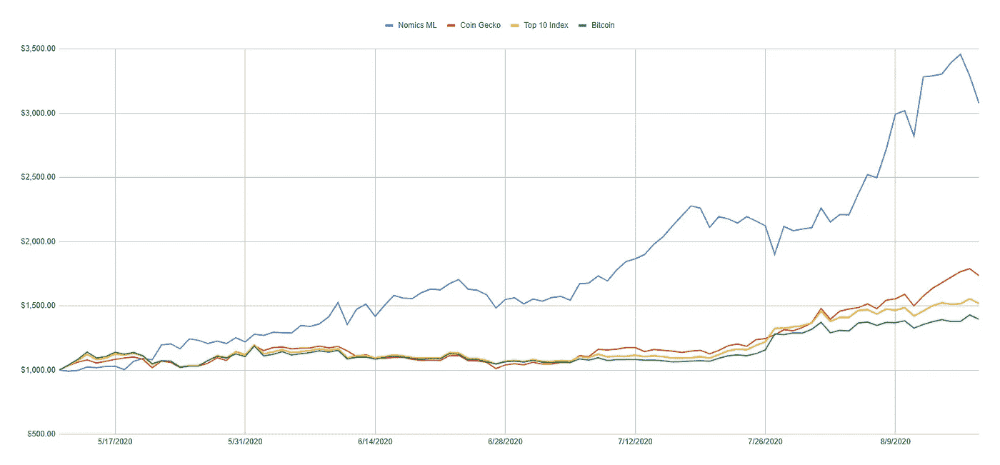

# 机器学习挑选了我的密码组合 100 天——这是结果

> 原文：<https://medium.com/coinmonks/machine-learning-picked-my-crypto-portfolio-for-100-days-these-are-the-results-6e2a205b14dd?source=collection_archive---------1----------------------->

在过去的 100 天里，我一丝不苟地跟踪了我的投资组合的表现。虽然我的投资组合本身并不引人注目，但人们对我用来挑选进入我投资组合的资产的机器学习策略产生了广泛的兴趣。

这个想法是 105 天前我想到的。 ***完全基于机器学习预测来建立一个完整的加密货币投资组合策略岂不是很酷？***

> 我开始使用机器学习模型生成的预测来自动化我的整个投资组合。

所以，我就是这么做的。几天后一切就绪，我能够推出一个投资组合策略，只依靠机器学习预测来决定我每周购买哪些加密货币。

在过去的 100 天里，我根据每周预测不断更新投资组合，跟踪进展，并最终激励成千上万的其他投资者和交易者在建立[加密投资组合](https://coincodecap.com/category/portfolio-management)时考虑类似的替代策略。

 [## 案例研究:使用机器学习进行项目组合管理

### 在最近的一篇博客文章中，Nomics 宣布发布其 7 天加密价格预测。他们的预测使用了…

blog.shrimpy.io](https://blog.shrimpy.io/blog/case-study-using-machine-learning-for-portfolio-management) 

> 投资组合策略是如何运作的？

每周一次，我使用 [**经济学的 7 天预测**](https://nomics.com/) 来更新我的投资组合中应该包含的资产。使用 100%真实资金，通过 [**Shrimpy**](https://www.shrimpy.io/) 管理投资组合。

通过 Shrimpy 管理投资组合意味着我可以成为一名社交领袖，并允许其他机器学习爱好者实时跟踪投资组合的更新。Shrimpy 还有强大的交易工具，所以我从来不需要登录我的交易所账户来管理投资组合。

 [## 机器学习案例研究

### 关注 Shrimpy 上的机器学习案例研究！

www.shrimpy.io](https://www.shrimpy.io/leader/mlcasestudy) 

# 结果

到目前为止，这项研究的结果令人吃惊。机器学习投资组合策略不仅胜过比特币、市场和其他流行策略，而且是以一种特殊的方式做到这一点的。

在过去的 100 天里，机器学习策略已经达到了峰值，性能提高了近 **250%。这一表现比比特币 T17 高出 4 到 5 倍，而其他市场同期仅增长了 50%到 75%。**

This graph does **not** show backtested results. These values were taken based on the real value of my portfolios. (A $1,000 portfolio was created for each of these 4 strategies to hold a real-world comparison)

有趣的是，我们在结果中看到了一种微妙的模式。机器学习策略的性能在几周内大幅上升，然后经历一个下降期，然后在另外几周内再次大幅上升。

没有说这种行为是否会继续重演，但它证明了预测在某些时候的不稳定性。

关于最新结果的更多信息可以在第 15 周的 [**研究更新**](https://blog.shrimpy.io/blog/machine-learning-for-crypto-portfolio-management-case-study-week-15) 中找到。每周都会发布更新，回顾上周的结果，规划下周的预测，并总结所有想法。

 [## 加密投资组合管理的机器学习案例研究:第 15 周

### 在过去的 7 天里，币安的投资组合增长了 17.84%，EvilSpider3 的表现超过了 88%的投资组合…

blog.shrimpy.io](https://blog.shrimpy.io/blog/machine-learning-for-crypto-portfolio-management-case-study-week-15) 

# 讨论

> 下面的讨论将基于我对该策略的看法和见解。对这些想法要有所保留。

在我看来，经济学似乎擅长识别已经成为赢家的资产，并押注于这些资产继续获胜。我很少看到经济学能够在突破发生之前*预测到突破的例子。*

从本质上讲，如果一项资产已经连续几周持平，经济学似乎会预测该资产在下周将继续持平。从逻辑上讲，这是有意义的，因为这是最有可能的结果。

然而，一旦资产经历突破，经济学就像是一个决定突破是继续还是逆转的好工具。

机器学习策略的许多选择是高度不稳定的资产。这导致了一周又一周的大幅波动。一周的策略可能是 ***上涨 70%*** ，然后下一周可能是 ***下跌 20%*** 。

这种策略的高风险和高回报性质并不适合许多投资者。明智的做法是，仔细思考如果采用这种策略，会对你的投资组合产生怎样的影响。

识别风险区域并减少那些风险是投资组合管理的重要部分。这就是为什么我们建立了[**Shrimpy**](http://shrimpy.io/)**的原因，我们可以将资金分成多个投资组合，一次分配多个策略，并对市场进行长期观察。**

# **结论**

**第一个 100 天的 [**机器学习案例研究**](https://blog.shrimpy.io/blog/case-study-using-machine-learning-for-portfolio-management) 已经产生了非凡的结果。然而，一如既往，这并不能保证未来的表现。**

**虽然 100 天可能足够让一些人相信机器学习可以在投资组合管理中占有一席之地，但现在还不是结束这项研究的时候。**

**我鼓励每个人都加入这项研究，报名参加 [**Shrimpy**](http://shrimpy.io/) ，支持 MLCaseStudy 的负责人，并监督未来 100 天的表现。**

*****Shrimpy 上见！*****

> **[直接在您的收件箱中获得最佳软件交易](https://coincodecap.com?utm_source=coinmonks)**

****