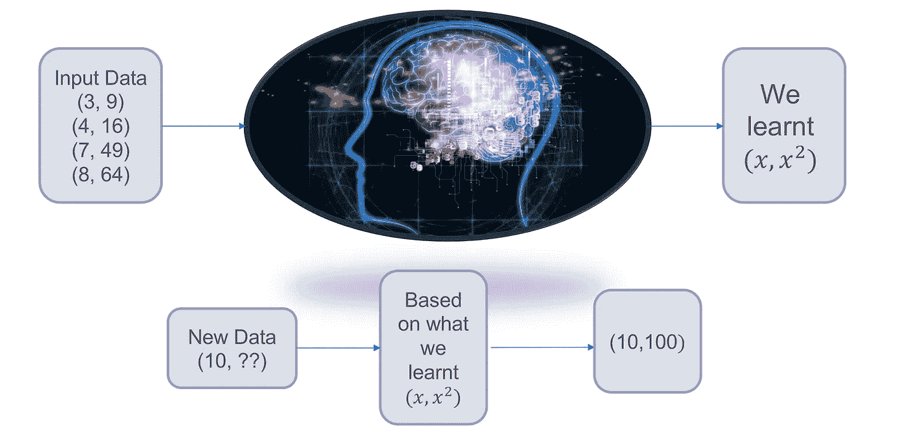
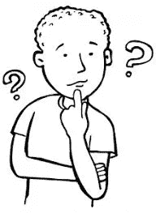

# 为傻瓜简化的机器学习

> 原文：<https://medium.com/coinmonks/machine-learning-simplified-for-dummies-1355acbe6f16?source=collection_archive---------6----------------------->

让我们参加这个测验，试着回答:

(注:继续阅读前先猜猜答案……)

3 -> 9

4 -> 16

7 -> 49

8 -> 64

10 -> ??

你回答 100 了吗？为什么？为什么不是 46 或 67 或其他四位数或字母表中的一个字母？

这是因为你计算出，在前四对数字中，每对中的第二个数字是第一个数字的平方。

Analysis by the Human Brain

现在，假设我们把同样的五双给一台机器，比如电脑。就像人脑分析前四个例子并提示第五个例子的结果一样，我们需要机器来做同样的事情。

**这是机器学习**。其中，我们希望机器处理给定的输入数据(在我们的例子中，是前四个例子),对于任何新数据(第五对),根据它处理的先前输入数据猜测或预测结果。我们希望机器从经验中学习，并对新的数据点做出适当的猜测或预测。

在上面的例子中，它只是文本——准确地说是数字。输入数据可以是从文本或数字数据到图像、视频、音频等任何数据。并且它不仅限于上述类型的数据。

# **机器学习的应用/例子:**

Analyzing Customer Behavior

我们希望机器能够预测，考虑到消费者过去五年的购买历史，他可能会从沃尔玛或山姆购买什么。沃尔玛有你过去五年的数据，知道你每次来买东西，你肯定会买洗涤剂、食用油、面包、零食、薯片、巧克力等，以及确切的数量。如果下次你去的时候，沃尔玛已经为你准备好了这些，那该怎么办？？？或者送到你家。它怎么知道你确实需要这个？这是因为沃尔玛处理你账单的电脑知道你每次买了什么，而且现在已经根据你的购物习惯进行了学习。同样，我们已经让网飞和 YouTube 根据用户的浏览历史向他们推荐视频。这是机器学习。

Google Photos — Identifying People by Face Recognition

我们可能希望计算机输入特定人 A 的大量照片，然后对于任何新的人的照片，计算机应该识别该新照片是否属于人 A。这是谷歌用于谷歌照片的一个实时例子。类似地，人的音频文件上的语音，其中对于给定的新音频文件，计算机预测该语音是否属于同一个人。

我们希望软件能够在电子邮件到达我们的邮箱之前，根据用户之前将哪些电子邮件视为垃圾邮件来对其进行分类。

此外，我们有一些应用程序可以根据过去几百年的温度、时区、位置、一年中的时间等数据来预测未来几天的天气预报。

在阿瑟塞缪尔的定义中—***机器学习是计算机或机器在没有明确编程的情况下进行学习的能力。***

机器可以从输入数据中学习，并且对于新的数据点，基于输入数据给出适当的猜测，而不需要为新的数据点编程。

Tom Michel 的另一个定义是这样的— ***如果一个计算机程序在 T 类任务中的性能，如 P 所测量的，随着经验 E 的增加而提高，那么该计算机程序被认为是从关于某类任务 T 和性能测量 P 的经验 E 中学习***

Predicting House prices

为了更好地理解这个定义，我们举个例子，比如说，预测达拉斯市的房价。假设我们给计算机程序输入了一百万个数据点，这个程序包含达拉斯房价，包括每平方英尺的数据。脚、邻近区域等。，从 2005 年至今。这里，

E =一百万个数据点

T =房价预测

P =供应商的预测值和实际值之间的差异。差异越小，预测就越准确。

# 为什么机器学习在今天很重要？

机器学习正在发展。无论是在家、在学校还是在工作场所，我们都通过日常琐事来处理数据。数据是所有企业的命脉。机器学习将使我们能够做出决策，以便让公司在竞争中保持领先，而不是落后。机器学习的两个主要优势是节省时间和帮助做出适当的决定。

Which University???? Damn…I need help!!!

假设一名学生正在某个特定的国家寻求更高的学位。如果数据可用，机器学习模型可以分析该国所有这些大学的数据和学生的数据，并预测哪所大学在排名、位置、费用、课外活动等方面最接近和最适合该学生。比方说，我开发了这个模型，并将其扩展到世界上所有国家，并将它作为我的产品放在一个网站上。现在，来自世界各地的学生可以来到我的网站，根据他们的学术数据、他们喜欢的地点和他们选择的课程，看看什么是最适合他们的大学。机器学习将为客户节省时间并帮助他们做出适当的决策，从而产生收入。

或者现在的 YouTube 推荐。观看特定视频后，YouTube 会根据视频的类型、您的位置、语言推荐/预测您可能喜欢的其他视频。它根据你是否点击了那些推荐的视频来衡量它的性能。从而节省您的时间，因为您不需要浏览其他同类型的视频。当你想在最后一分钟学习新东西时，这是非常有效的。预测会给你一个与你正在搜索的主题相关的所有视频的集合。从而节省你的时间，帮助你从最好的视频中获取信息，反过来增加 YouTube 的业务。

这简直就是机器学习。现在，你可能会想，机器如何预测消费者可能会购买什么，或者消费者可能会寻找哪个视频。这是一个完全不同的世界，包括统计、算法、数据分析等的组合。

