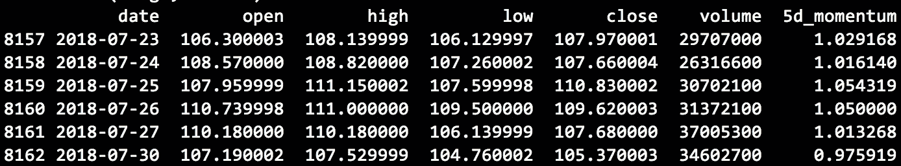

# 机器学习教程#1:预处理

> 原文：<https://medium.com/coinmonks/machine-learning-tutorial-1-preprocessing-d90198e37577?source=collection_archive---------3----------------------->

## 主题:数据清理、目标变量选择、特征提取、缩放、降维

在这个机器学习教程中，我将探索定义一个典型的机器学习项目的 4 个步骤:预处理、学习、评估和预测(部署)。在第一部分中，我将完成预处理步骤。本系列其他教程:#1 预处理(本文)， [#2 训练](/coinmonks/machine-learning-tutorial-2-training-f6f735830838)， [#3 评测](/@adam5ny/machine-learning-tutorial-3-evaluation-a157f90914c9)， [#4 预测](/@adam5ny/machine-learning-tutorial-4-deployment-79764123e9e1)


Machine Learning project overview. Author: Adam Novotny

我将使用股票价格数据作为主要数据集。这是本教程的一个好选择，原因如下:

*   根据定义，数据集是公开的，可以很容易地从多个来源下载，因此任何人都可以复制这项工作。
*   并非所有的特征都可以从源中立即获得，需要使用领域知识来提取，类似于现实生活。
*   这个项目的**结果是高度不确定的**，它再次模拟了现实生活。每年都有数十亿美元投入到股票价格预测问题上，而且绝大多数项目都失败了。因此，本教程不是关于创造一个神奇的印钞机；它是关于复制机器学习工程师在项目中可能拥有的经验。

所有代码都位于下面的 [Github repo](https://github.com/adam5ny/blogs/tree/master/ml-preprocessing) 中。文件“preprocessing.py”驱动分析。建议使用 Python 3.6，该文件包含设置所有必要依赖项的说明。

首先，我们需要下载数据集。我会有些武断地选择微软股票数据(来源:[雅虎财经](https://finance.yahoo.com/quote/MSFT/history?p=MSFT))。我将使用完整的可用历史，包括撰写本文时的 1986 年 3 月 13 日至 2018 年 7 月 30 日。在此期间，股价表现如下:


MSFT stock price. Source [https://finance.yahoo.com/chart/MSFT](https://finance.yahoo.com/chart/MSFT)

价格变动很有趣，因为它至少表现出两种行为模式:

*   直到 2000 年科技股崩盘前的大幅上涨
*   2000 年以来的横盘整理

这导致了许多有趣的机器学习复杂性，例如训练和测试数据的采样。

# 数据清理

经过一些简单的操作并将 csv 数据加载到 pandas DataFrame 后，我们得到了以下数据集，其中开盘价、最高价、最低价和收盘价代表每个日期的价格和交易的股票总数。


Raw dataset includes columns: date, prices (open, high, low, close), trading volume


Raw dataset includes columns: date, prices (open, high, low, close), trading volume

**缺失值**不存在，我通过运行以下命令确认了这一点:

```
missing_values_count = df.isnull().sum()
```


No missing values in dataset

离群值是我需要解决的下一个话题。这里要理解的关键点是，我们的数据集现在包括价格，但价格不是我试图预测的指标，因为它们是以绝对值衡量的，因此更难跨时间和其他资产进行比较。在上表中，第一个可用价格约为 0.07 美元，而最后一个价格为 105.37 美元。

相反，我将尝试预测每日回报。例如，在第二个交易日结束时，回报率为+3.6% (0.073673/0.071132)。因此，我将创建一个 return 列，并使用它来分析可能的异常值。

数据集中出现的 5 个最小日收益率如下:


5 smallest daily returns

和 5 个最大的每日回报:


5 largest daily returns

最负的回报是-30%(指数 405)，最大的是 20%(指数 3692)。通常，这里需要对异常值进行进一步的特定领域的分析。现在我将跳过它，并假设本教程只是出于说明的目的概述了这个过程。总的来说，考虑到 1987 年和 2000 年发生的市场崩溃与极度波动相关，这些数据似乎是有道理的。

对于开放、高、低和体积柱将需要相同的分析。不可否认，数据清理有点学术，因为雅虎财经是一个非常广泛使用和可靠的来源。理解数据仍然是一个有用的练习。

# 目标变量选择

我们需要定义我们的 ML 算法将试图预测什么。具体来说，我们将预测第二天的回报。这里回报的时机很重要，所以我们不会错误地预测今天或昨天的回报。将明天的回报定义为我们的目标变量的公式如下:

```
df["y"] = df["return"].shift(-1)
```

# 特征抽出

现在，我将转向价格、回报和交易量的一些简单转换，以[提取 ML 算法可以使用的特征](https://en.wikipedia.org/wiki/Feature_extraction)。金融从业者已经开发了 100 多个这样的功能，但我只展示几个。对冲基金在这一步花费了绝大部分时间，因为 ML 算法通常只有在数据可用时才有用。“垃圾进，垃圾出”。

我们可以考虑的一个特征是今天的收盘价如何与 5 个交易日(一个日历周)前的收盘价相关联。我把这个特征称为“5d_momentum”:

```
df[“5d_momentum”] = df[“close”] / df[“close”].shift(5)
```



New 5d_momentum feature

一个典型的趋势跟踪特征是 [MACD](https://stockcharts.com/school/doku.php?id=chart_school:technical_indicators:moving_average_convergence_divergence_macd) (移动平均线收敛/发散振荡器)。熊猫的优势在这里大放异彩，因为只用 4 行代码就可以创建 MACD。MACD 指标的图表如下。在下图中，典型的买入信号是穿过橙色线的蓝色“macd_line ”,代表“macd_line”的 9 日指数移动平均线。反之，则代表卖出信号。


MACD of stock price

上面提到的 Github repo 中的 python 代码“generate_features.py”包含了我们可能会考虑的其他特性。例如:

*   [趋势:移动平均线](https://www.investopedia.com/articles/active-trading/052014/how-use-moving-average-buy-stocks.asp)


MSFT Moving Average 50 day — 200 day

*   [趋势:抛物线 SAR](https://stockcharts.com/school/doku.php?id=chart_school:technical_indicators:parabolic_sar)


MSFT SAR

*   [动量:随机振荡器](https://stockcharts.com/school/doku.php?id=chart_school:technical_indicators:stochastic_oscillator_fast_slow_and_full)


MSFT Stochastic Oscillator

*   [动量:商品通道指数(CCI)](https://stockcharts.com/school/doku.php?id=chart_school:technical_indicators:commodity_channel_index_cci)
*   [动量:相对强度指数](https://stockcharts.com/school/doku.php?id=chart_school:technical_indicators:relative_strength_index_rsi)
*   [波动性:布林线](https://stockcharts.com/school/doku.php?id=chart_school:technical_indicators:bollinger_bands)
*   [波动率:平均真实范围](https://stockcharts.com/school/doku.php?id=chart_school:technical_indicators:average_true_range_atr)
*   [卷:论平衡卷(OBV)](https://stockcharts.com/school/doku.php?id=chart_school:technical_indicators:on_balance_volume_obv)
*   [音量:柴金振荡器](https://stockcharts.com/school/doku.php?id=chart_school:technical_indicators:chaikin_oscillator)

在特征提取过程的最后，我们有以下特征:

```
['return', 'close_to_open', 'close_to_high', 'close_to_low', 'macd_diff', 'ma_50_200', 'sar', 'stochastic_oscillator', 'cci', 'rsi', '5d_volatility', '21d_volatility', '60d_volatility', 'bollinger', 'atr', 'on_balance_volume', 'chaikin_oscillator']
```

# 抽样

我们需要将数据分成训练和测试两部分。我再怎么强调测试数据集也不应该用在学习阶段。它将仅用于评估步骤，以便绩效指标完全独立于培训，并代表实际绩效的无偏估计。

通常，我们可以随机抽样测试数据，但时间序列数据通常不太适合随机抽样。原因是这会影响学习过程。例如，随机化可能会产生一种情况，即在学习步骤中使用 2005 年 1 月 1 日的数据点来预测 2003 年 1 月 1 日的回报率。

因此，我将选择一种更简单的方法来对数据进行采样，并将前 7000 个样本用作学习的训练数据集，其余 962 个样本用作评估的测试数据集。

两个数据集都将保存为 csv 文件，因此我们通过存储 4 个文件(MSFT_X_learn.csv，MSFT_y_learn.csv，MSFT_X_test.csv，MSFT_y_test.csv)来结束 ML 教程的这一部分。这些将在本教程的后续步骤中使用。

# 缩放比例

特征缩放用于减少学习时间。这通常适用于[随机梯度下降和 SMV](https://en.wikipedia.org/wiki/Feature_scaling#Application) 。

开源 [sklearn](http://scikit-learn.org/stable/index.html) 包将用于大多数额外的 ML 应用，所以我将在这里开始使用它来[缩放所有特性](http://scikit-learn.org/stable/modules/preprocessing.html#standardization-or-mean-removal-and-variance-scaling)以具有零均值和单位方差:

```
from sklearn import preprocessing
scaler_model = preprocessing.StandardScaler().fit(X_train)
X_train_scaled = scaler_model.transform(X_train)
X_test_scaled = scaler_model.transform(X_test)
```

重要的是，在修改特征之前进行数据采样，以避免测试数据泄漏的任何训练。

# 降维

在这个阶段，我们的数据集 17 的特征。特征的数量对学习的速度有很大的影响。我们可以使用多种技术来减少特性的数量，以便只保留最“有用”的特性。

许多对冲基金在这个阶段会处理上百个特征，因此降维至关重要。在我们的例子中，我们只有 17 个说明性的特征，所以我将把它们都保存在数据集中，直到我探索不同算法的学习时间。

然而，出于好奇，我将执行主成分分析 [(PCA)](http://scikit-learn.org/stable/modules/generated/sklearn.decomposition.PCA.html) 来了解我们可以从数据集创建多少个特征，而不会失去有意义的解释能力。

```
from sklearn.decomposition import PCA
sk_model = PCA(n_components=10)
sk_model.fit_transform(features_ndarray)
print(sk_model.explained_variance_ratio_.cumsum())
# [0.30661571 0.48477408 0.61031358 0.71853895 0.78043556 0.83205298
 0.8764804  0.91533986 0.94022672 0.96216244]
```

前 8 个特征解释了 91.5%的数据差异。主成分分析的缺点是新特征位于低维空间，因此它们不再符合现实生活中的概念。例如，第一个原始特征可以是我在上面推导的“macd_line”。在 PCA 之后，第一个特征解释了 31%的方差，但是我们不再有任何逻辑描述该特征在现实生活中代表什么。

现在，我将保留所有的特征 17 个原始特征，但注意，如果算法的学习时间太慢，PCA 将是有帮助的。

本系列其他教程:#1 预处理(本文)， [#2 训练](/coinmonks/machine-learning-tutorial-2-training-f6f735830838)， [#3 评测](/@adam5ny/machine-learning-tutorial-3-evaluation-a157f90914c9)， [#4 预测](/@adam5ny/machine-learning-tutorial-4-deployment-79764123e9e1)

作者网址:[adamnovotny.com](https://www.adamnovotny.com/)