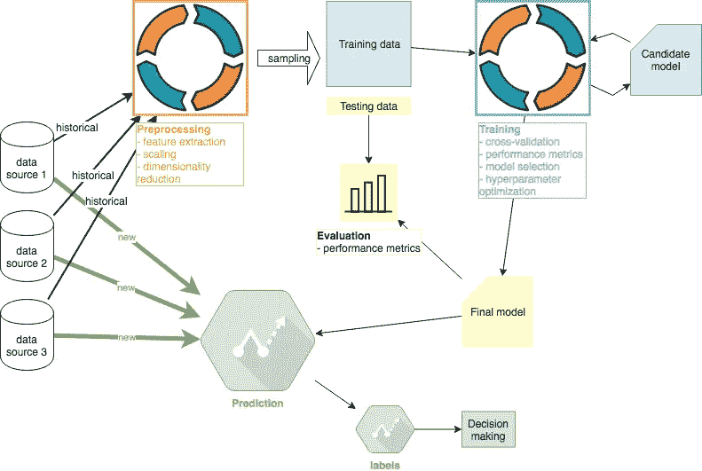

# 机器学习教程#2:训练

> 原文：<https://medium.com/coinmonks/machine-learning-tutorial-2-training-f6f735830838?source=collection_archive---------3----------------------->

## 主题:性能度量，交叉验证，模型选择，超参数优化，项目反映，工具



Machine Learning project overview. Author: Adam Novotny

ML 教程的第二部分是第一部分[预处理](/@adam5ny/machine-learning-tutorial-1-preprocessing-d90198e37577)的后续部分。所有代码都可以在这个 [Github repo](https://github.com/adam5ny/blogs/tree/master/ml-training) 中获得。本系列其他教程: [#1 预处理](/coinmonks/machine-learning-tutorial-1-preprocessing-d90198e37577)、#2 训练(本文)、 [#3 评测](/@adam5ny/machine-learning-tutorial-3-evaluation-a157f90914c9)、 [#4 预测](/@adam5ny/machine-learning-tutorial-4-deployment-79764123e9e1)

我用 4 个数据集结束了教程#1:训练特征、测试特征、训练目标变量和测试目标变量。在本教程#2 中，将只使用培训功能和培训目标变量。测试数据将在教程#3 中用于评估目的。

# 性能指标

我们专注于回归算法，因此我将考虑 3 个最常用的性能指标

*   [平均绝对误差](https://en.wikipedia.org/wiki/Mean_absolute_error) (MAE)
*   [均方误差](https://en.wikipedia.org/wiki/Mean_squared_error) (MSE)
*   [R](https://en.wikipedia.org/wiki/Coefficient_of_determination)

在实践中，可以做出特定于领域的决策来补充上面的标准度量。例如，投资者通常更关心重大的下跌错误，而不是上涨错误。因此，可能会得出过度强调与财务损失相对应的下行误差的指标。

# 交互效度分析

我将回到我在[预处理](/@adam5ny/machine-learning-tutorial-1-preprocessing-d90198e37577)中提到的同一主题。由于时间序列数据的性质，标准随机 K 倍验证会产生前瞻性偏差，因此不应使用。为了说明这个问题，让我们假设我们将 8 年的数据分成 8 份，每份代表一年。第一个训练周期将使用折叠# 1–7 进行训练，折叠#8 进行测试。下一个训练周期可能使用折叠# 2–8 进行训练，使用折叠#1 进行测试。这当然是不可接受的，因为我们使用第 2-7 年的数据来预测第 1 年。

我们的交叉验证必须尊重数据的时间顺序。我们可以使用步行验证或简单的多次训练测试分割。为了说明，我将使用 3 个训练测试分割。例如，假设我们有 2000 个样本，从最早的开始按时间戳排序。我们的 3 个部分如下所示:


Train-Test splits. Author: Adam Novotny

# 型号选择


ML Model Selection. Author: Adam Novotny

在这一部分，我将选择要培训的模型。“受监督的”算法部分(上图中的红色部分)是相关的，因为数据集包含要素和标签(目标变量)。谈到算法选择，我喜欢遵循[奥卡姆剃刀](https://en.wikipedia.org/wiki/Occam%27s_razor)。换句话说，从表现出最快的训练时间和最好的可解释性的算法开始。然后我们可以增加复杂性。

在本节中，我将探讨以下算法:

*   线性回归:快速学习，易于解释
*   决策树:学习速度快(需要修剪)，易于解释
*   神经网络:学习缓慢，难以解释

## 线性回归

从线性回归开始有助于了解我们是否可以在进入复杂的机器学习算法之前，通过简单的统计数据来实现我们的目标。具有明确定义的特征的房价预测就是一个例子，其中线性回归通常工作良好，并且没有必要使用更复杂的算法。

使用 sklearn 训练线性回归模型很简单:

```
from sklearn import linear_model
model = linear_model.LinearRegression()
model.fit(X_train, y_train)
y_pred = model.predict(X_test)
```

最初的结果没有产生任何有希望的东西，所以我采取了另一个步骤，进一步转换特性。我创建了多项式和非线性特征来解释非线性关系。例如，在 2 次多项式的情况下，特征[a，b ]变成[1，a，b，a，ab，b]。


Linear Regression results. Author: Adam Novotny

x 轴代表 3 个交叉验证区段(第一次折叠使用 1749 个样本用于训练，1749 个样本用于测试，第二次折叠使用 3499 个样本用于训练，1749 个样本用于测试，最后一次折叠使用 5249 个样本用于训练，1749 个样本用于测试)。显然，结果表明线性模型在实践中是没有用的。在这个阶段，我至少有以下选择:

*   岭回归:解决过度拟合(如果有的话)
*   线性套索:降低模型复杂性

在这一点上，我不认为上述任何选项会对结果产生有意义的影响。我将继续其他算法，看看他们如何比较。

然而，在继续之前，我需要设定期望值。金融界有一句话，成功的预测者只需要 51%的时间是正确的。财务杠杆可以用来放大结果，所以只要有一点点正确就会产生有影响力的结果。这就设定了期望值，因为我们永远不会在这个领域找到 60%正确或更好的算法。因此，我们预计 R 值较低。这一点需要说明，因为机器学习中的很多样本项目都是为了好看而设计的，这是我们在现实生活的价格预测中永远无法企及的。

## 决策图表

使用 sklearn 训练决策树回归模型同样简单:

```
from sklearn import tree
model = tree.DecisionTreeRegressor()
model.fit(X_train, y_train)
y_pred = model.predict(X_test)
```

上述拟合函数的默认结果几乎总是[过度拟合](https://en.wikipedia.org/wiki/Overfitting)。决策树有一个非常有表达力的假设空间，所以在没有修剪的情况下，它们可以代表几乎任何函数。训练数据的 r 很容易变成完美的 1.0，而测试数据的结果将是 0。因此，我们需要使用 scikit-learn 的 max_depth 参数 [DecisionTreeRegressor](http://scikit-learn.org/stable/modules/generated/sklearn.tree.DecisionTreeRegressor.html#sklearn.tree.DecisionTreeRegressor) 来确保该树能够很好地概括测试数据。

决策树的最大优势之一是它们的可解释性:参见许多使用标准说明性数据集的有用的[可视化文章](/@rnbrown/creating-and-visualizing-decision-trees-with-python-f8e8fa394176)。

## 神经网络

Scikit-learn 使[简单的神经网络](http://scikit-learn.org/stable/modules/generated/sklearn.neural_network.MLPRegressor.html#sklearn.neural_network.MLPRegressor)训练就像构建决策树一样简单:

```
from sklearn.neural_network import MLPRegressor
model = MLPRegressor(hidden_layer_sizes=(200, 200), solver="lbfgs", activation="relu")
model.fit(X_train, y_train)
y_pred = model.predict(X_test)
```

在普通笔记本电脑上，训练一个具有 2 个隐藏层(每个隐藏层 200 个单元)和多项式特征的神经网络需要几十秒钟。为了加快下一节的培训过程，我将不再使用 scikit-learn，而是将 [Keras](https://keras.io/) 用于 TensorFlow 后端。

Keras API 同样简单。该项目甚至包括 scikit-learn 的[包装器，以利用 scikit 的研究库。](https://keras.io/scikit-learn-api/#wrappers-for-the-scikit-learn-api)

```
from keras.models import Sequential
from keras.layers import Dense
model = Sequential()
input_size = len(X[0])
model.add(Dense(200, activation="relu", input_dim=input_size))
model.add(Dense(200, activation="relu"))
model.add(Dense(1, activation="linear"))
model.compile(optimizer="adam", loss="mse")
model.fit(X_train, y_train, epochs=25, verbose=1)
y_pred = model.predict(X_test)
```

# 超参数优化

做超参数优化的诀窍是理解参数不应该被单独对待。许多参数相互影响，这就是为什么经常进行彻底的[网格搜索](https://en.wikipedia.org/wiki/Hyperparameter_optimization#Grid_search)。然而，网格搜索是，它变得非常昂贵。

## 决策图表

我们的决策树网格搜索将迭代以下输入:

*   拆分器:用于拆分节点的策略(最佳或随机)
*   树的最大深度
*   每次分割的最小样本数:分割内部节点所需的最小样本数
*   最大叶节点:数量或无(允许无限数量的叶节点)

说明性的网格搜索结果如下:


Grid Search Decision Tree — first rows


Grid Search Decision Tree — last rows

使用最佳参数的性能:


Decision Tree results

同样，结果似乎不太乐观。它们似乎比线性回归更好(较低的 MAE 和 MSE ),但是 R 仍然太低而没有用。然而，我的结论是，决策树更强的表达能力是有用的，在这个阶段我会放弃线性回归模型。

## 神经网络

探索由 Keras 建立的神经网络的超参数，我们至少可以改变以下参数:

*   每层中隐藏层和/或单元的数量
*   模型[优化器](https://keras.io/optimizers/) (SGD、Adam 等)
*   [每层的激活功能](https://keras.io/activations/)(relu，tanh)
*   批次大小:每次梯度更新的样本数
*   要训练的时期:整个训练数据集的迭代次数

说明性的网格搜索结果如下:


Grid Search Neural Net — first rows


Grid Search Neural Net — last rows

使用最佳参数，我们获得以下性能指标:


Keras MAE, MSE, R2

神经网络和决策树的结果是相似的，这是常见的。这两种算法都有非常有表现力的假设空间，并且经常产生可比较的结果。如果我取得了可比较的结果，我倾向于使用决策树模型，因为它的训练时间更快，可解释性更强。

# 项目反思

在这个阶段，很明显没有模型可以用于生产。虽然决策树模型看起来表现最好，但它在测试数据上的表现仍然不可靠。在这一阶段，是时候返回去寻找额外的特征和/或数据源了。

正如我在第一篇[预处理教程](/@adam5ny/machine-learning-tutorial-1-preprocessing-d90198e37577)中提到的，金融从业者可能会花几个月的时间来获取数据和构建特性。特定领域的知识至关重要，我认为金融市场至少展示了有效市场假说的弱式。这意味着未来的股票回报不能从过去的价格变动中预测。我只使用了过去的价格变动来开发上述模型，因此从业者在第一个教程中就会注意到结果并不乐观。

为了完成本教程，我将继续保存决策树模型，并在本教程的下一节中将其用于演示目的(就像它是最终的生产模型一样):

```
pickle.dump(model, open("dtree_model.pkl", "wb"))
```

重要提示:Python pickle 库中有[个已知安全漏洞](https://www.cs.uic.edu/~s/musings/pickle/)。为了安全起见，关键的一点是永远不要取消对非您创建的数据的检查。

# 工具

工具是一个常见的问题，但通常并不重要，直到项目由成千上万的例子和至少数百个特性组成。我通常从 scikit 开始——学习，当性能成为瓶颈时就转移到其他地方。例如， [TensorFlow](https://www.tensorflow.org/) 不仅是一个深度学习框架，还包含其他算法，如 [LinearRegressor](https://www.tensorflow.org/api_docs/python/tf/estimator/LinearRegressor) 。如果 scikit-learn 执行得不够好，我们可以用 TensorFlow 和 GPU 训练上面的线性回归。

本系列其他教程: [#1 预处理](/coinmonks/machine-learning-tutorial-1-preprocessing-d90198e37577)、#2 训练(本文)、 [#3 评测](/@adam5ny/machine-learning-tutorial-3-evaluation-a157f90914c9)、 [#4 预测](/@adam5ny/machine-learning-tutorial-4-deployment-79764123e9e1)

作者网址:[adamnovotny.com](https://www.adamnovotny.com/)