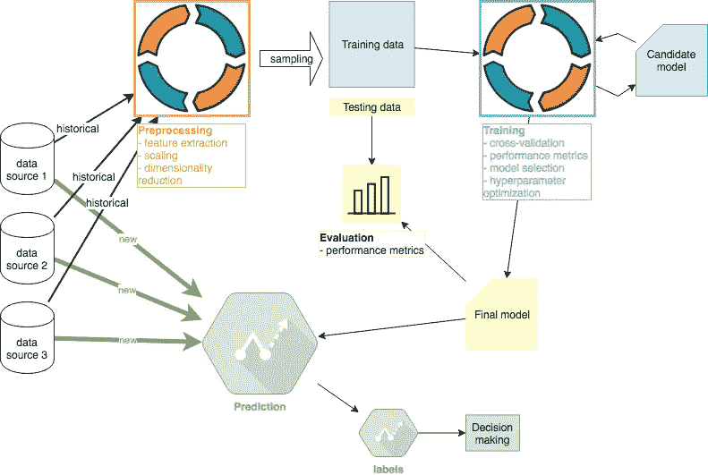
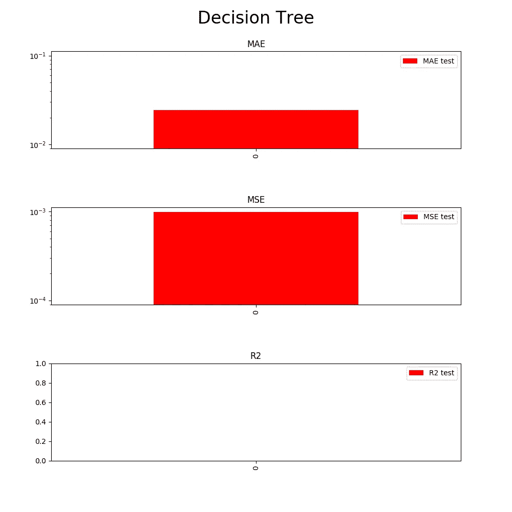

# 机器学习教程#3:评估

> 原文：<https://medium.com/coinmonks/machine-learning-tutorial-3-evaluation-a157f90914c9?source=collection_archive---------3----------------------->

## 主题:绩效指标，评论



Machine Learning project overview. Author: Adam Novotny

在这个系列的第三阶段，我将探索 ML 项目的评估部分。我将重用第二个培训阶段的一些代码和解决方案。然而，重要的是要注意，除了使用在训练步骤中产生的最终模型之外，评估阶段应该与训练完全分离。本系列其他教程: [#1 预处理](/coinmonks/machine-learning-tutorial-1-preprocessing-d90198e37577)、 [#2 训练](/coinmonks/machine-learning-tutorial-2-training-f6f735830838)、#3 评测(本文)、 [#4 预测](/@adam5ny/machine-learning-tutorial-4-deployment-79764123e9e1)。 [Github 代码](https://github.com/adam5ny/blogs/tree/master/ml-evaluation)。

# 性能指标

本节的目标是确定我们的模型在训练步骤中如何处理它没有学习过的真实数据。首先，我们必须加载我们保存为最终模型的模型:

```
model = pickle.load(open("dtree_model.pkl", "rb"))
>>> model
DecisionTreeRegressor(criterion='mse', max_depth=3, max_features=None, max_leaf_nodes=None, min_impurity_decrease=0.0, min_impurity_split=None, min_samples_leaf=1, min_samples_split=5, min_weight_fraction_leaf=0.0, presort=False, random_state=1, splitter='best')
```

接下来，我们将加载我们在本教程的预处理部分创建的测试数据。我将评估部分与培训分开的主要原因正是这一步。我也将代码分开，以确保没有来自培训的信息泄露到评估中。重申一下，到目前为止，我们还没有看到本节中使用的数据。

```
X = pd.read_csv("X_test.csv", header=0)
y = pd.read_csv("y_test.csv", header=0)
```

在此阶段，我们可能会在培训步骤的基础上执行额外的绩效评估。然而，我将坚持以前使用的指标:MAE，MSE，R2。



Decision tree MAE, MSE, R2

# 评论

从之前的教程中，我们已经知道我们的模型在实践中表现得不够好。然而，正如我之前提到的，我在这里继续使用它进行说明，以完成教程并解释现实生活项目中涉及的思考，其中性能并不总是像许多玩具数据集那样理想。

关键的比较是我们的模型相对于训练阶段的评价有多好。在模型准备生产的情况下，我希望评估阶段的性能可以与训练阶段的折叠测试相媲美。

将上一次训练测试文件夹[与这里的](/coinmonks/machine-learning-tutorial-2-training-f6f735830838)(用于训练的 5249 个数据点)和上面的评估结果进行比较:

*   梅:最后的训练阶段，~10^-2.~10^-2 评估阶段
*   MSE:~10^-4.最后培训阶段~10^-3 评估阶段
*   r:最后训练阶段~0。评估阶段~0

在该模型从未见过的数据集上的性能相当相似。尽管如此，过度拟合仍然是一个潜在的问题。如果我们在训练阶段就准备好了一个模型用于生产，我们在这个阶段就有理由相信它会按照我们对样本数据的预期来执行。

本系列其他教程: [#1 预处理](/coinmonks/machine-learning-tutorial-1-preprocessing-d90198e37577)、 [#2 训练](/coinmonks/machine-learning-tutorial-2-training-f6f735830838)、#3 评测(本文)、 [#4 预测](/@adam5ny/machine-learning-tutorial-4-deployment-79764123e9e1)

作者网址:[adamnovotny.com](https://www.adamnovotny.com/)