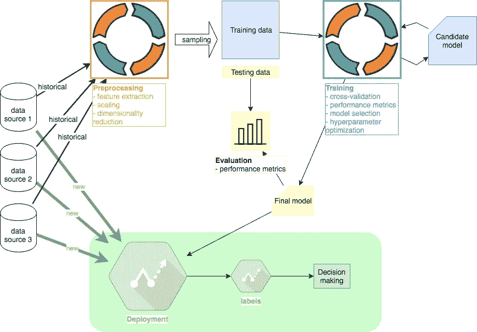
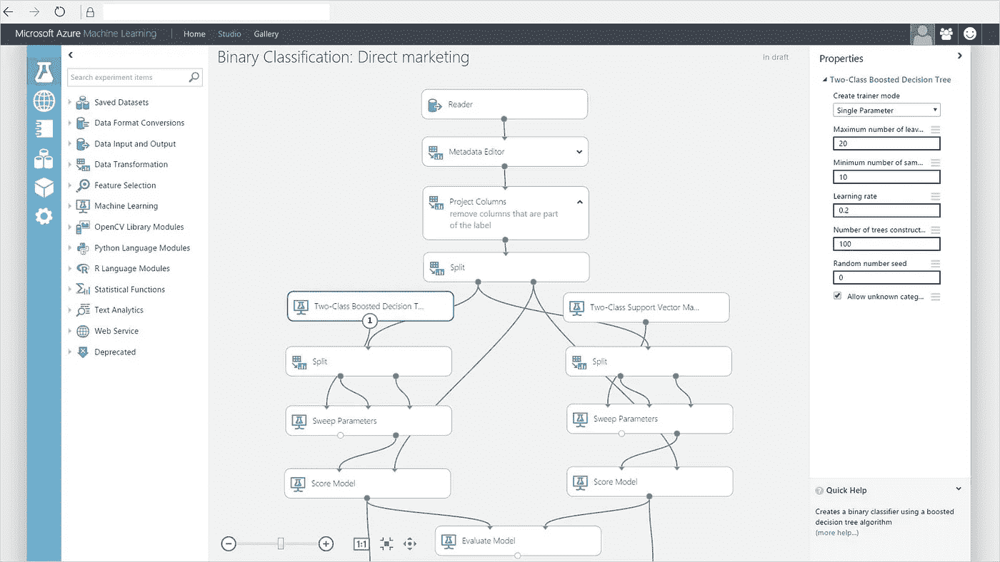
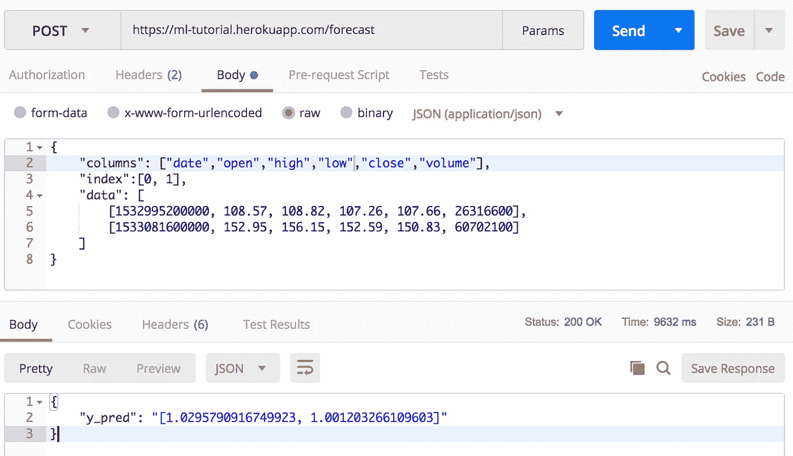
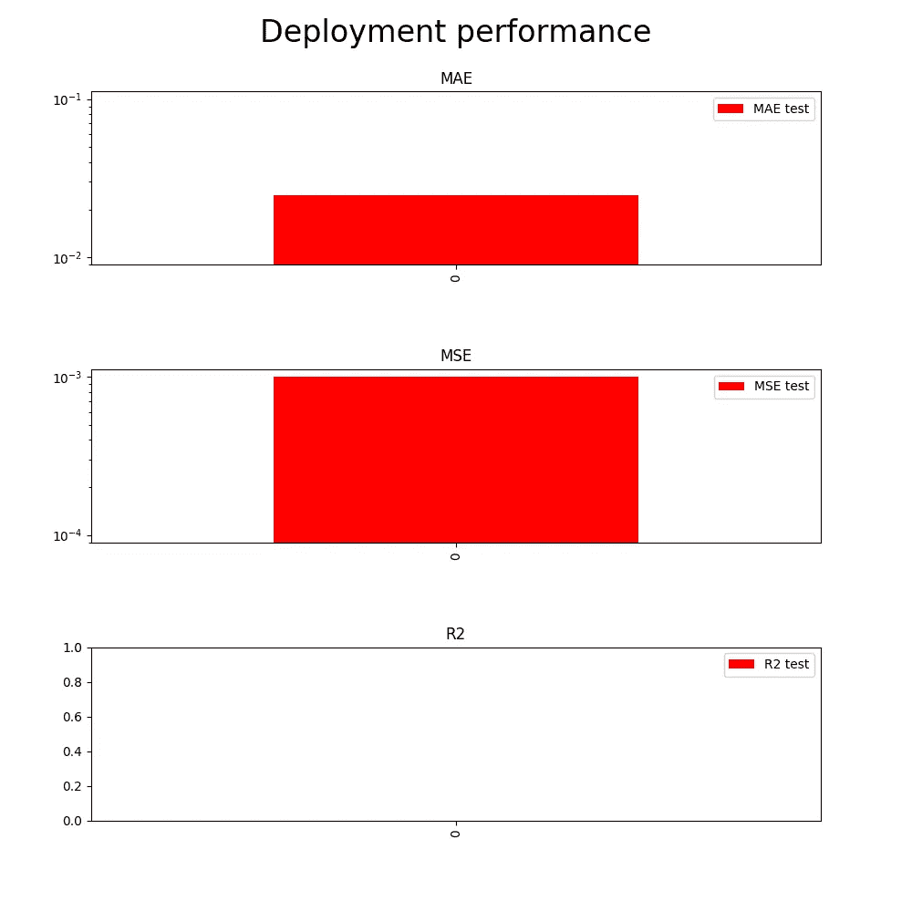

# 机器学习教程#4:部署

> 原文：<https://medium.com/coinmonks/machine-learning-tutorial-4-deployment-79764123e9e1?source=collection_archive---------3----------------------->

## 主题:堆栈选择、Heroku、测试



Machine Learning project overview. Author: Adam Novotny

在这个系列的最后阶段，我将建议 ML 工程师部署他们的代码的几个选项。在大型组织中，项目的这一部分将由一个专门的团队来处理，这在关注可伸缩性时尤为重要。本系列其他教程: [#1 预处理](/coinmonks/machine-learning-tutorial-1-preprocessing-d90198e37577)、 [#2 训练](/coinmonks/machine-learning-tutorial-2-training-f6f735830838)、 [#3 评测](/coinmonks/machine-learning-tutorial-3-evaluation-a157f90914c9)、#4 部署(本文)。 [Github 代码](https://github.com/adam5ny/blogs/tree/master/ml-deployment)。

# 堆栈选择

部署 ML 代码的选项有很多，但我通常至少在三个通用类别中做出选择:

*   作为服务提供的解决方案(例如微软 Azure Machine Learning Studio)
*   无服务器功能(例如 [AWS Lambda](https://docs.aws.amazon.com/lambda/latest/dg/python-programming-model.html)
*   自定义后端代码(例如 [Python Flask](http://flask.pocoo.org/docs/0.12/) 由 [Heroku](https://devcenter.heroku.com/articles/getting-started-with-python) 提供服务)

## 即服务解决方案

微软 Azure Machine Learning Studio 等平台为整个项目提供全套工具，包括预处理和训练。自定义 API 端点通常很容易生成，而且由于有了拖放式接口，编写代码通常是不必要的。这些解决方案通常针对懒惰的学习者进行了很好的优化，因为评估是最昂贵的计算步骤。不利的一面是，在不经历平台上所有项目步骤的情况下，引入定制代码(比如最终的模型)有时更具挑战性。



As-a-service deployment example: Microsoft Azure

## 无服务器功能

无服务器函数是廉价计算的好解决方案。AWS 使用 3 秒的默认超时来完成一个功能。虽然超时可以延长，但在决定是否合适时，默认值通常是一个很好的通用指南。Lambda 只允许上传 50MB 的定制代码，这对于大多数机器学习目的来说通常是不够的。然而，函数非常适合快速计算，如线性回归模型。另一个缺点是平台只支持特定的语言。就 Python 解决方案而言，在撰写本文时，AWS Lambda 仅支持 2.7 和 3.6 版本。

## 自定义后端代码

在 Heroku 或 Amazon 的 EC2 等平台上编写定制的后端代码允许我们完全复制我们在本地机器上编写的代码。代码和服务器部署可以针对我们正在部署的 ML 算法类型进行完全定制。这种解决方案的缺点是操作复杂，因为我们需要关注许多与 ML 无关的步骤，例如安全性。

我将把代码部署在 Heroku 上，它为测试提供了一个自由层。轻量级的[烧瓶框架](http://flask.pocoo.org/)将驱动后端。这样选择的主要原因是，它允许我们在后端重用以前教程中编写的所有代码。我们可以将 Flask 与 Python 3.6 和我们以前使用的所有机器学习库并排安装。

使用 Flask，运行应用程序的整个后端代码只有几行:

```
import pickle
import pandas as pd
from flask import Flask, jsonify, request, make_responseapp = Flask(__name__)[@app](http://twitter.com/app).route('/forecast', methods=["POST"])
def forecast_post():
    """
    Args:
        request.data: json pandas dataframe
            example: {
                "columns": ["date", "open", "high", "low", "close",
                   "volume"],
                "index":[1, 0],
                "data": [
                   [1532390400000, 108, 108, 107, 107, 26316],
                   [1532476800000, 107, 111, 107, 110, 30702]]
            }
    """
    if request.data:
        df = pd.read_json(request.data, orient='split')
        X = preprocess(df)
        model = pickle.load(open("dtree_model.pkl", "rb"))
        y_pred = run_model(X, model)
        resp = make_response(jsonify({
           "y_pred": json.dumps(y_pred.tolist())
        }), 200)
        return resp
    else:
        return make_response(jsonify({"message": "no data"}), 400)
```

*   pd.read_json(…):从 [POST 请求](https://en.wikipedia.org/wiki/POST_(HTTP))中读取数据，这是一个 json 对象，对应于与 Yahoo finance prices(我们的原始数据源)格式相同的价格数据
*   预处理(…):来自[预处理](/coinmonks/machine-learning-tutorial-1-preprocessing-d90198e37577)教程的代码副本，它将原始价格数据处理成特性。重要的是，所用的定标器必须与我们在预处理中使用的定标器完全相同，所以在预处理过程中必须先保存到 pickle 文件，然后从 pickle 加载
*   run_model(…):加载并运行我们保存的来自[培训](/coinmonks/machine-learning-tutorial-2-training-f6f735830838)教程的最终模型
*   make_response(…):返回预测

# 赫罗库

将我们的预测代码部署到 Heroku 将需要我们从以前的教程中收集至少两段必要的代码:最终模型(保存为 pickle 文件)和来自[预处理](/coinmonks/machine-learning-tutorial-1-preprocessing-d90198e37577)教程的代码，该教程将我们从现实世界中收集的原始特征转换为我们的模型可以处理的特征。

关于如何在 Heroku 上部署 Docker app，我就不赘述了。有大量的好材料包括 Heroku 的文档，非常好。在 Heroku 上运行和部署 Docker 应用程序的所有必要代码也在 Github repo 中。需要记住几个关键步骤:

*   将 Dockerfile 另存为 *Dockerfile.we* b，这是运行应用程序所需的所有代码的容器
*   使用命令 [heroku container:push](https://devcenter.heroku.com/articles/container-registry-and-runtime) 部署容器
*   使用命令[释放容器 heroku 容器:释放](https://devcenter.heroku.com/articles/container-registry-and-runtime)

此时，我们的代码已经部署完毕，我们可以使用[邮递员](https://www.google.com/url?sa=t&rct=j&q=&esrc=s&source=web&cd=1&cad=rja&uact=8&ved=2ahUKEwjmut-U1JvdAhVKsqQKHaQUBg0QFjAAegQIBRAC&url=https%3A%2F%2Fwww.getpostman.com%2F&usg=AOvVaw1vWzpwzQOHi5ErKZnywLDR)发出一个手动预测请求进行测试:



Postman sample request

日期由 Unix 时间戳表示。第一个主体窗口由我们以价格形式提供给端点的输入组成。第二个窗口从应用程序返回预测。

# 测试

为了测试实现，我将重用评估步骤中的代码。然而，我将使用 Heroku 应用程序批量预测评估的 691 个样本，而不是使用我们的 sklearn 模型在本地进行预测。目标是让我们在本地机器上做出的预测与使用我们的部署堆栈做出的预测完全匹配。

这一步对于确保我们能够使用预先训练的模型远程复制我们的结果至关重要。测试代码也可以在 [Github](https://github.com/adam5ny/blogs/blob/master/ml-deployment/backend/tests/test_app.py) 上获得。我们确认 Heroku 应用的性能与评估教程中本地生成的性能相匹配:



Tested deployment performance matches evaluation results

总之，该项目旨在提供一个数据科学项目需要的思维类型的概述。不应在生产中使用该代码，它仅用于说明目的。一如既往，我欢迎所有建设性的反馈(积极的或消极的)。

本系列其他教程: [#1 预处理](/coinmonks/machine-learning-tutorial-1-preprocessing-d90198e37577)、 [#2 训练](/coinmonks/machine-learning-tutorial-2-training-f6f735830838)、 [#3 评测](/coinmonks/machine-learning-tutorial-3-evaluation-a157f90914c9)、#4 部署(本文)。 [Github 代码](https://github.com/adam5ny/blogs/tree/master/ml-deployment)。

作者网址:[adamnovotny.com](https://www.adamnovotny.com/)