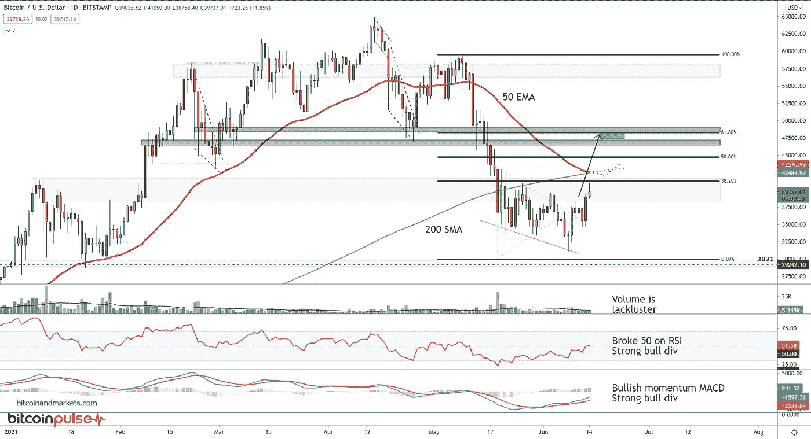

# 2021 年 6 月 14 日宏观图表纲要

> 原文：<https://medium.com/coinmonks/macro-chart-rundown-for-14-june-2021-7e82500c25e3?source=collection_archive---------4----------------------->

## 今天，我们研究比特币和以太坊的图表，然后转向宏观的东西，美元、黄金、美国国债、CPI 和石油。

欢迎回到 BTCM 研究中心。如果您觉得这些图表更新信息丰富，请订阅。今天，我们研究比特币和以太坊的图表，然后转向宏观的东西，美元、黄金、国债、CPI 和石油。

# 比特币

比特币的牛市还好。经历了一个大的迂回，但即将回到正轨。它已经打破了它的盘整模式，显示出非常好的教科书式的威科夫积累。

# 威科夫积累

下一张图更忙。我定期在我的[比特币脉冲](https://bitcoinandmarkets.com/tag/pulse/)中浏览这张图表上的所有东西。它实际上只是简单的振荡指标、均线和斐波纳契回撤。

紫色方框是我的近期目标，基于一系列因素:

1)价格倾向于回撤至 61.8%的水平，准确率较高。
2)这也对应于要测试为阻力的前期支撑。
3)比特币设置的 Ichimoku 云在那个确切的区域有一个日线云交叉，这是一个云能量较低的区域，充当价格的磁铁。
4)沿着该路径的 50 EMA/200 SMA 交叉将与作为磁体的先前 TA 相匹配。
5)振荡指标中强烈的看涨背离(较低的蜡烛线收盘，振荡指标中较高的低点)。
6)普遍的牛市偏向。

唯一让我犹豫不要过于乐观的因素是交易量。交易量并没有像我预期的那样增加。或许随着价格上涨，这种情况会在晚些时候出现，但这是值得警惕的。

*(注:我使用简单的技术分析指标是因为它们是其他交易者使用最多的，它们更多的是一种自我实现的预言品质。我不相信图表上的线有任何特殊的力量来改变价格，但是作为易受市场心理影响的群体动物，它们起作用了。此外，复杂的交易机器人是基于简单和复杂的指标编程的，但复杂的指标是从更简单的指标建立起来的。所以，在我看来，信号越简单越清晰。)*

# 以太坊

每日以太坊图收盘低于 50 均线，这暴露了在 0.045 btc 附近缺乏任何支撑。

在 5 月份的最新宏观图表纲要中，我指出了以太坊中的模式，它在每年的头几个月都有波动。在 2016 年减半后，这个泵非常大，从年初一直运行到 6 月中旬。

这个 2021 年后减半泵和 2017 年奇怪的相似。它从年初一直持续到五月中旬，一直持续到六月中旬。这种模式背后的机制尚不清楚，从某种程度上来说，它似乎与比特币减半有关。比特币的第二次减半是在 2016 年 7 月，相比之下，今年早些时候的第三次减半是在 2020 年 5 月。当加上这个以太坊泵的顶部也是今年早些时候(2021 年 5 月对 2017 年 6 月)的事实时，这提供了有趣的间接证据。

这可能是一个非常简单的故事。例如，可能是减半创造了一个媒体/新闻循环，替代硬币能够抓住这个循环。由于他们无法创造自己的轰动效应，他们必须等待比特币开始减半。然后，由于替代币的流动性相对比比特币差得多，在狂热时期，它们相对于比特币的价值会增加，但当狂热消退时，它们相对于比特币的价格也会大幅下跌。

我们可以在谷歌趋势搜索数据中看到“比特币”与“以太坊”的关系。以太坊多年来几乎是零利息，除了小的硬核“加密”推广者之外，完全没有嗡嗡声。以太坊没有草根的、独立的兴趣。

我预计以太坊将在今年剩下的时间里继续其对比特币的下滑。它是一只粉红色毛绒绒的独角兽，合法、多产、可持续的价值不超过 10 亿美元。我预计以太坊的这轮萧条周期将使其回到 500 美元以下，甚至可能更低。

下面美元图表中的两个快速场景。*红色场景，*如果我们考虑最近的峰值，就像左边红色箭头处的峰值。这种情况意味着几个月后会出现另一轮反弹。在这种情况下，我们需要看到价格保持在 20 周简单移动平均线之上，并按压最近的高点。**然而，*黑色场景*更有可能**，因为最近的峰值与之前的周期高点相似。跌破 20 周移动平均线就是这种情况的信号。

好了，太多以太坊垃圾了，让我们进入主要的宏观内容。

# 美元

快速看一下每日 DXY 图，我们可以看到最近的底部保持得很好，它正压向 50 均线。打破 50 均线将是一种力量的展示，因为这将违背美元死亡的叙事；至少美元保持稳定。

真正的重要程度是 91.5-92。一旦 DXY 超过 92 手柄，情况可能会变得很糟糕。美元的底线是，它没有走弱，实际上有走强的威胁。

# CPI 5%打印？

我可能会得到一些关于最后一句话的反驳，特别是关于 CPI 的。如果 CPI 显示通胀率为 5%，美元怎么可能走强？

我写了一篇关于这个主题的文章，如果你是比特币市场的会员，你会想看的。以下是我们今天要讨论的相关部分:

> *今天公布了 5 月份的消费者物价指数，这是一个意外的好消息，同比增长 5%。这并不是 5 月份价格上涨了 5%，而是自去年 5 月以来上涨了 5%。这非常重要。去年四月和五月发生了什么？负的季节性调整 CPI 和锁定。*
> 
> *为了完整起见，以下是数字:*
> 
> 未经调整的同比增长 5.0%
> 
> 季节性调整后为 0.6%
> 
> 食品和能源减少 3.8%
> 
> 减去食品和能源，调整后为 0.7%
> 
> 能量 28.5%

*CPI YoY change,* [*FRED*](https://fred.stlouisfed.org/series/CPIAUCSL#0)

> 我现在可以听到通货膨胀论者说，“看，现在有大规模的通货膨胀！！!"在宣称 CPI 无用数月后，他们终于开心地不再依赖 CPI 了。LOL 这就是为什么我们需要将货币定义为货币供应的增加，并在其他货币市场如借贷、收益率和回购中寻找确认。
> 
> *几个月同比增长 4-5%没什么大不了的，因为前一年实际上是前所未有的锁定和通缩。这意味着价格比 2020 年 5 月份高 5%，当时我们都处于封锁状态。这不应该让任何人感到惊讶！供应链正在重组，芯片短缺正在造成巨大破坏，石油价格正在飙升(下文将详述)，刺激措施已经拉动了数万亿美元的需求。* **而在通胀论者叙述“2020 年所有美元的 30%被印刷出来”后，年同比仅增长 5%！？当我们连续几个季度保持 5%时，叫醒我。**
> 
> *基于 2020 年 6 月如此之低，6 月份最有可能出现另一个约 3-4%的大幅增长。到 2020 年 7 月，CPI 已经跃升至 4%，因此到 2021 年 7 月，我预计 CPI 将回到 1%左右。短暂的。*
> 
> 市场将拒绝这些更高的价格并放缓，但在此之前，它们将进入比特币作为“通胀对冲”的怀抱。

# 金色的

黄金价格没有太大变化。它确实比预期反弹得更远，但正如预测的那样，它在 2011 年高点的水平阻力处遭遇阻力。价格现在回落测试 50 均线。

如果黄金不能守住 50 均线，我预计它会测试更低，跌至 1780 美元左右。

# 财政部

请记住，在我们 BTCM 研究公司的论文中，当私人信贷随着利率上升而扩张时，货币就会被印出来。如果利率下降，这意味着资金越来越紧张，这与我们在阿根廷等真正通胀环境中看到的情况相反。正如我们最近看到的，随着 CPI 的上涨，美国 10 年期国债的利率也在上涨。相反，现在利率在下降，因此作为通胀指标的 CPI 也会下降。

自 2008 年后增长范式转变以来，我一直强调 CPI(作为通胀的代表)似乎已经爆发，而债券并没有购买它，将 CPI 拉低(这里使用的是美国 10 年期收益率)。

原谅这里的对数刻度，在下一张图中，我使用它的原因将变得显而易见。正如我几个月来一直呼吁的那样，我们可以在上面看到 10 年的利率正在滚动。它已经打破并关闭了 50 均线以下的连续蜡烛线，在这里确实显示出了弱点，日线上的低点和高点越来越低。

要让市场相信增长已经回来，利率应该上升，信贷应该扩张，还有很长的路要走。特别是，由于救助(QE 正在操纵以阻止违约和通缩)使得坏账和配置不当的资本继续存在。如果 10 年期利率达到 2.5%以上，并突破这一通道上升，我会认为自己被证明是错误的。

我预计今年剩余时间内，随着抵押品短缺和美元走强，利率将会下降。

# 油

石油是另一种被误解的商品。我也包括我自己。大多数 CPI 的变化都可以单独归因于石油。这在现在是有道理的，因为油价比去年同期上涨了两倍，难怪 CPI 在上涨。

自 5 月 25 日以来，最近的这一举动是对重力的蔑视。去年，全球原油库存大幅下降，人们对全球需求大幅复苏寄予厚望。

然而，从技术分析的角度来看，这波反弹看起来正在失去动力。像在许多市场一样，在上升的楔形上方可能会有一个假，然后回调到 60 美元。

总体而言，如果产量停留在这些水平或增加，全球经济将无法支撑更高的价格。在 70 美元/桶的价格下，压力肯定是朝向更高的产量和更低的价格。

这周就这样了。请查看[比特币脉冲](https://bitcoinandmarkets.com/tag/pulse/)，这是我关于比特币的会员通讯，我也绑定了很多宏。

> 加入 [Coinmonks 电报频道](https://t.me/coincodecap)，了解加密交易和投资

## 另外，阅读

*   [尤霍德勒 vs 科恩洛 vs 霍德诺特](/coinmonks/youhodler-vs-coinloan-vs-hodlnaut-b1050acde55a) | [Cryptohopper vs 哈斯博特](https://blog.coincodecap.com/cryptohopper-vs-haasbot)
*   [币安 vs 北海巨妖](https://blog.coincodecap.com/binance-vs-kraken) | [美元成本平均交易机器人](https://blog.coincodecap.com/pionex-dca-bot)
*   [如何在印度购买比特币？](/coinmonks/buy-bitcoin-in-india-feb50ddfef94) | [WazirX 评论](/coinmonks/wazirx-review-5c811b074f5b) | [BitMEX 评论](https://blog.coincodecap.com/bitmex-review)
*   [比特币主根](https://blog.coincodecap.com/bitcoin-taproot) | [Bitso 回顾](https://blog.coincodecap.com/bitso-review) | [排名前 6 的比特币信用卡](/coinmonks/bitcoin-credit-card-bc8ab6f377c6)
*   [双子座 vs 比特币基地](https://blog.coincodecap.com/gemini-vs-coinbase) | [比特币基地 vs 北海巨妖](https://blog.coincodecap.com/kraken-vs-coinbase)|[coin jar vs coin spot](https://blog.coincodecap.com/coinspot-vs-coinjar)
*   [印度比特币交易所](/coinmonks/bitcoin-exchange-in-india-7f1fe79715c9) | [比特币储蓄账户](/coinmonks/bitcoin-savings-account-e65b13f92451) | [Paxful 点评](/coinmonks/paxful-review-4daf2354ab70)
*   [杠杆令牌](/coinmonks/leveraged-token-3f5257808b22) | [最佳密码交易所](/coinmonks/crypto-exchange-dd2f9d6f3769) | [密码交易机器人](https://blog.coincodecap.com/best-crypto-trading-bots)
*   [Godex.io 审核](/coinmonks/godex-io-review-7366086519fb) | [邀请审核](/coinmonks/invity-review-70f3030c0502) | [BitForex 审核](/coinmonks/bitforex-review-c4bb28d9e271)
*   [Crypto.com 费用](/coinmonks/binance-fees-8588ec17965) | [僵尸加密审查](/coinmonks/botcrypto-review-2021-build-your-own-trading-bot-coincodecap-6b8332d736c7) | [替代品](https://blog.coincodecap.com/crypto-com-alternatives)
*   [MXC 交易所评论](/coinmonks/mxc-exchange-review-3af0ec1cba8c) | [Pionex vs 币安](https://blog.coincodecap.com/pionex-vs-binance) | [Pionex 套利机器人](https://blog.coincodecap.com/pionex-arbitrage-bot)
*   [我的加密副本交易经历](/coinmonks/my-experience-with-crypto-copy-trading-d6feb2ce3ac5) | [比特币基地评论](/coinmonks/coinbase-review-6ef4e0f56064)
*   [加密货币储蓄账户](/coinmonks/cryptocurrency-savings-accounts-be3bc0feffbf) | [赌注加密](https://blog.coincodecap.com/staking-crypto) | [CEX。IO 审查](https://blog.coincodecap.com/cex-io-review)
*   [最佳比特币保证金交易](/coinmonks/bitcoin-margin-trading-exchange-bcbfcbf7b8e3) | [Bityard 保证金交易](https://blog.coincodecap.com/bityard-margin-trading) | [Prokey 点评](/coinmonks/prokey-review-26611173c13c)
*   [加密保证金交易交易所](/coinmonks/crypto-margin-trading-exchanges-428b1f7ad108) | [赚取比特币](/coinmonks/earn-bitcoin-6e8bd3c592d9) | [Mudrex 投资](https://blog.coincodecap.com/mudrex-invest-review-the-best-way-to-invest-in-crypto)
*   [WazirX vs CoinDCX vs bit bns](/coinmonks/wazirx-vs-coindcx-vs-bitbns-149f4f19a2f1)|[block fi vs coin loan vs Nexo](/coinmonks/blockfi-vs-coinloan-vs-nexo-cb624635230d)
*   [BlockFi 信用卡](https://blog.coincodecap.com/blockfi-credit-card) | [如何在币安购买比特币](https://blog.coincodecap.com/buy-bitcoin-binance) | [网格交易机器人](https://blog.coincodecap.com/grid-trading)
*   [加密副本交易平台](/coinmonks/top-10-crypto-copy-trading-platforms-for-beginners-d0c37c7d698c) | [五大 BlockFi 替代方案](https://blog.coincodecap.com/blockfi-alternatives)
*   [CoinLoan 审核](/coinmonks/coinloan-review-18128b9badc4)|[Crypto.com 审核](/coinmonks/crypto-com-review-f143dca1f74c) | [火币保证金交易](/coinmonks/huobi-margin-trading-b3b06cdc1519)
*   [顶级付费加密货币和区块链课程](https://blog.coincodecap.com/blockchain-courses) | [币安评论](/coinmonks/binance-review-ee10d3bf3b6e)
*   [在美国如何使用 BitMEX？](https://blog.coincodecap.com/use-bitmex-in-usa) | [BitMEX 点评](https://blog.coincodecap.com/bitmex-review) | [币安 vs Bittrex](https://blog.coincodecap.com/binance-vs-bittrex)
*   [最佳免费加密信号](https://blog.coincodecap.com/free-crypto-signals) | [YoBit 评论](/coinmonks/yobit-review-175464162c62) | [Bitbns 评论](/coinmonks/bitbns-review-38256a07e161)
*   [比特币基地赌注](https://blog.coincodecap.com/coinbase-staking) | [热点评论](/coinmonks/hotbit-review-cd5bec41dafb) | [库币评论](https://blog.coincodecap.com/kucoin-review) | [期货交易机器人](/coinmonks/futures-trading-bots-5a282ccee3f5)
*   [最佳加密交易信号电报](/coinmonks/best-crypto-signals-telegram-5785cdbc4b2b) | [MoonXBT 评论](/coinmonks/moonxbt-review-6e4ab26d037)

*原载于 2021 年 6 月 14 日 https://btcm.co***。**