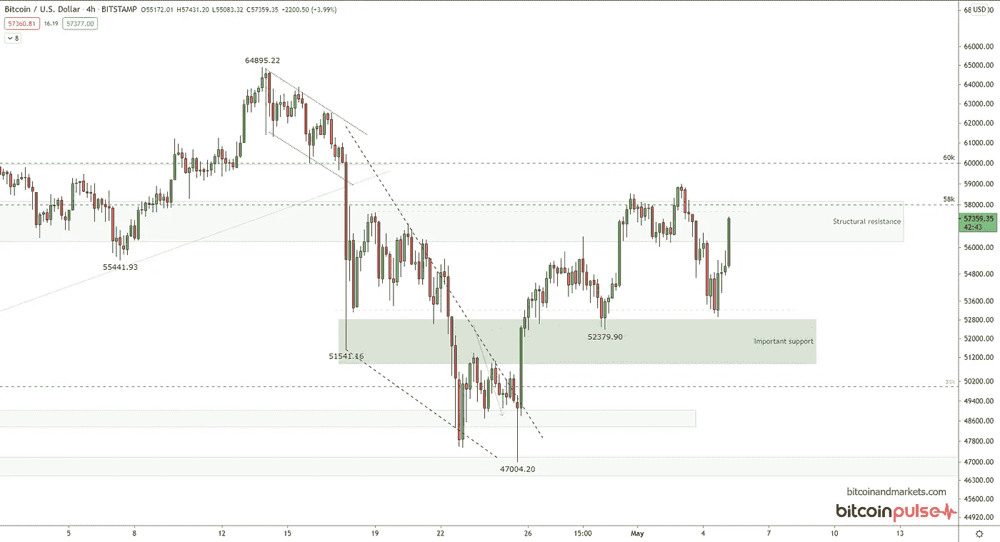

# 2021 年 5 月 5 日宏观图表纲要

> 原文：<https://medium.com/coinmonks/macro-chart-rundown-for-5-5-2021-9740c4ec511c?source=collection_archive---------4----------------------->

今天我们考察比特币，以太坊，美元，原油，股票，大宗商品，黄金白银！

欢迎回到 BTCM 研究中心。如果您觉得这些图表更新信息丰富，请订阅。今天我们考察比特币、以太坊、美元、原油、股票、商品、黄金、白银！

# 比特币

上周，我说过 58k 美元是一个关键价位，要注意这个价位何时会受到考验。嗯，价格确实突破了 58k 美元，但立即被拒绝。在这种时候，你至少要看到日线收在这个水平上，作为一个可靠的确认(如下例)，以及成交量的增加和持续走高。我们没有看到任何这些特征。3 月 3 日的每日蜡烛触及 59，000 美元，但很快被抛售，以 57，222 美元收盘。此外，在整个反弹过程中，成交量极其低迷。

我有点担心 altcoins 的崩溃可能会对比特币产生不利影响。价格在这里有点挣扎，昨天的图表看起来很悲观。我认为更有可能的是，替代币崩溃可能有利于比特币，因为人们会将他们能够获得的价值转移回比特币，但替代币也有可能拖累比特币。我非常有兴趣了解比特币是如何度过夏季低迷的。

**别忘了，比特币正处于牛市。仅此一点就足以在图表的某些点上打破僵局。当每个人都站在悲观的一边时，这艘船就有倾覆的趋势。**

更多关于比特币的技术分析，以及更多宏观评论，请订阅 bitcoinandmarkets.com 的[比特币脉动](https://bitcoinandmarkets.com/membership/)。

# 以太坊

我不是以太坊的粉丝。在我看来，从长远来看，它太复杂、太集中、太具有欺骗性，永远不会安全或成功。但是，庞氏骗局可以持续很长时间，而联邦理工学院现在正在运作。所以，我们应该看一看。

别忘了，这些是日志图表。下划线趋势是 9 天内 50%的移动。

以太坊的历史可以很好地放在周线图上。我对以太坊的价格没有预测，因为以太坊的基本面是庞氏基本面。这也是其他骗局的平台。因此，一个传统的类比可能是粉红单交易所(一个交易小盘股公司的股票交易所)或者一个赌场。

以太坊今天的市值是 3900 亿美元，其中大约 3890 亿美元是纯粹的幻想。

快速浏览一下以太坊的比特币价格，这里有很多交易，但你可以看到价格与 ATH 相差甚远，准确地说是 60%左右。我还在每年的转弯处画了垂直线，并突出显示了相应的泵。如果这种模式继续下去，我们可以预计这种涨势将很快结束，今年剩余时间以太坊应该会对比特币下跌。

# 美元指数

本周，美元让许多人感到困惑。美元真的会走高吗？“等等，救援反弹结束了吗？它正在走低，”这就是当你没有一个像我们在 BTCM 研究中所做的那样的总体论点时所存在的困惑。

我们处于强势美元的环境中。美元相对于其他货币应该会升值。在过去的一年里，美元相对于其他货币仅下跌了 8%，尽管美联储和美国政府一直在尽一切努力来摧毁它。尽管他们尽了最大努力，但美元甚至没有跌至 2018 年的低点。

我仍然认为下一步会更高，但美元可能会在阻力区(虚线箭头)附近反弹，然后突破阻力区。美元通常与股票、石油和黄金成反比。

# WTI 原油

这是石油的关键点。正如我一直在说的，油价在 60 多美元时，美国页岩产量将开始重返市场。石油输出国组织知道这一点，不希望这种情况发生。在这盘大棋的下一步，石油输出国组织计划在 7 月前将日产量提高 200 万桶。

> *“在截至 7 月份的未来三个月里，欧佩克+集团的原油产量将增加 200 多万桶/日。”*

全球产量参差不齐，一些国家略有增产，而另一些国家则在减产。一个很好的例子是美国和加拿大。美国本周增加了 2 个钻井平台，总计 440 个石油和天然气钻井平台，而加拿大减少了 4 个，至 51 个(不过仍比去年增加了 24 个)。这种模式在全球重复，有些增加，有些减少；除了石油输出国组织。他们准备增加生产。

短期来看，油价可能会上涨，但价格应该不会很快大幅上涨(T4)。我仍然预计油价不会长期保持在 60 美元/桶以上。

# 股票

看看标准普尔 500 的日线图，一切看起来都很好。没有明显的近期价格变动。还有一些空间来测试一些更低的水平，如果发生这种情况，它确实会危及这次复苏的整体结构。

我预计股市会有一些疲软，原因有三个:1)经济衰退的二次探底，因为我们已经提前了今年的大部分消费；2)古老的“5 月卖出”咒语；3)股市正处于长期移动平均线以上的创纪录偏差。所有这些都表明，应该很快会出现一次盘整。

我看好美国股票，对短期内“一分耕耘，一分收获”的说法抱有相当的敬意。今年夏天可能会横盘下跌，但从长期来看，结构性去全球化和外币疲软应该会对美国股市构成压力。

# 商品

商品指数已经突破了 6 年来的高点，通货膨胀论者喜欢把它作为他们唯一可以用来支持他们立场的指标之一。然而，从上面的长期图表来看，这一举动是有背景的。这很重要，我不会反对，但这并不惊天动地。我已经标出了下一个抵抗区域。

没有什么是直线上升的。在经历了一个月的持续上涨后，现在至少是大宗商品盘整的时候了。短期商品应该会有所回落。长期来看，随着全球经济继续陷入更深的萧条和去全球化，大宗商品将会疲软。

# 黄金和白银

本周金价持平。它通过停留在重要的 1750 美元水平上显示了一点力量，但它停留在那里的时间越长，没有找到更多的多头来推高价格，向下的压力将会增加。

# 银

本周白银价格略有上涨，但没有什么值得大书特书的。

感谢阅读。订阅分享！

A

*原载于 2021 年 5 月 5 日*[*【https://btcm.co】*](https://btcm.co/macro-chart-rundown-for-5-5-2021/)*。*

## 另外，阅读

*   [什么是融资融券交易](https://blog.coincodecap.com/margin-trading) | [成本平均法](https://blog.coincodecap.com/dca)
*   最好的[加密交易机器人](/coinmonks/crypto-trading-bot-c2ffce8acb2a) | [网格交易机器人](https://blog.coincodecap.com/grid-trading)
*   [3 商业评论](/coinmonks/3commas-review-an-excellent-crypto-trading-bot-2020-1313a58bec92) | [Pionex 评论](/coinmonks/pionex-review-exchange-with-crypto-trading-bot-1e459d0191ea) | [Coinrule 评论](/coinmonks/coinrule-review-2021-a-beginner-friendly-crypto-trading-bot-daf0504848ba)
*   [比特币基地评论](/coinmonks/coinbase-review-6ef4e0f56064) | [德里比特评论](/coinmonks/deribit-review-options-fees-apis-and-testnet-2ca16c4bbdb2) | [FTX 交易所评论](/coinmonks/ftx-crypto-exchange-review-53664ac1198f)
*   [n 零复习](/coinmonks/ngrave-zero-review-c465cf8307fc) | [Phemex 复习](/coinmonks/phemex-review-4cfba0b49e28) | [PrimeXBT 复习](/coinmonks/primexbt-review-88e0815be858)
*   [Bybit 交易所评论](/coinmonks/bybit-exchange-review-dbd570019b71) | [Bityard 评论](/coinmonks/bityard-review-7d104239be35) | [CoinSpot 评论](https://blog.coincodecap.com/coinspot-review)
*   [3 commas vs crypto hopper](/coinmonks/3commas-vs-pionex-vs-cryptohopper-best-crypto-bot-6a98d2baa203)|[赚取加密利息](/coinmonks/earn-crypto-interest-b10b810fdda3)
*   最好的比特币[硬件钱包](/coinmonks/the-best-cryptocurrency-hardware-wallets-of-2020-e28b1c124069?source=friends_link&sk=324dd9ff8556ab578d71e7ad7658ad7c) | [BitBox02 回顾](/coinmonks/bitbox02-review-your-swiss-bitcoin-hardware-wallet-c36c88fff29)
*   [莱杰 vs n rave](/coinmonks/ledger-vs-ngrave-zero-7e40f0c1d694)|[莱杰 nano s vs x](/coinmonks/ledger-nano-s-vs-x-battery-hardware-price-storage-59a6663fe3b0) | [币安评论](/coinmonks/binance-review-ee10d3bf3b6e)
*   [加密复制交易平台](/coinmonks/top-10-crypto-copy-trading-platforms-for-beginners-d0c37c7d698c) | [Coinmama 评论](/coinmonks/coinmama-review-ace5641bde6e)
*   [CoinLoan 评论](/coinmonks/coinloan-review-18128b9badc4) | [YouHodler 评论](/coinmonks/youhodler-4-easy-ways-to-make-money-98969b9689f2) | [BlockFi 评论](/coinmonks/blockfi-review-53096053c097)
*   最好的[加密税务软件](/coinmonks/best-crypto-tax-tool-for-my-money-72d4b430816b) | [硬币追踪评论](/coinmonks/cointracking-review-a-reliable-cryptocurrency-tax-software-5114e3eb5737)
*   最佳[加密借贷平台](/coinmonks/top-5-crypto-lending-platforms-in-2020-that-you-need-to-know-a1b675cec3fa) | [杠杆令牌](/coinmonks/leveraged-token-3f5257808b22)
*   [BlockFi vs Celsius](/coinmonks/blockfi-vs-celsius-vs-hodlnaut-8a1cc8c26630)|[Hodlnaut 点评](/coinmonks/hodlnaut-review-best-way-to-hodl-is-to-earn-interest-on-your-bitcoin-6658a8c19edf) | [KuCoin 点评](https://blog.coincodecap.com/kucoin-review)
*   [Bitsgap 评审](/coinmonks/bitsgap-review-a-crypto-trading-bot-that-makes-easy-money-a5d88a336df2) | [Quadency 评审](/coinmonks/quadency-review-a-crypto-trading-automation-platform-3068eaa374e1) | [Bitbns 评审](/coinmonks/bitbns-review-38256a07e161)
*   [埃利帕尔泰坦评论](/coinmonks/ellipal-titan-review-85e9071dd029) | [赛克斯斯通评论](/coinmonks/secux-stone-hardware-wallet-review-15-discount-coupon-2020-7577032faa6e)
*   [本地比特币评论](/coinmonks/localbitcoins-review-6cc001c6ed56) | [加密货币储蓄账户](https://blog.coincodecap.com/cryptocurrency-savings-accounts)
*   最佳[区块链分析](https://bitquery.io/blog/best-blockchain-analysis-tools-and-software)工具| [赚比特币](/coinmonks/earn-bitcoin-6e8bd3c592d9)
*   [加密套利](/coinmonks/crypto-arbitrage-guide-how-to-make-money-as-a-beginner-62bfe5c868f6)指南| [如何做空比特币](/coinmonks/how-to-short-bitcoin-568a2d0b4ae5)
*   最佳[加密制图工具](/coinmonks/what-are-the-best-charting-platforms-for-cryptocurrency-trading-85aade584d80) | [最佳加密交易所](/coinmonks/crypto-exchange-dd2f9d6f3769)
*   [如何在印度购买比特币？](/coinmonks/buy-bitcoin-in-india-feb50ddfef94) | [瓦济克斯审查](/coinmonks/wazirx-review-5c811b074f5b)
*   [印度比特币交易所](/coinmonks/bitcoin-exchange-in-india-7f1fe79715c9) | [比特币储蓄账户](/coinmonks/bitcoin-savings-account-e65b13f92451)
*   [CoinDCX 评论](/coinmonks/coindcx-review-8444db3621a2) | [加密保证金交易交易所](https://blog.coincodecap.com/crypto-margin-trading-exchanges)