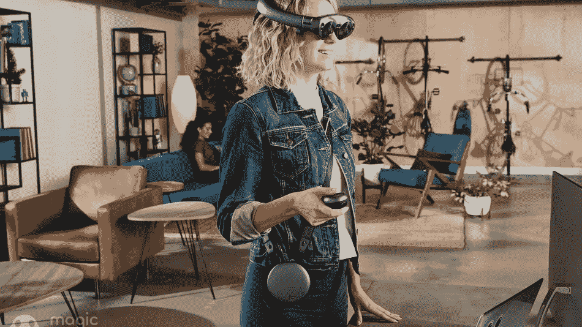
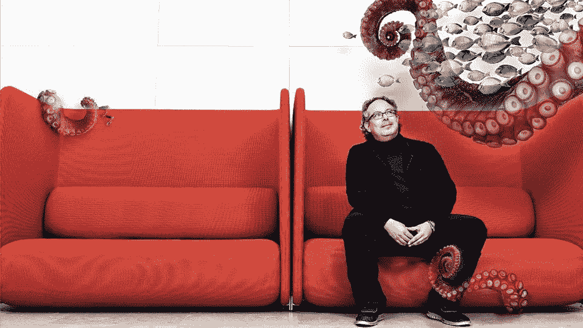
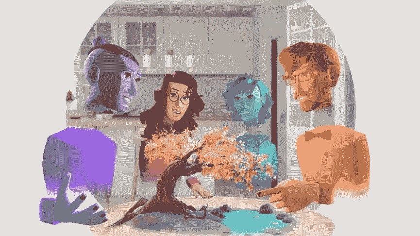
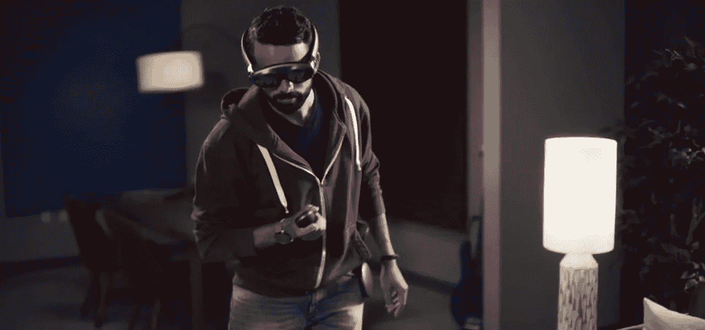
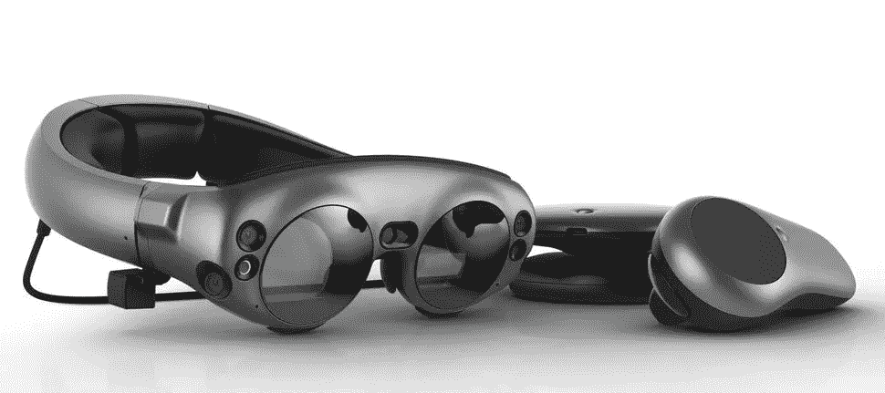

# Magic Leap:终极混合现实体验

> 原文：<https://medium.com/coinmonks/magic-leap-ultimate-mixed-reality-experience-eb7945479d54?source=collection_archive---------7----------------------->

迄今为止，你肯定已经尝试过一些 AR 耳机，但没有什么能真正让你着迷于如此逼真的功能。Magic Leap 推出后，对未来的期望很高。是的，带着这种希望，我们对这种改变持积极态度。

> 像任何优秀的魔术师一样，45 岁的创始人兼首席执行官 Rony Abovitz 守口如瓶。自 2011 年成立以来，Magic Leap 一直在极度保密的状态下运作。

R&D 魔术跳跃部门经过严格的开发和高科技测试，想出了如此伟大的发明，从而在发射前炒作观众的期待。现在，当 magic leap 的创始人 Abovitz 展示了它的第一个产品时，它已经工作了很长时间。这在热切的观众中引起了一定程度的兴奋。对这个产品的一瞥给了我们一个线索，什么样的计算未来正等待着我们。

# 以下是您需要了解的…..

对神奇飞跃的漫长等待终于结束了。是的，对每个人来说，这是一个漫长的情绪过山车，但该公司终于出现了。它看起来像是混合现实眼镜。

这款眼镜名为 Magic Leap One，与它有很大关系。一个新的虚拟世界，3D 生物接近不同的声音效果和视觉效果。

这是类似于谷歌眼镜和 HoloLens 的东西。谈到 magic leap one，这款眼镜通过透明镜片的耳机将数字 3D 图形叠加到你对现实世界的看法上。

迄今为止，Magic Leap 已经筹集了近 14 亿美元的风险资本，其中包括今年 2 月的 7.94 亿美元，据报道这是历史上最大的 C 轮融资。

> **这项技术可能会影响每一个使用屏幕或电脑的企业，以及许多不使用屏幕或电脑的企业。它可能会扼杀价值 1200 亿美元的平板显示器市场，并从根本上动摇价值 1 万亿美元的全球消费电子业务。**

# 什么是 magic leap？

“Magic Leap”开发了这种杰出的设备，采用了他们称之为光场技术的独特技术。要了解更多，光场部分指的是 Leap 容纳多个焦点的方式。这为用户提供了终极的 3D 体验，他们将能够在不同的距离清楚地看到全息图。体验后的用户留下了深刻的印象。Magic Leap 为这种新的进化设备采用了一个新术语，称为“空间计算”，而不是使用术语“混合现实”或“增强现实”。

用户一直对 Magic Leap 持怀疑态度，因为它从未在公共场合展示过它的产品，因此用户对 Magic Leap One 感到兴奋。有如此多的记者和其他人在关注这家初创企业，而在发起采访时，只有少数记者被邀请去看一看，写一写。

Magic Leap 拥有一个为各种平台开发应用程序的开发团队，以及为 Magic Leap 拍摄视频或创作其他内容的电影摄影师等“创作者”。

将光线投射到光场，它不仅能捕捉到射到我们眼睛的每一束光线，还能捕捉到每一束光线在特定环境中行进的方向。它追踪穿过空间中每一点的光量。因此，它允许 VR、AR 和 MR 研究人员以及工程师以高水平的可视化赋予虚拟动画、对象和角色深度感。

> 技术人员声称这项技术比虚拟现实更有益于我们的身体——眼睛、大脑等，因为它尊重我们理解和处理世界的方式

# 关于这背后的想法…..“目标是取代智能手机”

在这里谈论的想法是，数字世界不会叠加在现实世界上，而是融入其中。这是一个完全互动的环境，用户可以在观看空间周围的虚拟生物时，观察周围的事物并感受它。由于摄像头和传感器，该设备还将知道用户正在做什么。因此，如果用户突然起身去做其他事情，它会自动暂停，直到用户再次开始。一旦用户完成，它将恢复之前的操作。这种巨大的功能可以通过普通电视的放大版来理解。但这还不是全部。

这一切都是他们策划的。Magi leap 相信有大量的设备可以被它替代。

***他们解释说“我们并不是说每个人都会走这条路。”他们进一步解释说，“如果你真的把你所有的手机、电视、笔记本电脑、平板电脑加起来，加起来有几千或几万美元，它们都会被虚拟化，”***

# 神奇飞跃一号的范围…

[https://www.youtube.com/watch?v=U2XQHLSuETs](https://www.youtube.com/watch?v=U2XQHLSuETs)

# "了解 Magic Leap 的最佳方式是体验它."

微软 HoloLens 是最接近这种虚拟体验的产品。Magic Leap 允许您与计算机生成的图像进行交互，这些图像与您周围的世界一起出现。

Magic leap 的目标是商业用户，未来将为每个人提供随时佩戴的设备，包括学生、商业用户和普通消费者。

消费者可能正在购买一辆汽车，通过 Magic Leap，可以看到汽车就在他们的车道上，并实时更换颜色。或者想象一下，在网上浏览一双鞋，然后从你的办公桌上看到这双鞋的三维图像。

从健康行业的角度来看，Magic Leap 似乎正在努力创建一个健康的内容生态系统，同时提供第一方和第三方娱乐支持以及更标准的 AR 操作系统。

除此之外，在另一边，Magic Leap one 提供的 AR 游戏可以接管所需的空间，并在你的头上投影漂浮的动画水母。更重要的是，这项技术描绘了某种用户可以拿在手中的数字角色，充当 AR 个人助理。magic leap 的创始人 Abovitz 也宣布了 Magic Leap 和 Twilio 之间的合作关系。它非常专注于添加软件的计划，这将使应用程序开发人员能够通过电话或短信联系 Leap 系统。

因此，一方面，有了 Magic Leap，用户将能够打开电子邮件，观看电视和体育运动，购买鞋子和许多可以在几秒钟内完成的事情。用户可以坐在家里的沙发上，就像在篮球比赛的场边一样，或者就在乐队用户面前。

由于数字对象可以看起来是 3d 的，想象一下深夜节目，但用户可以在电视或其他设备上观看，就好像主持人坐在你的客厅里一样。

Magic Leap 的技术可以实现这些体验，但仍然需要开发人员来创造它们。

# Magic Leap 的价格是多少？

Magic Leap 长期以来都笼罩在神秘之中。由于许多问题，公司已经花了将近十年的时间。Magic Leap 正在研究将计算机生成的图像叠加到视野中的真实世界的技术。

出于对 Magic Leap One 成本的担忧，用户等待了很长时间。它的售价为 2295 美元，这是一个很大的数目，但它还没有出售给消费者。现在 Magic Leap 将把它卖给那些为他们设备开发更多应用和游戏的公司。

*原载于 2018 年 8 月 9 日*[*【www.quytech.com】*](http://www.quytech.com/blog/magic-leap-ultimate-mixed-reality-experience/)*。*