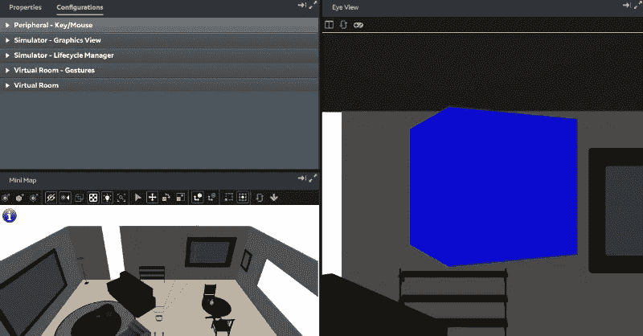

# magic Leap(Mac 上的 Unity)示例:第 1 部分

> 原文：<https://medium.com/coinmonks/magic-leap-unity-on-a-mac-by-example-part-1-fc3188f0e964?source=collection_archive---------3----------------------->

我们从一个与 *Magic Leap* 控制器交互的简单例子开始这个系列。

这个系列的完整例子可以从[下载](https://github.com/larkintuckerllc/magic-leap-patterns)。

**更新**:本周早些时候在 L *umin SDK 0.14.0* 写了这个，但是刚刚升级到 *0.15.0* 。虽然有一些突破性的变化，模拟器的性能是日夜更好(现在几乎可用)。已更新文章，包含更改。

**设置**

首先，本系列假设您已经构建并运行了[*Magic Leap Hello Cube*](https://creator.magicleap.com/learn/tutorials/magic-leap-remote-hello-cube-unity-r-edition)示例。你也可能会发现这篇文章很有帮助 [*拆箱 Magic Leap Development(Mac 上的 Unity)*](/@johntucker_48673/unboxing-magic-leap-development-unity-on-a-mac-8d8c7d474e3b)*。*

一个额外的设置步骤是使用菜单将 *Magic Leap Unity 包*导入到您的 *Unity* 项目中:

*资产>导入包>自定义包*

查找文件:

*~/Magic Leap/tools/unity/v 0 . 15 . 0/Magic Leap-0 . 15 . 0 . unity package*

这个包包含使用 *Magic Leap Unity API* 所需的文件，该 API 在 *UnityEngine 下可用。Experimental.XR.MagicLeap* 命名空间。它还包含了一些例子。

此外， *Unity API 文档*(参考)可通过在网络浏览器中打开以下文件获得(也可从 *Magic Leap* 门户获得)。

*~/magic leap/tools/unity/v 0 . 15 . 0/API _ docs/html/index.html*

**控制**

第一个例子演示了与 *Magic Leap* 控制器(或者一个兼而有之的移动应用)的交互；具体来说，当控制器的缓冲器被按下时，它将立方体(来自 *Hello Cube* 示例)涂成蓝色。

**注意**:您可以使用*属性/配置*面板模拟按压控制器的保险杠；使用*属性*选项卡和*输入控制器*部分。

**注**:这个例子是 *Magic Leap* 提供的[例子](https://github.com/larkintuckerllc/magic-leap-patterns/blob/master/Assets/MagicLeap/Examples/Scripts/Utility/ControllerStatsText.cs)的简化版本。

*Assets/src/control/cube . cs*

观察

*   该脚本作为*立方体*游戏对象的脚本组件被附加。
*   *MLInput。启动*和 *MLInput。Stop* 将在与控制器交互的任何类的*monobhavior Awake*和 *OnDestroy* 方法中被调用。
*   我们应该禁用整个脚本 *MLInput。启动*失败。
*   因为控制器可以断开连接，所以我们需要在尝试与控制器交互之前检查这种情况(因此在 *Update* 方法顶部的 guard-子句)。
*   私有变量 *_active* 仅用于在按钮(或者 *Bumper* 或者 *Move* )从激活转变为非激活(或者反之亦然)时触发更新。
*   私有变量 *_first* 用于在第一次更新时初始化 *_active* 。

**接下来的步骤**

虽然我们只涉及了控制器的功能，但我们将在下一篇文章[*Magic Leap(Mac 上的 Unity)中通过示例继续讨论手势输入:第 2 部分*](/@johntucker_48673/magic-leap-unity-on-a-mac-by-example-part-2-56662fb569f) 。