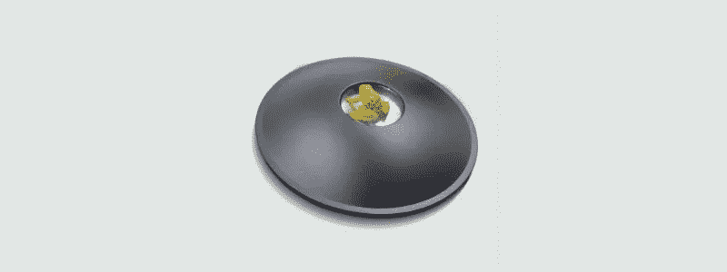
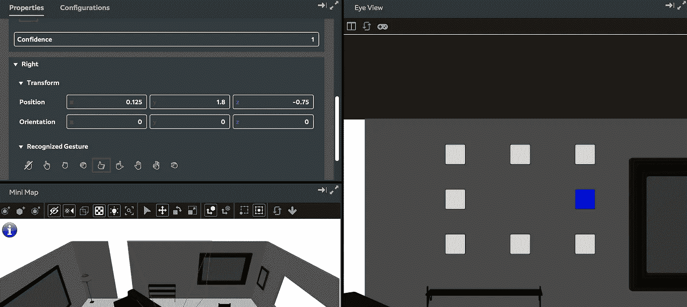

# magic Leap(Mac 上的 Unity)示例:第 2 部分

> 原文：<https://medium.com/coinmonks/magic-leap-unity-on-a-mac-by-example-part-2-56662fb569f?source=collection_archive---------9----------------------->

通过 *Magic Leap* API 与手(左右)手势交互特别简单。

本文是以[*Magic Leap(Mac 上的 Unity)为例开始的系列文章的一部分:第 1 部分*](/@johntucker_48673/magic-leap-unity-on-a-mac-by-example-part-1-fc3188f0e964) 。

**更新**:本周早些时候在 L *umin SDK 0.14.0* 写了这个，但是刚刚升级到 *0.15.0* 。虽然有一些突破性的变化，模拟器的性能是日夜更好(现在几乎可用)。已更新文章，包含更改。

本系列的完整示例可从[下载](https://github.com/larkintuckerllc/magic-leap-patterns)。

**手部跟踪(以前称为手势)**

这个例子演示了用八种不同的手势(也称为击键)与手(左手和右手)进行交互，例如，点、拳等。用你左手的颜色做一个手势，分别是正方形的蓝色；右手红色，双手洋红色。

**注意**:在 *v0.14.0* 和*v 0 . 15 . 0*的变更中，手势被重命名为按键(没有完全改变示例中的所有变量名)。

**注**:这个例子是 *Magic Leap* 提供的[例子](https://github.com/larkintuckerllc/magic-leap-patterns/blob/master/Assets/MagicLeap/Examples/Scripts/HandTrackingExample.cs)的简化版本。特别是，这个例子将所有代码放在一个文件中，画布不跟踪摄像机。

**注意**:关于他们的例子，另一个有趣的事情是它使用了标记为 [*核心组件*](https://github.com/larkintuckerllc/magic-leap-patterns/tree/master/Assets/MagicLeap/CoreComponents) *，*的代码，例如，它使用了其中的两个( *HandTracking.cs* 和 *HeadposeCanvas.cs* )。起初，我想在我的项目中使用这些，但经过一番思考后，我意识到这些并不是一个可靠的 API，而实际上只是示例代码。

*Assets/src/hand _ tracking/gesture . cs*

观察结果:

*   很像前面的例子，我们在 *Awake* 和 *OnDestroy* 方法中使用 *MLHands.start* 和*ml hands . stop*；包括如果 *MLHands.start* 失败则禁用脚本。
*   *v0.14.0* 和 *v0.15.0* 之间的一个很大的变化是你必须在使用它们之前启用按键；这是因为添加关键点使得 *Magic Leap* 硬件更难识别它们。
*   除了读取手势，你得到一个置信度(0f 到 1f)值；1f 表示 100%有信心。
*   私有变量 *_lastLeftGesture* 和 *_lastRightGesture* 仅用于在手势改变时触发更新。
*   如前所述，私有变量 *_first* 用于在第一次更新时初始化*_ lastleftgestate 和 _ lastlrightgestate*。

**接下来的步骤**

关于手势，我们将在下一篇文章[*Magic Leap(Mac 上的 Unity)中通过示例讨论平面检测 API:第 3 部分*](/@johntucker_48673/magic-leap-unity-on-a-mac-by-example-part-3-219854456d3e) 。