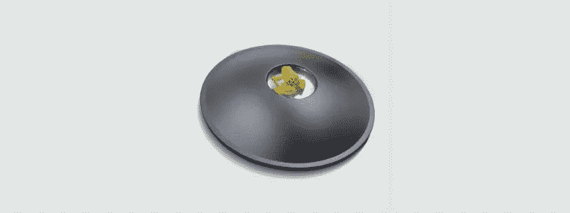
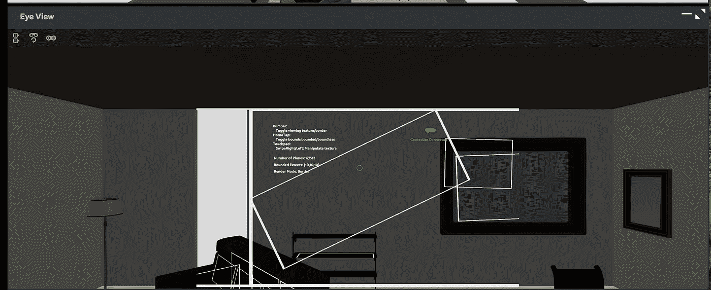
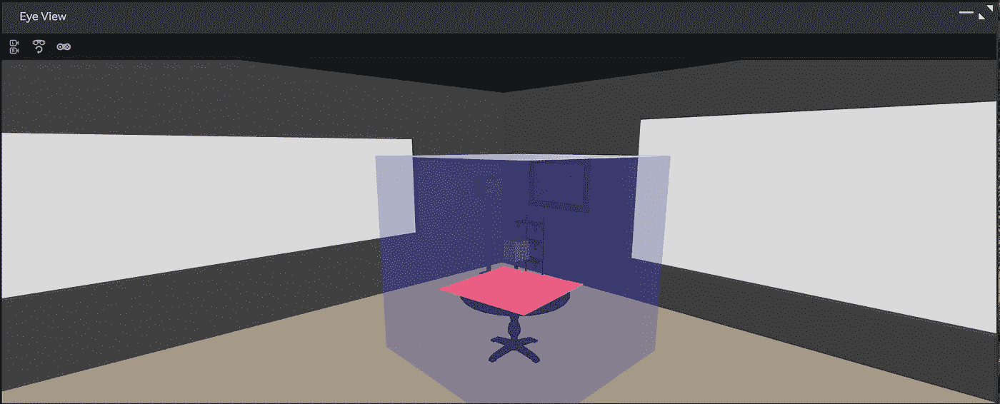

# magic Leap(Mac 上的 Unity)示例:第 3 部分

> 原文：<https://medium.com/coinmonks/magic-leap-unity-on-a-mac-by-example-part-3-219854456d3e?source=collection_archive---------9----------------------->

探索平面检测魔术飞跃 API。

本文是以[*Magic Leap(Mac 上的 Unity)为例开始的系列文章的一部分:第 1 部分*](/@johntucker_48673/magic-leap-unity-on-a-mac-by-example-part-1-fc3188f0e964) 。

在六个核心 [SDK 示例](https://creator.magicleap.com/learn/guides/sdk-examples-landing-page)中，我们已经探索了控制器和手部跟踪(正式的手势)。已经决定跳过探索[图像跟踪](https://creator.magicleap.com/learn/guides/sdk-example-image-tracking)和[网格](https://creator.magicleap.com/learn/guides/sdk-example-meshing)API，转到平面上。

本系列的完整示例可从[下载](https://github.com/larkintuckerllc/magic-leap-patterns)。

**平面**

首先，在运行他们的[示例](https://creator.magicleap.com/learn/guides/sdk-example-planes)时，我发现模拟器中的平面检测有点不稳定；它探测到房间里似乎不存在的飞机。此外，他们的例子过于复杂，跨越了多个文件。

本文中的例子更简单，也更容易预测。它在半透明的蓝色立方体中找到水平面，并将它们涂成红色。

*Assets/src/planes/planes . cs*

观察

*   很像前面的例子，我们在 *Awake* 和 *OnDestroy* 方法中使用 *MLWorldPlanes.start* 和*mlworld planes . stop*；包括如果 *MLWorldPlanes.start* 失败则禁用脚本。
*   同样，为了更好地控制平面检测，我们将平面检测限制在半透明的蓝色框内(围绕*休息室*中的桌子)。设置为脚本的参数( *BBoxTransform* 和*bbox extensions*)。
*   即使在这些受控的情况下，平面检测发现三个平面。一个(如图所示)覆盖桌面。另外两个具有相同的中心和宽度/高度；但是有奇怪的旋转，导致他们不显示(不知道为什么)。

**下一步**

了解了 planes API 的表面之后，我们将在下一篇文章[*【Magic Leap(Mac 上的 Unity )】(示例:第 4 部分*](/@johntucker_48673/magic-leap-unity-on-a-mac-by-example-part-4-d12be6a63fc9) )中继续讨论光线投射。