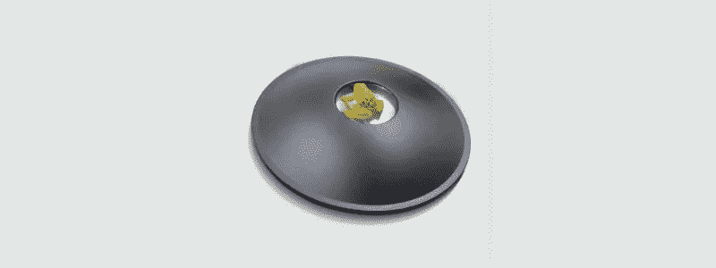
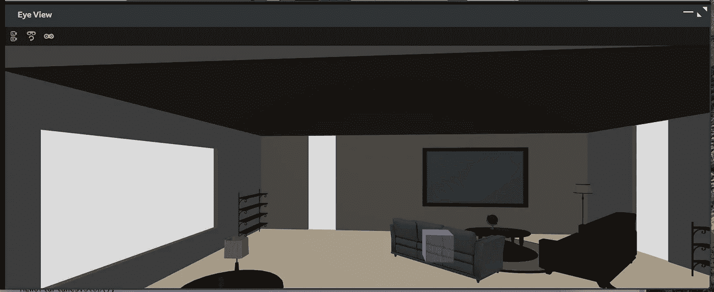

# magic Leap(Mac 上的 Unity)示例:第 4 部分

> 原文：<https://medium.com/coinmonks/magic-leap-unity-on-a-mac-by-example-part-4-d12be6a63fc9?source=collection_archive---------1----------------------->

探索 Raycast Magic Leap API。

本文是以[*Magic Leap(Mac 上的 Unity)为例开始的系列文章的一部分:第 1 部分*](/@johntucker_48673/magic-leap-unity-on-a-mac-by-example-part-1-fc3188f0e964) 。

我们探索了一种简单而强大的与物质世界互动的技术；光线投射。

该系列的完整示例可从[下载](https://github.com/larkintuckerllc/magic-leap-patterns)。

**光线投射**

与之前的文章一样，这个例子是 Magic Leap 关于光线投射主题的更复杂的[例子](https://github.com/larkintuckerllc/magic-leap-patterns/blob/master/Assets/MagicLeap/CoreComponents/BaseRaycast.cs)(多个文件之一)的简化版本。

这个应用程序在从位置(0.0f，0.5f，0.0f)开始计算的位置绘制一个立方体；房间中心离地面 1/2 米。它向(-1.0f，0.0f，0.0f)方向移动；朝着挂着照片的墙。它返回击中房间中第一个物理物体(沙发背)的位置，并绘制一个立方体。

*Assets/src/ray cast/ray cast . cs*

观察结果:

*   与前面的例子非常相似，我们在 *Awake* 和 *OnDestroy* 方法中使用 *MLWorldRays.start* 和*mlworldrays . stop*；包括如果 *MLWorldRays.start* 失败则禁用脚本。
*   我不明白为什么我们想要/需要创建一个 *RaycastHit* 对象来传递数据，而我们已经有了更原始形式的关键数据，例如 *Vector3* *point* 。
*   如果从起点到碰撞点的整个路径都不在 *Magic Leap* 耳机的视野之内，那么光线投射如何工作还不完全清楚。

**结论**

通过简单的例子，我们已经探索了六个核心*Magic Leap*API 中的四个:控制、手跟踪(又名手势)、平面和光线投射。

剩下的两个图像跟踪和网格化更难处理；因此不包括在本系列中。

我们用一个更完整的例子来总结这个系列:第 5 部分 。