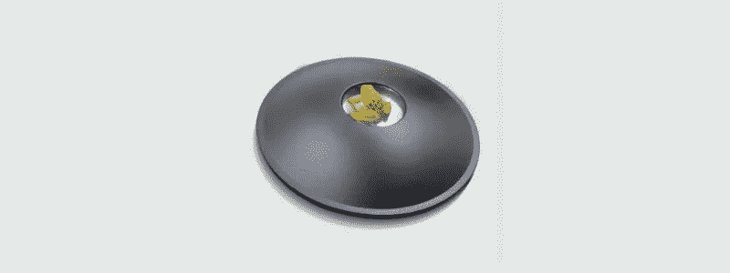
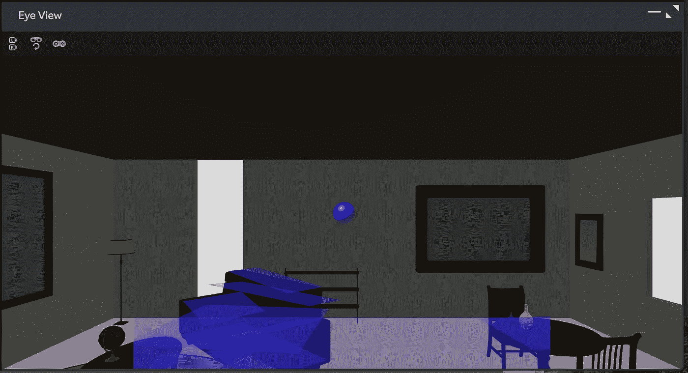
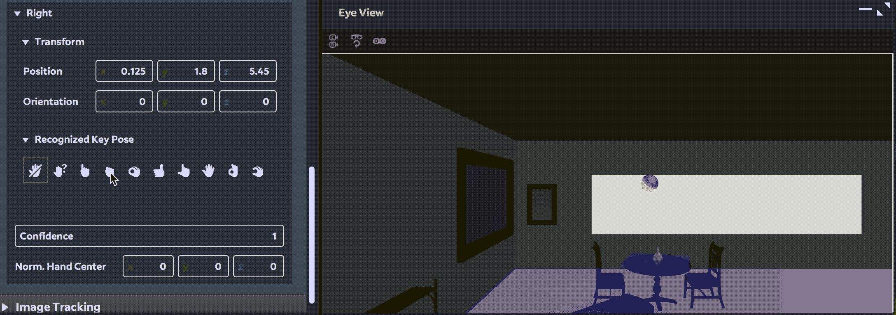
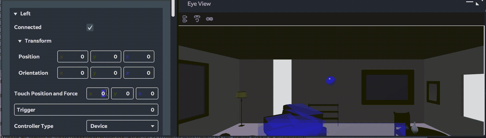
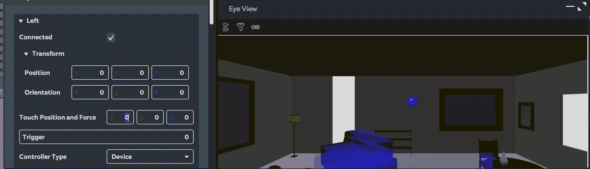

# magic Leap(Mac 上的 Unity)示例:第 5 部分

> 原文：<https://medium.com/coinmonks/magic-leap-unity-on-a-mac-by-example-part-5-4fb691b1d759?source=collection_archive---------9----------------------->

使用一系列*Magic Leap*API 的更完整示例。

本文是以[*Magic Leap(Mac 上的 Unity)为例开始的系列文章的一部分:第 1 部分*](/@johntucker_48673/magic-leap-unity-on-a-mac-by-example-part-1-fc3188f0e964) 。

在前四篇文章中，我们通过简单的例子探索了每一个 *MLHands、MLInput、MLWorldPlanes 和 MLWorldRays*API。在本文中，我们一起使用它们来构建一个稍微复杂一些的示例。

**落球示例**

该示例可从单独的存储库中下载。

虽然有点令人不快(不会很好地扩展)，但所有功能都是在 [*Ball.cs*](https://github.com/larkintuckerllc/ball-drop-example/blob/master/Assets/src/Ball.cs) 脚本中的 *Ball GameObject 上实现的。*

启动时，渲染*球*(蓝色球体)，启动 API，检测水平面和地板(透明蓝色平面)。

*Assets/src/Ball.cs*

如果用户用右手握拳，球将下落并反弹到其下方的障碍物上。

*资产/src/Ball.cs*

如果用户使用第一个触摸控制(左/右/上/下)，它将水平移动球。

*资产/src/Ball.cs*

当球在障碍物上方移动时，它将浮动其高度，以保持在障碍物(包括地板)上方的恒定高度。

*资产/src/Ball.cs*

当 *Unity* 停止时，API 也会停止。

*Assets/src/Ball.cs*

**结论**

希望本系列对您有所帮助。