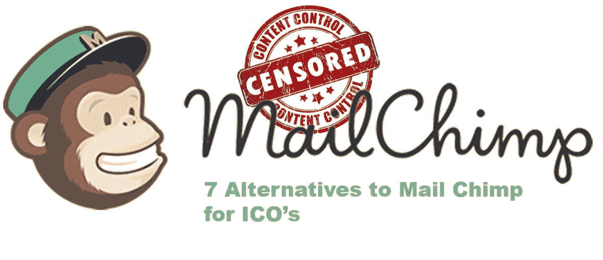
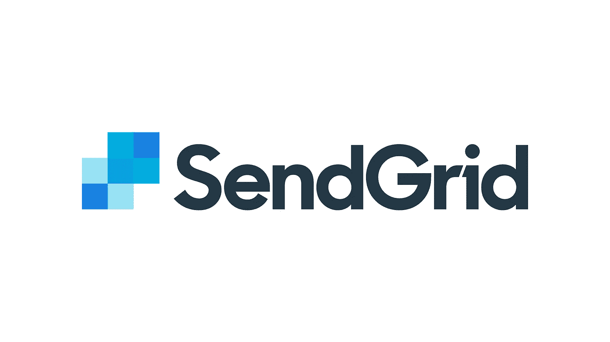
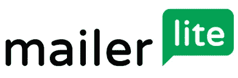
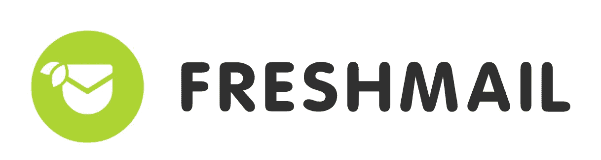
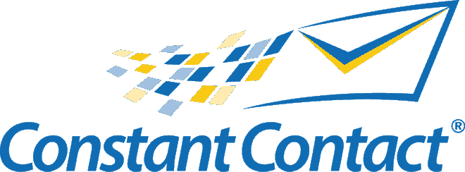
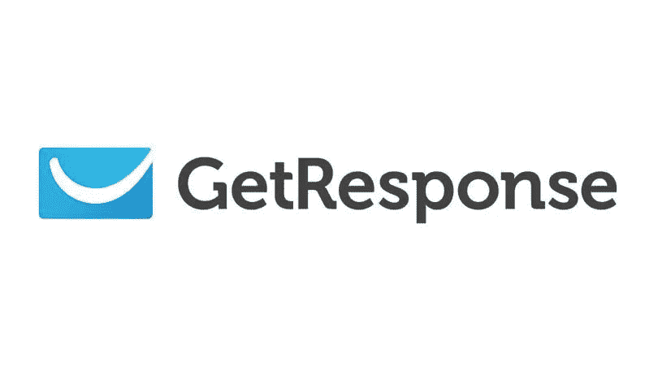

# MAIL CHIMP 正在关闭加密货币账户，但还有其他选择

> 原文：<https://medium.com/coinmonks/mail-chimp-is-shutting-cryptocurrency-accounts-but-there-are-alternatives-8d9a02347281?source=collection_archive---------0----------------------->

Mail chimp 已经加入了 facebook 和谷歌的行列，以阻止加密货币相关的账户。脸书决定屏蔽加密货币相关广告是可以理解的，因为脸书是一个封闭的平台，可以决定接受任何让他们满意的内容。这意味着每个使用 facebook 的用户都不会看到区块链的相关广告。

谷歌禁止区块链相关广告的决定是一个严重的问题，因为数百万网站通过 AdX 和 Adsense 做广告。谷歌的决定是对数百万热爱区块链技术的出版商、研究人员和企业家的惩罚。

周四，Mail chimp 在他们的 twitter 上发布了这个消息。

“目前，加密货币的推广和交换经常与网络钓鱼、诈骗、欺诈和误导性商业行为联系在一起。值得注意的是，该政策并不阻止通过我们的平台发送的邮件中相关主题的讨论。例如，出版物和记者可以发送加密货币相关信息，只要他们不参与加密货币的销售、生产、交换或营销。”

这意味着 Mail chimp 决定审查公司可以与客户分享的内容。“这是一个不公平的决定”——他们是一家私人公司，而不是政府公司。

出于好奇，几家公司联系了 mail chimp，询问他们将使用哪些指标来区分参与区块链的公司和参与新闻相关讨论的其他公司。人们声称只有人类才能完美区分那些账户。

目前，mailchimp 没有回应任何询问。Mailchimp 可能会效仿 facebook 今年早些时候禁止所有区块链相关广告的做法。他们声称，数字货币的匿名性是一种享受。这一消息已经在影响比特币的价格。比特币目前的交易价格低于 7000 美元大关。

Mail chimp 可能是电子邮件领域的领导者，因为他们的业务存在。他们可能也很擅长发送邮件，但其他电子邮件客户端也可以联系到相同的用户。

每当一家公司决定屏蔽任何关于加密货币或与之相关的人的内容时，就会有关于它被视为审查的讨论。人们总是会争辩他们是私人企业的事实。

我们已经看到像 youtube，twitter，Reedit，Google，脸书这样的网站禁止来自其他平台的内容。Mailchimp 新闻是一个悲伤的消息。他们突然决定禁止邮件列表集中在一个主题，而不是一个彻头彻尾的骗局。

出于同样的原因，他们的 AUP 政策也歧视“信用修复服务”和“在家工作”邮件。当他们中的许多人每月只支付几美元时，区分不是诈骗的服务是不值得的。

如果所有加密货币用户通过友好的政策转移到一个较小的电子邮件服务，Mail chimp 将结束黑名单问题和更大的送达率。然而，对他们来说，游戏结束了。

mailchimp 的 7 种替代品

mail chimp 的理想替代品将包含以下组件:

交易组件(与其他提供商集成的能力)

合理使用 API

使用方便

Mail chimp 已经变得不可靠，因为他们可能会因为某些原因认为你手动创建的活动是一个骗局。他们在没有任何警告的情况下封锁了人们的账户。他们封锁一切，包括用于发送电子邮件的 API。Mail chimp 加入了这样一群公司，他们对待你就像是在帮你的忙，即使你是付费消费者。

> [在您的收件箱中直接获得最佳软件交易](https://coincodecap.com/?utm_source=coinmonks)

这就是为什么我们决定为邮件黑猩猩写出这些替代品

1.  **Sendgrid** 有一个名为“营销活动”的营销产品。它们还允许您使用 AWS SNS 分离 API。Send grid 是一个可扩展的电子邮件传递服务，可以处理 SPF、ISP 和 DKIM。他们还使用内容检查、速率限制、垃圾邮件报告和反弹来帮助用户。

**2。Mailerlite** 是这个列表中最便宜的选择。他们允许用户向 5000 名用户发送无限量的电子邮件。这是一项免费计划，允许用户向订户发送 1，000 封电子邮件。Mailerlite 是首次电子邮件营销的完美选择。它很轻，便于发送电子邮件。Malierlite 具有基本的自动响应、A/B 测试以及从任何网站嵌入注册的能力。

**3。对于需要一点营销自动化的有经验的营销人员来说，Freshmail** 是完美的解决方案。Freshmail 是一个轻量级的解决方案，可以轻松地与其他系统竞争。Freshmail 的定价方案很灵活，他们甚至有一个免费增值计划，允许用户向 500 个联系人发送无限的电子邮件。Freshmail 更进一步，允许用户从 Gmail、CSV 和 CRM 等其他服务导入联系人。

**4。持续联系**是世界上最大和发展最快的电子邮件营销服务之一。这也是最容易使用和初学者友好的电子邮件营销服务。您可以轻松管理您的电子邮件列表、联系人、电子邮件模板等。每个帐户都可以让您轻松跟踪和报告，内置社交媒体共享工具，图片库和 1GB 的存储空间来存储您自己的文件。持续联系通过实时聊天、电子邮件、社区支持和庞大的资源库提供无与伦比的支持

**5。主动活动**是商家的绝佳选择。他们为任何企业提供灵活的定价选择。电子邮件管理围绕分割测试功能构建，以创建基于特定日期的活动。活动活动还允许用户上传联系人，并从 CRM 等第三方程序同步联系人。最后，他们有一个非凡的拖放界面，非常适合初学者。

**6。Sendinblue** 是这份榜单中最值得信赖的选择之一。他们与每个联系人沟通，以确保该联系人是 100%的订户。他们还与他们的联系人沟通，以确保他们没有因为以前的发送问题而被列入名单。这是他们确保用户成功营销的方式。

**7。Getresponse** 是电子邮件营销的最终选择。Get response 有许多其他供应商根本没有提供的功能。例如，他们允许用户拆分测试多达 5 个登录页面。他们还有一个内置的登录页面创建器和一个专门的工具来创建网上研讨会营销跟踪，我还忘了提到他们独有的拖放编辑功能。

链接:

 [## 电子邮件营销软件- GetResponse

### GetResponse 的电子邮件营销。发送电子邮件简讯、活动、在线调查和后续自动回复邮件…

www.getresponse.com](https://www.getresponse.com/)  [## 电子邮件营销和营销自动化软件- SendinBlue

### 加入 50，000 多家公司，使用最易于使用的一体化电子邮件营销、SMS、交易电子邮件(SMTP)和…

www.sendinblue.com](https://www.sendinblue.com/)  [## 电子邮件营销-营销自动化-小型企业 CRM

### 白金护肤的故事“积极运动让我有一个与人交谈，并根据他们的…

www.activecampaign.com](https://www.activecampaign.com/)  [## 电子邮件营销软件|持续联系

### 与不断接触，你可以创建有效的电子邮件营销和其他在线营销活动，以满足您的…

www.constantcontact.com](https://www.constantcontact.com/index.jsp)  [## 电子邮件营销和时事通讯软件

### 认识革命性的邮件设计师。无需任何编码技巧，即可创建美观有效的简讯。访问…

freshmail.com](https://freshmail.com/)  [## 电子邮件营销软件、自动化和服务| MailerLite

### 面向小型企业、专业博客作者和作者的电子邮件营销软件。所有计划包括拖放电子邮件…

www.mailerlite.com](https://www.mailerlite.com/)  [## 电子邮件递送服务|发送网格

### 通过全球最大的基于云的电子邮件交付平台交付您的交易和营销电子邮件…

sendgrid.com](https://sendgrid.com/)