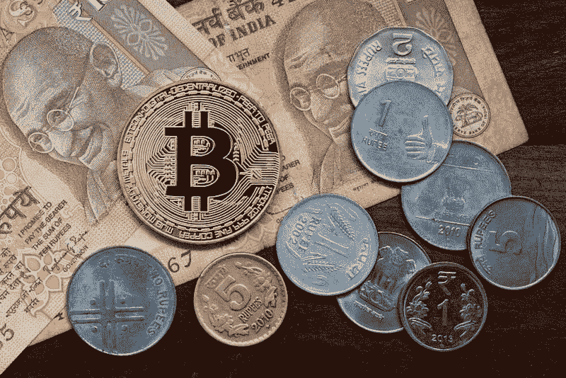
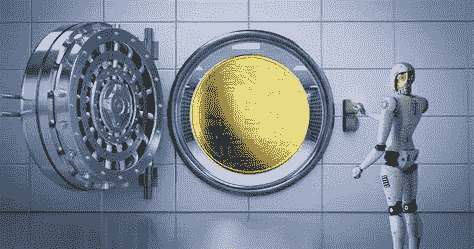
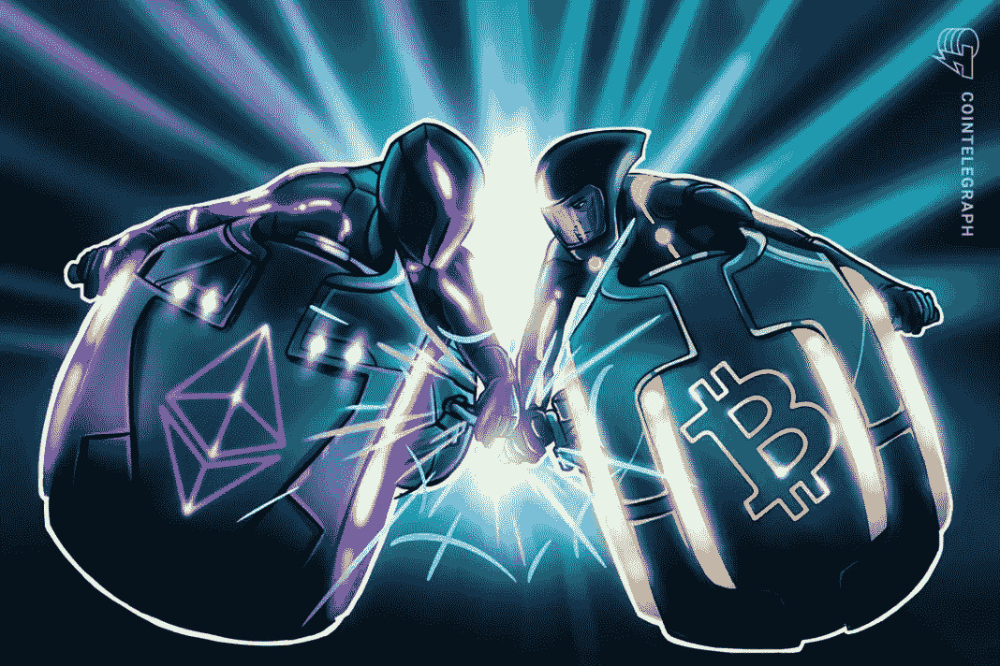

# 重大事件为大规模采用加密技术铺平了道路

> 原文：<https://medium.com/coinmonks/major-events-pave-the-way-to-massive-crypto-adoption-30146a000623?source=collection_archive---------8----------------------->

## 2021 年 6 月 Crypto 发生的 10 件事

Image Created by Author in Canva

6 月份对加密价格来说是一个艰难的月份，比特币在略高于 30，000 美元的水平上多次触底。但是，当大量散户投资者在恐惧中卖出他们的头寸时，机构资金和社区发展全速前进。

*六月发生了许多你可能错过的事情！*

*我列出了十大事件，我认为这些事件对加密技术的采用会产生最大的影响。*

## **事件 1-**6 月 2 日

> 谷歌取消了 2018 年禁止加密交易所使用谷歌广告服务的政策

Crypto Ads Unblocked from Google — Image by Coin Telegraph

**影响**

鲜为人知的交易所更有机会获得公平的市场份额。加密平台将会有越来越多的用户采用。随着用户开始利用本地令牌平台，本地令牌交易所的资产价值将会增加。

 [## 最佳 6 个加密交易信号电报通道

### 这是乏味的找到正确的加密交易信号提供商。因此，在本文中，我们将讨论最好的…

medium.com](/coinmonks/best-crypto-signals-telegram-5785cdbc4b2b) 

## 事件 2-6 月 8 日

> 墨西哥参议员爱德华多·伊诺霍萨表示，他打算向立法机关提交一份提案，以帮助该国采用加密技术

Mexican Crypto Adoption — Image by Beincrypto.com

**影响:**

越来越多的国家正在向中央银行数字货币过渡(CBDC)。各国可以摆脱美元本位，开始用更高效的数字支付解决方案与其他货币竞争。查看我的文章“山姆大叔的性感 CBDC”来了解这对美国的国内生产总值(GDP)意味着什么。

 [## 加密交易机器人——2021 年最佳免费加密交易机器人

### 2021 年币安、比特币基地、库币和其他密码交易所的最佳密码交易机器人。四进制，位间隙…

medium.com](/coinmonks/crypto-trading-bot-c2ffce8acb2a) 

## 事件 3-6 月 10 日

> 印度政府撤销禁止加密货币的决定，并可能将 BTC 列为自己的资产类别

India deems BTC its own asset class — Image by Yahoo Finance

**影响:**

各国开始理解加密货币的价值和效用。他们明白，过早地低估数字资产的效用是不明智的。他们希望在全球舞台上竞争最有效的数字支付形式。

 [## BlockFi 评论 2021:利弊和利率

### 今天，我们提出了一个全面的 BlockFi 评论，这是一个成立于 2017 年的加密贷款平台，拥有其…

blog.coincodecap.com](https://blog.coincodecap.com/blockfi-review) 

## 事件 4-6 月 11 日

> 一件罕见的神秘朋克外星人 NFT 在拍卖会上以创纪录的 1180 万英镑成交

CryptoPunk Alien NFT — Not Original

**影响:**NFTs 受欢迎程度的上升表明“真正所有权”的感知价值发生了转变。自密码猫时代以来，我们已经走过了漫长的道路。我预计会有许多其他形式的数字艺术和游戏内容被创造出来，并伴随着一股采用 NFT 的热潮。

 [## 加密税务软件——五大最佳比特币税务计算器[2021]

### 不管你是刚接触加密还是已经在这个领域呆了一段时间，你都需要交税。

medium.com](/coinmonks/best-crypto-tax-tool-for-my-money-72d4b430816b) 

## 事件 5-6 月 13 日

> 韩国金融服务委员会(Financial Service commission)要求银行收集更多有关加密交易所的信息，以核实交易类型和各方身份。

Banks Crack Down on Crypto — Image by [en.cryptonomist.ch](https://en.cryptonomist.ch/)

**影响:**政府正在寻求实施法规，以限制网络上不良行为者的不良行为。这些法规将有助于限制洗钱、性交易、恐怖分子融资和许多其他社会认为不可接受的交易。

## **活动 6 日-6 月 15 日**

> Intertrust 对 100 家对冲基金进行了评估，结果显示，到 2026 年，他们 7.2%的资产将由加密货币持有。

Institutional Investing — Image by Coinbase

**影响:**机构投资者继续进入加密货币市场。他们的投资组合中以加密方式持有的比例正在增加，这表明他们对这项技术和未来几年的增长充满信心。

 [## Pionex 评论 2021 |免费加密交易机器人和交易所

### Pionex 是为交易自动化提供工具的后起之秀。Pionex 上提供了 9 个加密交易机器人…

medium.com](/coinmonks/pionex-review-exchange-with-crypto-trading-bot-1e459d0191ea) 

## 活动 7-6 月 16 日(大型活动)

> 国会议员 Gabriel Silva 计划向巴拿马提交一份法案，提出将 crypto 作为法定货币的计划，并通过提供税收优惠来激励其采用。

Tax Incentives for BTC — Image by Coin Telegraph

**影响:**如果该法案得以实施，巴拿马将成为首批采用加密货币作为法定货币的国家之一。凭借先发优势，他们应该能够吸引企业将其加密业务转移到该国。

许多小经济体将从找到一种货币中大大受益，这种货币将减少它们对大国的依赖。

> 这是一场真正的金钱革命！

## 事件 7-6 月 23 日

> QR Capital 推出首只拉美比特币 ETF

First Latin American ETF — Image from Webitcoin.com

**影响:** QR Capital 声称，新的比特币 ETF 将允许通常没有资格在 BTC 投资 100%投资组合的投资者现在参与他们的 ETF。比特币与股票市场其他资产的相关性很低，这使得它对于那些寻求分散投资组合的人来说是一个有吸引力的选择。

## 事件 8-6 月 24 日

> 萨尔瓦多总统 Nayib Bukele 提出了一项承认 BTC 为法定货币的法案，该法案将于 9 月 7 日生效。

Nayib Bukele Supports BTC — Image by Kogocrypto.com

总统声称他将向任何下载政府钱包的人空投 30 美元。基于萨尔瓦多的人口，这可能是 1.17 亿美元的礼物。我希望在其他国家看到类似的事情发生，因为他们正在寻找创造性的方法来激励使用他们的 CBD。

## 事件 9 —正在进行

> 随着比特币鲸鱼数量的下降，ETH whale 钱包的数量一直在上升

ETH VS BTC — Image by Coin Telegraph

**影响:**ETH whale 钱包的增长表明人们对加密效用的看法发生了转变。以太坊被认为在区块链很有用，因为比特币被视为一种“数字黄金”。

6 月份，目前有 1200 个 ETH“鲸鱼钱包”(能装 1 万个 ETH 或更多的钱包)和 2137 个 BTC“鲸鱼钱包”(能装 1000 多个 BTC 的钱包)。这代表了瑞士联邦理工学院钱包的大幅增长和 BTC 钱包的逐渐下降。

要了解比特币价格下跌的更多信息，以及什么样的加密技术将长期存在，请查看我的文章，“[比特币和熊市](/crypto-capital-network/bitcoin-and-the-bears-f4cf3afd4f)”。

显然，在价格停滞不前的时期，加密技术的采用取得了一些重大进展。这波牛市持续下去只是时间问题，我们会看到向加密货币的大规模转移，加密货币在其区块链上提供某种形式的效用。

我对未来充满期待，在未来的几个月里，我将继续为您提供重大事件的最新消息。感谢所有读者对我的大力支持！

*下次见，加密首都网！*

*   约瑟夫·洛夫勒

> 加入 [Coinmonks 电报频道](https://t.me/coincodecap)，了解加密交易和投资

## 另外，阅读

*   [什么是保证金交易](https://blog.coincodecap.com/margin-trading) | [美元成本平均法](https://blog.coincodecap.com/dca)
*   [BigONE 交易所评论](/coinmonks/bigone-exchange-review-64705d85a1d4) | [电网交易机器人](https://blog.coincodecap.com/grid-trading)
*   [3 商业评论](/coinmonks/3commas-review-an-excellent-crypto-trading-bot-2020-1313a58bec92) | [Pionex 评论](/coinmonks/pionex-review-exchange-with-crypto-trading-bot-1e459d0191ea) | [Coinrule 评论](/coinmonks/coinrule-review-2021-a-beginner-friendly-crypto-trading-bot-daf0504848ba)
*   [莱杰 vs Ngrave](/coinmonks/ledger-vs-ngrave-zero-7e40f0c1d694) | [莱杰 nano s vs x](/coinmonks/ledger-nano-s-vs-x-battery-hardware-price-storage-59a6663fe3b0) | [币安评论](/coinmonks/binance-review-ee10d3bf3b6e)
*   [Bybit Exchange 审查](/coinmonks/bybit-exchange-review-dbd570019b71) | [Bityard 审查](/coinmonks/bityard-review-7d104239be35) | [CoinSpot 审查](https://blog.coincodecap.com/coinspot-review)
*   [3 commas vs crypto hopper](/coinmonks/3commas-vs-pionex-vs-cryptohopper-best-crypto-bot-6a98d2baa203)|[赚取加密利息](/coinmonks/earn-crypto-interest-b10b810fdda3)
*   最好的比特币[硬件钱包](/coinmonks/the-best-cryptocurrency-hardware-wallets-of-2020-e28b1c124069?source=friends_link&sk=324dd9ff8556ab578d71e7ad7658ad7c) | [BitBox02 回顾](/coinmonks/bitbox02-review-your-swiss-bitcoin-hardware-wallet-c36c88fff29)
*   [BlockFi vs 摄氏](/coinmonks/blockfi-vs-celsius-vs-hodlnaut-8a1cc8c26630) | [Hodlnaut 点评](/coinmonks/hodlnaut-review-best-way-to-hodl-is-to-earn-interest-on-your-bitcoin-6658a8c19edf) | [KuCoin 点评](https://blog.coincodecap.com/kucoin-review)
*   [Bitsgap 审查](/coinmonks/bitsgap-review-a-crypto-trading-bot-that-makes-easy-money-a5d88a336df2) | [Quadency 审查](/coinmonks/quadency-review-a-crypto-trading-automation-platform-3068eaa374e1) | [Bitbns 审查](/coinmonks/bitbns-review-38256a07e161)
*   [密码本交易平台](/coinmonks/top-10-crypto-copy-trading-platforms-for-beginners-d0c37c7d698c) | [Coinmama 审核](/coinmonks/coinmama-review-ace5641bde6e)
*   [印度的加密交易所](/coinmonks/bitcoin-exchange-in-india-7f1fe79715c9) | [比特币储蓄账户](/coinmonks/bitcoin-savings-account-e65b13f92451)
*   [CoinDCX 评论](/coinmonks/coindcx-review-8444db3621a2) | [加密保证金交易交易所](https://blog.coincodecap.com/crypto-margin-trading-exchanges)
*   [CoinLoan 评论](/coinmonks/coinloan-review-18128b9badc4) | [YouHodler 评论](/coinmonks/youhodler-4-easy-ways-to-make-money-98969b9689f2) | [BlockFi 评论](/coinmonks/blockfi-review-53096053c097)
*   [CoinFLEX 评论](https://blog.coincodecap.com/coinflex-review) | [AEX 交易所评论](https://blog.coincodecap.com/aex-exchange-review) | [UPbit 评论](https://blog.coincodecap.com/upbit-review)
*   [AscendEx 保证金交易](https://blog.coincodecap.com/ascendex-margin-trading) | [Bitfinex 赌注](https://blog.coincodecap.com/bitfinex-staking) | [bitFlyer 审核](https://blog.coincodecap.com/bitflyer-review)
*   [AscendEx Staking](https://blog.coincodecap.com/ascendex-staking)|[Bot Ocean Review](https://blog.coincodecap.com/bot-ocean-review)|[最佳比特币钱包](https://blog.coincodecap.com/bitcoin-wallets-india)
*   [霍比评论](https://blog.coincodecap.com/huobi-review) | [OKEx 保证金交易](https://blog.coincodecap.com/okex-margin-trading) | [期货交易](https://blog.coincodecap.com/futures-trading)
*   [麻雀交换评论](https://blog.coincodecap.com/sparrow-exchange-review) | [纳什交换评论](https://blog.coincodecap.com/nash-exchange-review)
*   最好的[加密税务软件](/coinmonks/best-crypto-tax-tool-for-my-money-72d4b430816b) | [硬币追踪评论](/coinmonks/cointracking-review-a-reliable-cryptocurrency-tax-software-5114e3eb5737)
*   [Stackedinvest 评论](https://blog.coincodecap.com/stackedinvest-review) | [北海巨妖评论](/coinmonks/kraken-review-6165fc1056ac) | [期货交易机器人](/coinmonks/futures-trading-bots-5a282ccee3f5)