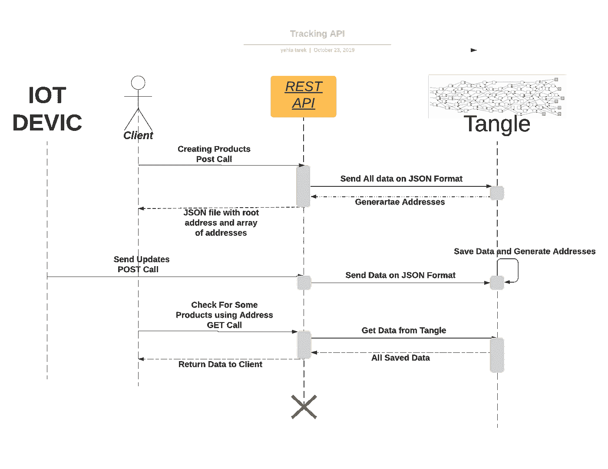
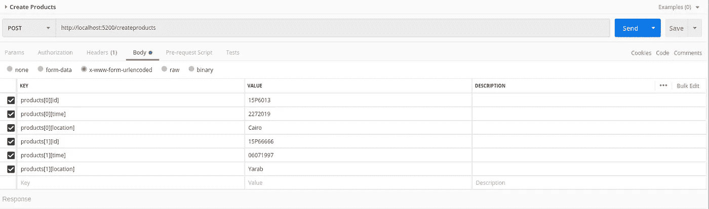

# 制作一个 REST API 来跟踪产品

> 原文：<https://medium.com/coinmonks/make-a-rest-api-to-track-products-51fb65e4ab4d?source=collection_archive---------1----------------------->

在本文中，我使用 IOTA 制作了一个简单的 REST API 来跟踪产品。产品所有者将使用该跟踪 API 来记录他们的产品和他们需要的所有相关数据(位置、所有者、修改、时间),然后 API 将数据推送到 tangle，然后 API 将使用根地址进行响应，以跟踪所有产品和每个产品的地址数组。该地址阵列应作为 QR 码打印在每个产品上，供 QR 码阅读器更新/读取数据。对于复杂的部分，我使用 MAM restricted 进行通信，并使用它生成路由和地址。你可以在这里找到我详细做的事情。

REST API 的序列图:



# API 端点、调用、控制器和响应

## 致电后创建产品

客户需要在 JSON 数组上发送他的所有产品信息，如 id、日期、详细信息等:

```
{[
{
id:”15p6013”,
date:”1/11/2019”,
location:”Cairo”
},
{
id:”20p6013”,
date:”1/11/2019”,location:”Cairo”},......]}
```

在邮递员上看起来会是这样



路线:

```
app.route(‘/createproducts’)
.post(tracker.create_products)
```

控制器:

```
const initComm = require(‘./iota_comm_modules/initComm’)
exports.create_products = (req, res) => {initComm.execute(req.body.products).then(function(tracker) {res.json(tracker)})}
```

IOTA 模块。所有的 IOTA 模块都包含在这篇[文章](/@yehiatarek67/playing-with-iota-parsing-data-for-supply-chain-project-b46806170c6)中。

```
const init = (_products)=>{SendMamRestricted.execute("initialize root").then(function(result) {trackedProducts['rootAddress'] = resultSendPublicTransaction.execute(IotaGlobal.seed,IotaGlobal.address,result)})return PublishAll.execute(_products)}const initComm = async(_products) =>{trackedProducts['addresses'] =  await init(_products)return trackedProducts}
```

然后，响应将是一个 JSON 对象，其根地址在 MAM Merkel 树上，可以在 GET 调用中使用，以获取所有产品数据和每个产品的地址数组。

回应:

```
{"rootAddress": "NEH9MERQJWOYERNDMQJLESEUSIUMBAZ9DTFCNRVUVOGNWDNDFGERMTOTXUWICFYRJYUFRFDVMVXJTIEPG","addresses": ["BJKXGMJLMJFXUVZNL9FJZDIESOFQZIHCEUELPFZSUYYFKYVQGSSQNONWZEKTKUIPSWVJFAZOBRQZQJVUL","FMA9BONNEWBLBXLCJ9DVCFSHDSXAWDKYUTRV9DVSY99TVRCWQ9HZ9NWDIUDBWXHCTNAAZOEVYTK9TWZLP"]}
```

现在，使用所有这些地址，您可以通过“get”调用来获取数据。

## 获取产品信息获取电话

客户发送他想要跟踪的一组产品的地址。

端点

```
[http://localhost:5200/getproducts?address=YLMBOYMLPTUFDESSIPJORHEMTVKCWRCZBYZBSDFVDPLEXPCZNHFOTFCZFJNUYYZMUDMJZNSPCUPLHBYNQ](http://localhost:5200/getproducts?address=YLMBOYMLPTUFDESSIPJORHEMTVKCWRCZBYZBSDFVDPLEXPCZNHFOTFCZFJNUYYZMUDMJZNSPCUPLHBYNQ) 
//first product address should return his data and data for all products after it.
```

途径

```
app.route(‘/getproducts’).get(tracker.get_products);
```

控制器

```
const fetchMamRestricted= require(‘./iota_comm_modules/FetchMamRestricted’)exports.get_products = async (req,res) =>{const productsData = await fetchMamRestricted.execute(req.query.address)fetchMamRestricted.cleanResp()res.json(productsData)}
```

IOTA 模块

```
let resp = []const logData = data => {resp.push(IotaGlobal.converter.trytesToAscii(data))}const FetchMam = async (_root) => {// Callback used to pass data + returns next_rootawait IotaGlobal.Mam.fetch(_root, mamType, mamSecret, logData)return resp}const cleanResp = ()=>{resp = []}
```

回应产品信息以及此后添加或更改的所有新产品:

```
["{ "id": "15P6013","time":"2272019","location":"Cairo"}","{"id":"15P66666","time":"06071997","location":"Egypt"}"]
```

## 更新呼叫

假设一些产品被转移到另一个国家或进行了一些修改，物联网设备将会进行呼叫。

**我使用了 post call，因为我无法更新已经部署在 Tangle 上的数据**

端点:

```
[http://localhost:5200/updateproduct](http://localhost:5200/updateproduct)
```

主体(主体可以是用户想要发送的任何形式的数据):

```
{ id: ‘15p6013’,time: ‘noew now’,owner: ‘john’,details: ‘lorem lorem lorem’ }
```

路线:

```
app.route(‘/updateproduct’).post(tracker.update_product)
```

控制器:

```
const sendMamRestricted = require(‘./iota_comm_modules/SendMamRestricted’)exports.update_product = (req, res) => {console.log(req.body.data)sendMamRestricted.execute(JSON.stringify(req.body.data)).then(function(tracker) {res.json(tracker)})}
```

IOTA 模块:

```
const Publish = async data => {// Convert the JSON to trytes and create a MAM messageconst trytes = IotaGlobal.converter.asciiToTrytes(data)const message = IotaGlobal.Mam.create(mamState, trytes)// Update the MAM state to the state of this latest messagemamState = message.state// Attach the messageawait IotaGlobal.Mam.attach(message.payload, message.address, 3, 9)return message.root}
```

回应:

```
“SVGLNSIUTKYDIPJQJQGFJDKGZAQIQ9BTCQJXLAUZFRDKQLOJPMLNBBIXZWBBFUPWXJFQZCODZYTKEFL9V”
```

它的新地址已经生成客户端用户可以从他以前的地址。

使用 GET call 测试它

```
[http://localhost:5200/getproducts?address=SVGLNSIUTKYDIPJQJQGFJDKGZAQIQ9BTCQJXLAUZFRDKQLOJPMLNBBIXZWBBFUPWXJFQZCODZYTKEFL9V](http://localhost:5200/getproducts?address=SVGLNSIUTKYDIPJQJQGFJDKGZAQIQ9BTCQJXLAUZFRDKQLOJPMLNBBIXZWBBFUPWXJFQZCODZYTKEFL9V) //same address returned from update call
```

它会给出响应:

```
[“{”id”:”15p6013”,”time”:”noew now”,”owner”:”john”,”details”:”lorem lorem lorem”}”]
```

以确保一切按预期运行。我将使用带有根地址的 GET 调用，查看更新是否已经添加到了 Merkel 树中。

端点:

```
[http://localhost:5200/getproducts?address=NEH9MERQJWOYERNDMQJLESEUSIUMBAZ9DTFCNRVUVOGNWDNDFGERMTOTXUWICFYRJYUFRFDVMVXJTIEPG](http://localhost:5200/getproducts?address=NEH9MERQJWOYERNDMQJLESEUSIUMBAZ9DTFCNRVUVOGNWDNDFGERMTOTXUWICFYRJYUFRFDVMVXJTIEPG)
```

回应:

```
[“initialize root”,“{\”id\”:\”15P6013\”,\”time\”:\”2272019\”,\”location\”:\”Cairo\”}”,“{\”id\”:\”15P66666\”,\”time\”:\”06071997\”,\”location\”:\”Yarab\”}”,“{\”id\”:\”15p6013\”,\”time\”:\”noew now\”,\”owner\”:\”john\”,\”details\”:\”lorem lorem lorem\”}”]
```

物联网设备推送的更新已添加！

## 下一步做什么？

1-需要在 POST 调用中获取用户公共地址，以便对每个用户更加个性化。

2-产品创建后需要发送 MAM 受限密码，然后将此密码添加到 IOT 设备进行更新。

但是所有这些更新都很简单，我没有添加它们来关注主要问题。

实际上，所有的 API 调用都会返回一些无组织的数据，所以我可以按时间添加一个过滤器模块。随着时间的推移，默克尔树发生了变化，例如:

地址 1→2019 年 1 月 20 日至今的所有变更。

地址 2→2019 年 11 月 30 日至今的所有变更。

……

在时间过滤器之后，我需要添加 ID 过滤器来获取特定产品或产品范围发生的所有更改。更有组织性，并帮助没有 tangle 经验的开发人员与之交互。如果我能找到一种方法来组织所有的地址，那就太棒了，所以对于地址 X，使用 tangle 给我发生在产品 X 上的所有变化，而不需要任何过滤器。如果您有任何更好的解决方案或反馈，请留下评论。谢了。

项目源代码

[https://github.com/yehia67/Tracker-api/](https://github.com/yehia67/Tracker-api/tree/master)

> [在您的收件箱中直接获得最佳软件交易](https://coincodecap.com/?utm_source=coinmonks)

[](https://coincodecap.com/?utm_source=coinmonks)