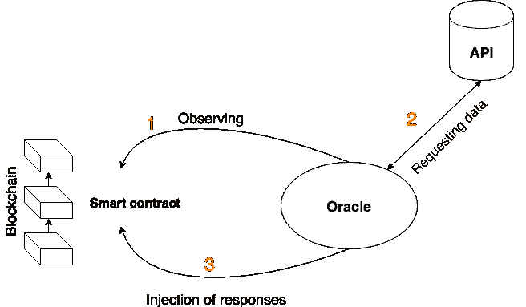

# 使用您的 Solidity 智能合同发出 HTTP 请求

> 原文：<https://medium.com/coinmonks/make-http-request-using-your-solidity-smart-contract-4f7173bd391c?source=collection_archive---------0----------------------->

你有没有尝试过把一个微服务集成到你的智能合约里？试着做一个 API 请求？这在可靠性上可能吗？简而言之，答案是否定的。以太区块链协议与 API 协议完全不同。以太网是确定性的，它不能随时间改变，所有节点都应该批准它，但是 HTTPS 请求随时间改变

# **为什么像 Nodejs 和 Laravel 一样不容易**

问题是，智能合约作为区块链上的对象，不能只发送 HTTP 请求。这将与所有区块链协议的一个基本原则相矛盾——它们的确定性“任何事务的结果必须总是相同的，以便节点验证它，无论我们在哪里、如何以及何时调用它”。所以我们不能使用 solidity 进行 API 调用。解决这个问题的一个诀窍是“或现实化”。什么是 Orcalize？



使用 Oracle 作为区块链和 API 之间的中介。每当有事务发生时，Oracle 都保持列表(观察智能契约)。Oracle 请求 API 数据并将响应注入智能合约。在[文档](https://docs.provable.xyz)和[资源库](https://github.com/yehia67/ethereum-examples)上可以找到很多例子和解释

不幸的是，大多数代码示例都只是 GET 调用。不知道为什么？我甚至认为 Oraclize 只为 GET 调用提供解决方案。或者老实说，我找到了一些例子，但它们对像我这样的新手来说有点复杂。所以我写了这篇文章来用更简单的方式解释它。

# 代码实现

1-我们需要导入 Orcalize 库，其名称为“provable”clone[GitHub 库](https://github.com/provable-things/ethereum-api)然后导入合同

```
import “github.com/oraclize/ethereum-api/provableAPI.sol”;
```

2-如果 API 调用失败或成功，最好在调用时发出事件。

3-检查我们的合同是否有足够的余额进行交易

```
if (provable_getPrice(“computation”) > address(this).balance) 
```

4-然后使用用于进行所有 API 调用的“provable_query”函数进行 HTTP 调用，例如，进行 Post 调用:(文档中的示例)

```
// The URL datasource also supports a supplement argument, useful for creating HTTP POST requests.// If that argument is a valid JSON string, it will be automatically sent as JSON.provable_query(“URL”, “json(https://shapeshift.io/sendamount).success.deposit",‘{“pair”:”eth_btc”,”amount”:”1",”withdrawal”:”1AAcCo21EUc1jbocjssSQDzLna9Vem2UN5"}’)
```

**完整的代码应该是这样的**

```
if (provable_getPrice(“computation”) > address(this).balance) {emit LogNewProvableQuery(“Provable query was NOT sent, please add some ETH to cover for the query fee”);} else {emit LogNewProvableQuery(“Provable query was sent, standing by for the answer…”);provable_query(“URL”, “json(https://shapeshift.io/sendamount).success.deposit",‘{“pair”:”eth_btc”,”amount”:”1",”withdrawal”:”1AAcCo21EUc1jbocjssSQDzLna9Vem2UN5"}’)
}}
```

让你的代码更动态，更容易调用任何类型的方法，比如普通的后端。您可以解析来自外部`request`函数所有`provable_query`函数参数，如下所示:

```
function request(string memory _query,string memory _method,string memory _url,string memory _kwargs)publicpayable{if (provable_getPrice(“computation”) > address(this).balance) {emit LogNewProvableQuery(“Provable query was NOT sent, please add some ETH to cover for the query fee”);} else {emit LogNewProvableQuery(“Provable query was sent, standing by for the answer…”);provable_query(“computation”,[_query,_method,_url,_kwargs]);}}
```

就是这样，你可以在这个[链接](https://github.com/yehia67/ethereum-examples/tree/master/solidity/truffle-examples)上找到很多松露的例子。谢谢！

[](https://coincodecap.com)

> [在您的收件箱中直接获得最佳软件交易](https://coincodecap.com/?utm_source=coinmonks)

[](https://coincodecap.com/?utm_source=coinmonks)