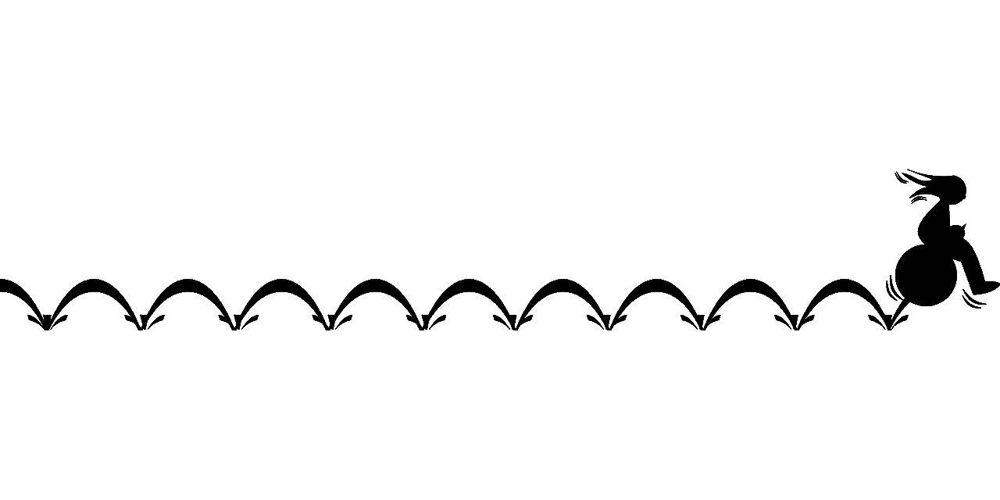

# 赚钱 24/7 头皮布林反弹

> 原文：<https://medium.com/coinmonks/make-money-24-7-scalping-bollinger-bounces-f7b4c7d2a61e?source=collection_archive---------1----------------------->

Assets such as stocks, options, commodities, futures, Forex, and cryptos all trade up and down. It is possible to predict when an asset is about to reverse. Having this knowledge can allow you to take profits on small price movements called scalping.

我喜欢在股票市场交易期权和差价，但是市场一周只开放 5 天。甚至连外汇市场周末也不开放。期货市场周日开市对我来说还是不够。其余时间我做什么？我当然不会去打扫。嗯，咄！

幸运的是，加密市场全天候开放。但是要成功地用这种方式赚钱，有…