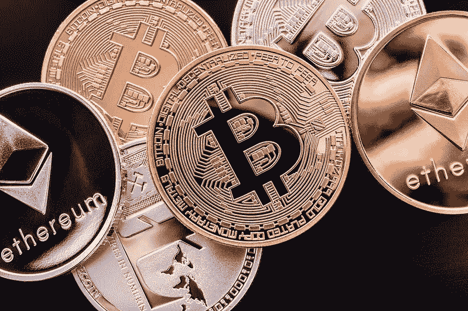

# 不用投资，用比特币赚钱

> 原文：<https://medium.com/coinmonks/make-money-with-bitcoin-without-investing-f9a690b9bc0?source=collection_archive---------9----------------------->

You can make money with bitcoin without putting any money into the system.

你可以用比特币赚钱，而无需向系统投入任何资金。

不投资比特币赚钱是可行的，但前提是你要牢记，你将创造的被动收入将仅足以帮助你在比特币行业入门。

我们现在将介绍新手在 2022 年使用免费比特币产生货币的最流行方法，而无需向系统中投入任何货币。

> 另外，请看:[我是如何在 30 天内获得 173 名关注者的](/p/1d587e551f61?source=post_stats_page----------------------------------------)

# 参与以加密货币支付的竞赛

游戏化系统已经在几个网站上实现，使你能够赚取加密货币，然后可以兑换成比特币。

许多加密货币交易所为那些知道如何交易的人举办比赛。

如果你不是经验丰富的交易员，但确实有区块链项目可以作为替代收入来源，比特币投资组合竞赛是另一个选择。

> 还有，参见:[2022 年新手如何用比特币赚钱](https://asedeyhotnaija.com/how-to-make-money-with-bitcoin-for-beginners-in-2022/)

# 销售接受比特币的第三方产品

随着比特币越来越受欢迎，越来越多的东西会用比特币购买。

通过加盟计划，许多商品可以在社交媒体甚至视频频道或网站上推广。

用比特币赚钱的一个很好的方法是出售第三方物品，并从购买中赚取佣金。

> 另外，请看:[2022 年购买 3 个宝石加密代币](/p/9c8023f586bf?source=post_stats_page----------------------------------------)

# 玩支付比特币的视频游戏

目前，许多视频游戏平台正在他们的虚拟世界中使用区块链技术，以在他们的市场中进行推广和奖励参与。

玩电子游戏是赚取比特币的好方法，你可以保留、交易甚至出售比特币。

> 同样，参见:[进入元宇宙](https://asedeyhotnaija.com/into-the-metaverse/)

# 解决隐藏在比特币中的加密谜题

解决隐藏 BTC 奖的所谓加密谜题是一种用比特币和加密货币产生货币的技术，相对来说很少有人知道。

比特币钱包由 12 个单词组成，这些单词可能出现在一件艺术品、一张图片甚至一本漫画书中。

你应该知道元先生漫画，其中有 0.1 BTC 隐藏在其页面上。

> 另请参见:[我的 2022 年 10x 加密精选](/p/1bfb9fa8ca0b?source=post_stats_page----------------------------------------)

# 接受加密货币作为支付

当然可以！你肯定会把比特币作为一种支付服务的方式，无论是在线支付还是面对面支付。

全球许多人都习惯于接受加密货币支付。

如果你在 BTC 得到付款，如果你认为它的价值会上升，你可以选择卖掉它，这样你就可以从在 BTC 得到付款中获利。

> 另请参见:【2022 年投资的五大加密货币

# 成为一个有影响力的加密者或 Youtuber

任何认真对待加密社区并拥有大量知识的人都可以通过创建一个关于加密货币或区块链技术的教育材料渠道来教育其他刚刚起步的人。

你可以以比特币影响者和 YouTuber 的身份参加网络研讨会、视频、直播，甚至出版一本书。

你的追随者会迅速增长，一旦你能创造出有实际价值的吸引人的内容，并从中脱颖而出，你就会开始赚钱。

> 另外，请看:[我为什么要投资比特币？](https://asedeyhotnaija.com/why-should-i-invest-in-bitcoin/)

# 总结一下

在这个优秀的教程中，通过彻底研究这种加密货币的优点和缺点，你可以用比特币赚钱。

在 BTC 投资和不投资都是和 BTC 一起生钱的绝佳技巧；要避免的陷阱是强调的最后一点。

现在是你迈向财务自由的第一步，并最终在 2022 年开始用比特币赚钱的时候了。

> 加入 Coinmonks [电报频道](https://t.me/coincodecap)和 [Youtube 频道](https://www.youtube.com/c/coinmonks/videos)了解加密交易和投资

## 也阅读

 [## 杠杆代币[多头代币]终极指南

### 杠杆化令牌是具有杠杆化风险敞口的 ERC20 令牌，不考虑保证金、要求、管理…

medium.com](/coinmonks/leveraged-token-3f5257808b22)  [## 最佳加密交易所| 2021 年十大加密货币交易所

### 加密货币交易所的加密交易需要了解市场，这可以帮助你获得利润。之前…

blog.coincodecap.com](https://blog.coincodecap.com/crypto-exchange)  [## 2021 年最佳加密交换平台| CoinCodeCap

### 如果我们看看今天的场景，许多加密货币交换平台提供了广泛的功能和深度…

blog.coincodecap.com](https://blog.coincodecap.com/best-swap-platforms)  [## 2021 年最佳加密借贷平台| 6 大比特币借贷平台

### 获得比特币和其他加密货币的最佳贷款利率

medium.com](/coinmonks/top-5-crypto-lending-platforms-in-2020-that-you-need-to-know-a1b675cec3fa)  [## 2021 年 6 大最佳硬件钱包|顶级加密硬件钱包[更新]

### 最好的加密货币硬件钱包是绝对必要的。我们将在 NGRAVE、Ledger Nano X 和…

medium.com](/coinmonks/the-best-cryptocurrency-hardware-wallets-of-2020-e28b1c124069)  [## 2021 年最佳免费加密交易机器人

### 2021 年币安、比特币基地、库币和其他密码交易所的最佳密码交易机器人。四进制，位间隙…

medium.com](/coinmonks/crypto-trading-bot-c2ffce8acb2a)