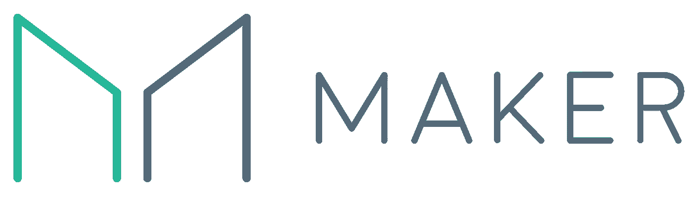
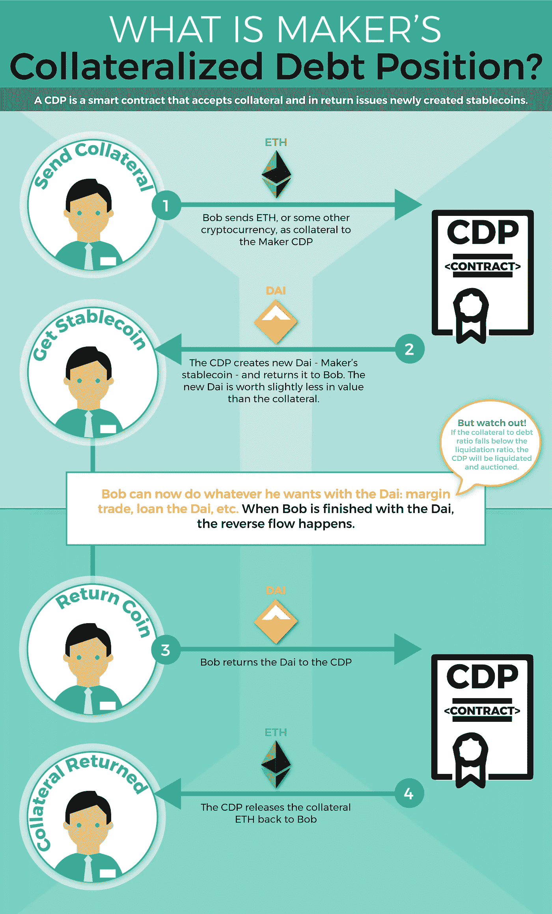
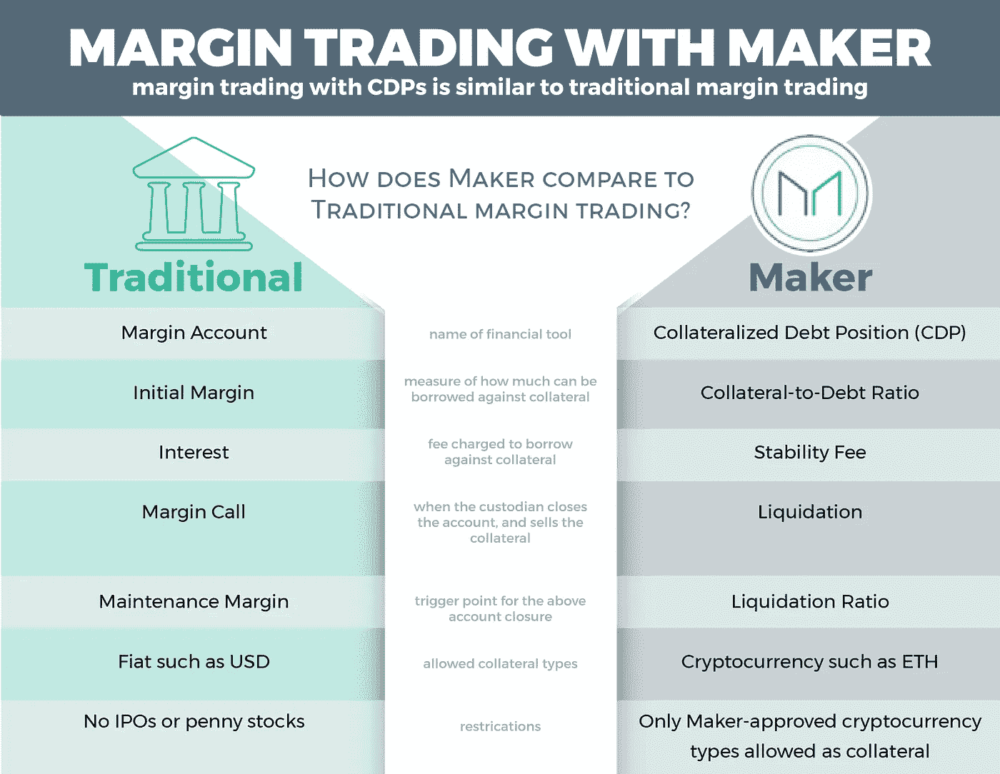
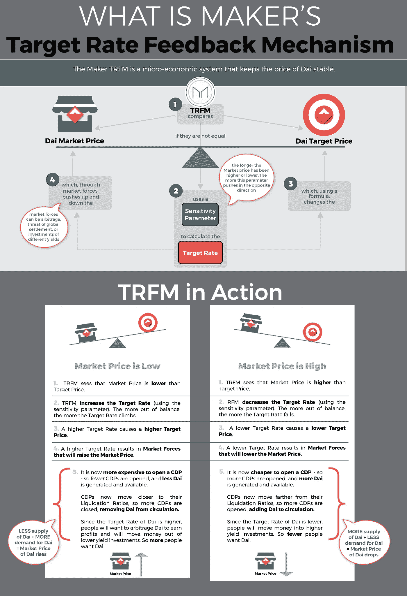
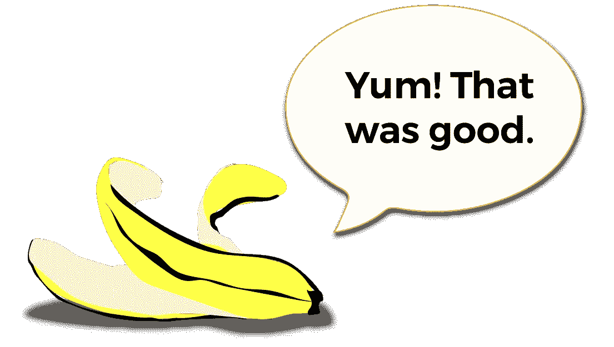

# 创客与戴——香蕉纸

> 原文：<https://medium.com/coinmonks/maker-and-dai-the-banana-paper-6c68eb59fc62?source=collection_archive---------5----------------------->

[https://makerdao.com/](https://makerdao.com/)

这篇文章是我的系列文章之一🍌香蕉白皮书——区块链白皮书以一种易于理解的方式重新编写(比如香蕉！)风度。我的目标是帮助读者以最小的痛苦快速理解和评估复杂的区块链思想。

今天我们来看看 Maker——生态系统中最突出(也是最复杂)的 stablecoin 项目之一。Maker 得到了 Polychain Capital、Andreesson Horowitz 和其他人的大力支持。

(注意:这是一篇相当长的香蕉论文，有点违背我正在尝试做的事情的原则。但有几个重要的背景信息是理解 Maker 的关键，所以我花了一点时间解释这些，即 stablecoins 和保证金交易。如果你已经理解了这些概念，你可以安全地跳过这些章节。)

## 【创客与戴——浅释

Maker 是一个智能合约平台，可以生成、管理和稳定**戴**——一种加密货币稳定币。

做市商平台通过一种被称为 CDP(债务抵押头寸)的金融工具，允许用户以他们的加密资产为抵押借入 Dai，实际上创建了一个分散的保证金交易平台。

## **制造者和戴——详细概述**

## *什么是 Stablecoins？*

要想了解 Maker 和戴，首先需要了解 stablecoins。

在你的生活中，金融交易很可能是使用法币(政府支持的法定货币)完成的。也许你用美元买食物，或者用欧元付房租。有很多原因可以让你把你的法定货币用于这些目的，比如可替代性(你的一个货币单位可以与任何其他类似的货币单位互换)、流动性(其他人会接受你的货币)以及限量供应。你可以使用菲亚特的一个最重要的原因是它有一个相对稳定的价值。

你不会想花一天的时间去创造小部件，结果却得到一种下周贬值一半的货币。你不会想用一种在你第一次还款到期时变得一文不值的货币进行抵押贷款。一种货币未来价值的不确定性使得这种货币几乎不可能用于正常交易。

许多人认为缺乏稳定性是加密货币主流化的主要障碍之一。加密货币往往与稳定性相反——它们具有非常高的波动性。你可能相信你最喜欢的硬币将“飞向月球”——但实际上，你不知道下个月、下周甚至明天会发生什么样的剧烈价值变化。如果加密货币成为主流，许多人认为必须有一种货币——稳定的货币——保持分散，但随着时间的推移保持稳定的价值。

Maker 是一个智能合约平台，它创建并管理这样一个叫做**戴**的稳定币。

## 米*阿克尔和戴*

戴是一种稳定的加密货币，至少在最初，它是通过与美元 1 比 1 挂钩来稳定的，这意味着 1 戴的价值是以与 1 美元相同的汇率创造和交换的。

戴背后的创客平台有几个功能。创客平台:

1.  创造了戴
2.  允许用户以加密资产为抵押借用 Dai
3.  稳定戴创客平台和价值的尝试
4.  为创客平台的风险管理提供了一个“MKR”

我们将详细讨论其中的每一项。

## 创造与借用戴

戴不像比特币那样被挖矿。相反，戴是通过一份精明的合同，通过贷款而被动态地创造出来的。在最简单的流程中，用户向契约发送某种类型的担保(以加密资产的形式)，契约返回给用户新创建的 Dai。该合同保存担保品，直到 Dai 被归还。

下面是一个典型的场景是如何工作的(为了简单起见，我们用美元来表示这些值)。注意，你必须存入*比你得到的 Dai 价值更多的*抵押品。例如，在下面的场景中，Bob 需要发送价值 150 美元的 ETH 来获得价值 100 美元的 Dai—150%的存款。

1.  Bob 将价值 150 美元的 ETH 作为抵押品存入智能合约。
2.  智能合约将价值 100 美元的 Dai 返还给 Bob。

鲍勃现在可以对戴做任何他想做的事情，无论他选择多久。当他完成了戴，逆向流动发生了:

1.  Bob 将价值 100 美元的 Dai 返回到智能合约。
2.  智能合约将抵押品释放回 Bob。

上面的智能合约在做市商平台中被称为*债务抵押头寸* (CDP)。

Collateralized Debt Position

智能合同比上面介绍的稍微复杂一些。例如，Bob 不仅仅偿还 100 美元的 Dai。他必须偿还稍微多一点——也许 100 美元的 Dai 外加 1 美元——因为系统向 CDP 收取基于时间的*稳定费*。你可以把这个稳定费想象成戴身上的利息。

那么鲍勃为什么要开 CDP 并得到戴呢？有几个原因。这里有几个例子:

*   在一个简单的用例中，由于 Dai 的值是稳定的，Bob 可以执行基本的银行活动，比如贷款给 Dai 并赚取利息。
*   在一个更复杂的用例中，Bob 可以使用 Dai 对 ETH 进行保证金交易。

让我们探索第二种情况，因为它是 Maker 白皮书的主要部分。

(如果您已经了解保证金交易，可以跳过下一部分，从**CDPs 保证金交易**开始)

## **什么是融资融券交易？**

传统的保证金交易是一种金融工具，通过允许你借钱购买资产(如股票)，增加你的收益和损失。

例如，如果你有 2000 美元，保证金交易允许你用原来的 2000 美元再多借*2000 美元，并购买总计 4000 美元的股票。在保证金交易中，你借钱来增加你的*敞口*——或者说，增加收益和损失。你进行保证金交易是因为它给了你*杠杆*——大幅增加你的收益和损失。*

要进行保证金交易，您需要:

1.  将钱存入你的经纪公司的保证金账户。
2.  借入你想购买的股票价格的 50%。因此，如果一只股票每股 100 美元，你可以支付 50 美元，并借另外 50 美元购买股票。你借入的百分比被称为初始保证金，由你的经纪公司设定。
3.  你买的股票成为你贷款的抵押品。
4.  你为你的贷款支付利息
5.  你必须保持最低数量(通常是 25%)的股票价值的抵押品。你必须保持的这个百分比叫做*维护保证金*。所以如果维持保证金是*25%*并且你的股票价值 100 美元，你必须至少有 25 美元(100 美元的 25%)的自有资金在股票上。**
6.  **你不能对某些类型的股票进行保证金交易，比如首次公开募股和低价股。**

**这里有一个例子:**

1.  **鲍勃认为下周股票会大幅上涨。他想充分利用这次上涨。**
2.  **鲍勃将 10，000 美元存入保证金账户。**
3.  **鲍勃现在可以购买高达 20，000 美元的 BgTme。他用自己的 10，000 美元和从保证金账户借的 10，000 美元。**
4.  **接下来的一周，BgTme **价格上涨** 50%。**
5.  **Bob 用自己的钱赚了 5000 美元，又用借来的钱赚了 5000 美元，使他用自己的钱赚的钱翻了一番。**
6.  **Bob 关闭了他的保证金账户，偿还了 10，000 美元的贷款，提前退出了 10，000 美元。**

**(这里涉及到利息和其他费用，但为了简单起见，我们将忽略它们)**

**当然，相反的情况也可能发生:**

1.  **鲍勃认为下周股票会大幅上涨。他想充分利用上升的机会。**
2.  **鲍勃将 10，000 美元存入保证金账户。**
3.  **鲍勃现在可以购买高达 20，000 美元的 *BgTme* 。他用自己的 10，000 美元和从保证金账户借的 10，000 美元。**
4.  **接下来的一周，BgTme **价格下跌** 50%。**
5.  **Bob 在自己的钱上损失了 5000 美元，在借来的钱上又损失了 5000 美元，这是他用自己的钱所损失的两倍。事实上，因为他还必须偿还 10，000 美元的贷款，他实际上失去了所有的钱。**
6.  **Bob 关闭了他的保证金账户，偿还了 10，000 美元的贷款，然后两手空空地退出了。如果没有保证金，他只会损失一半的钱(5000 美元)。但是因为他用了保证金账户，他的风险增加了一倍，损失了一切。**

**事实上，在第二个例子的极端情况下，如果股票价值跌得太低，Bob 的账户中不再有所需的保证金，经纪公司将发出“保证金通知”，根据账户规则，要么允许 Bob 存入更多的钱来支付所需的保证金，要么干脆关闭他的账户并出售他的抵押品。**

**最糟糕的是，在这种极端情况下，即使追加保证金通知后，鲍勃也可能最终欠下*钱。如果价值下跌超过 50%——假设下跌 75%——Bob 最终不仅损失了他原来的 10，000 美元，还欠了额外的 5，000 美元(加上杂项利息和佣金)。***

**保证金交易可能非常有利可图，但也可能造成重大损失。**

## **【CDPs 融资融券交易**

**使用加密货币进行保证金交易是创客平台的一个关键功能。**

****

**Margin Trading with CDPs**

1.  **鲍勃认为下周 ETH 的价格会大幅上涨。他想充分利用这次上涨。**
2.  **Bob 将价值 10，000 美元的 ETH 存入 CDP，并收回价值 5，000 美元的 Dai。**
3.  **鲍勃现在用戴的 5000 美元购买了*更多的* ETH。他现在持有价值 15，000 美元的 ETH。**
4.  **接下来的一周，ETH 的价格上涨了 50%。**
5.  **Bob 在他原来的 ETH 上赚了 5，000 美元，在他从 Dai 购买的 ETH 上又赚了 2，500 美元，*使他在原来的 ETH 上的收益增加了 25%* 。**
6.  **Bob 将他在步骤 3 中购买的 5000 美元的 ETH 回售给 Dai，将 Dai 返回智能合约以结清 CDP，并收回他的原始抵押品 ETH。**
7.  **鲍勃最终获得了 7500 美元的丰厚利润。**

**(这里有一项类似于利率的费用——稳定性费用——为了简单起见，我们忽略不计)**

**但是，就像保证金交易一样，相反的情况也会发生。如果 ETH 价格下跌，Bob 的损失会被放大。同样，就像保证金交易一样，如果 ETH 的价值下降得太低，并且 Bob 存放的 ETH 的价值接近不再覆盖他所借 Dai 的成本的价值(做市商将该价值称为*清算比率*)，做市商平台将发出保证金通知——在做市商的情况下，他们称之为*清算 CDP*——并拍卖抵押品以保持系统的偿付能力。**

**然而，CDP 与保证金交易的一个不同之处是——无论你的抵押品价值下跌到什么程度，你的欠款永远不会超过你的存款。在保证金交易中，你最终可能会欠下大笔的钱。但在 CDP 中，Maker 将你的损失限制在抵押品的总价值上。如果抵押品的价值低于所借 Dai 的价值，创客平台及其治理机构将弥补这一损失，而不向你收费。**

***注意:目前只有 ETH(实际上是一种称为混合乙醚或 PETH 的变体)被允许作为 CDP 的抵押品，尽管白皮书称在不久的将来将允许更多的抵押品类型。***

**好了，我们回到创客平台的功能。我们讨论了前两个功能:创建 Dai 和允许用户借用加密资产。我们还详细介绍了 CDP 和保证金交易。现在，让我们来讨论一下创客平台的最后两个功能:稳定 Dai/创客，以及治理。**

## **稳住戴和创客平台**

**Maker 平台通过三种方式实现稳定性:**

1.  **上述 CDP 部分中提到的抵押品拍卖(债务拍卖)**
2.  **戴的目标利率反馈机制**
3.  **全球结算**

## **债务拍卖**

***注意:目前，Maker 已经实施了一个清算 CDP 的临时机制——Maker 平台本身收购 CDP 并出售抵押品，根据需要创造或燃烧更多 PETH 来弥补销售中的任何损失或收益。长期而言，当制造商接受多种类型的抵押品时，他们计划实施一系列债务拍卖，如下所述。***

**做市商版本的追加保证金通知是债务拍卖。每种 CDP 抵押品类型都有一个*清算比率*。这一清算比率用于决定 CDP 何时面临违约风险，以及何时应该追加保证金——或者在做市商的世界里，应该清算。**

**例如，考虑这个 CDP。**

*   **Bob 在 ETH 用 150 美元开了一个 CDP，收到了 100 美元。他目前的抵押品债务比率是 150%——他在瑞士联邦储蓄银行持有他的 Dai 价值的 150%。**
*   **ETH 的清偿率为 105%**
*   **如果 CDP 中的 ETH 价值从 150 美元降至 104 美元，抵押品债务比将变为 104%，低于要求的 105%，因此 CDP 将被清算。**

**当 CDP 低于其清算比率时，*保管人*(系统中由*保持*系统偿付能力的参与者)负责拍卖 CDP。他们立即执行以下操作:**

1.  **首先，平台必须筹集足够的 Dai 来偿还 CDP，以便可以获得和出售抵押品。为了获得此 Dai，该平台创建并拍卖新的 MKR 令牌(MKR 令牌是系统治理令牌，请参见下面关于 MKR 令牌的部分)。**
2.  **平台使用步骤 1 中筹集的 Dai 来结算 CDP 并获得担保品。然后，该平台清算并拍卖担保品，用所得资金回购与第一步中创建的同等数量的 MKR。这控制了 MKR 令牌的稀释。该平台拍卖的抵押品刚好够回购 MKR。**
3.  **平台还收取清算违约金。因此，第二步实际上拍卖了比回购 MKR 所需的抵押品略多的抵押品。这额外的金额支付清算罚款。**
4.  **如果有任何剩余的抵押品，它将被返还给 CDP 的原始持有者。**
5.  **上述第 1 步和第 2 步是并行进行的。**

**让我们浏览一个示例流程，看看它是如何工作的。**

1.  **Bob 使用 150 美元的 ETH 开立 CDP。作为回报，他得到了 100 美元的代币。**
2.  **ETH 的清算比例已设定为 110%。目前，如步骤 1 所示，Bob 的 CDP 的抵押债务比率为 150%。**
3.  **ETH 的价值突然下降，现在 150 美元的 ETH 只值 105 美元。这可不好。如果抵押品的价值继续下跌，并最终低于 Dai 借出的价值，CDP 就会“上下颠倒”，并具有负值。**
4.  **该平台发现 CDP 的抵押品与债务的比率低于阈值，它立即进行两次拍卖。首先，该平台需要筹集足够的 Dai 来买断 CDP。对于这个示例 CDP，它必须创建和拍卖足够的 MKR，以在 Dai 中筹集 100 美元。假设的当前市场价值是 50 美元，平台创建并拍卖掉 2 个新的代币，作为回报，现在有 100 美元的戴。第二，平台向 CDP 支付 Dai 以获得 105 美元的 ETH 抵押品。**
5.  **现在，该平台需要拍卖足够的 ETH 抵押品，以回购第一次拍卖中产生的 MKR，外加一笔清算罚款。在我们的例子中，该平台需要筹集 101 美元的 Dai——100 美元用于回购 2 个新的 MKR 代币，以及 1 美元的清算罚款。由于 CDP 中持有的 ETH 现在价值 105 美元，该平台以 101 美元的 Dai 拍卖 101 美元的 ETH，然后以 101 美元的代币回购。**
6.  **由于 CDP 中现在还剩下 4 美元的 ETH，因此这一额外部分将返还给最初的 CDP 持有者。**
7.  **最后，在步骤(d)中购买的 MKR 被烧录(或永久擦除，使其不再存在)。这是一个重要的步骤，这将在下面解释。**

**实际上，该平台发现了一种 CDP，其价值有可能低于已借出的 Dai。这些 CDP 威胁着创客平台的稳定性。因此，该平台采取行动，通过拍卖 CDP 来消除这种风险——从制造商那里移除 CDP。**

**如果平台行动足够快，CDP 的风险就被消除了，而抵押品仍有价值，拍卖甚至还会略有收益，因为清算罚款是由 CDP 的持有者支付的。当 MKR 在步骤(e)中燃烧时，现有 MKR 的供应量减少。较低的 MKR 供应量意味着较高的人均价格。这样，MKR 持有者对平台的正确管理(通过风险设置)应该会增加 MKR 代币的价值。**

**另一方面，如果平台行动不够迅速，或者如果清算比率设置得太低，抵押品将低于贷款戴的价值。拍卖所得不足以买回所有创造出来的，这将使现存的数量净增加。MKR 供应量的增加会导致 MKR 的价值下降。这样，MKR 持有者对平台的糟糕管理应该会导致 MKR 的价值下降。**

**总之，当做市商平台发现某个 CDP 的抵押品价值可能很快会降至该 CDP 创建的 Dai 的价值以下时，它会迅速采取行动，拍卖该 CDP 并将其从做市商平台移除。如果平台行动足够迅速，MKR 的持有者就会得到回报。如果平台运行缓慢或效率低下，MKR 持有者就会受到惩罚。**

## **目标速率反馈机制**

**庄家加强稳定的另一种方式是，当美元变得不稳定时，该平台触发目标汇率反馈机制——这是一种自动功能，取消了戴与美元的挂钩。通过 TRFM，制造商试图通过市场力量和目标价格来保持 Dai 的价值稳定。Dai 在市场上移动的距离目标价格越远，平台在新开放的 CDP 中推动和拉动 Dai 的创建成本就越难，从而使 Dai 的价值回到目标价格。**

**这是一个相当复杂的过程，如下图所示:**

****

**Target Rate Feedback Mechanism**

## ****全球结算****

**全球结算是做市商加强稳定性的最后一种方式，是在极端市场紧急情况下的最后手段，如黑客攻击或做市商平台的安全漏洞，或长期的市场非理性。全球结算由 MKR 持有者触发(见下文)，并有效地“解除”做市商平台，冻结价格，清算所有资产，并将其返还给所有者。**

**最后，创客平台的最后一个功能是提供一个本地治理令牌，即 MKR。**

## **MKR 代币**

**MKR 令牌是创客平台的治理令牌。MKR 持有者对系统的稳定性和完整性负责，他们通过投票和设置平台的风险参数来执行这些价值观。**

**以下是 MKR 令牌持有者可以投票的一些示例参数:**

*   **CDP 中接受的抵押品类型**
*   **每种担保品的担保品对债务百分比**
*   **用户关闭 CDP 时支付的稳定性费用**
*   **治理问题**
*   **更多**

**理论上，如果 MKR 持有者在管理平台方面做得很好，MKR 的价值就会上升。如果他们做得不好，MKR 的价值就会下降。**

****

**理解创客和戴是一个漫长的过程，但这个平台上有很多概念。有几个项目我们没有涉及，比如神谕(Maker 如何知道抵押品的市场价格)、保管人和安全性。如果你对这些感兴趣，我建议转到白皮书。**

## ****资源****

**[创客白皮书](https://makerdao.com/whitepaper/DaiDec17WP.pdf)**

**[创客网站](https://makerdao.com/)**

***免责声明——我做多 MKR。***

# **给点掌声怎么样？**

***如果你喜欢这篇文章，* ***随时鼓掌多次或与朋友分享*** *。这让我知道我的工作是有帮助的，并鼓励我写更多。***

**还有——如果你想看更多这些🍌香蕉论文，请在下面评论，让我知道你对哪些区块链项目感兴趣，并想更好地了解。**

**Michael Bogan 是一名技术爱好者，拥有 25 年的技术架构、创业、产品发布等经验。我写区块链、创业公司、[和家庭](http://www.michaelmbogan.com)。**

**订阅我的邮件列表，这样你就不会错过任何邮件！**

**跟随我的媒介。**

**在 Instagram 上关注我。**

**在推特上关注我。**