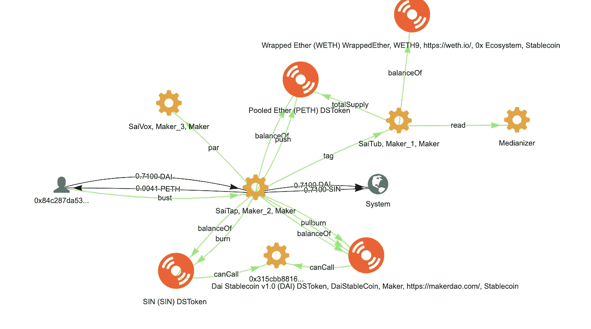

# 创客道交易画报

> 原文：<https://medium.com/coinmonks/maker-dao-transactions-illustrated-691ad2715cf7?source=collection_archive---------2----------------------->

## Maker DAO 是支持稳定令牌 DAI 的协议。本文以 bloxy.info 网站上的图表为例，描述了基于真实交易实例的协议。

# 介绍

该协议被实现为智能合约:

***赛浴盆****:*[*https://bloxy . info/address/0x 448 a 5065 AE bb8 e 423 f 0896 E6 C5 d 525 c 040 f 59 af 3*](https://bloxy.info/address/0x448a5065aebb8e423f0896e6c5d525c040f59af3)

接受包裹乙醚(WETH)作为 DAI 债务的抵押品，以及

***赛塔*** :

[*https://bloxy . info/address/0x BDA 109309 F9 fafa 6 DD 6 a9 CB 9 f1 df 4085 b 27 ee 8 ef*](https://bloxy.info/address/0xbda109309f9fafa6dd6a9cb9f1df4085b27ee8ef)

为戴清理债务(戴交易所坏账)

该协议在[https://developer.makerdao.com/dai/1/api/vox](https://developer.makerdao.com/dai/1/api/vox)中有描述。我们从这个来源获取了文本描述，但是使用 bloxy.info 网站上的图形演示，通过真实的交易示例对其进行了说明。每个插图都附有它所显示的交易的链接。您可以通过单击链接来调查此特定交易，或者通过查找合同中的类似交易来进一步调查。

我们相信这份材料将有助于更好地理解 Maker DAO 协议，并以各种可能的方式使用它。

# 方法概述

所有协议方法都可以分类，与不同的实体一起工作:


MakerDAO Smart Contract methods

它们描述了使用 Maker DAO 系统通常可以做些什么:

1.  存入/取出您的乙醚(PETH 游泳池)
2.  控制你的 CDP(抵押品头寸)并从他们那里获得贷款(DAI)。这有效地控制了戴的总供应量。
3.  清算戴/PETH 的债务

# 加入抵押品池

通过存入`ETH`以换取`PETH`(汇集醚)来加入抵押品池。

*   金额应以`PETH`为单位。
*   ETH 将按照加入价格从呼叫者处扣除(`ask`


[https://bloxy.info/tx/0x68802029f7dd70895f1c773082f049b71d325581000d23ccbebdd4530ce444ff](https://bloxy.info/tx/0x68802029f7dd70895f1c773082f049b71d325581000d23ccbebdd4530ce444ff)

# 退出抵押品池

通过将`PETH`返回金库，换取`ETH`的比例金额，从而提取抵押品。

*   金额应以`ETH`为单位指定。
*   PETH 将按退出价格从呼叫者处借记(`bid`)

将为每个`PETH`返回比在`join`更多或更少的`ETH`代币，这取决于系统在存放到池中的抵押品的生命周期内是盈利还是亏损。


[https://bloxy.info/tx/0xde0045b4e2386612396e3113b82f37928a980785516806f1ab4a49cb0d78cd00](https://bloxy.info/tx/0xde0045b4e2386612396e3113b82f37928a980785516806f1ab4a49cb0d78cd00)

# 打开 CDP

创建一个空的 CDP，并将调用者设置为所有者。


[https://bloxy.info/tx/0xaf9814ac29554f2e0c7ccb0ebe87c73a343f43886bb21c10da54bef35d4b0b7b](https://bloxy.info/tx/0xaf9814ac29554f2e0c7ccb0ebe87c73a343f43886bb21c10da54bef35d4b0b7b)

# 给 CDP

将 CDP 转让给不同的所有者。(变化`lad`)


[https://bloxy.info/tx/0xef45f2faaa0b908d57131e32e1af856c0b3c0f7e9a68222e05f00c9584cd58fe](https://bloxy.info/tx/0xef45f2faaa0b908d57131e32e1af856c0b3c0f7e9a68222e05f00c9584cd58fe)

# 锁定 CDP

增加`PETH`抵押品(增加`ink`)。


[https://bloxy.info/tx/0x8666e2871274c806b77e3b4046fa41b7a3bc02f120f0ab5f5e4f03f92c6edd39](https://bloxy.info/tx/0x8666e2871274c806b77e3b4046fa41b7a3bc02f120f0ab5f5e4f03f92c6edd39)

更复杂的情况，ETH 最初转换为:


[https://bloxy.info/tx/0x7e5858980d985f62342828f2e3018d4cea3012312d991a3eecd78577df149294](https://bloxy.info/tx/0x7e5858980d985f62342828f2e3018d4cea3012312d991a3eecd78577df149294)

# 免费 CDP

移除`PETH`抵押品(减少`ink`)。


[https://bloxy.info/tx/0x95a8e38236ba459ab0ec44bc53a4561c1626e1f08950fb92466d7ae33e4230f8](https://bloxy.info/tx/0x95a8e38236ba459ab0ec44bc53a4561c1626e1f08950fb92466d7ae33e4230f8)

更复杂的情况，转换回 ETH


[https://bloxy.info/tx/0x714bee5d4c352acfe1edf5b8286ffbab46f54946a24e7c7edd1cacca41a8cfcf](https://bloxy.info/tx/0x714bee5d4c352acfe1edf5b8286ffbab46f54946a24e7c7edd1cacca41a8cfcf)

# 画戴

发放一定数量的代币(增加`art`、`rum`)


[https://bloxy.info/tx/0xa675314e644aea0320c72f3107e6cb5c427a51885999c1e42484ddbdb46ad29b](https://bloxy.info/tx/0xa675314e644aea0320c72f3107e6cb5c427a51885999c1e42484ddbdb46ad29b)

更复杂的是，用中介的精明契约把戴送给了那家伙


[https://bloxy.info/tx/0xe847cd30af2826e37170ae2c736a0d0f0adc4a7f3b0e32a20f2768440d2c3f10](https://bloxy.info/tx/0xe847cd30af2826e37170ae2c736a0d0f0adc4a7f3b0e32a20f2768440d2c3f10)

# 擦戴

偿还部分未偿还的戴债务(减少`art`、`rum`)。


[https://bloxy.info/tx/0x6466f98209f92dc32921988c016a75b9946a9d44f58d2b5eaecf898500cdab84](https://bloxy.info/tx/0x6466f98209f92dc32921988c016a75b9946a9d44f58d2b5eaecf898500cdab84)

更复杂的情况下，在那里戴交换支付的费用。DEX exchange Oasis 用于此目的:


[https://bloxy.info/tx/0xc28febfa30c5233c1f0a69cc8ed0dc1c7c6dfe5809d7e18cf38bba5fb8c161c3](https://bloxy.info/tx/0xc28febfa30c5233c1f0a69cc8ed0dc1c7c6dfe5809d7e18cf38bba5fb8c161c3)

# 关闭 CDP

关闭 CDP。清除所有债务，解锁所有抵押品并删除记录。

抵押品将用于以市场利率支付任何未偿债务。剩余的担保品将被返还给资金池。


[https://bloxy.info/tx/0x41d126cf65e57585b79f5ab178188b30716e9590e540fa4530030cf18d50512d](https://bloxy.info/tx/0x41d126cf65e57585b79f5ab178188b30716e9590e540fa4530030cf18d50512d)

更复杂的情况，用绿洲来交换戴到:


[https://bloxy.info/tx/0x0cfcad36a457135111f4e0cfb309bc784488d066f527d8e4ab27e87b338da8e5](https://bloxy.info/tx/0x0cfcad36a457135111f4e0cfb309bc784488d066f527d8e4ab27e87b338da8e5)

更复杂的是，有了 Uniswap 的参与:


[https://bloxy.info/tx/0x38eeae65901c6ff749999b83d121d35e49a025c8d57c294f19f3d029137d2841](https://bloxy.info/tx/0x38eeae65901c6ff749999b83d121d35e49a025c8d57c294f19f3d029137d2841)

# 咬 CDP

清算脆弱的 CDP(零`art`，减少`ink`)。

不安全的 CDP 需要清算。当一个`cup`不是`safe`时，任何人都可以执行`bite(cup)`，即承担所有 CDP 债务，并没收足够的抵押品来覆盖这些债务，外加一个缓冲。

这将使 CDP 回到安全状态(可能没有抵押品)。

`bite`还有其他可能的实现方式，例如，仅获取足够的抵押品以将 CDP 转换为 safe，但为了简单起见，选择了所描述的实现方式。


[https://bloxy.info/tx/0xa569c5e31c978aa5f281a584d14ebc0fcbb41de4f69acb8629d16e6f6277f219](https://bloxy.info/tx/0xa569c5e31c978aa5f281a584d14ebc0fcbb41de4f69acb8629d16e6f6277f219)

更复杂的情况


[https://bloxy.info/tx/0x627ff7151575daaa93c63e5bf470e58011c71c8893807ad17e1d4a09aeaa21bd](https://bloxy.info/tx/0x627ff7151575daaa93c63e5bf470e58011c71c8893807ad17e1d4a09aeaa21bd)

# 繁荣债务

系统过剩时买入`dai`。

可以认为是买了就烧掉。给定一个净戴余额，出售戴以换取 PETH，这是烧毁。


[https://bloxy.info/tx/0x50f77fadf3ff0282a160cc4602081737252a906f6661469afb1f2de3ada84a2b](https://bloxy.info/tx/0x50f77fadf3ff0282a160cc4602081737252a906f6661469afb1f2de3ada84a2b)

# 胸部

在系统亏损时卖出`dai`。

`bust`实际上是两个功能合二为一:抵押品抛售(又名`flip`)，以及膨胀和出售(又名`flop`)。`fog`不为零时，卖出换回戴，用于冲销坏账，`woe`。如果`fog`为零，但是`tap`具有净 Sin 余额，则铸造并出售以换取戴，直到净 Sin 余额为零。



[https://bloxy.info/tx/0xc69d05644d525a8404b7c93509e8d51f6cedaeb35351368376ff5a0250cbc198](https://bloxy.info/tx/0xc69d05644d525a8404b7c93509e8d51f6cedaeb35351368376ff5a0250cbc198)

# Vox 目标价格

`vox`提供由`par`以参考单位给出的 Dai *目标价格*。例如，以美元为参考单位的`par == 2`意味着每 Sai 2 美元的目标价格。

目标价格可以随时间变化，变化速率由`way`给出，即每秒变化的倍增速率。

在 Dai 1.0 中，灵敏度`how`被设置为零。通过直接用`coax`调整变化率`way`来调整目标价格。在未来的迭代中，`how`可以是非零的，然后`way`调整将通过反馈机制自动跟随。`vox`部分受制于正在进行的经济建模研究。


[https://bloxy.info/tx/0x45f816f35b28550e9eec3e876d35247ee1e75dcc6cd215d4ed9c816a31c5dfda](https://bloxy.info/tx/0x45f816f35b28550e9eec3e876d35247ee1e75dcc6cd215d4ed9c816a31c5dfda)

```
*This article was composed from the data and by analytical tools from* [*Bloxy.info*](https://bloxy.info) *analytical engine.* [*Bloxy.info*](https://bloxy.info) *web site provides a set of tools for analytics, traders, companies and crypto enthusiasts.

The tools include APIs, dashboards and search engine, all available on-site, providing accurate data, indexed directly from the blockchain live node.

Bloxy mission is to make blockchain more transparent and accessible to people and businesses.

Please, make a reference to the source of data when referencing this article.*
```

# 繁琐复杂

为了展示一个真实交易的例子，请看下面这个:


[https://bloxy.info/tx/0xa745b2c9f7621f5a9a3a3cdcc5b321c2e61de0148d88047296a9ddcd642948c5#](https://bloxy.info/tx/0xa745b2c9f7621f5a9a3a3cdcc5b321c2e61de0148d88047296a9ddcd642948c5#)

除了制造商 DAO contracts，还有 3 DEX 参与其中:Oasis、Uniswap 和 Kyber Network。此交易由智能合约**saver proxy(**[https://bloxy . info/address/0x c 19d 0 f1 e 2 b 38 aa 283 e 226 ca 4044766 a 43 aa 702 b](https://bloxy.info/address/0xc19d0f1e2b38aa283e226ca4044766a43aa7b02b)**)编排。**

它所做的是收回抵押品，与凯博互换 Eth -> Dai，并用 Dai 偿还债务

# 进一步研究

bloxy . info[maker Dao](https://stat.bloxy.info/superset/dashboard/makerdao/?standalone=true)的仪表板显示了方法使用随时间变化的有趣动态:


Bloxy.info [Dashboard for MakerDAO](https://stat.bloxy.info/superset/dashboard/makerdao/?standalone=true)

由于交易者出于不同的目的使用不同的方法，这种动态可以讲述关于创客道生态系统中重要事件和行为的许多故事。

> [直接在您的收件箱中获得最佳软件交易](https://coincodecap.com/?utm_source=coinmonks)

[](https://coincodecap.com/?utm_source=coinmonks)