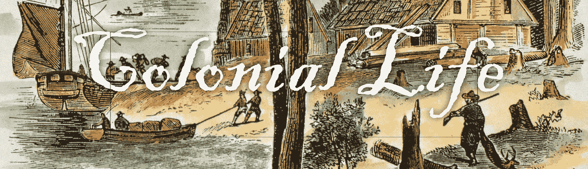
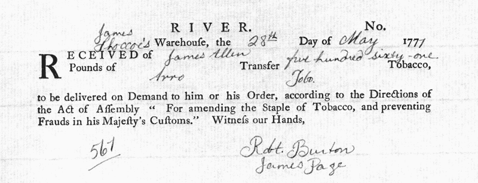
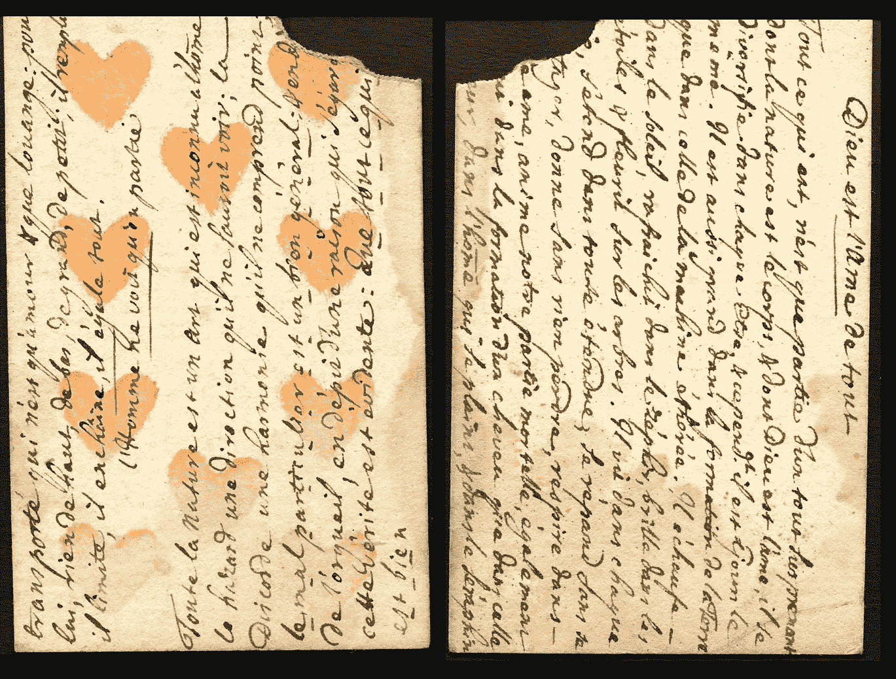

# 马克尔道:18 世纪版

> 原文：<https://medium.com/coinmonks/makerdao-18th-century-edition-bd15722d9193?source=collection_archive---------1----------------------->

## **土地银行、戴与殖民地货币供应**

*本文假定读者对马可道和戴马币已有基本了解。如果你不熟悉戴和它是如何工作的，你可以在这里***。**

# ***简介:***

*加密货币和殖民时代的对比分析并不多。这令人惊讶，因为一个是美国历史上长达几个世纪的农业时期，当时人们穿着滑稽的鞋子，另一个是技术驱动的数字货币形式，涉及计算机、密码学和互联网。*

*好吧，也许这并不奇怪。但是也许是我们开始的时候了！*

*这一切都是从我偶然看到西奥多·塞耶的一篇晦涩难懂的论文开始的，这篇论文的标题是“美国殖民地的土地银行系统”。在书中，塞尔描述了一个在 18 世纪上半叶在所有 13 个原始殖民地蓬勃发展的系统。*

*我被这段鲜为人知的美国货币史与马克道和在以太坊运行的戴稳定币的相似之处深深吸引。*

*以下是对殖民地土地银行及其与傣族稳定货币的相似性的探讨。*

# ***金银币匮乏:一个亟待解决的硬通货问题***

*阻止金币和银币外流到英国的难题一直困扰着美国的 13 个殖民地，直到 1783 年它们解体。*

*这种黄金和白银外逃的原因是一个简单的会计问题；殖民地从英国进口的制成品比他们出口的未加工的原材料多。这是有意为之的，因为殖民地在一个叫做重商主义的体系下运作，这实质上意味着他们的全部目的是通过贸易不平衡来丰富英国的财富。*

*使铸币问题复杂化的是，当时美国还没有任何重大的黄金或白银发现，而且直到 1848 年的加州淘金热才会有。*

*但是这些殖民地尽管是，嗯… *殖民地*还是相当自给自足的，也许，更重要的是，它们是相当自主的。这种自我主权导致了通常被称为“美国精神”的东西，后来当英国人在美国独立战争中血债血偿时，这种精神会反噬英国人。*

*在不同时期，各个殖民地政府都试图以不同的方式向他们的经济中注入一种不同于硬币的替代货币。*

*1690 年，马萨诸塞州发行了西方世界第一种政府支持的法定货币，以资助 T4 国王威廉战争，这最终成为了美国的 T2 传统。*

*在弗吉尼亚、马里兰和北卡罗来纳，烟草被用作一种商品货币。*

*在弗吉尼亚，烟草被储存在仓库里，代表烟草价值的纸条被殖民者用来更方便、更轻便地促进商业。*

*在英国领地之外，在今天的魁北克以及当时的新法国殖民地，殖民者定期依靠扑克牌钱来代替法国里弗。*

**

**Tobacco Note from 1771 © Colonial Williamsburg Foundation**

**

**New France’s Playing Card Money**

*正如我们所见，硬通货总是短缺，殖民地竭尽全力想出创造性的解决方案来缓解这个问题。这种“好”钱的持续缺乏在很大程度上可以归因于格雷欣法则。*

****

# ***殖民主权***

*现在对我们来说可能很奇怪，但在殖民时代，没有单一的“美国”身份这回事。直到导致 1775 年美国独立战争的事件才出现。*

*在此之前，殖民地表现得像独立的民族国家，效忠于特定的出生殖民地或明确宣称的殖民地。具有讽刺意味的是，正是他们与英国的共同纽带将这些殖民地联系在一起。每个殖民地负责自己的事务。*

*作为一名杰出的宾夕法尼亚人，本杰明·富兰克林知道货币供应是他的殖民地经济引擎正常运转的必要润滑剂。没有足够的流通资金意味着没有足够的资本来发展业务、获得贷款、购买住房或承担创业风险；意为经济停滞*。*富兰克林在他的一篇更著名的论文[中假设说“*充足的货币将导致欧洲商品的消费减少，与人口数量成比例*，因此这将是使我们的贸易平衡比现在更加平等的一种手段”。](https://teachingamericanhistory.org/library/document/a-modest-enquiry-into-the-nature-and-necessity-of-paper-currency/)*

*富兰克林花了大量时间写作、思考和论证他认为能刺激经济增长的货币政策。但是，我们会发现，当创造一种独特的殖民交换媒介时；某些殖民地不会逃往海外，他们有一张王牌叫做土地银行系统。*

# ***土地银行:一项新颖的殖民发明***

*殖民地土地银行是公共机构，发放纸币贷款以换取土地、房屋、联排别墅或农场等抵押品。从 1712 年到法国和印度战争(1754-1763)以及独立战争(1775-1783)，它们存在于每一个殖民地。它们被证明是创造独特的殖民地货币供应的无价机制，尤其是在中部殖民地。*

*第一个建立银行的殖民地是 1712 年的南卡罗来纳州，但每个殖民地最终都纷纷效仿。这个体系的逻辑以及对与金币和银币脱钩的替代货币供应的需求，似乎太诱人了，让人无法抗拒。*

*在每一个殖民地，都有一个行政贷款办公室，有一个董事会或一群由立法机关选出的受信任的公民。在发放贷款之前，贷款办公室会指派分析员确定一个人的土地价值。*

*“一般来说，土地银行法禁止贷款超过抵押财产价值的一半……土地银行的建立是为了帮助尽可能多的人，尤其是贫困农民。现存的记录表明，1774 年发放的大部分贷款都发放给了自耕农和技工。*

*贷款将在规定的时间框架内(通常为一年)连本带利偿还，贷款利息通常被殖民政府用于公共工程，从而降低了民众的总体税收。*

*殖民者可以用新产生的资本投资他们的农场，支付工人工资，或者在镇上购买商品和服务，等等。如果借款人拖欠贷款，他们的抵押品将被出售以支付未偿债务，差额(如果有剩余)将返还给原借款人。*

# *一些群体比其他群体表现得更好*

*正如你所料，土地银行系统在一些殖民地比其他殖民地运作得更令人满意。土地价值更高、政府严格控制货币供应总量的殖民地表现更好。*

*此外，很像戴的目标是维持与美元的平价——通过土地银行系统发行的殖民地纸币旨在维持与英镑的平价。*

*在新泽西、宾夕法尼亚和纽约，联系汇率并没有偏离太多。宾夕法尼亚州的货币汇率在 1723 年保持在 1.34 比 1，1729 年保持在 1.5 比 1，1739 年保持在 1.79 比 1，纽约和新泽西遵循类似的轨迹。相对而言，这证明了这个制度在中部殖民地是多么有效。*

*其他州，如卡罗莱纳州和罗德岛州，土地价值较低，殖民政府发行了过多的货币，表现更差。北卡罗来纳州的贬值幅度是 10 比 1，南卡罗来纳州是 8 比 1。*

*为了保持公众对纸币的信心，殖民地政府将货币的总供应量限制在一个固定的数量。他们还限制了任何个人可以借的贷款金额——通常设定为 100 英镑。*

*还有利率的问题要解决。殖民地的私人借贷利率通常在 8%左右，因此为了给他们的公民创造更有利的借贷条件，殖民地立法机构为土地银行设定了更低的利率。大多数殖民地将土地银行贷款的利率定为 5 %,但马里兰州只收 4 %,康涅狄格州收 3%。*

# ***马克尔道团队是否引导了殖民精神？***

*我们这些熟悉[马克尔道](https://makerdao.com/en/)的人会立即意识到[戴](https://makerdao.com/en/dai)的创建方式与殖民时期土地储备制度运作方式的相似之处。当然，动力和目标是不同的，执行也是不同的，但其核心是相同的基本思想。*

*正如人们常说的加密货币领域，这并不是说我们正在发明任何新的东西，只是以更有效和透明的方式实现事物的新方法。*

*单一抵押品 Dai 允许人们使用他们的乙醚，并将其锁定在抵押债务头寸(CDP)中。一旦汇率被锁定，他们就可以用戴(一种与美元挂钩的稳定货币)来对抗它。与土地银行体系非常相似，CDP 的持有者只能用抵押品提取一部分新资金，在制造商的情况下，基础抵押品与未偿还 DAI 贷款之间的比例必须保持在 150%。这一限制在土地银行系统中没有像在马可道那样严格执行，但一般规则适用；殖民者只能以他们作为抵押品的土地的一半的价值来提取新的纸币。*

*然而，不同之处在于，戴稳定币具有被编入以太坊智能合约的预期好处。因此，如果基础担保品低于 150%阈值，则触发清算事件等硬性规则可通过分布式代码契约自动执行。区块链的魔力使得由指定官员担任公职处理贷款业务成为历史。*

*与土地银行系统产生的殖民地特定利率相比，当除美元之外的其他货币进入该系统，特别是在[多抵押品 DAI](https://makerdao.com/en/whitepaper/#single-collateral-dai-vs-multi-collateral-dai) 的背景下，将为不同的抵押品类型及其相应的货币挂钩设定不同的[稳定费](https://makerdao.com/en/whitepaper/#risk-parameters)时，在 MakerDao 如何发生类似的情况将是有趣的。例如，黄金、白银和铂金支持的“戴”与 CNY 挂钩，或 Zcash 和 Monero 支持的“戴”与日元挂钩(我在“戴”两边加上引号，因为当挂钩改变为美元以外的货币时，名称可能会有所不同)。*

*当英国通过 1751 年的[货币法案](https://en.wikipedia.org/wiki/Currency_Act)来防止殖民地货币对英镑的进一步贬值时，殖民地的土地银行体系受到了冲击。*

*但是本杰明·富兰克林最终主张建立大陆土地银行，以此取代极不受欢迎的《印花税法案》( Stamp Act )( T7 ),试图避免政治动荡和公众对英国人的蔑视(当时本杰明·富兰克林仍然支持英国)。这是一个最终失败的尝试，但殖民地土地银行的遗产展现了美国历史上一个迷人的时代，值得更多的关注。*

***来源:***

*1.[https://www . encyclopedia . com/history/dictionary-thesaurus-pictures-and-press-releases/tobacco-money](https://www.encyclopedia.com/history/dictionaries-thesauruses-pictures-and-press-releases/tobacco-money)*

*2.[https://www . Cleveland fed . org/news room-and-events/publications/economic-commentary/2015-economic-commentations/EC-201506-paper-money-and-inflation-in-colonial-America . aspx](https://www.clevelandfed.org/newsroom-and-events/publications/economic-commentary/2015-economic-commentaries/ec-201506-paper-money-and-inflation-in-colonial-america.aspx)*

*3.【https://books.google.com/books?id=o6oOAQAAMAAJ】T4&lpg = pa 420&dq = British % 20 opinion % 20 of % 20 the % 20 greenback % 20 in % 201860s&pg = pa 420 # v = one page&q = British % 20 opinion % 20 of % 20 the % 20 greenback % 20 in % 201860s&f = false*

*4.[https://www . philadelphafed . org/-/media/publications/economic-education/Ben-Franklin-and-paper-money-economy . pdf](https://www.philadelphiafed.org/-/media/publications/economic-education/ben-franklin-and-paper-money-economy.pdf)*

*5.[https://teaching American history . org/library/document/a-modest-inquiry-into-the-nature-and-needity-of-paper-currency/](https://teachingamericanhistory.org/library/document/a-modest-enquiry-into-the-nature-and-necessity-of-paper-currency/)*

*6.[https://www . encyclopedia Virginia . org/tobacco _ in _ colonial _ Virginia](https://www.encyclopediavirginia.org/tobacco_in_colonial_virginia)*

*7.[https://maker Dao . com/en/white paper/# the-Dai-stable coin-system 概述](https://makerdao.com/en/whitepaper/#overview-of-the-dai-stablecoin-system)*

*8.塞尔西奥多。"美国殖民地的土地储备制度."*《经济史杂志》*，第 13 卷，第 2 期，1953 年，第 145–159 页。 *JSTOR* ，[www.jstor.org/stable/2113435.](http://www.jstor.org/stable/2113435.)*

> *[直接在您的收件箱中获得最佳软件交易](https://coincodecap.com/?utm_source=coinmonks)*

**