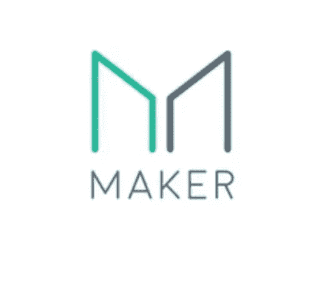
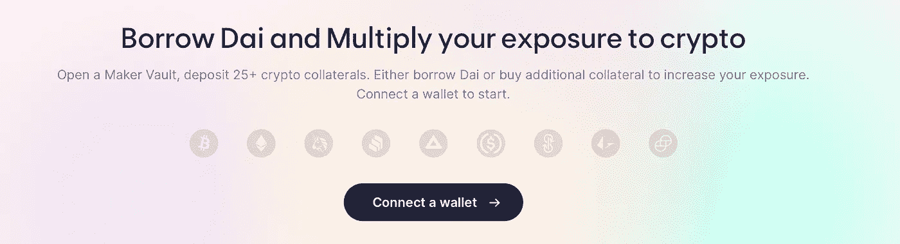
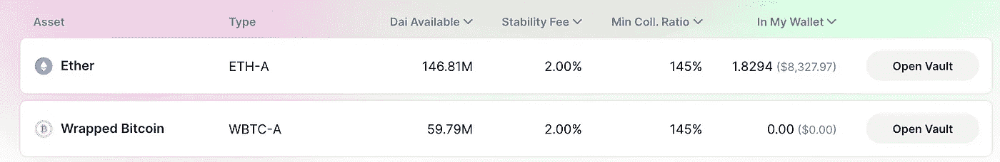
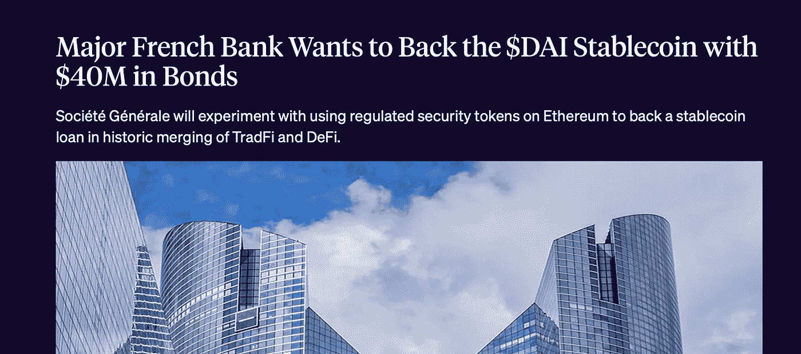

# 马克尔道:一只真正的野兽

> 原文：<https://medium.com/coinmonks/makerdao-a-true-beast-in-defi-2e993c73b00a?source=collection_archive---------12----------------------->

# 什么是创客？

[MakerDAO](https://makerdao.com/en/) 是一个开发借贷技术的组织，也是一个名为 ***戴*** 的稳定的币加密资产。

Maker 协议允许用户通过利用由 Maker 治理批准的附属资产来生成 Dai 稳定币。

制造商使用双令牌系统。一个是抵押支持戴稳定币，另一个是治理令牌。

# 简史

2017 年发布了首个 MakerDAO 正式白皮书，介绍了独创的 Dai stablecoin 系统。该白皮书描述了任何人如何通过其独特的智能合约利用其 ETH 作为抵押品来产生 Dai，这在当时被称为 ***抵押债务头寸*** 。在此期间，ETH 是唯一被接受的抵押资产。

2019 年，Maker 发布了一项升级系统的计划，以支持除 ETH 之外的多种抵押资产类型。现在，Maker 协议接受任何已经被 MKR 令牌持有者批准的基于以太坊的资产。

# MKR 代币

***MKR*** 令牌是治理令牌，允许持有者投票表决对创建者协议的更改。虽然任何人都可以向协议提交提案，但只有 MKR 令牌持有者可以对这些提案进行投票。在 Maker 中，一个 MKR 代币等于一票，意味着你持有的 MKR 代币越多，你的投票权就越大。

通过包括管理层投票和治理投票在内的科学治理体系，持有人对创客协议和戴的财务风险进行治理，以确保其稳定性、透明度和效率。

MKR 持有者可以就以下事项进行投票:添加新的担保品类型、更改担保品资产类型的风险参数、修改 DaiSavings 利率等。

每个做市商金库(我将在后面解释)类型都有自己的一套风险参数，这些参数是根据抵押品的风险状况确定的，并由 MKR 令牌持有者通过投票进行控制。一些关键风险参数包括:稳定费、清算比率、抵押品拍卖持续时间等。

MKR 代币持有者从马可道系统和戴稳定币的稳定性中获得经济利益，这意味着 MKR 代币持有者受到激励，以最符合马可道协议的利益的方式行事。

# 戴稳定币

戴稳定币是制造者的两种代币模型中的第二种货币成分。戴稳定币是一种去中心化、无偏见、抵押品支持的加密货币，与美元软挂钩。

用户通过将资产存入制造商的抵押品保管库中来生成 Dai。这就是 DAI 加入流通的方式，但是用户也可以通过经纪人和交易所获得 DAI，或者作为其他人的支付方式。

一旦用户获得了 Dai，他们就可以像使用其他加密货币一样自由地使用它。这意味着他们可以将它发送给其他人，使用它作为一种支付形式，甚至通过称为 ***【戴储蓄利率】*** 的制作者协议的一个功能来持有它作为储蓄。Dai 储蓄利率允许任何 Dai 持有人通过将他们的 Dai 锁定到 Maker 协议中的 DSR 合同中来自动且自然地赚取储蓄。

值得注意的是，流通中的所有 Dai 都是由超额抵押品支持的。也就是说金库里抵押品的价值高于戴的债务。因此，我必须拿出更多的价值作为抵押品，而不是我在戴身上拿出的价值。

Dai 旨在提供 4 种主要功能:

**价值储存:**戴是一种稳定的货币，即使在动荡的市场中，它也能保持其价值储存。

**交换媒介:** Dai 用于所有类型的交易目的的所有 DeFi 和加密空间。

**记账单位:**虽然 Dai 不是加密生态系统之外的价值衡量标准，但它确实是 Maker 协议和一些区块链 dApps 中的记账单位。

**延期付款标准:** Dai 用于清算 Maker 协议内的债务。

# 制造商金库

为了生成 Dai，用户必须通过称为 ***Maker Vaults*** 的 Maker 独特智能合约来利用他们的抵押品。任何用作抵押品的资产都必须通过治理得到 MKR 令牌持有者的批准。这些保管库保管抵押品，直到生成的 Dai 以及稳定费被付清。

保管库是非托管的，只要抵押品的价值不低于清算比率，每个用户都可以完全控制存放在那里的抵押品。

# 打开保险库

打开 Maker Vault 实际上非常简单，可以直接从 ***MakerDAOs Oasis 应用*** 中完成。

首先，你只需进入 Oasis 应用程序，将你的钱包连接到平台上(例如 Metamask 钱包)。

将您的钱包连接到平台后，您可以点击“您的保管库”来查看您拥有的任何打开的活动保管库，或者如果您希望第一次打开一个全新的保管库，您可以点击“打开新保管库”。

点击“打开新保险库”后，您将能够在 Oasis 上看到所有可用的保险库，包括保险库的 Dai 可用性、稳定性费用、最低抵押比率和存款金额。

然后，您只需在首选的保险库选项上单击“打开保险库”。

接下来，您存入所需的担保金额，然后单击“输入金额”。

然后，您通过您的钱包(本例中为 Metamask)确认交易，并在钱包中收到您的 DAI。

此时，您可以像使用任何其他加密货币一样使用您的 DAI。您可以使用刚刚生成的 DAI 购买更多的 ETH，并将这些 ETH 存入另一个金库。您可以通过将 DAI 应用于其他 DeFi 应用中，使用 DAI 进行一些产量耕作。你可以在 DeFi 借贷平台上借你的 DAI 来赚取利息。或者你可以创造抵押杠杆。

您放在 Maker 金库中的抵押品将被锁定，直到用户偿还最初生成的 DAI，加上持续累积的未偿债务的稳定费。这笔费用必须用戴支付。

一旦偿还了 DAI 和稳定性费用，用户就可以将他们的部分或全部抵押品取回他们的钱包。

# 高风险金库的清算

任何被认为风险太大的创客金库(根据 MKR 监管机构制定的参数)都可以通过自动化的创客协议拍卖进行清算。这确保了系统中始终有足够的抵押品来覆盖债务价值。每个金库都有自己的清算比率，该比率由 MKR 选民控制，并根据金库中特定资产的风险来确定。

在清算期间，庄家协议取得清算的保险库抵押品，并随后使用称为抵押品拍卖的内部拍卖机制将其出售。

被称为保管人的自动市场参与者利用套利机会，在 DAI 中竞标清算金库中的抵押品。戴通过这一抵押品拍卖过程筹集的资金用于支付金库债务，外加清算费，清算费也是由选民针对特定金库抵押品类型设定的。

如果筹集到足够的 Dai 来支付债务偿还和清算费用，那么剩余的抵押品将被归还给原金库所有者。

但是，如果没有通过抵押品拍卖筹集到足够的 DAI，赤字将被转换为“*协议债务*，并由庄家缓冲区中的 Dai 覆盖。做市商缓冲区中的资金来自稳定费、清算费和其他收入流。如果缓冲区中没有足够的 dai，协议将触发“债务拍卖”，系统将铸造 MKR，然后卖给 Dai 的竞标者。

# 目标市场

根据 MakerDAO 白皮书:

***“价格稳定的加密货币作为许多去中心化应用的重要交换媒介。因此，戴的潜在市场至少和整个分散的工业一样大。但戴的希望远远不止于此，还延伸到了其他行业。***

本文中讨论的戴稳定币市场包括:

1.  ***营运资金、套期保值和抵押杠杆***
2.  ***商户收款、跨境交易、汇款***
3.  ***慈善机构和非政府组织***
4.  ***博彩***
5.  ***预测市场***

# 法国银行抵押品入职

[https://blockworks.co/major-french-bank-wants-to-back-the-dai-stablecoin-with-40m-in-bonds/](https://blockworks.co/major-french-bank-wants-to-back-the-dai-stablecoin-with-40m-in-bonds/)

MakerDAO 是一个如此强大的协议，以至于它实际上收到了法国第三银行的提议，将令牌化的 AAA 级欧元计价债券纳入 MakerDAO 系统(如果你有兴趣了解更多信息，请点击图片下方的链接)。

这实际上也有助于 MakerDAO 增加其 DAI stablecoin 的抵押品基础，并减少对不稳定加密资产的依赖。换句话说，除了加密资产，金库里还锁着更多类型的抵押品。

更不用说 MakerDAO 创始人 Rune Christensen 在出席[无银行播客](https://www.youtube.com/watch?v=1880RYS9f2Y)时所说的事实，这种合作关系证明，从监管角度来看，大银行可以加入并利用像 MakerDAO 这样强大的 defi 应用程序。

# 结论

MakerDAO 是一个非常强大的协议，融合了稳定的硬币生成和分散的借贷功能。

MakerDAO 是区块链以太坊上最成熟的应用之一，目前在 [defipulse](https://defipulse.com) 上排名第一，总价值约为 180 亿美元(TVL)。在撰写本文时，Maker 的交易价格约为 3200 美元，市值为 32 亿美元。

MakerDAO 允许用户将不同的 ERC-20 代币锁定到他们独特的智能合约(称为 Maker Vaults)中，并生成 DAI stablecoin 作为回报。然后，用户可以像部署任何其他加密货币一样重新部署这个 DAI。无论他们是想在交易所上市，还是将其部署在其他 DeFi 协议上以获得额外收益，都取决于用户。

在我看来，MakerDAO 是所有 DeFi 中最强大的协议之一，我相信在未来的几年里它们将继续如此。除了为传统金融和 defi 的合并铺平道路之外，MakerDAO 还为更可持续的绿色未来铺平了道路。我不会在这里深入探讨，但如果你感兴趣，我会看看我在本文前面链接的无银行播客，看看为什么主持人 Ryan Sean Adams 将 Maker 称为“超绿色货币”。

> 加入 Coinmonks [电报频道](https://t.me/coincodecap)和 [Youtube 频道](https://www.youtube.com/c/coinmonks/videos)了解加密交易和投资

## 也阅读

 [## 最佳加密交易所| 2021 年十大加密货币交易所

### 编辑描述

blog.coincodecap.com](https://blog.coincodecap.com/crypto-exchange)  [## 2021 年 10 大最佳加密贷款平台| CoinCodeCap

### 编辑描述

blog.coincodecap.com](https://blog.coincodecap.com/crypto-lending)  [## 2021 年最佳免费加密交易机器人

### 2021 年币安、比特币基地、库币和其他密码交易所的最佳密码交易机器人。四进制，位间隙…

medium.com](/coinmonks/crypto-trading-bot-c2ffce8acb2a)  [## 最佳 4 个加密交易信号电报通道

### 这是乏味的找到正确的加密交易信号提供商。因此，在本文中，我们将讨论最好的…

medium.com](/coinmonks/best-crypto-signals-telegram-5785cdbc4b2b)