# 马克尔道令牌解释道:戴、韦瑟、、辛、。第一部分

> 原文：<https://medium.com/coinmonks/makerdao-tokens-explained-dai-weth-peth-sin-mkr-part-1-a46a0f687d5e?source=collection_archive---------0----------------------->

## 制造者道使用多个 20 代币用于特定目的，以确保戴稳定硬币的稳定性。本文基于 Bloxy.info 令牌流工具描述它们的角色和使用模式。

# 刀客代币

M aker DAO 系统由几个智能合约组成(Sai Tap，Sai Tub，Vox，Medianiser 等。)，还有 ERC-20 代币。他们共同努力确保戴令牌的稳定。

在本文中，我们主要关注如何轮换和使用令牌。下图显示了用于将一个令牌转换为另一个令牌的主要令牌流和智能合约方法:

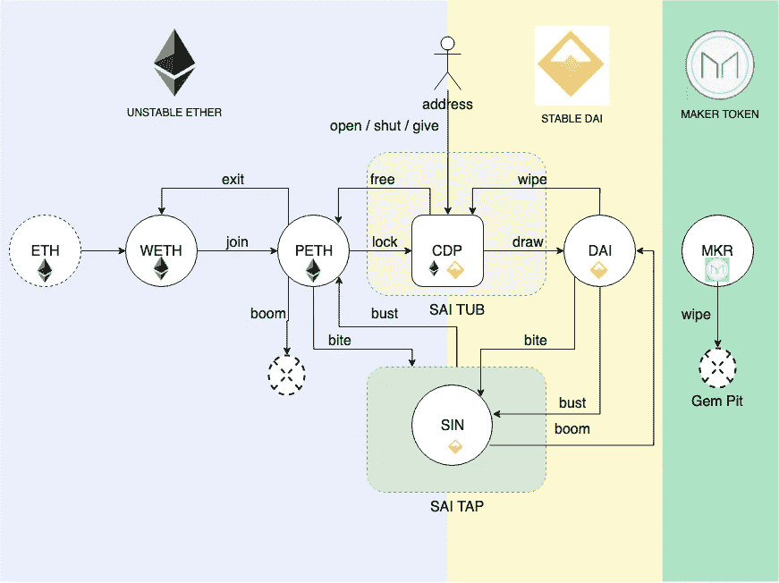

Maker DAO Tokens Turnaround and Contract Methods

令牌显示为圆形，而智能合约及其实体为圆角矩形。图中的箭头表示使用这些智能契约方法，您可以将余额从一个令牌更改为另一个令牌。

例如，调用 join()将删除您的 WETH 令牌，并给您适当数量的 PETH 令牌。

# 不稳定的(“类似以太的”)令牌

图表的左侧显示了与以太相关的令牌:

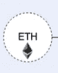

Ether

[***乙醚***](https://bloxy.info/tokens/ETH) *本身并不直接用于制刀系统。如果你本来就有 ETH(像我们大多数人一样)，你必须先把它转换成 WETH ( Wrapped ETH)令牌。*

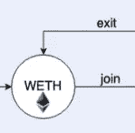

[***WETH***](https://bloxy.info/address/0xc02aaa39b223fe8d0a0e5c4f27ead9083c756cc2)*是 ETH 的一一对应，但是作为 ERC-20 的令牌。在任何时候，你都可以把以太换成 WETH，然后再换回来。不利的一面是，每一次这样的转变都需要天然气。*

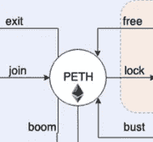

[***PETH***](https://bloxy.info/address/0xf53ad2c6851052a81b42133467480961b2321c09)*是“汇集醚”的简称。当你把钱存到刀师傅那里，你就可以拿回这个令牌。注意，它并不完全是一对一对以太，它的速率是计算出来的。*

# 稳定的(“戴式”)令牌

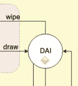

[***戴***](https://bloxy.info/address/0x89d24a6b4ccb1b6faa2625fe562bdd9a23260359) 是马克道稳定币，预计足够接近 1 美元。它是在您使用 CDP 生成贷款时为您铸造的

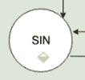

[***罪***](https://bloxy.info/address/0x79f6d0f646706e1261acf0b93dcb864f357d4680) *令牌代表清偿债务。其价值等于 1 DAI，在债务清算过程中代替 DAI 使用*

# Maker DAO 实用程序令牌

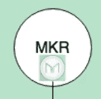

[](https://bloxy.info/address/0x9f8f72aa9304c8b593d555f12ef6589cc3a579a2)**令牌用于支付债务平仓时的佣金费用(按抹平法)。**

# *智能合同*

*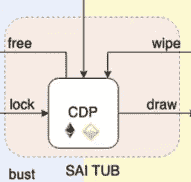*

*[**Sai Tub** 智能合约](https://bloxy.info/address/0x448a5065aebb8e423f0896e6c5d525c040f59af3)存储 CDP 的。CDP 是你在戴的债务被杠杆化了。大部分操作都是用 Maker DAO 完成的。*

*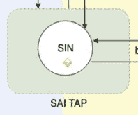*

*[**Sai Tap** 智能合约](https://bloxy.info/address/0xbda109309f9fafa6dd6a9cb9f1df4085b27ee8ef)允许清算债务并从中产生利润。*

# *智能合同方法*

*Maker DAO 智能合约有很多方法，主要分类如下表:*

*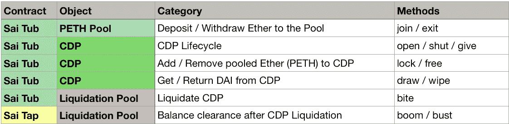*

*Maker DAO Smart Contract Methods*

*大多数方法使用我们上面列出的令牌和作为内部 Sai Tub 实体的 CDP 进行操作。*

*这些方法的更详细的描述你可以在[Maker DAO transactions Illustrated](/coinmonks/maker-dao-transactions-illustrated-691ad2715cf7)文章中找到。*

# *令牌使用模式*

*下面的素材是基于 [Bloxy.info](https://bloxy.info) Token Flow 工具和 Maker DAO analytical[dashboard](https://stat.bloxy.info/superset/dashboard/makerdao/?standalone=true)创建的。*

```
*[*Bloxy.info*](https://bloxy.info) *web site provides a set of tools for analytics, traders, companies and crypto enthusiasts.

The tools include APIs, dashboards and search engine, all available on-site, providing accurate data, indexed directly from the blockchain live node.

Bloxy mission is to make blockchain more transparent and accessible to people and businesses.

Please, make a reference to the source of data when referencing this article.**
```

*我们的目标是将智能合约代码和上图与实际的令牌流和关于这些令牌的用户操作相匹配。我们将使用我们的工具和分析方法，从不同的角度逐一研究表征。*

*我们的第一个令牌是…*

# *包裹乙醚*

*我们的解释在网站上。它是包裹的以太网，可以在需要 ERC-20 令牌的地方代替以太网使用。首先想到的是分散交易所(DEX)。通常，DEX 协议期望 ERC20 令牌作为购买/出售方资产，并且它们不能直接与 Ether 一起工作。所以你首先把你的以太变成 wet，交换它，然后我们可以变回以太。*

*此令牌始于 2017 年 12 月，与 Maker DAO 协议同时。注意，最大持有人是制造商道智能合约:*

*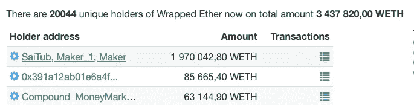*

*WETH largest holders*

*所有者与其他令牌的交集也显示了 Maker DAO 令牌:*

*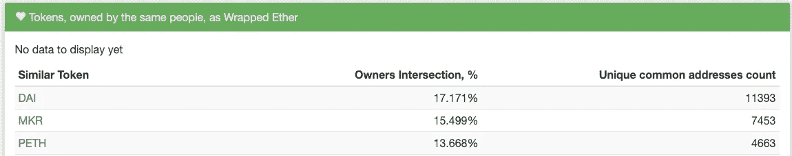*

*Tokens correlated by common holders, Source: [bloxy.info](https://bloxy.info/token_holders/0xc02aaa39b223fe8d0a0e5c4f27ead9083c756cc2)*

*SaiTub MaerDAO 智能合约上出现了这种高 wet 余额，因为用户将 wet 存入制造商 DAO 的 SaiTub 智能合约，以便稍后创建 CDP。我们在 [MakerDAO 仪表盘](https://stat.bloxy.info/superset/dashboard/makerdao/?standalone=true)上分析了这一过程的动态:*

*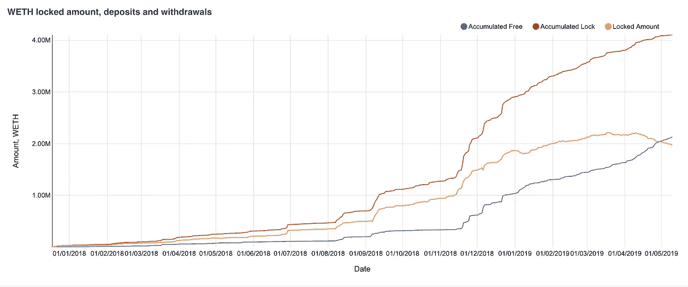*

*WETH locked amount, deposits, withdrawals. Source: bloxy.info [MakerDAO dashboard](https://stat.bloxy.info/superset/dashboard/makerdao/?standalone=true)*

*从该图可以看出，在 2019 年 5 月 10 日，锁定的 WETH 数量约为。200 万 ETH(橙色线)，而总铸造量超过 400 万 ETH。*

*有多少人参与了这项活动？交易者的数量可以通过在 SaiTub 智能合约上发起退出/加入交易的唯一地址来估计:*

*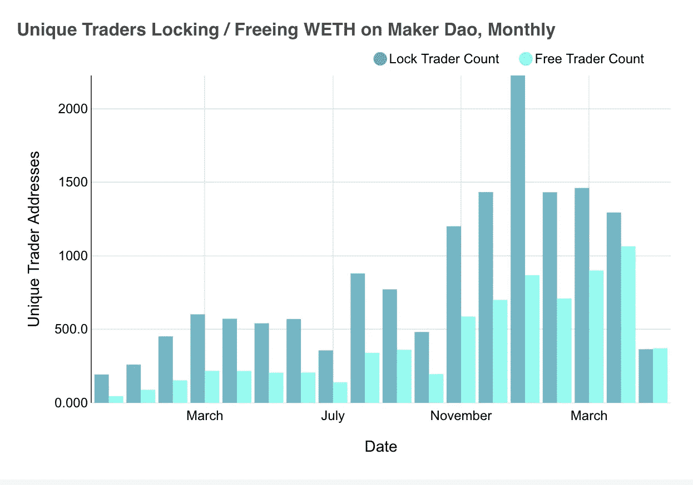*

*Unique count of addresses, locking and freeing WETH on Maker DAO smart contract. Source: bloxy.info [MakerDAO dashboard](https://stat.bloxy.info/superset/dashboard/makerdao/?standalone=true)*

*交易者的行为由每月锁定和释放的次数来描述:*

*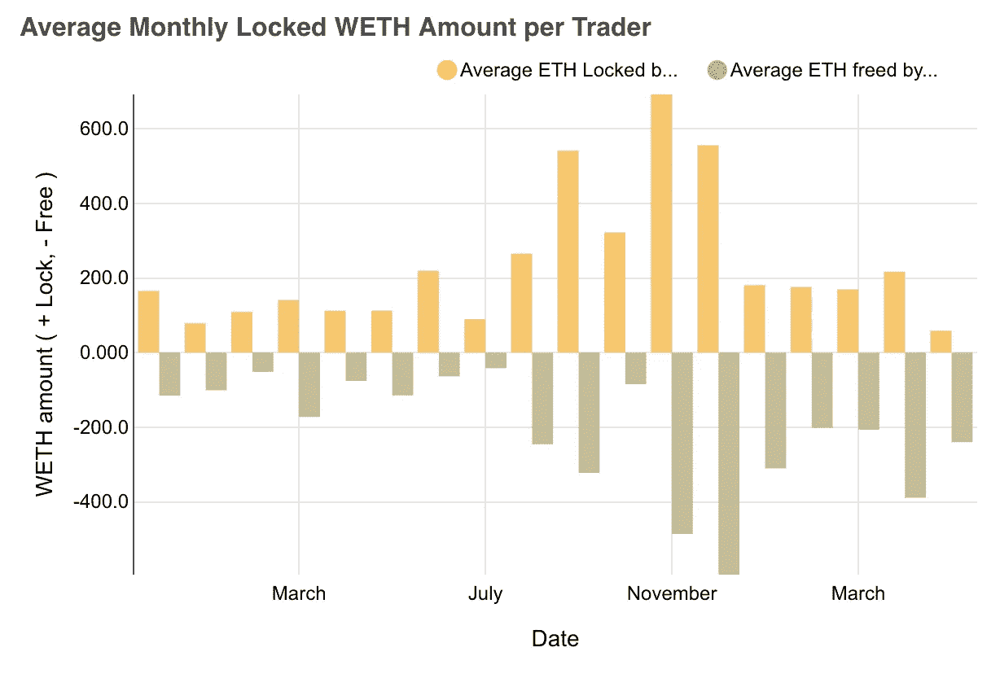*

*Monthly free/lock WETH amount. Source: bloxy.info [MakerDAO dashboard](https://stat.bloxy.info/superset/dashboard/makerdao/?standalone=true)*

*有趣的趋势是，锁定和免费金额看起来相当对称，在 2019 年 4 月之前，当更多的人开始从制造商道提取(免费)WETH，而不是将其存入(锁定)。这是该图的两个右栏。这反过来导致了制造商 DAO 的 wet 余额减少。*

# *我们外面的制造者是刀吗？*

*问题是——除了刀匠之外，还有其他地方用吗？*

*答案是肯定的。首先，它在 ZeroX 和 Oasis(匹配市场)交易所非常活跃，如 bloxy . info[wet 交易页面](http://localhost:3000/token_trades/0xc02aaa39b223fe8d0a0e5c4f27ead9083c756cc2)所示。*

*[令牌流工具](http://localhost:3000/token_graphs/0xc02aaa39b223fe8d0a0e5c4f27ead9083c756cc2#)展示 wet 的主要流程:*

*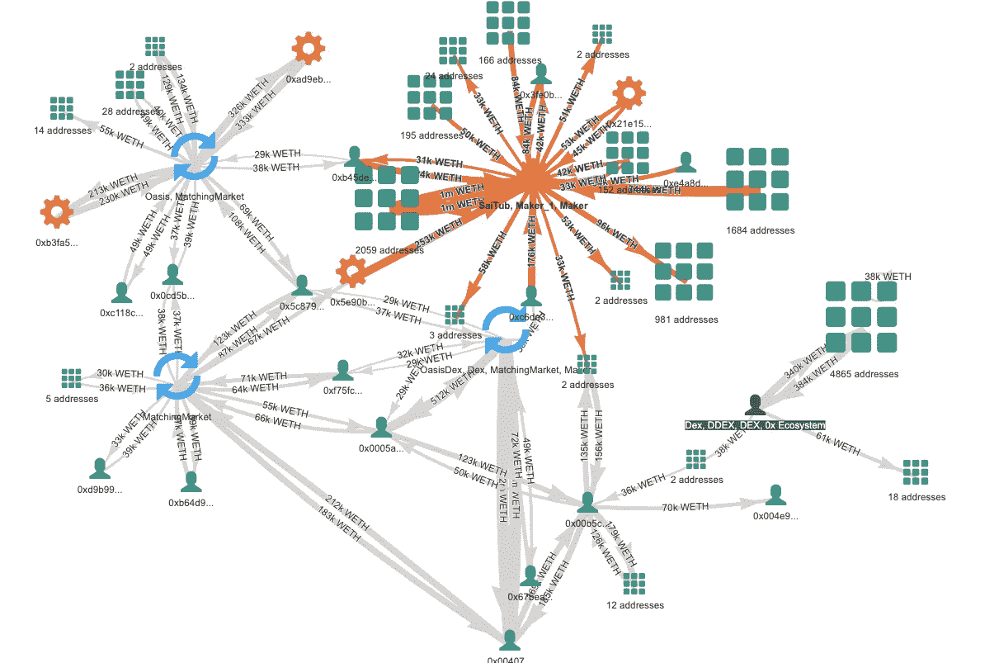*

*Main WETH flows. Source: [bloxy.info](http://localhost:3000/token_graphs/0xc02aaa39b223fe8d0a0e5c4f27ead9083c756cc2#)*

*如您所见，我们的令牌有几个“重心”:*

1.  *马克代的赛图布*
2.  *绿洲，DDEX 交易所*
3.  *ZeroX(不涉及传输，因此未在此图中明确显示)*

*DEX 上最活跃的交易者之一进行 wet 交易的例子如下:*

*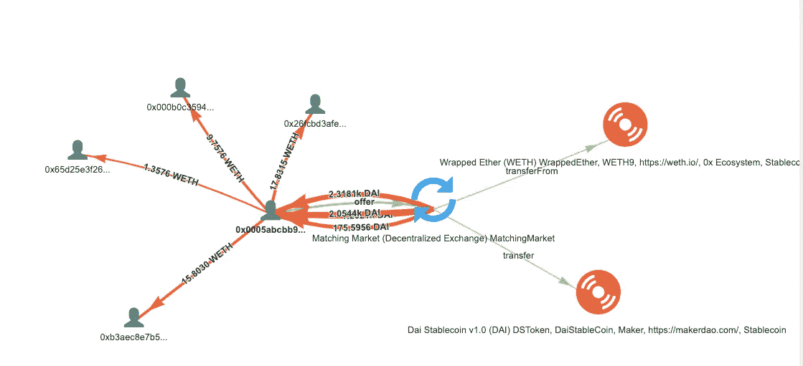*

*DEX trade between many parties with WETH/DAI pair. Source: [bloxy.info](https://bloxy.info/tx/0xc538725a76c26695c3fae183bea430bfb86449bc9a066288e52716d22b10f009)*

*我们交易的不仅仅是戴，以下是 DEX 交易所的前 10 对:*

*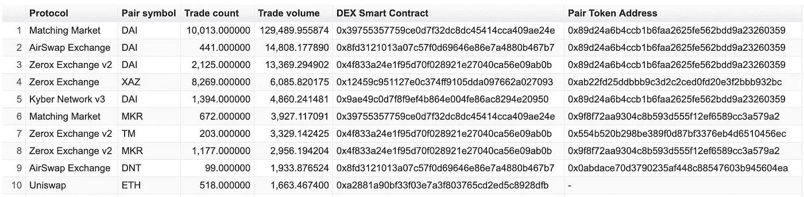*

*Top 10 pairs for WETH on DEX. Source: [bloxy.info DEX API](https://bloxy.info/api_methods)*

# *PETH(混合醚)*

*代表 ETH，即你投入到 Maker DAO smart 的合同中，以创造日后戴的债务。这是对我们的汇率，等于*

*PETH =(收支平衡)/(PETH 总供给)*

*现在它等于 1.04，因为 PETH 的一部分因债务清算而被烧毁。如图所示，这个数字随着时间的推移而增加:*

*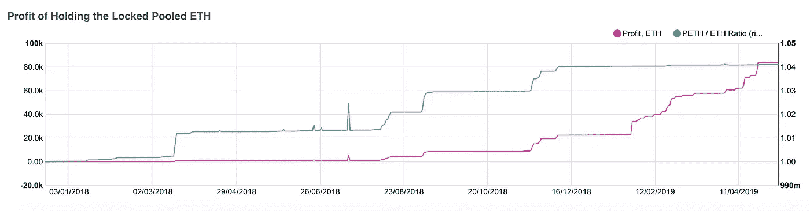*

*PETH/WETH rate and profit associated with it. Source: bloxy.info [MakerDAO dashboard](https://stat.bloxy.info/superset/dashboard/makerdao/?standalone=true)*

****PETH/WETH 汇率的变化为用户产生 APR 和利润，这些用户在很久以前就加入了这个池，并且用 WETH 来交换 PETH。他们的总利润估计在 80，000 ETH 左右。****

*PETH 不在 DEX 上交易，似乎只在 MakerDAO 基础设施内部使用。*

*下面的令牌流显示，主要的 PETH 流从交易者流向 Sai Tub 智能合约。然后，部分流会转到 SaiTap(在债务清算的情况下)，或者转到系统地址(用于刻录):*

*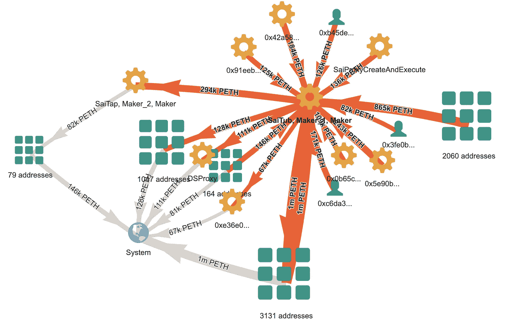*

*PETH token flow. Source: [bloxy.info token flow tool](https://bloxy.info/token_graphs/0xf53ad2c6851052a81b42133467480961b2321c09#)*

***未完待续！在第二部分中，我们将讨论代币戴、和罪！***

> *[直接在您的收件箱中获得最佳软件交易](https://coincodecap.com/?utm_source=coinmonks)*

*[](https://coincodecap.com/?utm_source=coinmonks)*