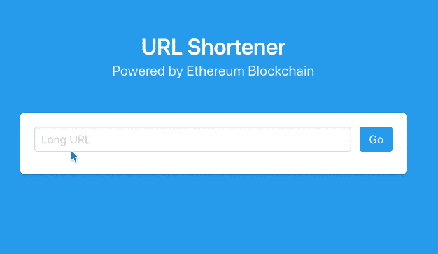
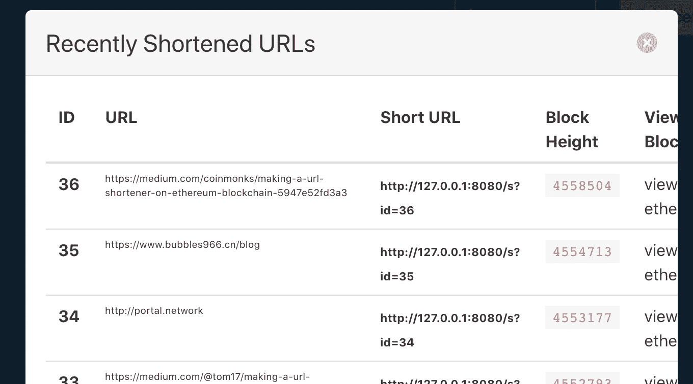
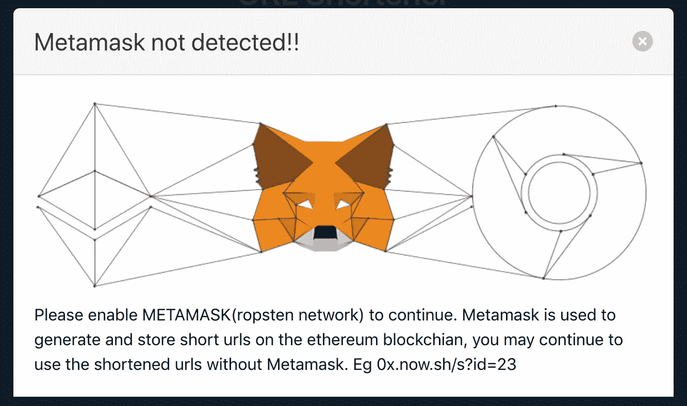

# 在⛓区块链以太坊制作一个网址缩短器

> 原文：<https://medium.com/coinmonks/making-a-url-shortener-on-ethereum-blockchain-5947e52fd3a3?source=collection_archive---------4----------------------->

## 永远保存区块链的链接

## 该产品

# 它是如何工作的



部署在 [0x.now.sh](https://0x.now.sh) 的 web app 与部署在[以太坊 Ropsten testnet](https://ropsten.etherscan.io/address/0x4b8241f24537d2539d0b310bc074fd68a782e182) 上的智能合约进行交互。在 testnet 上意味着你可以用自由醚与它互动。点击获取您的[免费乙醚。](https://faucet.metamask.io)

## 该过程

*   用户进行交易，请求区块链存储 URL 字符串。
*   由于这是一项改变区块链现状的交易，因此需要附带一定数量的乙醚，以便矿工将其开采到区块链。
*   费用(也称为[气体](https://www.cryptocompare.com/coins/guides/what-is-the-gas-in-ethereum/))的数量由 Metamask chrome 扩展决定，并显示在提示框中。
*   交易确认需要等待一段时间(5-10 秒),具体取决于区块链的繁忙程度。
*   生成了缩短的 URL。https://0x.now.sh/s?id=23
*   当用户点击缩短的 URL 时，进行另一个事务，请求区块链哪个 URL 字符串位于所提供的引用处(在这种情况下是 23)
*   因为这个交易没有改变区块链的状态，所以这次我们不需要支付任何 ETH，用户被无缝地重定向到长 URL。

## dApp

作为一个分散的应用程序意味着这个 web 应用程序不需要任何集中的数据库来运行。它仅与部署在区块链上的智能合约进行交互。

## 智能合同📃

```
pragma solidity ^0.4.24;contract e0x {
 event Log(string message);
 event LinkAdded(uint linkId, string url);

 struct LinkTemplate {
  address userAddress;
  string url;
 }

 uint lastLinkId;
 mapping (uint => LinkTemplate) public linkMapping;

 constructor() public {
  lastLinkId = 0;
 }

 function createNewLink(string url) public returns (uint) {
     lastLinkId++;
  linkMapping[lastLinkId] = LinkTemplate(msg.sender, url);
  emit LinkAdded(lastLinkId, url);
  return lastLinkId;
 }

 modifier linkExists(uint linkId) {
     //link with the given hash does not exist
  if(linkMapping[linkId].userAddress == 0x0000000000000000000000000000000000000000) {
   revert();
  }
  _;
 }

 function getLink(uint linkId) linkExists(linkId) public constant
  returns(
   address,
   string
  ) {
      LinkTemplate memory link = linkMapping[linkId];
   return(
    link.userAddress,
       link.url
   );
  }}
```

# 技术挑战

## 与智能合同交互

EthersJS 库用于与区块链对话

```
// provider picks up the Metamask injected web3 object from browser 
let provider = new ethers.providers.Web3Provider(web3.currentProvider);
let address = "ADDRESS_OF_DEPLOYED_SMART_CONTRACT";
let abi = [...] //defines JSON interface for the smart contract
```

## 在区块链上存储数据

```
// calling the createNewLink function defined in the smart contract
tx = await contract.createNewLink(url);
console.log(tx.hash);
```

## 收听区块链事件

```
contract.on("LinkAdded", (linkId, linkUrl) => {

        var shortUrl = '{0}/s?id={1}'.f(window.location.origin, linkId.toNumber())
        $("#info").prepend( "Short URL: <a href='{0}'>{0}</a><br>".f(shortUrl) );

    });
```

## 正在生成最近缩短的 URL 列表



EthersJS 不支持事件批量监听，所以我必须使用 web3js 的 allEvents()函数调用

```
MyContract = web3.eth.contract(abi);
    myContractInstance = MyContract.at(address);
    events = myContractInstance.allEvents({event: 'LinkAdded', fromBlock: 0, toBlock: 'latest'});
    events.watch(function(error, result){
      console.log(result.args.url, result.args.linkId.toNumber());
      ...
});
```

## 使得缩短的 URL 在所有浏览器中都是可访问的



这相当棘手，因为与区块链交互需要浏览器支持 web3，并安装一些钱包(元掩码或类似的)。目前，web3 和钱包支持仅适用于桌面版的 Chrome 和 Firefox。

为了解决这个问题，我不得不创建一个钱包，如下所示

```
provider = ethers.getDefaultProvider('ropsten');
wallet = ethers.Wallet.createRandom();
wallet = wallet.connect(provider);
```

向令人敬畏的 [ethersJS 库](https://github.com/ethers-io/ethers.js/)大声疾呼，感谢它对此的支持。

## 统计 URL 访问量

使用这种浏览器的灵活性是有代价的。每次用户点击缩短的网址没有改变区块链的状态，因此不可能确定每个链接被点击了多少次。这个问题仍然没有解决。

该项目的完整源代码在 [Github](https://github.com/sauravtom/ethereum-url-shortener) 上。

欢迎提取请求😁

[](http://bit.ly/2G71Sp7)

[**Click to read today’s top story**](http://bit.ly/2G71Sp7)