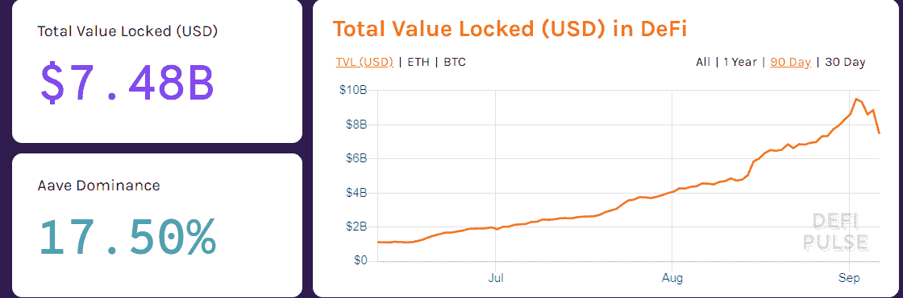

# 让更多用户能够轻松使用 DeFi 产品

> 原文：<https://medium.com/coinmonks/making-defi-products-easily-accessible-to-wider-users-dd39962c0792?source=collection_archive---------1----------------------->

[区块链科技的分散金融](https://blog.coincodecap.com/the-ultimate-guide-to-defi-decentralized-finance) ( [DeFi](https://blog.coincodecap.com/the-ultimate-guide-to-defi-decentralized-finance) )彻底改变了加密货币生态系统。通过提供不可信的解决方案，它增强了整个行业的投资者的能力，并大幅提高了他们赚钱的能力。

DeFi 在过去几年中广受欢迎，并一直处于创新的前沿，探索新的可能性。分散融资的一个新兴趋势是[高产农业](https://blog.coincodecap.com/defi-yield-farming-and-liquidity-mining)。也被称为流动性开采，产量农业允许任何人使用无许可的流动性协议赚取被动收入。

衡量产量农业预期增长的一种智能方法是分析锁定的总价值，该价值告知 DeFi 智能合同中锁定的加密货币数量。DeFi 行业继续其巨大的增长轨迹，总价值已达到 74.8 亿美元。这清楚地证明了 DeFi 对高产农民来说是一个有吸引力和有利可图的投资机会。

资料来源:DefiPulse

尽管 DeFI 提供了无限的机会，但渗透率非常低。2020 年 7 月，ARPA 对 DeFi 进行了一项调查，目标是 ARPA 社区中约 700 名区块链从业者、区块链用户、密码持有者、技术爱好者和其他区块链相关用户。发表的研究的一个关键发现是，尽管 2020 年其增长巨大，但目前只有数万名 DeFi 用户，与全球 500 万密码交易商相比，渗透率仅为 1%。

## **进入壁垒**

不幸的是，DeFi 开发人员正面临着现有智能合同选项的许多挑战，这些挑战阻止了他们获得主流采用。造成这种低渗透率的主要因素之一是高昂的天然气费用。一个农民需要为进出池塘支付费用。执行智能合同收取的高额费用让农民质疑整个机制的利润回报。

另一个关键挑战是行业内的过度竞争。在这个市场中，每周都有令人兴奋的新发展，这使得农民几乎不可能定期了解新出现的机会。如果农民在投资 DeFi 生态系统时不能利用这些最新的发展，可能会导致机会的丧失。这产生了一种混乱和困惑的气氛，阻碍了农民的整体战略。

除了所有这些因素，安全性是与智能合同相关的最大问题之一。的确，智能合约比集中式系统安全得多，因为它们取代了对可信第三方的需求。然而，它们并非完全没有风险。DeFi 智能合约中的一个漏洞可能会使用户的资金暴露在严重的漏洞之下。尽管开发人员不断努力实现高安全性级别，但没有 100%的保证。这种担心打击了潜在农民投资 DeFi 方案的积极性。

## **那么，有什么解决办法呢？**

为了应对这些挑战并为更广泛的用户提供方便的访问，需要一种创新和全面的方法。 [APY。Finance](https://www.apy.finance/) 是一个自动化的高产农业平台，旨在减轻这些风险，并为高产农民提供更安全、更经济的选择。该平台不断将高产农户的资金投入到最新、最高产的农业中，从而实现整体利润的增量增长。

**那么，APY 是如何。金融成功地为投资者提供了最好的结果？**

在创新和技术的顶端工作，它采用以下策略-

## **自动化高产农业**

高产农业的主要目标是尽可能多的赚钱。因此，每一个高产的农民都期待投资最高产量的农场。随着越来越多的用户开始投资回报最佳的资金池，他们也会稀释收益率。因此，农民们会从一个池塘跳到另一个池塘，寻求最高的产量。该公司认识到这一关键问题，因此设计了一种自动再平衡机制，智能地在池之间路由资金，使高产农业变得容易。

## **最低汽油费**

APY。金融通过在单个交易中以非托管方式集中发送资金池资金来实现规模经济。这将导致天然气费用大幅下降近 99%。这对高产农民来说是一个不可思议的机会，因为它为他们创造了一个替代世界，在这个世界中他们可以最大限度地减少支出，从而成倍地增加利润。

## **风险调整收益**

APY 的最终目标。财务团队将建立一个 100%社区所有的平台，这将通过 [APY 令牌](/@deloschang/562aa1302180)逐步去中心化来实现。这种民主的[治理模式](https://cryptopurview.com/governance-token-far-reaching-impact-on-defi-protocols/)将授权代币持有者发起提案，并对重要决策进行投票，如战略风险评分变化，甚至收益分配。随着市场形势的变化，机构群体可以集体决定更新这些风险分值，以反映新的变化。

聚焦于改造 DeFi 景观的 [APY。金融](https://www.apy.finance/)提供下一代产量农业，将 DeFi money legos 与多样化智能合约风险相结合，创新高 APY 策略。通过采用以绩效为导向的方法，它有望为高产农民带来卓越的成果。

## 另外，阅读

*   最好的[密码交易机器人](/coinmonks/crypto-trading-bot-c2ffce8acb2a)
*   [加密复制交易平台](/coinmonks/top-10-crypto-copy-trading-platforms-for-beginners-d0c37c7d698c)
*   最好的[加密税务软件](/coinmonks/best-crypto-tax-tool-for-my-money-72d4b430816b)
*   [最佳加密交易平台](/coinmonks/the-best-crypto-trading-platforms-in-2020-the-definitive-guide-updated-c72f8b874555)
*   最佳[加密贷款平台](/coinmonks/top-5-crypto-lending-platforms-in-2020-that-you-need-to-know-a1b675cec3fa)
*   [最佳区块链分析工具](https://bitquery.io/blog/best-blockchain-analysis-tools-and-software)
*   [加密套利](/coinmonks/crypto-arbitrage-guide-how-to-make-money-as-a-beginner-62bfe5c868f6)指南:新手如何赚钱
*   最佳加密制图工具
*   [莱杰 vs 特雷佐](/coinmonks/ledger-vs-trezor-best-hardware-wallet-to-secure-cryptocurrency-22c7a3fd391e)
*   了解比特币的[最佳书籍有哪些？](/coinmonks/what-are-the-best-books-to-learn-bitcoin-409aeb9aff4b)
*   [3 商业评论](/coinmonks/3commas-review-an-excellent-crypto-trading-bot-2020-1313a58bec92)
*   [AAX 交易所评论](/coinmonks/aax-exchange-review-2021-67c5ea09330c) |推荐代码、交易费用、利弊
*   [Deribit 审查](/coinmonks/deribit-review-options-fees-apis-and-testnet-2ca16c4bbdb2) |选项、费用、API 和 Testnet
*   [FTX 密码交易所评论](/coinmonks/ftx-crypto-exchange-review-53664ac1198f)
*   [n 零审核](/coinmonks/ngrave-zero-review-c465cf8307fc)
*   [Bybit 交换审查](/coinmonks/bybit-exchange-review-dbd570019b71)
*   [3Commas vs Cryptohopper](/coinmonks/cryptohopper-vs-3commas-vs-shrimpy-a2c16095b8fe)
*   最好的比特币[硬件钱包](/coinmonks/the-best-cryptocurrency-hardware-wallets-of-2020-e28b1c124069?source=friends_link&sk=324dd9ff8556ab578d71e7ad7658ad7c)
*   最佳 [monero 钱包](https://blog.coincodecap.com/best-monero-wallets)
*   [莱杰 nano s vs x](https://blog.coincodecap.com/ledger-nano-s-vs-x)
*   [bits gap vs 3 commas vs quad ency](https://blog.coincodecap.com/bitsgap-3commas-quadency)
*   [莱杰纳米 S vs 特雷佐 one vs 特雷佐 T vs 莱杰纳米 X](https://blog.coincodecap.com/ledger-nano-s-vs-trezor-one-ledger-nano-x-trezor-t)
*   [block fi vs Celsius](/coinmonks/blockfi-vs-celsius-vs-hodlnaut-8a1cc8c26630)vs Hodlnaut
*   Bitsgap 评论——一个轻松赚钱的加密交易机器人
*   为专业人士设计的加密交易机器人
*   [PrimeXBT 审查](/coinmonks/primexbt-review-88e0815be858) |杠杆交易、费用和交易
*   [埃利帕尔泰坦评论](/coinmonks/ellipal-titan-review-85e9071dd029)
*   [SecuX Stone 评论](https://blog.coincodecap.com/secux-stone-hardware-wallet-review)
*   [BlockFi 评论](/coinmonks/blockfi-review-53096053c097) |赚取高达 8.6%的加密利息