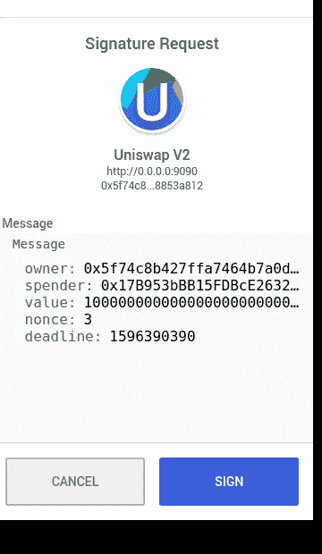

# 让 Gitcoin Grants 没有汽油

> 原文：<https://medium.com/coinmonks/making-gitcoin-grants-gasless-bf9a59e93632?source=collection_archive---------2----------------------->

是的，我们能做到。感谢戴的[许可](/@Degens/betting-without-eth-dais-new-permit-feature-5517293f3246)功能。

**什么问题？**

[这个](https://github.com/gitcoinco/web/blob/master/docs/GRANTS.md#user-content-rounds-6:~:text=In%20round%206%20we%20transitioned%20away,is%20submitted%20through%20the%20donate()%20function.)就是 gitcoin grant 现在的工作方式。

1.  批准[批量结帐](https://github.com/gitcoinco/BulkTransactions#user-content-deployment:~:text=BulkCheckout.sol%20has%20been%20deployed%20to%20the,Mainnet%20and%20Rinkeby%20at%200x7d655c57f71464B6f83811C55D84009Cd9f5221C.)合同以批准您的 DAI(或任何 ERC20 令牌)。
2.  调用 BulkCheckout 合同的捐赠功能，将您的令牌转移到多个地址。

这种批准和调用模式非常普遍，但这不是一个好的用户体验，开发者正试图以各种方式解决这个问题。

**有什么解决办法？**

使用戴的许可功能保存交易。我已经更新了 [BulkCheckout](https://github.com/gitcoinco/BulkTransactions) 合同，将许可证包含在合同调用本身中。在这里签合同[。](https://github.com/yashnaman/bundler/blob/master/contracts/BulkCheckout.sol)

在这个模式中，用户首先签署一个 EIP712 类型的签名数据，合同才能提交。

EIP2612 like permit function signature request

使用这种模式，gitcoin 格兰特可以无气。(我已经使用了 [EIP-2585 最小元事务转发器](https://github.com/wighawag/EIPs/blob/eip-2585/EIPS/eip-2585.md)和 [Biconomy 的](https://biconomy.io/)中继网络来完成这项工作)。

这种“许可和转移”模式非常有用，可以让用户体验更好。它没有被充分使用的原因是只有少数 ERC20 令牌具有 permit 功能。

gitcoin 的大部分赠款都是以戴的形式捐赠的，这种模式有助于使捐赠变得更加容易。

在 github 上检查项目:[https://github.com/yashnaman/bundler](https://github.com/yashnaman/bundler)

演示视频:[https://www.youtube.com/watch?v=bhZ3jWyqNvY&t = 155s](https://www.youtube.com/watch?v=bhZ3jWyqNvY&t=155s)

这次黑客攻击是为了[黑客沙漏](https://hackthehourglass.ieeemait.com/)黑客马拉松。

> [在您的收件箱中直接获得最佳软件交易](https://coincodecap.com?utm_source=coinmonks)

