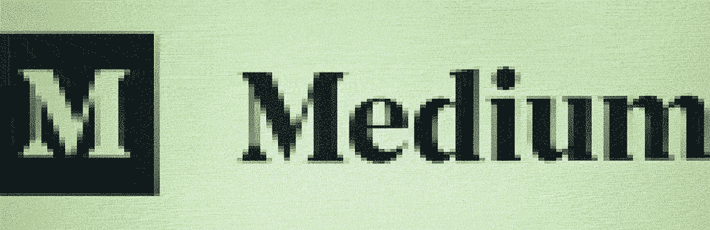
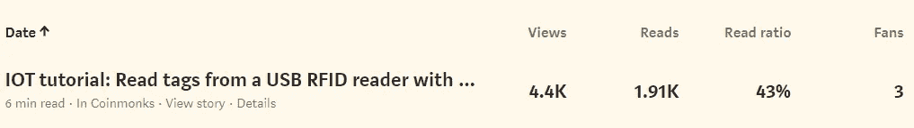

# 作为一个凡人用媒介赚钱(第 1/4 部分):品尝它

> 原文：<https://medium.com/coinmonks/making-money-on-medium-as-an-ordinary-mortal-part-1-4-getting-a-taste-for-it-5931df581a5a?source=collection_archive---------1----------------------->

A **你是一个读者数量停滞不前的中型故事的作者，但你真的想增加你的读者数量吗？我的第一个故事也有同样的问题:月浏览量在开始时有所增长，但很快就在每月 950 左右波动。**

此时，我开始对如何增加这个数字感兴趣。可能像其他作家一样，我想尽可能地传播我的作品，让更多的读者看到。在这个系列的第一部分，我将描述六个月后我的第一个媒体故事的读者数量和盈利情况。

> *我想补充一个免责声明:我知道这里的总数与其他人相比是微不足道的(特别是与所有通过互联网变得富有的人相比)，但我仍然喜欢在这个话题上进行实验和学习。综上所述，我认为你可以说这是“正常”媒体作者的一个用例，展示如果你不是为了赚钱而写的，你可以从你的故事中得到什么。*

在我解释我将采取的步骤以增加我的系列第二部分的读者之前，我现在想给你一些我正在谈论的媒体故事的背景。

# 我在媒体上的第一个故事

作为一个《媒介》的热心读者，当我在做兼职项目时，我总是想着自己写一篇故事。当我摆弄我的树莓派和 USB RFID 阅读器时，我发现很难运行这个简单的设置。

Screenshot of my first story on Medium

在尝试了我在留言板上发现的多种方法后，我有点沮丧，我很快就在 Node-RED 上成功了。我确信**分享我的方法也会对其他人有所帮助**，因为在 stackoverflow 和其他平台上已经有了很多讨论。有人可能会说**我找到了一个小小的利基**。

因为我已经运行了这个实现，所以在我发表了我的第一个媒体故事后不久，写这篇文章就变得很容易了！

# 通过媒体和联盟营销赚钱

写这篇文章，我的意图不是从中赚钱，但无论如何，我有一个亚马逊账户。于是我决定**第一次尝试加盟** **营销**。

在教程中，我描述了一个由 Raspberry Pi 和 USB RFID 阅读器组成的设置。他们将是一个好的开始，包括有意义的链接，不会感觉不自然。

当然,**可能有更好的附属链接产品，这就是为什么:大部分读者很可能已经拥有一个树莓派，那里的 USB RFID 阅读器非常便宜。但不管怎样，对于第一次实验，我完全没意见，因为我只是想尝试一下。**

给你的故事添加附属链接也很简单。你首先要加入亚马逊 PartnerNet，然后在平台上搜索合适的产品。如果您已经找到了一些，您可以使用工具栏直接创建代销商链接，一旦您加入 PartnerNet，工具栏就会显示出来。

*如果你还没有听说过联盟营销，或者想阅读一些定性的深入书籍，我可以推荐以下两本:*

*   [亚马逊联盟:用亚马逊联盟计划赚钱](https://amzn.to/2W21JHf)(联盟链接)*由 Armann Kholie 为您提供联盟营销的实用知识。*

# 6 个月后查看统计数据

这篇文章发表后不久，我停下来查看统计数据，基本上就把它忘了，因为这只是一个小实验。

但有一天，我收到了一封来自亚马逊 PartnerNet 的电子邮件，告诉我有一些销售。这又把我的注意力拉回到这个故事上，因为我既没想到会有很多读者，也没想到会有什么销量。

## 媒体上的读者和谷歌上的排名

但当我再次查看统计数据时，我惊喜地发现:在前六个月，我的故事获得了 4400 次点击，阅读率约为 43%，大约有 2000 人阅读我的故事直到结束。

这对我来说已经是一个很好的结果了，因为我知道我很可能帮助了很多人的副业项目。

The stats on my story after having it published six months ago

通过查看更多的统计细节，我很惊讶地发现了以下情况:只有 3%的读者在媒体上找到了我，**，而大多数读者实际上来自谷歌**。

因此，我输入关键词“raspberry pi rfid 阅读器 usb ”,发现我的故事在谷歌上排名第一。

> 哇，太棒了！

Most of my readers are coming from Google where my content ranks on 1 for the relevant keywords

我想这是一个很好的证明，说明 **Medium 非常适合通过关联公司**赚钱，因为我只需要创建相关内容，并不关心搜索引擎优化。

我甚至没有把文章贴在观众通常会看到的地方。在那次经历之后，我很好奇的想知道它是如何与联盟链接的。

## 代销商点击和销售

在 Medium 和 Google 上取得好成绩后，来自亚马逊的收入相当少(6 个月 9.63€)。

尽管如此，我的度量标准还是有一些令人鼓舞的地方。自从这个故事发布以来，我订购了 19 种产品，点击了 424 次附属链接，相当于点击的**转换率为 4.48%**。

由于我对联盟营销没有太多的经验，我在网上做了一个快速调查，发现这个**转化率实际上相当不错**。另一方面，我认为 2018 年 9 月订购产品的高数量是一个异常值，我必须预计正常月份的销售额会下降。

此外，我们必须记住，如果我们把我的故事的总点击量考虑在内，我的整体转化率更像是 0.005%。

*你如何计算一个故事的转化率？我对你的意见很感兴趣，所以请随意评论。*

## 接下来的步骤

看完所有这些数字后，我尝到了甜头，我想知道是否可以通过围绕我的故事做一些改进来提高这些数字。

*my 的下一步是分析我发布的故事，寻找扩大受众和盈利的机会。*

我将在本系列的第二部分中讨论这个问题。在那里，我将描述我最终定义的 7 个步骤，以获得更多的读者并提高转化率。

> [直接在您的收件箱中获得最佳软件交易](https://coincodecap.com/?utm_source=coinmonks)

