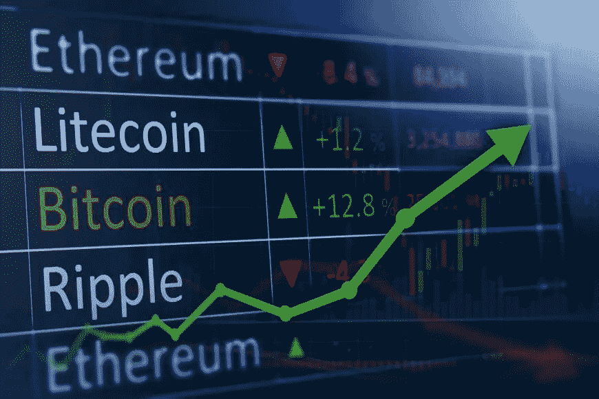
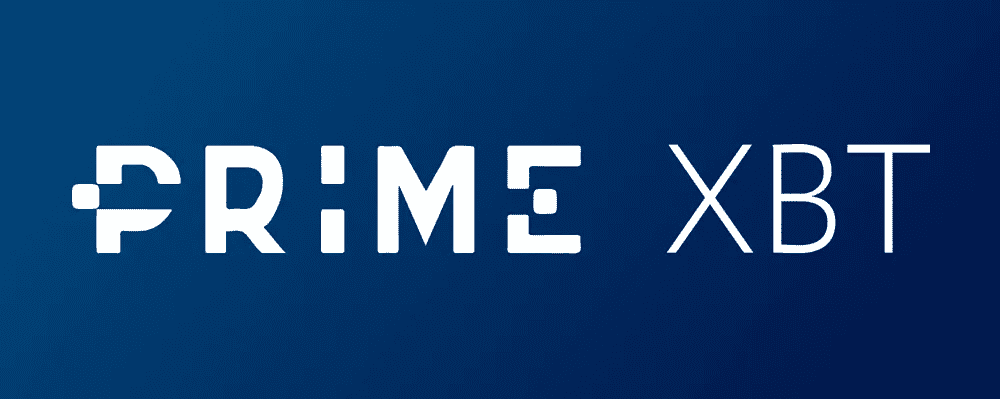

# 2020 年用加密赚钱:权威指南

> 原文：<https://medium.com/coinmonks/making-money-with-crypto-in-2020-the-definitive-guide-revised-987041c54a54?source=collection_archive---------0----------------------->

自十年前比特币推出以来，对加入加密货币交易市场的人来说，最大的吸引力一直是交易者能够获得的惊人利润。

尽管 2020 年的今天与加密货币早期相比有很大不同，但如果说有什么不同的话，那就是现在有更广泛的创收方式，该行业本身也比以前大得多。

随着加密货币行业规模和参与者数量的增加，浏览当今可用的各种赚钱选项会变得更加困难。

考虑到这一点，本指南将涵盖如何在 2020 年用加密赚钱，首先看看加密货币实际上是什么，然后再看看用加密货币赚钱的具体方式，如[交易](https://primexbt.com/)、投资、[加密货币开采](https://blog.coincodecap.com/tag/crypto-mining/)、加密龙头和奖金以及加密货币社交交易。

# 什么是加密？

## 加密货币从何而来？

[加密货币](https://coinmarketcap.com)诞生于 2008 年，当时一个名为中本聪的匿名组织或个人发布了一篇名为[比特币](https://blog.coincodecap.com/a-candid-explanation-of-bitcoin/)白皮书的研究论文，概述了被称为“加密货币”的新技术的运作方式。

除了概述一种新的数字货币类别的广泛概念，该论文还概述了中本聪将发布的名为[比特币](https://blog.coincodecap.com/a-candid-explanation-of-bitcoin/)的加密货币的具体细节，并解释了一种被称为“区块链”的新技术，该技术将用于支持这种新型[数字货币](https://blog.coincodecap.com)。

比特币白皮书发布几个月后，中本聪于 2009 年初通过开采第一个区块启动了比特币区块链，并由此开始了[比特币](https://blog.coincodecap.com/a-candid-explanation-of-bitcoin/)声名狼藉而又耐人寻味的一生。

尽管比特币的曝光率、用户数量和价值一开始都比现在小得多，但随着时间的推移，比特币的规模逐渐增长，随着价格的上涨和早期采用者开始赚取巨额利润，这吸引了更多的交易者。

一旦交易数量增长到需要普通交易的水平，加密企业家就设计并建造场所，让世界各地的加密货币交易者首次聚集在一起，目的是从比特币交易中获利。

## 加密货币是如何工作的？

如上所述，比特币和大多数其他加密货币运行在一种称为区块链的技术上，这是中本聪在发布比特币白皮书时最重要的发明。

[区块链](https://blog.coincodecap.com/what-is-blockchain-a-simple-guide-for-dummies/)本质上是一个全数字的账本系统，它允许不相连的人群和组织同时维护所有用户拥有的所有价值的单一记录，并以不需要中央权威机构来决定网络治理的方式来实现这一点。

例如，比特币运行在基于数学和算法的软件上，可以在没有任何人类干预的情况下选择何时创造新的加密货币以及创造多少新的加密货币，而不是由中央银行决定何时创造新货币以及应该向谁支付新货币。

正因为如此，加密货币就其本质而言是去中心化的，这也是多年来为它们提供如此大的弹性的原因，而其他数字货币此前并未幸免。

这意味着，即使监管机构和政府机构想要关闭比特币和其他加密货币，他们也无法做到，因为事实上，例如，关闭比特币就相当于必须在世界各地同时找到并查封数千台电脑。

# 用加密赚钱:投资

## 什么是加密货币投资？

加密货币投资是在相对较长的时间内购买和出售加密货币的过程，目的是从这些交易中获利。

自从创造了[比特币](https://bitcoin.org)以来，加密货币投资一直是过去十年中最赚钱的金融活动。

早期比特币投资者购买比特币并持有 10 年，与购买任何其他资产类别并持有 10 年相比，利润差异惊人。

如今，比特币投资一如既往地非常受欢迎，并且是所有金融交易中最令人兴奋的领域之一，主流金融行业正逐渐融入加密市场。

## 什么是最好的加密投资策略？

对于那些想要投资加密货币市场的人来说，有各种各样的策略可供选择，其中一些投资策略需要大量的技术知识、经验和技能，而一些策略对于任何人来说都很容易实施。

或许最直接、最简单的加密货币投资策略(讽刺的是，也是最受欢迎的策略之一)是长期持有或“hodling”。

这种策略执行起来很简单，因为所需要的只是购买一定数量的加密货币，并长期持有，通常会持续数年。

由于比特币的内在机制不断限制长期供应，这导致比特币(以及其他加密货币)的价格在过去 10 年中持续呈指数增长。

正因为如此，长期持有一直是如此有利可图和可靠的策略，今天有这么多加密货币投资者基本上只是购买和长期持有。

另一个非常受欢迎的加密货币投资策略是基于基本面分析进行投资，因为投资是基于不依赖于加密货币图表中价格和交易量运动的决策。

基本面分析需要考虑的重要因素包括加密货币市场在任何给定时间点的整体实力、全球市场在任何给定时间点的实力、加密货币交易商的总体情绪以及加密货币的任何潜在大规模外部威胁或机遇。

# 用密码赚钱:交易

## 加密交易和投资有什么不同？

加密货币交易是另一种极其常见的活动，与加密货币投资一样，这种活动的目的是通过买卖加密货币来获利。

当我们考虑每笔交易的平均持续时间以及交易发生的频率时，这种活动不同于加密货币投资。

加密货币投资是关于交易少量的长期交易，而加密货币交易是一种涉及在相对较短的时间内创造频繁交易的活动。

例如，加密货币投资者可能会购买比特币并持有两年，然后出售获利，加密货币交易者可能会使用算法机器人，以便每天创建数千笔交易，每笔交易持续数毫秒。

## 2020 年最佳加密交易平台？

## PrimeXBT

[PrimeXBT](https://primexbt.com//platform) 是 2020 年全球最大的多资产保证金交易平台，当你考虑到该平台仅在 2 年前推出，今天每天管理着高达 20 亿美元的全球金融贸易时，这是一个相当不可思议的事实。

PrimeXBT 是加密货币行业和传统资产市场保证金交易的领导者，所有加密资产的利润率高达 100 倍，传统资产(包括股票指数、外汇对、商品和金属)的杠杆高达 1000 倍。

PrimeXBT 是一个安全可靠的交易平台，拥有合适的工具，能够开发简单而强大的策略，在市场中获利。

PrimeXBT 提供[银行级安全](https://primexbt.com/security)以保护其客户的资金，迄今为止从未被黑客攻击或破坏。

除此之外，PrimeXBT 运行在一个强大的交易引擎上，每秒可以执行多达 12，000 笔交易，每笔交易的平均时间为 7.2 毫秒。

除了具有高安全性和强大的工具，PrimeXBT 还提供业内任何主要交易平台中最低的费用，对所有资产、所有资产类别和所有交易规模适用 0.05% 的[统一费率。](https://primexbt.com/fees)

## 币安

[币安](https://binance.com)是另一个交易平台，它在相对较短的时间内成长起来，在密码交易行业占据了相当大的市场份额。

这在很大程度上是因为精明的营销和币安本地加密货币 BNB 币的使用，以便在加密货币行业内部和外部建立曝光率。

币安有一个制作精良的平台，易于使用，即使在交易压力很大的情况下也能很好地运行。

该平台拥有大量的加密资产可供交易，但币安忽略了提供一个法定培训选项，交易者需要将加密货币转移到该平台，然后才能在那里交易。

这一直是一些交易者望而却步的事情，除此之外，另一个相当令人望而却步的因素是币安的费用比其他交易平台高出 10 倍。

然而，总的来说，币安是不介意支付更多费用的交易者的一个好选择，他们也希望专注于加密交易。

# 用加密赚钱:采矿

## 什么是加密挖掘？

加密货币挖掘是下载由加密货币提供的特定软件的过程，以允许计算机尝试解决复杂的加密问题，并在这样做时获得免费的加密货币。

加密货币挖掘是所有工作证明加密货币如何发挥作用的关键要素，minor 是任何加密货币的稳定力量，加密货币的稳定性与保护网络安全的 minor 数量之间有很强的相关性。

在比特币的早期，加密货币矿工甚至只需要一台基本的笔记本电脑就可以轻松赚取比特币，因为竞争很低，挖掘比特币的难度率也很低。

随着时间的推移和其他未成年人进入该领域，增加的哈希速率导致比特币网络中更高的难度，这反过来意味着 CPU 不能再用于挖掘比特币，GPU 也不能再使用，今天我们正处于挖掘比特币的唯一方式是使用一种称为 ASIC 的特殊类型的 GPU。

如今，挖掘比特币获利是不可能的，除非矿工是一个被称为采矿池的大型集团的一部分，或者经营一个被称为采矿农场的大型采矿计算机仓库。

## 2020 年，如何利用加密采矿赚钱？

虽然今天开采比特币根本不太可能产生利润，或者即使产生利润也只会是相对较小的金额，但在 2020 年，还有许多其他加密货币可以盈利。

最受采矿者欢迎的加密货币是以太坊和 Monero，这两种加密货币都为新采矿者提供了大量的文档，以学习如何开始工作。

以太坊早已成为仅次于比特币的全球第二大加密货币，也是基于工作证明挖掘来运作的。

然而，与比特币不同的是，以太坊打算在不久的将来过渡到一种不同风格的共识机制，称为股权证明，这种共识机制不需要使用计算设备，而是使用一个人拥有的资产数量。

Monero 是另一种非常受欢迎的加密货币，也是一段时间以来最赚钱的加密货币之一，因为与难度相比，奖励与其他可开采的加密资产相比是最佳的

为了参与加密货币采矿，需要的是采矿设备，包括配备大量 GPU 的计算机，支付采矿导致的更高电费的能力，以及如何设置采矿所需的硬件和软件的技术知识。

# 用密码赚钱:社会交易

## 什么是社交交易？

社交培训在加密货币行业中是一个相对较新的事物，但是它已经在传统交易中使用了很多年。

社会交易的基本思想是，交易者不是相互竞争，而是为了分享信息、策略、资源和其他东西而一起工作，共同增加他们的利润。

社交交易有许多不同的风格，本质上是为了一起分享价值和信息而使用的不同结构。

最常见的社交交易形式之一是复制交易，这是一些用户获得其他用户的策略并复制交易的能力，并向创建策略的交易者支付费用。

社会交易思想的其他改编包括创建基金或其他组织，以便投资者能够投资，由一个或多个交易员管理基金，决定基金资源将被分配到哪里。

## 哪里是社会贸易加密的最佳地点？

如上所述，加密货币行业内的社交交易是一个相对较新的现象，但是在很短的时间内已经有一些项目快速进入该领域，并且已经做得很好。

PrimeXBT 最近在其平台内推出了一个新模块，该模块以社交培训为中心，更具体地说，它允许交易员创建点对点投资基金，并与平台的其他用户一起集体获利。

PrimeXBT 平台的这一新功能是与加密货币社交交易的领导者之一 Covesting 合作开发的，该模块主要基于 Covesting 的先进社交交易技术，并应用于自己的平台。

这种社交交易的好处在于，拥有大量经验和知识的交易者，更重要的是，拥有创建盈利交易的良好记录的交易者，可以创建一个投资基金，并允许可能没有知识的新交易者能够可靠地创建盈利交易，以分享基金的成功。

社交交易在加密货币行业中已经越来越受欢迎，随着越来越多的新手交易者在未来几年涌入市场，我们预计这一趋势将持续到未来。

# 用加密赚钱:水龙头和奖金

## 什么是水龙头，如何从中赚钱

比特币水龙头是一个平台，为用户提供免费的加密货币，以换取完成网站上列出的小任务。

自从比特币出现以来，比特币水龙头就一直存在，多年来逐渐变得越来越先进，然而比特币水龙头受欢迎背后的相同概念在今天仍然适用。

比特币水龙头的吸引力在于，任何人都可以使用它们，而不需要任何技术技能或特殊知识，尽管完成任务的回报相对较小，但通过在这些任务上投入足够多的时间，可以产生可观的收入。

为了开始从比特币水龙头赚钱，这很容易，只要在谷歌上搜索“比特币水龙头”，然后选择一个注册后可以完成任务并获得比特币支付的水龙头。

## 什么是奖金，如何从中赚钱

对于加密货币用户来说，奖金是另一种流行的创收方式，无需具备任何特殊技能或知识。

加密奖金的原理本质上与比特币水龙头相同，因为平台会创建一个任务列表，完成这些任务可以换取一定数量的加密货币。

这些任务可能包括不同类型的基于社交媒体的活动，如分享和关注，基于设计的活动，如为项目设计徽标或图形，以及帮助传播加密货币曝光的活动。

像比特币水龙头一样，加密奖金不太可能让你一夜暴富，然而，如果有足够的奉献精神和足够的时间来完成手头的任务，用户可以产生大量的收入。

# 总之:2020 年用密码赚钱

在过去几年中，加密货币市场呈爆炸式增长，大量新交易者和新交易资产涌入，导致 2020 年的市值和交易量远高于两年前。

因此，2020 年在加密货币行业赚钱比以往任何时候都要容易得多，交易者有更多的选择，而且进入加密货币行业赚钱的门槛通常更低。

虽然现在的网上交易平台比以往多得多，但可供选择的平台数量的增加经常会让新手感到困惑，因为他们无法准确地比较和评估如此广泛的不同培训平台。

我们建议任何正在寻找高质量和可靠的交易平台的人对上面列出的平台进行深入调查，并将它们与行业中不具备同类[特性和功能](https://primexbt.com/platform)的其他平台进行比较。

> [在您的收件箱中直接获得最佳软件交易](https://coincodecap.com/?utm_source=coinmonks)

