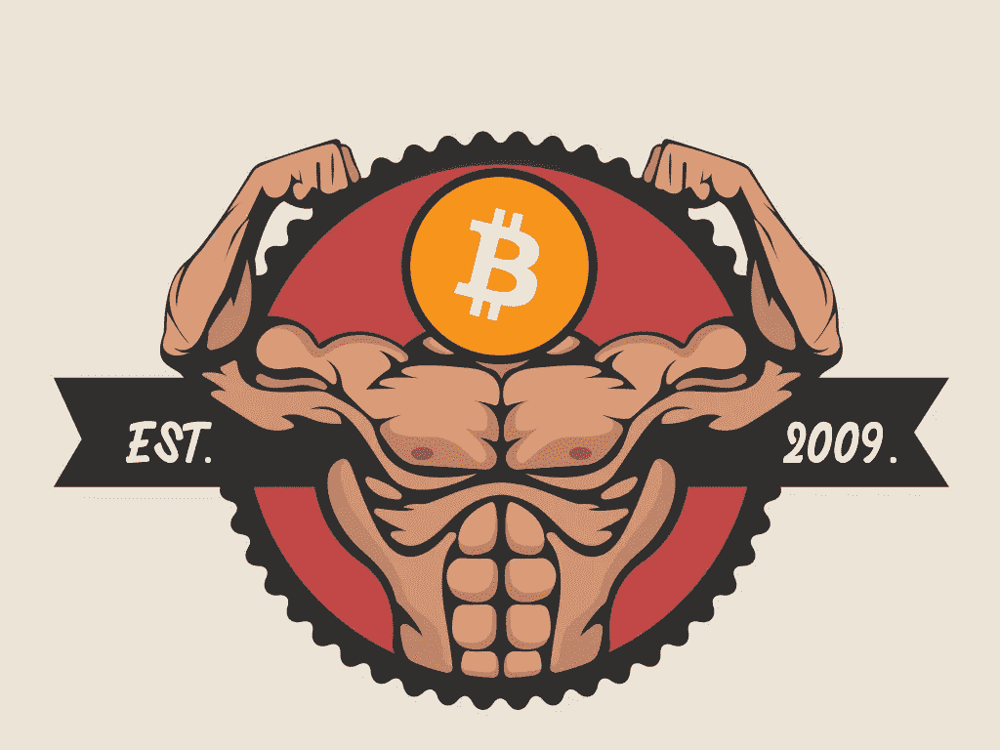

# 在加密货币市场获利:一些基本实践

> 原文：<https://medium.com/coinmonks/making-profits-in-the-cryptocurrency-market-a-few-fundamental-practices-e43c61a5a3f1?source=collection_archive---------1----------------------->

*TL；DR:以下是一个新的加密货币交易者可以遵循的一些做法，以尽量减少损失，并希望获得利润。*

*   *在一段时间内进行小额投资，以避免 FOMO 和价格调整*
*   *市场相对稳定时投资*
*   *永远不要投资超过你能承受的损失*
*   *对项目和代币进行尽职调查*

随着市场获得合法性，监管到位，加密货币交易变得越来越容易。然而，没有经验的交易者很难获利，而经验丰富的交易者似乎对市场运作有基本的了解。因此，虽然一些交易者获得了巨大的投资回报，但其他人却被他们的尝试远远甩在了身后。

我们将了解一些新的加密货币交易者可以遵循的基本做法，以最大限度地减少损失，并有望获得利润。

## 随着时间的推移少量投资，以避免 FOMO 和价格修正

加密货币市场，或者说任何形式的交易，都没有情感的空间。潜在的牛市或突然的抛售会让没有经验的交易者不安。观察价格上涨或下跌会引起这些投资者的情绪反应，他们认为自己错过了巨大的回报或避免了泡沫破裂。

害怕错过(FOMO)导致加密货币的需求和价格人为增加，随后，交易者必须面对突然牛市后不可避免的价格调整。

Sygnia Asset Management 的联合创始人兼首席执行官玛格达·维尔兹卡(Magda Wierzycka)最近表示，投资比特币是“她投资衣橱中最大的骷髅” Wierzycka 在 2017 年末开始的牛市期间进行了投资，以 18000 美元的价格购买了比特币。比特币的价格在接下来的几周内下跌，市值损失了 80%。在 FOMO 的推动下，维尔兹卡对加密货币的投资表明了一个错误的决定。

## 当市场相对稳定时投资

知道何时进入市场是至关重要的。大多数投资者在价格已经很高或者一直处于上升趋势时进入市场。这也发生在相反的情况下——当价格似乎在下跌时，投资者恐慌抛售。规划是长期获利的关键，这是专业交易员和对冲基金经理已经掌握的一个过程。

这样的计划减少了被情绪左右和坚持手头现有数据的机会。它有助于对抗由短期预测和市场投机产生的冲动。加密对冲基金公司 Morgan Creek Digital 的联合创始人 Anthony Pompliano 在一次采访中强调了这一点，

> “我们有一个价格目标，我们认为长期前景是什么时候，我出来说，到 2021 年 12 月，价格是 10 万美元。”

## 永远不要投资超过你能承受的损失

与任何形式的投资一样，投资者必须估计他们能够承担多大的风险，也就是说，他们的投资决不能超过他们的损失。加密货币市场相对不稳定，价格波动非常快。

曾经有过许多这样的例子，个人通过贷款进入市场，用抵押和贷款来购买，却因为这种由情绪驱动的非理性投资方法而失去了市场。投资的黄金法则在这里适用，它说不要投资一个人不能承受损失的钱。

## 对项目和令牌进行尽职调查

虽然时代已经改变，市场已经得到改善，但加密货币市场仍然偶尔受到实际上是骗局的项目的困扰。传统市场受益于多年的监管和立法，但加密市场是新的，立法者仍在审议监管。这使得在投资市场之前进行尽职调查变得非常重要。

相对常见，是指作案者人为抬高代币价格，导致需求上升。这引发了连锁反应，波及到其他投资者，他们开始投资，看到价格上涨。然后，犯罪者出售他们的代币份额，以其他投资者为代价获取巨额利润。Discord 和 Telegram 等社交媒体平台和沟通渠道被用来吸引不知情的投资者。一旦组织者有足够多的人投入到这个计划中，他们最快只需 18 秒就能[执行他们的计划。](https://www.finder.com.au/gone-in-18-seconds-new-study-gives-window-into-crypto-pump-and-dump-schemes)

## 结论

加密货币变得更加容易获得这一事实是一个极其积极的步骤，但重要的是要记住，这个市场是新的，仍在寻找立足点。波动性与股票交易具有相同的风险，因此，人们应该负责任地投资加密货币，就像在其他任何地方一样。只要理性指导投资实践，它就能带来高额利润，甚至可能是提前退休的关键。

> [在您的收件箱中直接获得最佳软件交易](https://coincodecap.com/?utm_source=coinmonks)

