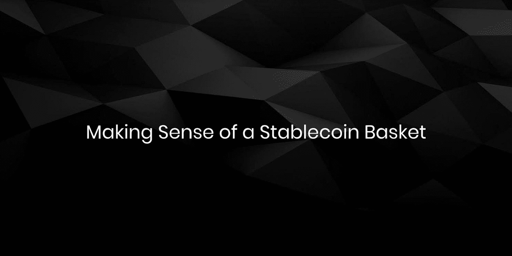
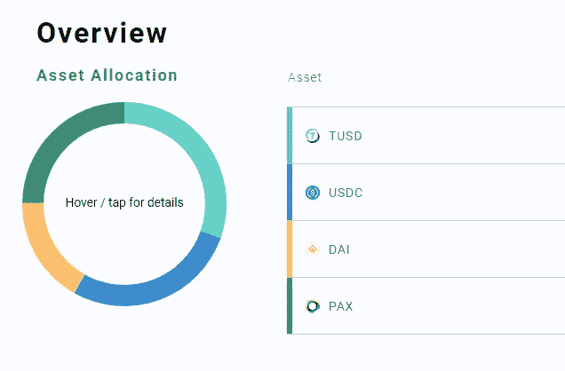
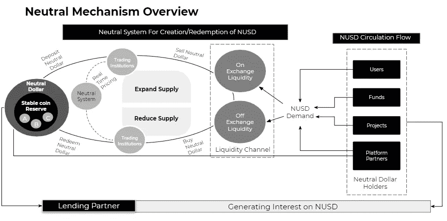

# 理解一个稳定的硬币篮子

> 原文：<https://medium.com/coinmonks/making-sense-of-a-stablecoin-basket-58116fc1d45f?source=collection_archive---------2----------------------->

**稳定的状态出现**

[Stablecoins](/coinmonks/an-introduction-to-stablecoins-6a2a6c67d447) 正在成为区块链技术的一个定义性应用，去年动荡的市场环境下菲亚特标志化的增长就是明证。稳定硬币项目数量的增加以及对这些令牌日益增长的兴趣表明了更广泛的加密空间中的认知转变，从笨拙的波动性转向有形用例的新地平线，这表明了对令牌化真实资产的真实兴趣。

尽管稳定的硬币有潜力，但随着它们的扩散，它们的问题变得越来越明显，我们认为这是“ ***稳定的硬币疲劳*** ”。许多 stablecoin 试图向最终用户提供相同的[价值主张](https://hackernoon.com/the-need-for-many-stablecoins-and-a-metastable-basket-e38adff6c8f4)，使得彼此之间难以区分，这反过来淡化了 stablecoin 是什么的信息、对 stable coin 商业模式如何运作的一般理解，以及什么样的 stable coin 可以满足用户的不同需求之间的区别。第二——与名字相反，大多数[稳定的图标并不稳定](/@neutralproject/visualizing-metastability-c0b7da9ade4b)。它们也不能像广告中所说的那样保证流动性，这意味着投资者可能在某种程度上无法获得令牌化资产。当人们开始使用不同的稳定货币时，稳定货币的流动性变得支离破碎，甚至在试图相互交易时变得完全不同。

稳定的硬币套利被宣传为促进流动性，但操作和现实世界的约束限制了机会更加有效。流动性由市场参与者决定，主导活动需要由行动者可观察和可访问的过程驱动。缺乏流动性会导致定价陈旧或价格不稳定——这两者都会严重削弱稳定货币的效用。这一概念的重要性是至关重要的——但不幸的是，许多人对市场如何运作有着令人费解的看法，这可能导致市场参与者的非理性理解和不良行为。许多 stablecoins 所宣传的信息表明，它们始终保持美元平价，用户不应该担心任何问题，这些问题只是一种幌子，旨在影响用户对他们所了解的内容感到满意，而实际上，用户应该[了解 stablecoin 发行者的商业模式和风险](https://hackernoon.com/a-case-study-on-husd-752b16a2d1f8)。

然而，这些缺点可以通过 [Neutral 的巧妙机制设计](/coinmonks/intro-to-neutral-dollar-98f95d1ff9f4)来缓解，这种机制设计可以促进流动性和成分稳定的集体价格发现。这可以通过构建中性美元来实现，中性美元是一个亚稳定的篮子，可以分散的方式聚集稳定的货币。一个互补的、统一的解决方案，帮助用户克服这种“稳定币疲劳”，同时展示存在的每一个稳定币用例。

[https://dapp.neutralproject.com](https://dapp.neutralproject.com/)

**分散聚集**

金融市场中的聚合概念并不是一个新的想法。这种想法是在传统资产中形成的，就成熟程度而言，传统资产取得了巨大的成功(由于可获得性而导致更大的流入，从而导致更紧密的利差和更高的效率)。资产支持证券(asset-backed securities)或交易所交易基金(ETF)等集合产品重新定义了这类市场，通过产品本身或衍生品等促进了市场活动。此类工具通过构建复杂的流程来重新包装风险和提高流动性，为最终消费者提供了简单性，这对零售用户和机构都很有吸引力。

分散化也不是一个新概念——随着区块链技术改变市场参与者参与决策的方式，我们可以开始看到更好的好处。传统市场中的许多聚合产品都受到某些法规的约束，以提高透明度和质量，但将权力下放纳入此类产品的创造可以带来非常有益的特性。这些资产的构建和分解可以在连续的时间内发生，并且远离集中管理，这有助于提高可见性。如果设计得当，去中心化还可以提高流动性，让更多用户参与到更全球化的生态系统中。分散化和聚合的结合显示了在改变人们如何一起工作和实现更好的方法来获得对加密资产的暴露方面的创新。

stablecoins 在这种分散聚合思想的背景下意味着让用户理解他们交互的资产的细微差别，并使用适合他们目的的东西。许多 stablecoins 都有不透明的商业模式，或者为了发行人的利益而有意隐藏的限制。分散的聚合器允许对基础稳定点的差异采取行动，同时创建亚稳定的低风险敞口，可以完全由市场定义，而不是类似于低效的令牌化桥梁。

**中性美元的令人信服的使用案例**

Neutral Dollar 是一个分散的 stablecoin 聚合器，它为密码行业的大量 stable coin 使用问题提供了一个总体解决方案。

*   *分散的流动性:*中性美元通过允许其组成硬币之间以无缝方式进行链上互换，在稳定的硬币市场上聚集流动性，由市场定价决定。
*   *缺乏透明度:*中性美元可以充当票据交换所，抵押品在链上是可见的。这意味着任何人都可以解读基础资产的风险敞口和风险状况，同时实时证明受支持的稳定资产的偿付能力和资产储备。
*   *糟糕的风险管理:*稳定的货币篮子继承了多样化的属性，中性美元的自主再平衡允许更好地管理稳定的货币头寸，同时保护投资者免受风险和损失。

由此推论，中性美元也可以对许多类型的用户有用，因为它的特点是:

*   *机构*:解决流动性失衡，避免任何集中管理的合规复杂性，同时有效管理运营和风险敞口
*   *交易员*:一种更稳定、流动性更强的工具，用于对冲目的，同时可以选择利用基础抵押品
*   *最终消费者* s:由于波动性和流动性较低，成为更好的交易媒介、价值储存手段和记账单位

The ecosystem for a new stablecoin standard

**走向主流采用**

加密货币，特别是稳定货币，是金融市场和全球经济缺陷的直接结果——缺乏跨境支付能力、交易费用高、银行系统不透明、投资者风险、市场时间和兑换限制等。中性美元的存在是为了推动加密发挥其全部潜力，通过解决每一个稳定的硬币用例，以及更多由于其亚稳态篮子属性的结果。让中性美元成为区块链采用率更广泛增长的最前沿的稳定货币是我们希望实现的解决方案。

— — — — — —

如果您有兴趣了解更多关于我们团队和产品的信息，[查看我们的网站](http://www.neutralproject.com/)或通过 [Telegram](https://t.me/neutralproject) 或 [Twitter](http://www.twitter.com/neutral_project) 与我们展开对话。

> [直接在您的收件箱中获得最佳软件交易](https://coincodecap.com/?utm_source=coinmonks)

