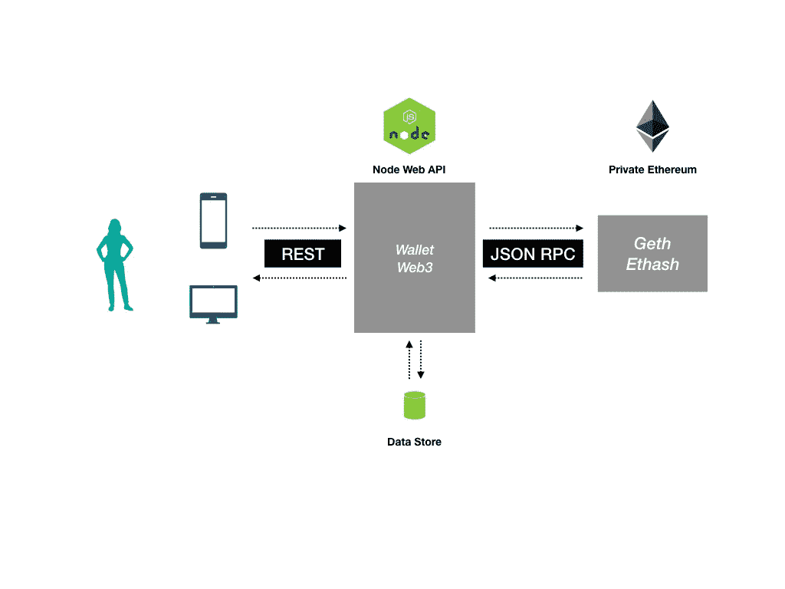
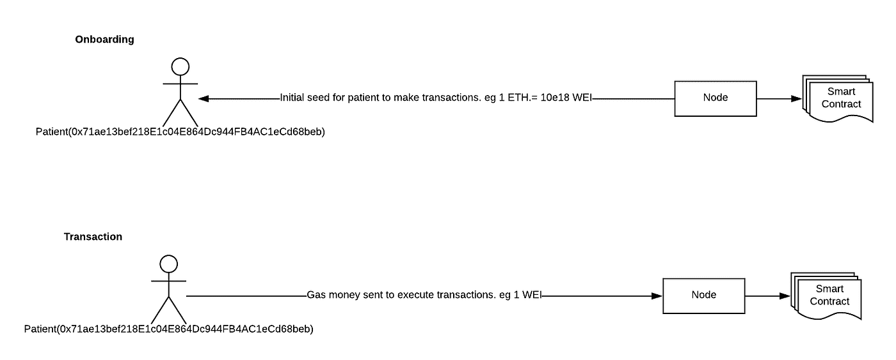
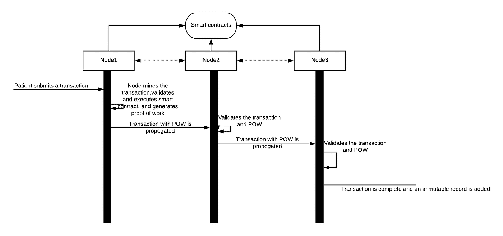

# 理解区块链/DLTs

> 原文：<https://medium.com/coinmonks/making-sense-of-blockchains-dlts-d8889cee7b84?source=collection_archive---------9----------------------->

区块链/分布式账本(Blockchain/Distributed Ledger)是一个记录资产交易的系统，其中交易及其细节记录在多个地方。与传统数据库不同，这些分类账没有中央数据存储。这种系统本质上提供了数据安全性，即只有正确的交易被“写入”分类账，并且分类账在未来的任何“读取”中保持一致。

在过去的几个月里，我们在 [Sahaj](http://www.sahajsoft.com) 一直致力于在区块链平台上为生命科学行业开发一种产品。

**问题的一般介绍:**

存在多个利益相关者，并且存在围绕文档、数字资产的业务工作流，其中各个资产具有映射到特定角色/个人的访问和操作权限。有各种各样的事件需要 100%的验证，即校对。想象一下，一个用户上传一个文档，与某个用户组共享。现在，文档必须以防篡改的方式存储。法规遵从性对于这个领域中构建的任何软件都是至关重要的。

**我们做了什么？**

我们开始构建概念验证，展示如何使用区块链构建防篡改工作流、事件记录等解决方案。我们的 POC 是使用 NodeJS、以太坊、Solidity 和数据存储(Postgres/S3)构建的。我们使用 Ansible 来自动化我们的部署。

**为什么是以太坊？**

社区非常活跃，文档非常有用， [truffle framework](http://truffleframework.com/) 使得开发和测试变得更加容易。我的一个同事， [Srini](/@srinivasanchandramouli) 写了一些关于[开始使用以太坊和 Solidity](/@srinivasanchandramouli/getting-started-with-ethereum-development-4e51b9b01b11) 的很酷的帖子。这将为您介绍 truffle 框架以及如何开始编写自己的智能合约。我们还使用了 Ganache——它提供了一个很好的链浏览器，比如 etherchain.org。

什么是智能合约？

智能合同是一种计算机协议，旨在以数字方式促进、验证或执行合同的协商或履行。智能合约允许在没有第三方的情况下进行可信的交易。这些交易是可追踪和不可逆转的

智能合同的支持者声称，许多种类的合同条款可以部分或完全自动执行，自动实施，或两者兼而有之。智能合同的目的是提供优于传统合同法的安全性，并降低与订约相关的其他交易成本。(感谢[维基百科](https://en.wikipedia.org/wiki/Smart_contract))

以太坊允许写这些驻留在区块链上的智能合约，它们在本质上是不可变的，即。代码一旦部署，就不能在区块链中删除或修改。这个可以用 solidity 或者其他语言来写，但是最首选的是 Solidity。它是一种图灵完全语言。

智能契约由状态和函数组成。函数本质上是改变契约状态的操作。

**交易:**

资产在网络中从一方转移到另一方的过程称为交易。人们可以使用智能合约来记录事件、存储状态等，从而扩展这一概念。所有交易都被记录并永久保存在分类账上。假设一名医生想要添加一份患者报告，患者确认了报告的正确性——我们在网络中使用智能合同上的两个事务对该工作流进行建模。

```
function storeReport
        (bytes32 patient_id,
         string report_id,
         string report_fingerprint){
  patients[patient_id].status = ReportStatus.SUBMITTED;
  string memory content = strConcat(“Patient ID—“,          patients[patient_id].patient_mnemonic
      ,”report submitted”);
  AuditLog(content, msg.sender, now); //Report Submitted
}function verifyReport(bytes32 patient_id, string report_id, string report_fingerprint) {
  if (sha3(patients[patient_id].status) == sha3(’SUBMITTED’))
    patients[patient_id].status = ReportStatus.VERIFIED;
  string memory content = strConcat(“Patient ID—“, patients[patient_id].patient_mnemonic, 
      ”report verified”);
  AuditLog(content, msg.sender, now); //Report Verified
}
```

综合起来看:

在 POC 中，所有利益相关方都是系统的参与者。Nodejs 应用程序负责创建用户帐户、管理用户密钥以及为这些帐户签署交易。这个应用程序使用 Web3 与区块链通信，web 3 是一个以太坊 JSON-RPC 客户端。区块链的功能类似于存储所有用户交互日志/事件的分布式数据库，创建相关数据的指纹。这种指纹用于验证系统的防篡改性。



对于概念验证，我们建立了一个带有几个节点的私有以太网。以太坊是一种基于货币的区块链，每笔“写”交易都有天然气价格(主要是为了防止公共链上的 DDOS 攻击)。随着适合企业和私人区块链的[企业以太坊联盟](https://entethalliance.org/)的成立，这种情况可能会改变。对于我们的问题，货币的概念没有任何直观意义。

对于记录交易的用户，他或她需要在区块链上有一个用户帐户，并且也有发送交易的货币。为了做到这一点，我们在每个用户的账户中植入一些种子——比如第 1 ~ 10 个卫。为了做到这一点，必须有一个帐户配置一些钱来分配给系统上的用户。最简单的方法是用分配在 genesis 块中的资金创建一个地址。



User onboarding

DLT 和节点:

有两种不同类型的节点

矿工—向系统提议“写入”

完整节点—确保建议的写入一致，并维护分类帐的状态。

下图详细描述了基于工作证明的系统中跨节点的典型事务工作流。



Transaction Flow

我们现在在哪里？

我们能够成功地展示和可视化使用分散的分布式分类帐来获得防篡改和安全性的影响，这主要会影响运营效率和法规遵从性。我们目前正从概念验证转向产品——在不暴露用户身份的情况下加入监管机构(你好，GDPR！)….我们正在探索其他区块链框架、[权威证明](https://github.com/ethereum/EIPs/issues/225)和其他可能在这个问题空间发挥关键作用的方面。从确定节点数量、证明不变性、确保跨 smart contract 部署的数据迁移、可伸缩性等等开始，存在许多挑战:-)。