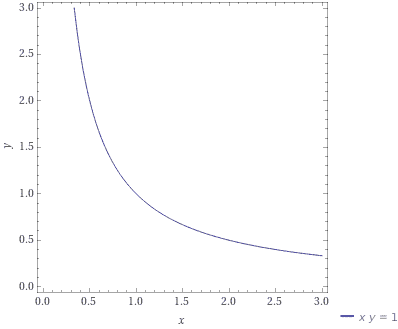
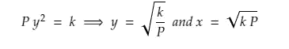
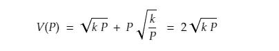
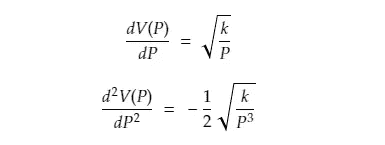
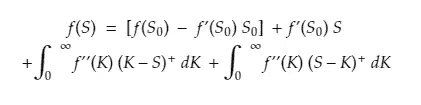
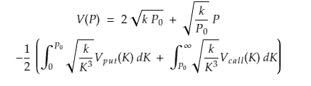
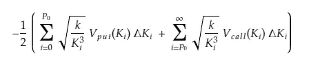
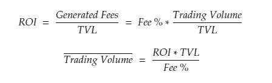
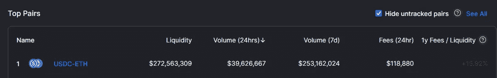

# 理解短暂的损失

> 原文：<https://medium.com/coinmonks/making-sense-of-impermanent-loss-9cd8fa7d2e05?source=collection_archive---------0----------------------->

## 或者说，我的 137% APR 到底在哪里？？

*初级读本* [*这里*](https://www.youtube.com/watch?v=cizLhxSKrAc) *。*

你有没有被朋友或同事在分散交易所(dex)押注加密货币赚取高得离谱的收益的报道取笑过？你决定自己去查看一下，快速回顾一下餐巾纸的计算结果，以确认支付给流动性提供者(LP)的费用除以锁定的总价值(TVL)确实得出 APR 高于 100%。很自然，你往池子里扔一些代币，看看会发生什么。根据你的计算，你的余额应该每分钟增加几美分。你等待，刷新，等待，刷新，你的平衡不动了。你再次刷新，你的余额下降了*。什么* & @#？？*

*我们知道，向 Uniswap 这样的 dex 提供流动性的缺点是非永久性损失(IL)。但是，到目前为止，在有限合伙人头寸上承担的风险比使用合理的经济分析为其定价所做的工作要高几个数量级。我要展示的是(不用挥手)IL 的风险可以用普通期权复制，因此 IL 的公平价格的无模型估计可以在某个有限的时间间隔内确定。然后，我将使用这一结果来计算补偿 IL 风险所需的交易量的盈亏平衡，从而展示如何判断参与流动性池的潜在盈利能力。*

*我将使用的参考框架是像 Uniswap v2 这样的固定产品做市商(CPMM ),因为 v3 提供的区间流动性期权使这一分析变得复杂。我后面会把结果推广到 v3。*

*对于门外汉来说，我将从短暂的损失概述开始。*

*顾名思义，CPMM 流动性池中两种资产 X 和 Y 的数量乘积保持不变，这是由运行它们的算法决定的。这种情况给了我们下面这张著名的图表，它展示了我们交易对中两种资产在任何时候的可能数量。由于我们的 CPMM 池中 Y 的算法价格是通过将池中 X 的数量除以 Y 的数量得出的，当一种资产的市场价格变化时，套利者被激励与池进行交易，从而调整 X 和 Y 的数量，直到 X/Y 与公平的市场价格相匹配。作为资金池的有限合伙人，你拥有资金池资产的按比例索赔权，资金池资产由基于交易者行为的数量不断变化的 X 和 Y 组成。因此，你对资产 X 和 Y 的敞口将随着时间的推移根据价格趋势而变化。*

**

*When k=1, the quantity of X and Y reserves in the pool will sit on this curve.*

*作为一个例子，假设以 X 计价的 Y 的价格为 0(如果你需要一个更直观的例子，假设 Y 是 ETH，X 是 USDC，由于黑客攻击、政府干预等原因，ETH 的价格为 0)。CPMM 协议通过用 X 的数量除以池中 Y 的数量来确定 Y 的价格。因此，套利者会以 X/Y 的价格将无价值的 Y 出售给资产池，直到没有 X 剩下——而资产池的 LP 将持有一袋资产 Y。我们承诺的 137% APY 就这么多了！重要的结果是，有限合伙人的风险敞口完全变成了资产 Y，他们对资产 X 没有索赔权。因此，以 X 计价的损失(在我们的例子中是 USDC)将是他们的两倍，如果有限合伙人只是 HODL 了他们的 X 和 Y 的 50/50 投资组合(在我们的例子中，他们损失了全部 100 美元，而如果是 HODL，他们将损失 50 美元)。*

*在期权交易领域，我们用一个名字来描述随着价格变化而变化的资产数量:gamma。自 20 世纪 70 年代布莱克-斯科尔斯法突破以来，其属性、风险状况和公平市场价格在交易业务中已为人熟知。使用一些(不那么花哨的)数学步法，我们可以计算出我们在 XY 池中 LP 位置的伽马值。*

*我们从 CPMM 的参数开始。为了在不失一般性的情况下大大简化我们的分析，让我们假设资产 X 是 USDC，因此它的价值(价格)总是等于 1:*

**

*Eq 1*

**

*Eq 2*

*接下来，我们把 X 和 Y 的投资组合的价值写成*

**

*在均衡状态下，套利者将与资金池交易，以执行:*

**

*我们可以重新排列等式 2，看到 *x = P y* ，并代入等式 1 得到:*

**

*利用上述内容，我们可以根据 CPMM 算法的参数改写我们投资组合的价值:*

**

*Eq 4*

*最后，我们可以开始对 Y 的市场价格求导(你很快就会明白为什么)。*

**

*Eq 5*

*我们现在有了一个封闭形式的表达式，表示池 XY 中 LP 位置的γ。正如预期的那样，它是负的，用行业术语来说，这意味着 LP 是空头 gamma，相当于空头期权头寸。因为空头期权头寸的价值与基础资产的波动性成反比，等式 5 从数学上解释了为什么 LP 头寸在大的价格变动中亏损。*

*[卡尔和马丹(2001)](https://www.researchgate.net/publication/2352870_Optimal_Positioning_in_Derivative_Securities) 的见解表明，任何连续的、两次可微分的支付 *f* 都可以用下面的公式分解成普通期权:*

****

*Definition of European Call/Put payout at expiry. Note that (S-K)+ is equivalent to max(S-K)*

*在上式中，*f”’*是支付相对于基础资产价格的二阶导数，我们已将其写在等式 5 中。我们现在确实需要做一个简化的假设，即将我们 LP 基金的假设锁定与我们在复制投资组合中使用的期权期限(到期时间)相匹配。换句话说，要对持有 24 小时 LP 头寸的风险进行定价，我们需要使用 24 小时到期的期权作为基准。*

*因此，等式 3 中 LP 头寸的价值可以根据资产 Y 的期权改写如下(不幸的是，我们必须引入大 K，这里是执行价格):*

**

*Eq 6*

*卡尔和马丹表明，在求解了所有 P 点的伽马值(*f″*)后，我们可以在普通期权空间中复制 l P 位置。 *f''* 也被称为“权重”，因为它们描述了在复制投资组合中包含多少行权价为 K 的期权。*

*让我们把数学放在一边，回到直觉上来。回想一下，在资产 Y 崩溃的情况下，这个资金池会剩下一堆毫无价值的 Y 代币。注意，我们的权重与 *sqrt(1/K)成正比。*这意味着当 K 接近 0 时，它的重量趋于无穷大。换句话说，LP 头寸是空头的，有*无限*数量的零成交看跌期权。当 Y 的价格趋向于 0 时，套利者*将*无限量的无价值 Y 放入池中，以吸走所有的 x。我们的数学与我们的直觉相符。*

*这些结果是非同寻常的，因为感谢 ETH/USDC 的流动性期权市场，我们实际上可以在实践中使用它们来赚钱(或省钱)。我最喜欢的加密期权交易所一直是 Deribit。我们可以在这里查看 ETH 期权[的最新价格(一定要点击左上角的以太坊)。](https://www.deribit.com/main#/options?tab=all)*

*为了实际计算参与 uni WAP v2 ETH/USDC 池的公允价值，我们将只关注等式 6 中的最后一项。这是因为第一项(不依赖于 *P* 的那一项)复制了投资组合的初始值( *x+P y* )，第二项(依赖于 *P* 的第一个订单的那一项)复制了资产 Y 的初始敞口(即 Y 的 *y* 单位)。这些术语在 P 中没有凸性，因此并不有趣，因为任何非凸性的支付都可以通过借钱(或资产)和购买(或做空)基础资产单位来复制。*

*为了近似积分，我们将离散化如下:*

**

*简单地说，我们将采用价外(OTM)看跌期权和看涨期权的价格，乘以计算出的权重( *f''* )，将它们相加，然后除以 2(负数只是告诉我们我们正在做空期权，并不具有启发性)。此外，我会将价格 0 分配给比最后一个报价的 OTM 期权稍高的期权。最后，我将使用[陷阱规则](https://en.wikipedia.org/wiki/Trapezoidal_rule)对总和进行数值估计。*

*查看我的[电子表格](https://docs.google.com/spreadsheets/d/e/2PACX-1vQhYykcQhwi3vJsCO0YeHfyoBcy1gQayqJ1pdJBl189rhO1qX8lXsMdvLqyTS3qYr8Fc-ORdt5ec8ih/pubhtml)来查看运行中的计算。在撰写本文时，我使用了列出的最接近 1 周的到期日(结果是离到期日还有 200 个小时)，并选择常量产品参数 *k* 等于 1。还有，我做这个计算的时候乙醚的价格大概是 2305。*

*在这种情况下，复制期权投资组合的估计年回报率为 16.16%。使用 uni WAP v2 ETH/USDC 池中的 TVL，我们现在可以计算需要为有限合伙人产生多少费用，以匹配期权 16.16%的年化回报率。首先回忆一下:*

**

*现在，我们想使用我们计算的 ROI 来计算盈亏平衡交易量:*

**

*Eq 7*

*大约在拍摄选项链的同时，我拍摄了 Uniswap v2 上的池统计信息，如下所示:*

**

*将观察到的池 TVL、我们要求的 16.16%的回报率和 0.3%的 v2 费率代入等式 7，我们可以求解盈亏平衡交易量。我们得到的结果是 147 亿美元，这是一个年率，等于 7 天的盈亏平衡交易量 2.816 亿美元。正如我们在上面看到的，这比过去 7 天的交易量 2.532 亿美元略高，可以有几种解释。*

*一种解释是，市场预计未来 7 天的交易量将高于过去 7 天，在这种情况下，Uniswap 和 Deribit 上观察到的价格可能会持平。更有趣的解释是，Uniswap v2 上的交易者预计未来 7 天的波动性低于 Deribit 上的交易者，在这种情况下，在没有交易成本的情况下，将存在 arb 机会。**无论如何，最重要的一点是，如果你不认为下周交易量会上升，Uniswap v2 的 LP 头寸将具有负的预期值。**这是因为 Deribit 上期权组合的成本是一个“公平”或“有效”的价值，即持有头寸的预期为 0，否则交易商将买入或卖出期权并改变价格。*

*最后要注意的一点是，如果你卖出复制期权组合，你很少会期望保留全部溢价，即 16.16%。要实现这一点，基础资产价格必须与头寸开始时的价格完全相同。否则，一些 OTM 看跌期权或看涨期权将到期，卖方将拥有正值。**类似地，你几乎不应该期望通过预期费用除以 TVL** 来计算餐巾背面的 APR。*

*这里还有大量的研究要做，我的分析只是触及了表面。我对 Uniswap v3 引入的新特性感到非常兴奋，并期待着撰写关于它们的文章。如果你喜欢这篇文章，并且它帮助你赚钱(或防止你亏损)，请分享它并发送提示到 0x 4683 e 61663 D1 df 94340d 09 e 3 ed 92d 7 b 05 af 2 fdb 0。另外，在推特上关注我@ [BasriRoss](https://twitter.com/BasriRoss) 。*

## *也阅读*

* [## 加密税务软件——五大最佳比特币税务计算器[2021]

### 不管你是刚接触加密还是已经在这个领域呆了一段时间，你都需要交税。

medium.com](/coinmonks/best-crypto-tax-tool-for-my-money-72d4b430816b)*