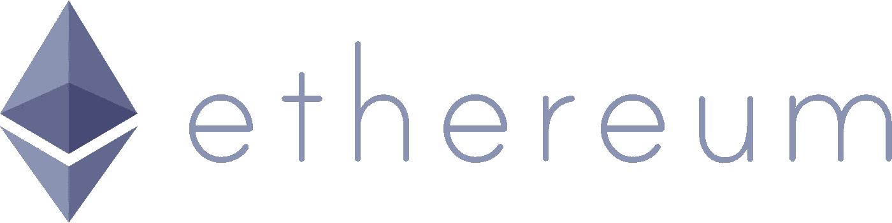
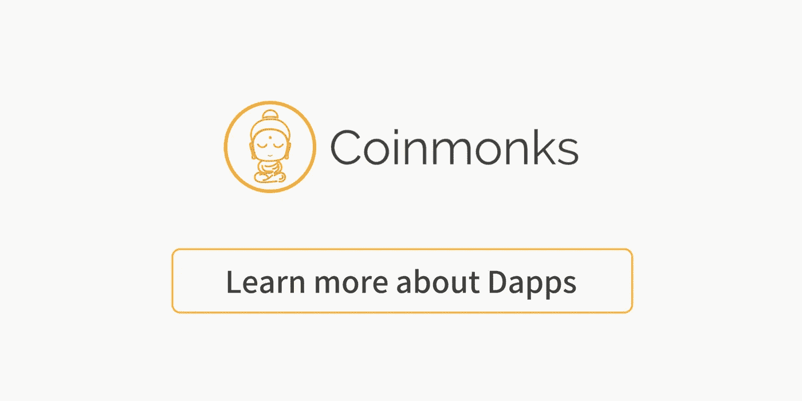

# 基于 Patreon 制作最简单的以太坊 Dapp 第 1 部分。制定明智的合同

> 原文：<https://medium.com/coinmonks/making-the-simplest-ethereum-dapp-based-off-patreon-part-1-making-the-smart-contract-153fb0ebdcfb?source=collection_archive---------6----------------------->



Ethereum Logo

如果你最近一直关注科技新闻，你可能会注意到围绕区块链科技和加密货币的热潮。几乎同样比例的怀疑论者高呼“这是泡沫！”，虽然这种说法是真实的，但这种说法的很大一部分落在了每周数百枚创造的大量替代硬币上，以及比特币等流行硬币的价格波动。

比特币确实是当今最知名的加密货币，但对于我们今天将要建立的智能合约，我们将专注于在以太坊区块链上实现它。原因是比特币的智能合约语言不如以太坊的智能合约语言 Solidity 发达。这部分是因为比特币的编程语言被故意设计成不具有图灵完整性，以防止任何恶意攻击。

在本文中，我们将使用以太坊的智能合约语言 Solidity 制作一个简单的智能合约。我们将基于一个叫做 Patreon 的众筹网站。用户将能够创建新的活动，访问者将能够为用户的事业做出贡献。

如果有兴趣或者想在继续之前温习一下 Solidity，这里有我们将使用的 Solidity 版本的 Solidity 文档，0.4.17。

 [## 坚固性-坚固性 0.4.17 文件

### Solidity 是一种面向契约的高级语言，用于实现智能契约。它受到了 C++，Python…

solidity.readthedocs.io](http://solidity.readthedocs.io/en/v0.4.17/) 

另一个需要熟悉的重要工具是 Remix，这是一个用于 Solidity 的在线编译器。使用该工具，您可以创建、编译、调试您的智能合约，并将其部署到以太坊区块链以及您的本地机器上。访问该页面时，您会注意到文本编辑器已经构建了智能合同。请随意浏览并理解它！

当您准备好继续时，删除编辑器上的代码，因为我们将开始一个全新的定制合同。

删除后，将此内容写入您的编辑器:

```
pragma solidity ^0.4.17; 
```

上面的代码行简单地说明了我们将在这个合同中使用的 solidity 的版本。在这种情况下，我们将使用版本 0.4.17。

按照这一行，我们将写:

```
pragma solidity ^0.4.17;contract PatreonFactory {}
```

这行代码将构成我们的第一个契约，它类似于面向对象语言中的一个类。该契约将包含变量等持久数据，以及可以修改这些变量的函数。该契约将被调用来创建其他契约实例，在这种情况下，这些实例将生成单独的 Patreon 页面。这个契约所做的就是创建单独的 Patreon 页面，并检索它创建的所有 Patreon 页面。

然后，我们将编写一个名为 createPatreon 的函数，它将放在我们的契约中:

```
pragma solidity ^0.4.17;contract PatreonFactory {

    function createPatreon() public {
        new Patreon(msg.sender); }
}
```

请记住，Solidity 是一种静态类型的语言，这意味着需要指定每个变量的类型。例如，在我们的 createPatreon 函数中，我们接受两个参数，但是我们还指定了每个参数的数据类型，在本例中都是字符串。我们的参数后面是单词“public ”,它表示这个函数既可以从契约内部调用，也可以从外部调用。

更多信息请点击这里:[http://solidity . readthedocs . io/en/v 0 . 4 . 21/contracts . html # visibility-and-getters](http://solidity.readthedocs.io/en/v0.4.21/contracts.html#visibility-and-getters)

最后，在这个函数中，我们将调用 new Patreon，它接受参数 msg.sender. Msg.sender 是一个变量，它是与创建特定合同的人相关的钱包 id 的地址。下面的参数是字符串类型，是我们的标题和描述，现在可以通过这些变量名来识别。但是，如果您注意到，msg.sender 没有包含在 createPatreon 函数的原始参数中。这是因为 msg.sender 隐式包含在我们的函数调用中。在 Solidity 中还有一些其他隐式包含的变量。

我们的新 createPatreon 将创建一个名为 Patreon 的契约实例，但是等等…

没错，现在还没有叫 Patreon 的合同！

让我们做一个:

```
pragma solidity ^0.4.17;contract PatreonFactory {

    function createPatreon(string title, string description) public {
        new Patreon(title, description, msg.sender);
         }
}contract Patreon {}
```

现在，我们从技术上创建了一个名为 Patreon 的契约实例。

让我们用一个函数填充这个新契约，并给你的工厂契约添加一些东西:

```
pragma solidity ^0.4.17;contract PatreonFactory {
      address[] public deployedPatreons; function createPatreon(string title, string description) public {
        address newPatreon = new Patreon(string title, string.description, msg.sender);
        deployedPatreons.push(newPatreon); }
}contract Patreon { function Patreon(string title, string description, address creator) public {
        manager = creator;
        patreonTitle = title;
        patreonDescription = description;
    }}
```

这里发生了很多事情。首先，我们在原始契约中初始化了一个名为 deployedPatreons 的公共变量，它的类型是 address 并存储在一个数组中。

然后，我们似乎将新契约的实例化命名为 newPatreon 和 address 数据类型。实际发生的情况是，我们新契约的实例化返回其部署位置的地址。然后，我们将这个地址作为一个变量捕获，然后将它放入名为 deployedPatreons 的公共数组中。

在我们的新契约中，我们有一个 Patreon 构造函数，其名称与我们的契约相同。在参数字段中，我们看到它有我们传入的三个参数字段。在第三个参数中，我们将 msg.sender 地址重命名为 creator。然后，我们将创建者地址指定为 manager，并相应地重命名变量。

接下来我们将初始化一些变量，如下所示:

(这是必要的，应该在从构造函数参数中保存变量之前完成)

```
pragma solidity ^0.4.17;contract PatreonFactory {
      address[] public deployedPatreons;function createPatreon(string title, string description) public {
        address newPatreon = new Patreon(string title, string.description, msg.sender);
        deployedPatreons.push(newPatreon);}
}contract Patreon {address public manager;
    uint public contributors;
    string patreonTitle;
    string patreonDescription;function Patreon(string title, string description, address creator) public {
        manager = creator;
        patreonTitle = title;
        patreonDescription = description;
    }}
```

您将注意到 4 个变量被初始化。在接下来的部分中，我们将引入一个使用该变量的函数。

```
pragma solidity ^0.4.17;contract PatreonFactory {
      address[] public deployedPatreons;function createPatreon(string title, string description) public {
        address newPatreon = new Patreon(string title, string.description, msg.sender);
        deployedPatreons.push(newPatreon);}
}contract Patreon {address public manager;
    uint public contributors;
    string patreonTitle;
    string patreonDescription;function Patreon(string title, string description, address creator) public {
        manager = creator;
        patreonTitle = title;
        patreonDescription = description;
    }function pay() public payable {
        require(msg.value > .01 ether);
        contributors += 1;
    }}
```

我们创建了一个名为 pay 的公共函数，并在 public 后附加了“payable”。这个声明声明这个函数取值为以太。用户可以输入他们想支付的金额。在这种情况下，我们在函数中创建了一个 require 语句，只允许用户输入大于 0.1 的值。之后，我们的 contributors 变量(从 0 开始)将增加 1。这将显示特定 Patreon 活动迄今为止的贡献者人数。

这个最小值的一个原因是以太坊中的每笔交易都要花费“汽油”成本。“气体”是以太的一种测量形式，虽然交易并不昂贵，但捐赠少于交易成本是没有意义的。支付“汽油”的例外情况是从区块链检索信息。

最后，让我们在 Patreon 契约中创建这三个函数:

```
 function cashOut() public {
        require(msg.sender == manager);
        manager.transfer(this.balance);
    }

   function destroy() public {
        require(msg.sender == manager);
        selfdestruct(manager);
    }

        function getInfo() public view returns (
        string, string, uint, address
    ) {
        return (
            patreonTitle,
            patreonDescription,
            contributors,
            manager

        );
    }
```

这三个函数将执行以下操作:

1.  把捐赠给我们的钱兑现。

2.销毁合同，这将把合同内的钱退还给各自的寄件人。

3.检索有关合同的信息。

功能 1 和 2 会耗费我们的汽油，但功能 3 不会。请记住，只有在契约中操作数据的函数才会消耗汽油。只检索信息的函数不需要任何调用成本。

在我们的函数 cashOut 中，我们要求我们的经理必须是该函数的调用方。如果其他人调用这个函数，事务将不会执行，Remix 上将显示一个错误。这个 require 语句确保只有这个契约的创建者有权调用这个函数。在下面一行中，我们将转移此合同的应计余额。该合同目前持有捐助者捐赠的金额，并被锁定在合同内，直到经理兑现或销毁该合同。

我们的 destroy 函数本质上是销毁或自毁函数，它摆脱了契约的具体实例。这将把贡献返回给他们的贡献者。一般来说，在你的合同中设置一个销毁功能是一个很好的做法，以确保如果要求没有得到满足，经理可以随时选择销毁合同，从而不会永远锁定合同中的资金。

然后，我们的最后一个函数将返回关于特定 Patreon 活动的信息，包括经理(创建者)地址、活动标题、活动描述和贡献者数量。

有点意外:

我们在 PatreonFactory 契约中添加了一个名为 getDeployedPatreon 的附加函数。。它将获得一个地址列表，这实际上是已部署的 Patreon 活动的地址！

提醒一句:永远记住用分号结束代码行。否则，在编译过程中你会得到一个错误。

```
pragma solidity ^0.4.17;contract PatreonFactory {

    address[] public deployedPatreons;

    function createPatreon(string title, string description) public {
        address newPatreon = new Patreon(title, description, msg.sender);

        deployedPatreons.push(newPatreon);
    }

    function getDeployedPatreon() public view returns (address[]) {
        return deployedPatreons;
    }

}contract Patreon {

    address public manager;
    uint public contributors;
    string patreonTitle;
    string patreonDescription;

    function Patreon(string title, string description, address creator) public {
        manager = creator;
        patreonTitle = title;
        patreonDescription = description;
    }

    function pay() public payable {
        require(msg.value > .01 ether);
        contributors += 1;
    }

    function cashOut() public {
        require(msg.sender == manager);
        manager.transfer(this.balance);
    }

   function destroy() public {
        require(msg.sender == manager);
        selfdestruct(manager);
    }

        function getInfo() public view returns (
        string, string, uint, address
    ) {
        return (
            patreonTitle,
            patreonDescription,
            contributors,
            manager

        );
    }
}
```

如果你喜欢这篇文章，请随意分享，尽可能人道地给它鼓掌。本 Dapp 教程的第 2 部分的 500 次鼓掌，以及一个涵盖该智能合约的创建和测试的视频演练！

第 2 部分将介绍如何创建一个前端和后端来与这个智能契约进行交互。敬请期待！

领英:【https://www.linkedin.com/in/bryanedison/ 

推特:@BryanAEdison

[](https://medium.com/coinmonks/dapp/home)

**Click to learn more about Dapps**