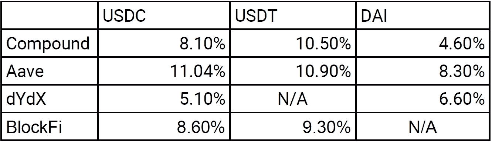

# 让你的应急储蓄有点回报

> 原文：<https://medium.com/coinmonks/making-your-emergency-savings-pay-off-a-bit-coin-54bd01ae547a?source=collection_archive---------2----------------------->

著名对冲基金经理雷伊·达里奥以一句“现金是垃圾”的俏皮话而闻名。在世界经济论坛上，他表示，如果人们一直持有太多现金，他们会感到遗憾。似乎很难反驳他的立场，因为目前典型银行账户的利率低于通胀率。另一方面，如果没有流动性最强的资产类别——现金——作为缓冲，那将是愚蠢的。

所有关于财务规划的指南通常都包括一笔紧急现金储备，可以支付大约 3-6 个月的费用。准确的数额取决于你的收入和储蓄，加上失业救济金和个人情况等其他因素。这个安全网的目的是能够覆盖意外但必要的支出或令人惊讶的经济短缺。

那么如何才能保住自己的安全网，不错失更高的回报呢？现在是时候寻找新的投资机会，将现金的价值稳定性和可获得性与高于通胀水平的利率结合起来。

# 输入定义

DeFi 是“分散金融”的缩写，描述了利用区块链技术提供分散金融产品而不需要中央金融中介的广泛服务。在媒体上，DeFi 往往与高风险的外币投资联系在一起，听起来更像是流行文化或食物搭配，而不是普通银行的改良储蓄计划。

不可否认，高风险、基于迷因的货币是新 DeFi 范式的一部分，但也有更明智、更知名的解决方案。

# 第一部分:稳定的硬币

我们的链上投资计划的主要组成部分是稳定的硬币。与比特币、以太坊或其他价值会在短期内大幅上升或下降的高波动性加密资产相反，稳定的硬币与法定货币挂钩，并保持稳定的价值。

Stablecoins 有多种口味，但主要有三种:

*   菲亚特支持稳定的硬币。

这些稳定的硬币由一个保管银行账户中等量的法定货币担保。因此，如果用户购买了这样的稳定硬币，他的法定货币存款应该被转移到银行账户，并且给定的稳定硬币的等值根据该存款进行数字铸造。像 Circle USD (USDC)和 Tether USD (USDT)这样的硬币就属于这个桶。Tether 被反复审查，因为与 USDC 不同，他们不公开和独立地审计他们的现金存款。

*   加密支持的稳定硬币。

第二组稳定硬币由加密资产支持，而不是法定存款。由于基础资产的波动性，产生的货币通常不是以 1:1 的比例铸造的，而是具有通常健康的缓冲，以考虑到基础加密资产的价格波动。这种硬币的一个例子是戴，它也跟踪美元的价值。

*   基于算法的稳定硬币

最后一组稳定的硬币，肯定是最奇特的变体，使用算法自动创建和燃烧代币，以根据市场上的供求关系保持盯住。这方面的例子有 DefiDollar 或最近发行的 Fei。这个小组仍处于实验阶段，虽然很有趣，但我们将把重点放在前两个类别，以尽量减少风险。

除了上面提到的，还有一些稳定的硬币在流通。在这里可以找到一个列表[例如](https://cryptoslate.com/cryptos/stablecoin/)。

# 第 2 块:赌注和贷款平台

借贷和赌注平台允许我们通过智能合同轻松地向借款人提供稳定的硬币。这反过来会产生高于当前通货膨胀率的年利率。在过去的一年中，这个市场已经从 2020 年初的 4.65 亿美元的微薄总量发展到 2021 年 4 月的 290 多亿美元的总量。市场仍在不断变化，每月都有新的分散平台上线。

Total Value Locked in Lending over the years (Source: [https://defipulse.com/](https://defipulse.com/))

在撰写本文时，主要的提供者是。

*   复合的

Compound Labs 成立于 2017 年，获得了安德森·霍洛维茨(Andreesen Horowitz)、贝恩资本风险投资(Bain Capital Ventures)等硅谷老牌基金的资助，以发展其借贷平台。 [Compound](https://compound.finance/) 拥有最大的市场份额(50%以上)，并在以太坊链上为各种资产提供借贷解决方案。

*   Aave

[Aave](https://aave.com/) 于 2017 年在瑞士成立，为目前 24 种不同的加密资产提供借贷解决方案，从戴和等稳定的硬币到分散的 MANA 或 MakerDAO 的 Maker token 等令牌。

*   dYdX

dYdX 虽然主要是一个分散的交易所，但也对稳定的硬币存款产生利息。要接收这些，用户只需将他的资产存入平台上的智能合约。

*   BlockFi

与标准银行账户相比， [BlockFi](https://blockfi.com/?ref=40c2bf2a) 允许你将加密货币存入银行，以获得固定的年利率。这绝对是最简单的解决方案，因为你可以直接将加密货币从交易所转移到你的 BlockFi 账户。由此产生的利息按月支付。

Lending APY’s snapshot of selected platforms during April 2021

如上所示，每个资产和平台的贷款利率可能会有很大差异。此外，值得注意的是，这些也不是稳定的，因为它们是根据给定资产的供给和需求进行调整的。因此，如果目标是优化利率，建议使用可以在许多不同平台上使用的资产，并关注跟踪解决方案，如 [defi pulse](https://defipulse.com/) 以检查当前利率。尽管如此，defi pulse 上显示的数字可能会滞后，建议在给定平台上进行验证。
此外，值得注意的是，在这些平台上投资稳定的硬币之前，有一些重要的因素需要考虑，如到期日、安全性等。

# 第 3 块:组装链条

在决定了我们想将哪种稳定的硬币与哪种初始平台结合使用之后，是时候开始行动了。

我们缺少的最后一块积木是从菲亚特到我们选择的稳定硬币的上下斜坡，反之亦然。这部分取决于我们选择的硬币，因为不是所有地区的所有交易所都有稳定的硬币。虽然美国用户可以在比特币基地的[上购买 USDC，但欧洲客户需要使用币安](https://www.coinbase.com/join/cramer_kcg)[或北海巨妖](https://www.binance.com/en/register?ref=J8TZUX1P)来代替，要么直接购买 USDC(北海巨妖)，要么通过额外的步骤事先购买另一种加密资产，然后可以兑换成 USDC。

就出口而言，我们希望能够快速出售，并在紧急情况下尽快收回我们的法定货币。不同的交易所提供不同的选择。
比特币基地可以选择向 [Paypal](https://help.coinbase.com/en/coinbase/getting-started/add-a-payment-method/paypal-faq) 即时提款(如果需要，可以转到普通银行账户，通常需要额外两天)。
币安为受支持的 VISA 卡提供[即时提款](https://www.binance.com/en/support/faq/dde45d14a6eb44d6a0d5c62b83a2430b)。正常的 SEPA 提款可能需要两个工作日来处理。北海巨妖提供许多不同的提款选项，但是第一次从账户中提款需要 72 小时进行清算。最初的小额提款可以为账户做好准备，以加快以后的流程。

一旦我们找到了我们的交易所，并得到了我们稳定的硬币，我们还需要一个以太坊钱包(如果使用 USDC 或 USDT，这是 ERC20 代币)。

设置这个的最简单的方法是使用 [MetaMask](https://metamask.io/) ，这是一个为 Chrome、Firefox、Opera 和 Brave 浏览器提供的维护良好的浏览器扩展。MetaMask 提供简单易懂的[教程](https://www.youtube.com/watch?v=GNPz-Dv5BjM)让事情进展顺利。

一切就绪后，我们可以开始流程了。首先，我们需要将法定货币存入我们选择的交易所，并购买我们想要用于借贷的稳定硬币。

接下来，我们需要将我们的稳定硬币提取到钱包中。我们还需要钱包上的少量以太币来支付交易费用。

然后，我们前往我们选择的借贷平台部署我们的资本。这些平台上的登录使用 MetaMask 插件，这使得任何正常的注册都是不必要的。作为用户，与智能合同的所有最终交互都需要在 MetaMask 中获得批准。一旦我们添加了我们的资产，并且交易也得到网络的确认，一切就完成了。

最后一步，在未来的某个时候，将再次撤回我们的资本，并再次将其兑换为菲亚特。为此，我们返回页面，使用 MetaMask 登录，并使用平台的取款功能进行取款。然后，我们可以通过使用交易所存款系统将我们的稳定硬币再次存入所选的交易所。最后，我们出售我们稳定的硬币和法定利息，并将其提取到我们的银行账户。

The complete flow from traditional bank/fiat account to stable coins and lending platform and back again

# 第 4 块:结束想法

没有任何费用就没有回报。以太坊交易是这个过程的一部分，这一点需要记住。虽然有几个倡议正在运行，以降低以太网的费用，人们应该尽量减少交易和支付天然气的数量。否则，特别是如果投资金额较低，年收益的主要部分将需要收回交换和交易费用，如下图所示。

Time to cover assumed costs of 100 USD for transfers into and out of the system for different interest rates

再者，选择借贷平台时建议尽职调查。虽然上述项目已经确立，但仍有很大的失误空间。而且一旦确认，区块链的交易就无法撤销。此外，贷款平台的收益率不稳定，基础项目仍在开发中。因此，强烈建议不时进行检查。如果保证回报稍有减少
最后，失去对用于下注的钱包的访问或控制可能会导致无法取回自己的资产。因此，备份短语的安全副本和谨慎处理是必须的！分散式融资赋予最终用户更多的权力，但也赋予他们更多的责任。

*免责声明:以上仅代表一种观点，仅供参考。它无意成为投资建议。找一个有正式执照的专业人士寻求投资建议。*

另外:感谢[卢卡斯·n·p·艾格](https://twitter.com/Brusik)对草稿的校对和提出的想法。

> 加入 Coinmonks [电报频道](https://t.me/coincodecap)和 [Youtube 频道](https://www.youtube.com/c/coinmonks/videos)了解加密交易和投资

## 另外，阅读

*   [尤霍德勒 vs 科恩洛 vs 霍德诺特](/coinmonks/youhodler-vs-coinloan-vs-hodlnaut-b1050acde55a) | [Cryptohopper vs 哈斯博特](https://blog.coincodecap.com/cryptohopper-vs-haasbot)
*   [币安 vs 北海巨妖](https://blog.coincodecap.com/binance-vs-kraken) | [美元成本平均交易机器人](https://blog.coincodecap.com/pionex-dca-bot)
*   [新加坡十大最佳加密交易所](https://blog.coincodecap.com/crypto-exchange-in-singapore) | [购买 AXS](https://blog.coincodecap.com/buy-axs-token)
*   [投资印度的最佳密码](https://blog.coincodecap.com/best-crypto-to-invest-in-india-in-2021) | [HitBTC 评论](/coinmonks/hitbtc-review-c5143c5d53c2)
*   [加拿大最好的加密交易机器人](https://blog.coincodecap.com/5-best-crypto-trading-bots-in-canada) | [赌注加密](https://blog.coincodecap.com/staking-crypto)
*   [如何在印度购买比特币？](/coinmonks/buy-bitcoin-in-india-feb50ddfef94) | [WazirX 评论](/coinmonks/wazirx-review-5c811b074f5b)
*   [比特币主根](https://blog.coincodecap.com/bitcoin-taproot) | [Bitso 评论](https://blog.coincodecap.com/bitso-review) | [排名前 6 的比特币信用卡](/coinmonks/bitcoin-credit-card-bc8ab6f377c6)
*   [最佳免费加密信号](https://blog.coincodecap.com/free-crypto-signals) | [YoBit 评论](/coinmonks/yobit-review-175464162c62) | [Bitbns 评论](/coinmonks/bitbns-review-38256a07e161)
*   [huo bi 的加密交易信号](https://blog.coincodecap.com/huobi-crypto-trading-signals) | [BitMEX 评论](https://blog.coincodecap.com/bitmex-review)
*   [7 个最佳零费用加密交易平台](https://blog.coincodecap.com/zero-fee-crypto-exchanges)
*   [分散交易所](https://blog.coincodecap.com/what-are-decentralized-exchanges) | [比特 FIP](https://blog.coincodecap.com/bitbns-fip)
*   [用信用卡购买密码的 10 个最佳地点](https://blog.coincodecap.com/buy-crypto-with-credit-card)
*   [OKEx 评论](/coinmonks/okex-review-6b369304110f) | [Kucoin 交易机器人](/coinmonks/kucoin-trading-bot-automate-your-trades-8cf0ca2138e0) | [期货交易机器人](/coinmonks/futures-trading-bots-5a282ccee3f5)
*   [AscendEx Staking](https://blog.coincodecap.com/ascendex-staking)|[Bot Ocean Review](https://blog.coincodecap.com/bot-ocean-review)|[最佳比特币钱包](https://blog.coincodecap.com/bitcoin-wallets-india)
*   [霍比审核](https://blog.coincodecap.com/huobi-review) | [OKEx 保证金交易](https://blog.coincodecap.com/okex-margin-trading) | [期货交易](https://blog.coincodecap.com/futures-trading)
*   [Godex.io 审核](/coinmonks/godex-io-review-7366086519fb) | [邀请审核](/coinmonks/invity-review-70f3030c0502) | [BitForex 审核](https://blog.coincodecap.com/bitforex-review)
*   [Crypto.com 费用](/coinmonks/binance-fees-8588ec17965) | [僵尸加密审查](/coinmonks/botcrypto-review-2021-build-your-own-trading-bot-coincodecap-6b8332d736c7) | [替代品](https://blog.coincodecap.com/crypto-com-alternatives)
*   [有哪些交易信号？](https://blog.coincodecap.com/trading-signal) | [Bitstamp vs 比特币基地](https://blog.coincodecap.com/bitstamp-coinbase) | [买索拉纳](https://blog.coincodecap.com/buy-solana)
*   [ProfitFarmers 回顾](https://blog.coincodecap.com/profitfarmers-review) | [如何使用 Cornix Trading Bot](https://blog.coincodecap.com/cornix-trading-bot)
*   [MXC 交易所评论](/coinmonks/mxc-exchange-review-3af0ec1cba8c) | [Pionex vs 币安](https://blog.coincodecap.com/pionex-vs-binance) | [Pionex 套利机器人](https://blog.coincodecap.com/pionex-arbitrage-bot)
*   [我的密码交易经验](/coinmonks/my-experience-with-crypto-copy-trading-d6feb2ce3ac5) | [比特币基地评论](/coinmonks/coinbase-review-6ef4e0f56064)
*   [CoinFLEX 评论](https://blog.coincodecap.com/coinflex-review) | [AEX 交易所评论](https://blog.coincodecap.com/aex-exchange-review) | [UPbit 评论](https://blog.coincodecap.com/upbit-review)
*   [AscendEx 保证金交易](https://blog.coincodecap.com/ascendex-margin-trading) | [Bitfinex 赌注](https://blog.coincodecap.com/bitfinex-staking) | [bitFlyer 评论](https://blog.coincodecap.com/bitflyer-review)
*   [麻雀交换评论](https://blog.coincodecap.com/sparrow-exchange-review) | [纳什交换评论](https://blog.coincodecap.com/nash-exchange-review)
*   [加密货币储蓄账户](/coinmonks/cryptocurrency-savings-accounts-be3bc0feffbf) | [加密交易机器人](https://blog.coincodecap.com/best-crypto-trading-bots)