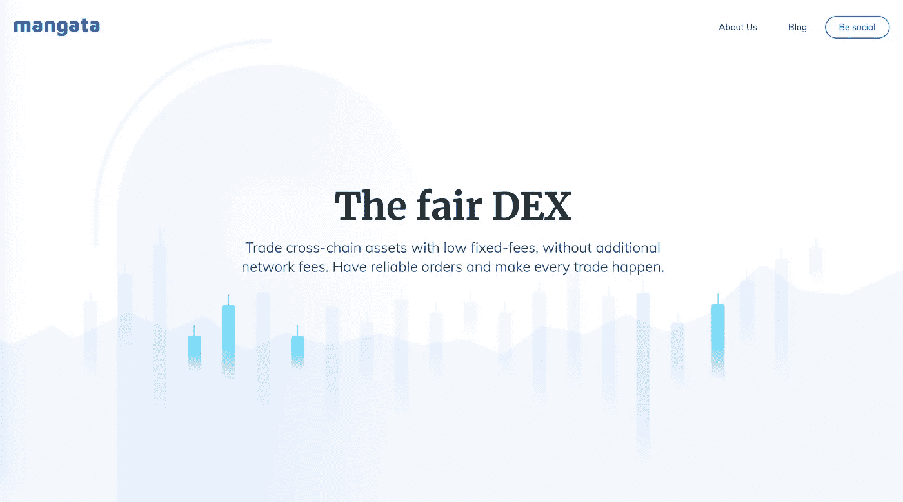

# mangata——波尔卡多的新英雄分散交换

> 原文：<https://medium.com/coinmonks/mangata-a-polkadots-new-hero-decentralized-exchange-e17eb0105942?source=collection_archive---------3----------------------->

[Funkhaus Berlin](https://www.funkhaus-berlin.net/)

一年前，我们在柏林参加一个会议，观看了一个关于以太坊现状的小组讨论。我们的 CTO gleb 问了一个困扰他一段时间的问题:

"是什么阻止了矿工用他们自己的事务替换用户事务和前端运行？"

尽管在房间里感觉像一头大象，但答案是:“没什么。我们只能希望矿工们诚实，不会那样做。”

当时，这不是一个显而易见的问题，但时代已经变了。在过去的一年里，[分散金融(DeFi)](https://blog.coincodecap.com/the-ultimate-guide-to-defi-decentralized-finance) 的加密子领域变得越来越受欢迎，并处于持续上升趋势。随着 DeFi 的增加，用户越来越依赖于分散交换、租借协议和其他应用程序。

随着这种激增，我们还注意到利用 MEV(Miner 可提取价值)的攻击越来越多。2019 年，在 Arxiv 上发表的一项[研究](https://arxiv.org/abs/1904.05234)中，这被描述为试图量化矿工的恶意行为。矿工可提取价值是指矿工通过以最有利于他们的方式重新排序块内容，在用户经济损失的情况下可预测的收益。事实上，最近已经宣布了一项重大举措——[flash bots](/flashbots/frontrunning-the-mev-crisis-40629a613752)——这是一个研发组织，旨在减轻 MEV 带来的负面影响和存在风险。

[抢跑](https://en.wikipedia.org/wiki/Front_running#:~:text=In%20essence%2C%20it%20means%20the,market%20manipulation%20in%20many%20markets.)的问题在传统金融中是众所周知的，对违法的程度很敏感。不幸的是，开发人员在设计当前的区块链时没有考虑到这一点，这种弊端在技术上是允许的。抢先交易和 MEV 是一个会给普通人带来可怕的 UX 的问题:大幅下滑、拒绝交易、长时间的确认和高昂的天然气成本。所有这一切的发生是因为，在引擎盖下，一群机器人正在街区内争夺空间，试图相互博弈。如果不是机器人，那么矿工可以提取价值的损害所有用户。

> 在这种情况下，交易策略必须分析和预测内存池活动，而不是评估加密资产的价格及其市场。我们认为这是错误的。

# 介绍曼加塔，交易的最佳指数

[Mangata](https://mangata.finance)

**我们的使命**是为交易者带来 ***公平的规则*** :快速的交易解决、低固定费用的保证以及 Polkadot 生态系统的抢先预防。

**我们的目标**是为在线数字货币的交易者和流动性提供者创建首屈一指的协议。

# 关键组件

## 费用

在 Uniswap 等现有指数中，交易者必须支付两项费用。交换费(通常为 0.3%)和网络费。网络费用受以太坊费用市场条件的影响，通常非常不稳定。

在 Mangata，没有网络费用，交易者只需为交易支付固定费用。不考虑费用，Mangata 可以提供平均便宜 50%的交易

我们认为，交易策略应该建立在价格预测和资产评估的基础上，而不是管理网络费用。

## 秩序公平

在两个层面上防止抢跑:

没有网络费用，如上所述，防止用户支付更高的交易费用和领先于其他用户。

在共识层面上，挖掘器不能先于用户运行，因为事务执行顺序被来自后续挖掘器的新块的散列随机化了。块中的顺序取决于创建块时不存在的信息。

## 地塞米松

Mangata 是基于 AMM(自动做市商)的 DEX，一种类似于 Uniswap 的机制。

流动性准备金可以由两类人提供:

*   验证者，他们的股份在 AMM 被重新用作流动性
*   纯粹的流动性提供者，无意成为验证者的用户

实际上，流动性拨备与供应链中 PoS 共识的赌注合并在一起。我们称之为 PoL——流动性证明。

本地令牌 MNG 负责标桩。因为 AMMs 中的流动性规定需要一对锁定的资产，所以每个验证者将不得不锁定一对两个资产，例如 MNG:点。验证者可以下注 MNG，与他们选择的任何令牌配对。

## ETH 桥

曼加塔是一个跨链德克斯，位于波尔卡多特和 ETH DeFi 生态系统之间。第一对也是最重要的一对是 DOT : ETH，这是一个基本的流动性渠道。

我们使用[雪叉](https://github.com/Snowfork/polkadot-ethereum)桥实施。

# 为什么是波尔卡多？

曼加塔是作为波尔卡多特生态系统中的副链建造的。副链是一种成熟的区块链，与提供结算和安全的主区块链(称为中继链)相连。曼加塔区块链是特定于应用程序的，仅限于一组特定的智能合约，尤其是 DEX 机制。

parachains 的优势在于，您可以为用户定制系统，打造引人注目的产品。就我们的 DEX 而言，是固定费用和超前预防。这在以太坊上是不可能的，智能合约的所有条件都被锁定，创作者影响区块链架构的能力有限。我们不仅仅局限于这第一个设计，我们还有更多！

另一个问题是越来越多的 DeFi 攻击。由于 Mangata DEX 将仅限于 exchange 功能，因此不存在被其他智能合约利用的风险。没有快速贷款攻击，没有价格先知，没有费用操纵。

我们认为，智能合约的大规模采用只有通过 Polkadot 才能实现。

# 我们走吧！

Mangata 是一个专注于 UX 交易的指数:固定费用使交易有利可图，没有阻碍成功交易的前期活动。

我们来这里是为了建立一个社区，这个社区将塑造去中心化交易所的未来。没有波尔卡多特，这是不可能的。

在 Mangata 上，交易和投资可以成为它应该成为的样子，加密资产分析和可预测的利润。

> *在后面的帖子中，我们将分享更多关于治理、令牌组学和发布细节的信息*

# 与曼加塔保持联系:

网址: [https://mangata.finance](https://mangata.finance/)

推特:[https://twitter.com/MangataFinance](https://twitter.com/MangataFinance)

邮箱: [hello@mangata.finance](http://hello@mangata.finance/)

电报:[https://t.me/mgtfi](https://t.me/mgtfi)

不和谐:[https://discord.gg/](https://discord.gg/X4VTaejebf)X4VTaejebf

## 另外，阅读

*   最好的[密码交易机器人](/coinmonks/crypto-trading-bot-c2ffce8acb2a)
*   [Deribit 审查](/coinmonks/deribit-review-options-fees-apis-and-testnet-2ca16c4bbdb2) |选项、费用、API 和 Testnet
*   FTX 密码交易所评论
*   [Bybit 交换审查](/coinmonks/bybit-exchange-review-dbd570019b71)
*   最好的比特币[硬件钱包](/coinmonks/the-best-cryptocurrency-hardware-wallets-of-2020-e28b1c124069?source=friends_link&sk=324dd9ff8556ab578d71e7ad7658ad7c)
*   [密码本交易平台](/coinmonks/top-10-crypto-copy-trading-platforms-for-beginners-d0c37c7d698c)
*   最好的[加密税务软件](/coinmonks/best-crypto-tax-tool-for-my-money-72d4b430816b)
*   [最佳加密交易平台](/coinmonks/the-best-crypto-trading-platforms-in-2020-the-definitive-guide-updated-c72f8b874555)
*   最佳[加密贷款平台](/coinmonks/top-5-crypto-lending-platforms-in-2020-that-you-need-to-know-a1b675cec3fa)
*   [莱杰纳米 S vs 特雷佐 1 vs 特雷佐 T vs 莱杰纳米 X](https://blog.coincodecap.com/ledger-nano-s-vs-trezor-one-ledger-nano-x-trezor-t)
*   [block fi vs Celsius](/coinmonks/blockfi-vs-celsius-vs-hodlnaut-8a1cc8c26630)vs Hodlnaut
*   Bitsgap 评论——一个轻松赚钱的加密交易机器人
*   为专业人士设计的加密交易机器人
*   [PrimeXBT 审查](/coinmonks/primexbt-review-88e0815be858) |杠杆交易、费用和交易
*   [在线评论](/coinmonks/haasonline-review-d8d1a3400419)享受九折优惠
*   Bitmex 上的[保证金交易的白痴指南](/coinmonks/the-idiots-guide-to-margin-trading-on-bitmex-dbbd7742c6fc?source=friends_link&sk=7bfa99d2a181142510c8442c8ddb0786)
*   [eToro 评论](/coinmonks/etoro-review-78807ddeb33c) |交易股票、密码、交易所交易基金、差价合约和商品
*   [BlockFi 评论](/coinmonks/blockfi-review-53096053c097) |赚取高达 8.6%的加密利息
*   开发人员的最佳加密 API
*   [最佳区块链分析工具](https://bitquery.io/blog/best-blockchain-analysis-tools-and-software)
*   [加密套利](/coinmonks/crypto-arbitrage-guide-how-to-make-money-as-a-beginner-62bfe5c868f6)指南:新手如何赚钱
*   顶级[比特币节点](https://blog.coincodecap.com/bitcoin-node-solutions)提供商
*   最佳[加密制图工具](/coinmonks/what-are-the-best-charting-platforms-for-cryptocurrency-trading-85aade584d80)
*   了解比特币最好的[书籍有哪些？](/coinmonks/what-are-the-best-books-to-learn-bitcoin-409aeb9aff4b)

> [直接在您的收件箱中获得最佳软件交易](/coinmonks/newsletters/coinmonks)

