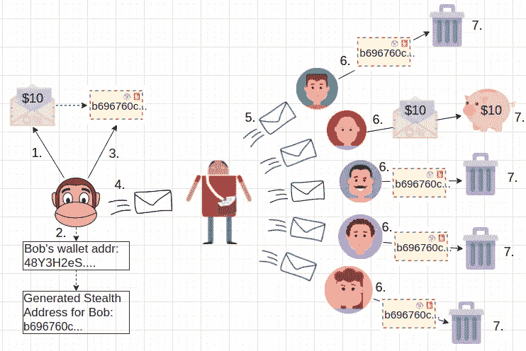
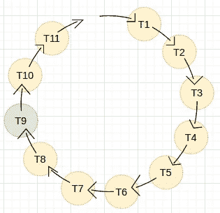
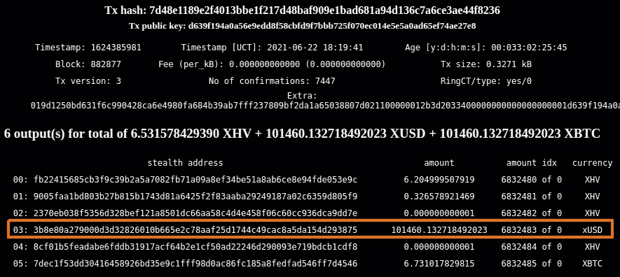
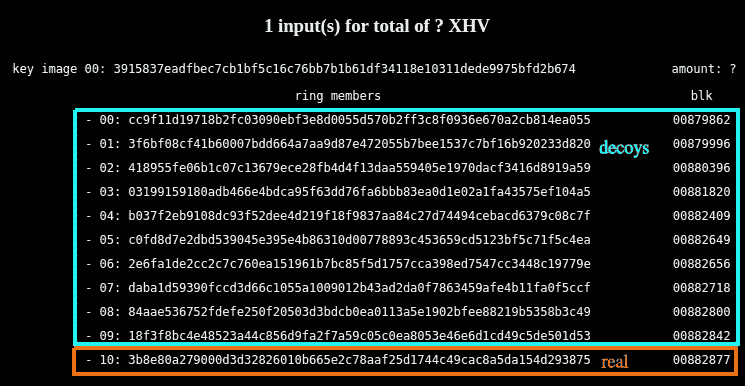
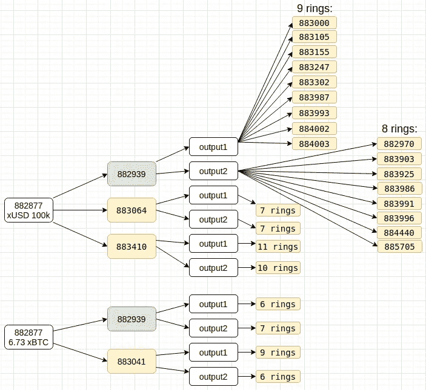

# 在 Monero 中映射环签名和秘密地址

> 原文：<https://medium.com/coinmonks/mapping-ring-signatures-and-stealth-addresses-in-monero-a5543a434684?source=collection_archive---------1----------------------->

## 以最近一次 XHV 黑客攻击(2021 年 6 月)为例

# 介绍

Monero 采用了许多技术来增强加密货币用户的隐私。在这篇文章中，我来看看其中的两个，发送者匿名的*环签名*和接收者匿名的 S *健康地址*。我经常发现这些文档很难理解，因为要么[对我来说太浅](https://www.getmonero.org/resources/moneropedia/ringsignatures.html)，要么[包含太多希腊符号](https://web.getmonero.org/library/Zero-to-Monero-2-0-0.pdf)，让我头疼。在这篇文章中，我试图更深入地研究这两种技术，但是保持它的直观性，我自己也是这样学习的。我希望如此。以及一个追踪真实世界黑客的例子，让它变得更有趣一些。

由于 Monero 已经被分叉并用作多个其他区块链的基础，环签名和秘密地址的相同概念也更广泛地应用于那些分叉的区块链。这些分叉项目之一是 [Haven 协议(XHV)](https://havenprotocol.org/) 私有 stablecoin 项目。我将使用来自 2021 年 6 月 XHV 攻击的例子，强调隐藏地址和环签名的相互作用，以及它们如何与 XHV 开发人员试图解决的攻击相关。

由于 XHV 区块链上的[漏洞没有完全恢复，数据应该还在那里，以便任何感兴趣的人在实践中检查。不管怎样，只要区块链还存在。无论如何，让我们先简要了解一下相关的 Monero 隐私特性，以便做好准备。](https://havenprotocol.medium.com/haven-protocol-successfully-deploys-rollback-hard-fork-206e5ead190e)

# Monero 隐私功能

Monero 使用多种隐私增强机制。其中包括[彼得森承诺](https://web.getmonero.org/resources/moneropedia/pedersen-commitment.html)、[戒指签名](https://web.getmonero.org/resources/moneropedia/ringsignatures.html)、[戒指机密交易(RingCT)](https://web.getmonero.org/resources/moneropedia/ringCT.html) 、[隐形地址](https://web.getmonero.org/resources/moneropedia/stealthaddress.html)。这些技术可分为隐藏交易中转账金额的技术、隐藏交易收款人的技术和隐藏汇款人的技术。有很多隐藏，所以让我们看看每一个。

## 交易金额

交易匿名的一个核心方面是交易金额，即交易花费/发送了多少资金。这与隐藏金额本身有关，但也是为了将一项交易的输入与另一项交易的输出相关联。例如，如果您可以查看在一次交易中发送的特定金额，并在随后的另一次交易中发现相同的金额，您可以推断出第一次交易的收款人可能是第二次交易的付款人，或者它与您认为已获得的其他资产的价格相匹配。

Monero 最初没有隐藏金额，交易的输入和输出金额在区块链上是可见的。如果您查看区块链早期的 Monero 交易，您仍然可以看到这一点，例如[100000](https://localmonero.co/blocks/tx/9c3c0086ef9aa98f370dac303c5dca109678bf95c9e4252e103dab16dce46fa8)区块中 2014 年的交易。

如今，Monero 使用一种叫做 [Pedersen Commitment](https://web.getmonero.org/resources/moneropedia/pedersen-commitment.html) 的加密方案来隐藏金额。我在[关于零知识证明的文章](/coinmonks/zero-knowledge-proofs-um-what-a092f0ee9f28)中详细描述了彼得森承诺。与此相关，在本文后面我还将讨论环签名，这也是[过去需要考虑的数量](https://monero.stackexchange.com/questions/6312/why-monero-used-to-split-amounts-by-denominations)。然而，自从引入 [RingCT 协议](https://monero.stackexchange.com/questions/3683/can-someone-walk-me-through-a-simple-example-to-explain-how-ringct-works?rq=1)以来，Ring 签名现在也隐藏了 Pedersen 承诺的金额。

因此，总的来说，关于交易金额，目前基于 Monero 的区块链隐藏得很好，这对用户来说非常透明。也就是说，用户不需要真正关心它，因为它总是在使用协议时自动发生。

## 交易接收者

在 Monero 中隐藏交易接收者的方法被称为[隐形地址](https://web.getmonero.org/resources/moneropedia/stealthaddress.html)。在 Monero 社区中，隐藏地址的含义似乎有些含糊不清，但在这里，我将其用作区块链上可见的交易接收方地址。

秘密地址不同于钱包地址。我在这里提到的 Monero 钱包地址是当你启动官方的 Monero 命令行(CLI)钱包，并输入“地址”命令时得到的地址。或者在 GUI 或您使用的任何钱包中也是如此。这个钱包地址实际上从未出现在基于 Monero 的区块链上，只有秘密地址会出现。

给定目标(接收者)钱包地址，发送者钱包生成一次性秘密地址。这个生成的隐藏地址在区块链中用作交易接收方地址。[椭圆曲线数学用于从给定接收者钱包地址中编码的公钥创建秘密地址，并使用大的随机因子](https://steemit.com/monero/@luigi1111/understanding-monero-cryptography-privacy-part-2-stealth-addresses)。这使得每个秘密地址都是唯一的。即使同一个发送者向同一个接收者发送 Monero，隐形地址对于每笔交易也总是不同且唯一的。这是隐藏交易接收者的机制。

关于建造隐形地址的细节，我推荐这篇[优秀栈交换贴](https://monero.stackexchange.com/questions/1409/constructing-a-stealth-monero-address)，以及类似 Luigi1111 的[优秀文章。当查看区块链时，如果没有匹配的私钥，秘密地址就无法与任何钱包地址匹配。只有接收者能够访问与用于生成秘密地址的公钥相匹配的私钥，因此只有他们的钱包能够识别针对他们的交易。](https://steemit.com/monero/@luigi1111/understanding-monero-cryptography-privacy-part-2-stealth-addresses)

## 猴子看，猴子做(涂鸦)

为了让这个看起来更形象，我做了下面这个关于邮件系统的最漂亮的涂鸦，作为隐形地址如何工作的隐喻。

My most impressive doodle on using mail as a metaphora for a Stealth Address. Pics from Pixabay: [monkey](https://pixabay.com/vectors/face-monkey-smile-smiling-2025030/), [envelope 1](https://pixabay.com/vectors/envelope-mail-postage-post-office-3172770/), [envelope 2](https://pixabay.com/illustrations/airmail-envelope-vintage-airmail-163625/), [envelope 3](https://pixabay.com/vectors/message-private-message-mail-email-369540/), [heads 1](https://pixabay.com/vectors/avatar-flat-modern-minimal-5261900/), [heads 2](https://pixabay.com/vectors/avatar-flat-modern-minimal-5261902/), [heads 3](https://pixabay.com/vectors/avatar-flat-modern-minimal-5261896/), [heads 4](https://pixabay.com/vectors/avatar-flat-modern-minimal-5261898/), [trashcan](https://pixabay.com/vectors/garbage-icon-rubbish-trash-1295900/), [piggy](https://pixabay.com/vectors/piggy-bank-bank-pork-money-3718557/), [mailman](https://pixabay.com/vectors/postman-letter-man-post-service-836940/).

考虑图中列出的 7 个步骤:

1.  乔治(左边的猴子)想给鲍勃(右边的秃子)寄 10 块钱。所以他开始建立一个 Monero 交易，并把 10 Monero 放进去。
2.  乔治有鲍勃的钱包地址。可能是他从 Bob 的 Github 项目里找到的，求捐款。乔治想寄些钱来。使用在 Bob 的公共钱包地址中编码的公钥，George 的钱包生成一个唯一的秘密地址来向 Bob 发送资金。
3.  George 将这个新生成的秘密地址放在 10 Monero 交易中作为接收方地址。
4.  乔治把交易交给邮递员投递。这里的邮递员代表着 Monero 点对点区块链网络。由运行 Monero 守护程序软件的节点组成。
5.  邮递员，或在这种情况下的 Monero 网络，将交易的副本发送给区块链的每个用户。或者他们的钱包。
6.  每个人都试图通过将他们的私钥与秘密地址相匹配来读取和打开事务。或者他们的钱包自动这样做。
7.  其他人都放弃了交易，因为他们的密钥不匹配，除了 Bob，他的私钥与 George 从他的钱包地址使用的公钥相匹配。所以鲍勃得到了 10 块钱，并把它们放进了他的钱包(piggybank)以备后用。

就本文而言，关键的要点是为每笔交易生成一个唯一的接收方地址，这就是您在区块链上看到的交易接收方地址。这就是(我所说的)秘密地址。这是下一步使用环签名隐藏交易发送者的一个重要元素，以及我们以后如何使用它来寻找环签名和隐藏地址之间的联系。我稍后讨论的 XHV hack 将更具体地说明这个链接。

## 交易发送方

正如我已经提到的，在 Monero 中隐藏交易发送者的方法被称为环签名。环签名之所以如此命名，是因为在算法如何被应用中的[环状结构。该算法的基本思想是建立一个可能签名者的匿名集合，并在该匿名集合中隐藏真实的发送者/签名者。在这种情况下，签名者指的是事务输出(秘密地址),该事务输出可以在附加了环签名的事务中使用。下面举例说明一个戒指签名(是的，这只是根据我的理解涂鸦):](https://en.wikipedia.org/wiki/Ring_signature)

My Ring Signature doodle. Green is the real tx, hiding in yellow decoys.

在上图中，我将 *T9* (作为环中的事务输出 9)涂成绿色，以说明在这种情况下它是真正的输入。这只是为了说明，因为真实的输入/签名者被随机放置在环上。因为如果它总是在同一个位置，它是哪一个就很明显了。[环签名算法](https://monero.stackexchange.com/questions/3683/can-someone-walk-me-through-a-simple-example-to-explain-how-ringct-works?rq=1)以类似环的顺序处理这些，因此得名。

Monero [目前强制执行 11](https://www.getmonero.org/resources/moneropedia/ring-size.html) 的环大小，这意味着该环包含真实的事务输入和 10 个虚假的*诱饵*事务输出(有时称为 [*混合*](https://monero.stackexchange.com/questions/8462/are-mixins-now-officially-called-decoys-and-when-did-that-happen) )。[戒指大小过去可以由用户更改](https://monero.stackexchange.com/questions/7233/would-a-fixed-ring-size-improve-anonymity)，但强制计数 11 目前用于避免不同的戒指大小泄露关于特定用户的额外元数据，从而削弱整体匿名设置。

环中的签名是使用来自区块链上真实交易的一组秘密地址生成的。谁都能证明其中一个签名是真的，但不能证明是哪个。这给了每一个环参与者可信的否认。真正的签名者当然是发送真正资金的人，或者是在秘密地址花费他们收到的输出的人。但是你不知道它是 11 个中的哪一个。此外，在每个交易花费中包含一个[键图像](https://monero.stackexchange.com/questions/2883/what-is-a-key-image),以确保每个输出仅花费一次。

关于环签名实现的细节，我推荐优秀的[栈交换答案](https://monero.stackexchange.com/questions/3683/can-someone-walk-me-through-a-simple-example-to-explain-how-ringct-works?rq=1)用于 Monero 和 RingCT 细节，或者[维基百科文章](https://en.wikipedia.org/wiki/Ring_signature)的原始环签名方案的示例代码。

对于本文来说，理解隐藏地址定义了事务接收者就足够了，当事务输出失效时，失效输出的隐藏地址出现在事务环签名中。但是秘密地址也可能在其他交易中作为虚假诱饵出现。

## 想象一下:来自 XHV Explorer 的秘密地址和环形签名

为了说明这一点，这里有一个 Haven protocol (XHV) explorer 的屏幕截图，显示了一个被攻击的 coinbase 输出(通常金额是隐藏的，但 coinbase / miner 事务显示了它们):

Screenshot of a coinbase output on XHV chain. [This link](https://explorer.havenprotocol.org/tx/7d48e1189e2f4013bbe1f217d48baf909e1bad681a94d136c7a6ce3ae44f8236) should take you to it, if the explorer exists as used to.

请注意，上面的屏幕截图显示了每个事务输出如何为接收者提供一个可见的隐藏地址。并且它总是唯一的，即使去相同的接收者钱包。上面截图中的所有输出，其实都是支付给同一个(黑客)钱包，只是各自有不同的隐身地址。在上面的截图中，我突出显示了一行 101k 的 xUSD 输出。让我们把它映射到一个环签名。

下面是资源管理器的屏幕截图，显示了上面突出显示的隐藏地址是如何用于 Ring 签名的:

Screenshot of explorer with a ring signature using the previous screenshots Stealth Address. [Link](https://explorer.havenprotocol.org/search?value=f864dc3816ef75e3217f08fb0aed343bcdd220ae7969b415df0472a894efcaab).

在这个截图中，我将它标记为真正的输出。一般来说，我们无法判断这是一个真实的输入还是一个诱饵输入。在这种情况下，我相信这是真正的花费，正如我将很快解释的那样，这是由于黑客们花掉它的一些方式。然而，一般来说，这应该说明隐形地址是如何在环签名中作为真实地址或诱饵地址出现的。从区块链的公开数据来看，我们真的不能断定是哪一个。

最后，在所有冗长的解释之后，让我们看看承诺的 XHV 攻击，以及秘密地址和环签名是如何进行的。

# 看看 XHV Hack 的例子

首先，为了更好地理解 XHV 漏洞描述，以及它们与隐藏地址和环签名的关系，需要一些简短的背景知识。

## 什么是 XHV

XHV，或 [Haven 协议](https://havenprotocol.org/)，被称为[算法稳定核心](https://hackernoon.com/algorithmic-stablecoins-a-beginners-guide-pmh320t)。令人惊讶的是，基本的 XHV 标记叫做 XHV。它可以在交易所交易，并在钱包之间发送，类似于 Monero 的 XMR。为了创建算法 stablecoin 功能，XHV 还在区块链上实现了其他令牌类型，例如 xUSD 跟踪美元值，xBTC 跟踪比特币值，xJPY 跟踪日元值。可以在 XHV 区块链上创建特殊的事务，将这些令牌类型中的一种更改为另一种，这些令牌可以像基本 XHV 本身一样在钱包之间发送。

美元、BTC 等的跟踪价格。，由[链](https://chain.link/)神谕决定，比如[XHV-USD](https://data.chain.link/ethereum/mainnet/crypto-usd/xhv-usd)的那个。不涉及太多的细节，这些概念只在较高的层次上与本文的多种资产类型相关，因为它们出现在讨论以下 XHV 利用的例子中。

## 功勋

在这里使用的例子中，在 XHV blockhain 的几天时间里，有[个不同的漏洞被利用。我将使用列表中的第一个漏洞作为示例。这个漏洞滥用了一些关于如何创建 miner (coinbase)事务的遗漏检查。如果感兴趣，可以类似地分析其他漏洞的输出，因为它们都列在 XHV teams](https://havenprotocol.org/wp-content/uploads/2021/07/Technical-Overview-of-June-2021-Exploits.pdf) [Medium post](https://havenprotocol.medium.com/haven-protocol-technical-overview-of-june-2021-exploits-6f4573fbf216) 上。

列表中第一个被利用的 miner 事务在 XHV 块 [882877](https://explorer.havenprotocol.org/block/882877) 中。具体而言，攻击者利用漏洞利用错过检查来验证额外资产令牌的矿工奖励(也称为 coinbase)交易中的采矿奖励/费用。在[区块 882877 采矿交易](https://explorer.havenprotocol.org/tx/7d48e1189e2f4013bbe1f217d48baf909e1bad681a94d136c7a6ce3ae44f8236)(也是上面签名部分的截图)中，你可以看到 101k xUSD 和 6.73 xBTC 被凭空创建。在块 [883040](https://explorer.havenprotocol.org/block/883040) 中再次利用 miner 事务，获得相同数量的 [6.73 xBTC 和 101k xUSD](https://explorer.havenprotocol.org/tx/45e4eba24ffa4f431ff433a58bafd67f17f7cfab4c4fb1263afdbeb8765b423f) 。

那么这与秘密地址和环签名有什么关系呢？在 XHV 开发人员注意到/被告知异常大的矿工奖励后，他们试图阻止黑客使用那些被黑客攻击的 101k xUSD 和 6.73 xBTC 输出。这就是那些事务输出的秘密地址和环签名发挥作用的地方。

## 试图阻止被剥削资金的支出

如前所述，Monero 不包括区块链上的实际接收方地址。取而代之的是，它为每笔交易创建一个一次性的秘密地址，这个秘密地址是基于接收者在他们的钱包地址中编码的加密公钥。虽然您不能将单个隐藏地址映射到任何特定的接收者/钱包，但是您可以将其映射到特定交易的环签名，其中由隐藏地址标识的输出可能被用作输入/花费(或作为诱饵)。之前的截图说明了这一点。

在这种情况下，XHV 开发者会将秘密地址用作被利用的交易的支付的目标地址，并扫描区块链以找到使用这些秘密地址作为输入的任何环签名，从而找到这些资金的任何潜在花费。在没有找到匹配的环签名/交易花费的情况下，可以假设资金还没有被花费/从初始目标秘密地址转移。阅读他们的[报告](https://havenprotocol.medium.com/haven-protocol-technical-overview-of-june-2021-exploits-6f4573fbf216)，这可能是他们假设的情况。

为了阻止攻击者使用他们开发的资金，他们[为最大的 XHV 挖掘池提供了一个经过修改的软件](https://havenprotocol.medium.com/haven-protocol-technical-overview-of-june-2021-exploits-6f4573fbf216)，该软件可以丢弃任何使用这些秘密地址作为其环签名一部分的新交易。[这些最大的矿池将让他们控制超过 51%的网络散列能力](https://miningpoolstats.stream/haven)。这种 51%以上的哈希能力使任何人都有能力丢弃其他人挖掘的任何块，在这种情况下，这些块将包含来自被利用的输出的秘密地址作为输入。

然而，阅读他们的[报告](https://havenprotocol.org/wp-content/uploads/2021/07/Technical-Overview-of-June-2021-Exploits.pdf)和[中期报告](https://havenprotocol.medium.com/haven-protocol-technical-overview-of-june-2021-exploits-6f4573fbf216)，开发商似乎在他们的扫描中犯了一些错误，资金没有被花掉的想法并不是真实的情况。我们可以简单地通过使用 XHV 守护进程共享的 [Monero 守护进程 RPC API](https://www.getmonero.org/resources/developer-guides/daemon-rpc.html) 来验证这一点。我们可以用这个 API 查询网络节点中的块和事务，并在环签名中寻找任何具有特定隐藏地址的输入。让我们看看它看起来怎么样。

## 将秘密地址映射到环签名

为了构建这个例子，我在 XHV 网络中查询那些在环签名中具有被利用的 miner 事务的隐藏地址的事务。一旦我找到了，我再重复一次扫描，以找到使用这些潜在花费作为他们的环签名的输入的交易。下图显示了这一过程的结果，以及被利用的 miner 事务如何在随后的区块中扩散到区块链:

Hacker TX fan-out into the blockchain and its ring signatures.

上图说明了两个被利用的事务输出如何从来自块 882887 的原始[被利用的 miner 事务扇出。上图中被利用的两个 miner 事务是图左侧的事务，标记为 *882877 xUSD 100k* 和 *882877 6.73 xBTC。*如果你在 block explorer](https://explorer.havenprotocol.org/tx/7d48e1189e2f4013bbe1f217d48baf909e1bad681a94d136c7a6ce3ae44f8236) 上查看 [miner 事务，xUSD 事务被支付到隐身地址*3b8e 80 a 279000d 3d 32826010 b 665 e 2 c 78 AAF 25d 1744 c 49 ca c8 a5 da 154d 293875*，xBTC 被支付到隐身地址*7 dec 1 f 53 DD 30416458926 BD 35 e 9 C1 fff 98。*](https://explorer.havenprotocol.org/tx/7d48e1189e2f4013bbe1f217d48baf909e1bad681a94d136c7a6ce3ae44f8236)

扫描这些秘密地址作为环签名的一部分，在块 [882939](https://explorer.havenprotocol.org/search?value=f864dc3816ef75e3217f08fb0aed343bcdd220ae7969b415df0472a894efcaab) 、 [883064](https://explorer.havenprotocol.org/search?value=7c897d1409f54f00d5ecc5ba7e3d4027db975cf13624ba8c39593aaf966518d9) 、 [883410](https://explorer.havenprotocol.org/search?value=a5903080ecc87b1166cc834e0eb48324bb682d384ce3e69864486e74454cc18b) 中，xUSD 输出用作三个事务的环签名的输入。在模块 [882939](https://explorer.havenprotocol.org/search?value=8733388b614cea9131dbd278dca97948819df53a76aeff2a8052902d14e005e2) 和 [883041](https://explorer.havenprotocol.org/search?value=ffb29e77f420792b162aecfe80db821f907cdfabcd7873350c8364fe54a0ad72) 中，xBTC 输出同样用作两个环形签名的输入。

在上图中，我用绿色突出显示了 882939，因为对我来说，这似乎很清楚，这是花费 882877 块中开发的资金的实际交易。我不能 100%证明这一点，因为环签名在 xUSD 和 xBTC 交易的 10 个其他诱饵中混淆了发送者。然而，这是一个很好的例子，说明如果你的行为通过其他启发背叛了你，这些隐私机制不一定单独隐藏你。

我这样说是因为块 882877 包含使用 xUSD 和 xBTC 开发的输出作为环成员的事务。两个输出也在同一块中首次出现在任何环签名中。就 Monero 选择诱饵的方式而言，在同一个区块进行两笔交易，使用完全相同的前一笔交易的诱饵，是极不可能的。更有甚者，Monero 对 miner (coinbase)交易的解锁时间为 60 个块，如块 882877 中的漏洞，882939 和 882877 之间的差异为 62 个块。所以 882939 是第一批被黑客攻击的输出可能被使用的地方之一。这一切同时发生，真是太巧了。这说明了技术可以完美地工作，但你的行为仍然会背叛你。对黑客来说可能没什么区别，但是一个很好的例子。

## 为什么只有 2-3 个环使用开发的输出

上图显示了只有 3 个和 2 个模块，其中 xUSD 和 xBTC 输出显示为环形输入，但对于图中的其它处理，则有更多。这是 XHV 开发者努力停止使用它们的结果，只是有点晚了，因为它们已经在 3 和 2 块中被用作真正的输入/诱饵。但如果不是这样，正如截止日期所显示的那样，停止可能会很好。

## 扇出进入区块链

在上图中，我将块 882939 中来自 xUSD 支付的[两个交易输出](http://f864dc3816ef75e3217f08fb0aed343bcdd220ae7969b415df0472a894efcaab)展开，作为输出的更实际扇出看起来像下面块中的多个环签名的例子。第一个(图中标为 *output1* )支付给隐身地址*71d 224 f 0043 fdf 8 C5 b 6 E8 BC 292 f1 C1 e 07 BF 820d 707 C2 d 9 b 04 b 6335d 49 BF 37 e4b*。第二个扇出输出( *output2* )支付给隐形地址*AFA 169 a 74 b 1581 cafed 215219 ca 7b 7708802 EC 13945540d 3 fb9 ba 30 e 188d 842*。

如图所示，882939 块的*输出 1* 可以作为 [*883000*](https://explorer.havenprotocol.org/search?value=b78ae3f494451ff377cdf6dd239c41c6375a0866c66a4c7ea528f6a6f9f3185e) 、 [*883105*](https://explorer.havenprotocol.org/search?value=3fa14c79d8da49f7764b263b6105406cc3f4c6a5779ed91c9540eb715a18c520) 、 [*883155*](https://explorer.havenprotocol.org/search?value=7f9ecbd43ac1dd6ee54fa7cb420136154900ccbb5f64d70529d2ad058af1e8a7) 、 [*883247*](https://explorer.havenprotocol.org/search?value=a446b7299e9938042f624871d068efe7a84a06a0c5d75cbf1504cea83933c561) 、[*883337 同样，输出 2 可以在*](https://explorer.havenprotocol.org/search?value=582c59946561f0ae43923e055a5738fed7320b144b58c81c6295504c206b6f05)**[*883903*](https://explorer.havenprotocol.org/search?value=0dae17cef562146ea19d1a6863439a2512f9d1831904a17fdbbd43ad7676c132)[*883925*](https://explorer.havenprotocol.org/search?value=a26b423f4e9674939bfa03a6d5040f3d03f601b6c51414c08f4ff46f3a5b46e2)[*883986*](https://explorer.havenprotocol.org/search?value=894f7f1e1fa7cbf6e222e8f8be473339bac732675bf81a0596f340464bcd48e9)[*883991*](https://explorer.havenprotocol.org/search?value=4f8f5903a57850813e1e6fc7e147d29aac5b0dfb857c65eb8850d9da6c82e4de)[*883996【中找到如果你想自己检查，只需打开这些链接，搜索我上面复制粘贴的秘密地址。*](https://explorer.havenprotocol.org/search?value=a13e1254579364c673d5add93a12955357b0abbf6f58a872a68784b48ea93488)**

## *与用户隐私的相关性*

*除了所有这些技术方面，阅读关于黑客和所有可能是有趣的。或者可能大家都已经睡着了。但是这和普通用户有关系吗？*

*如果你只关心一些基本的隐私，或者如果你根本不关心隐私和匿名，你可能很好地使用基于 Monero 的协议。如果你真的更关心它，我们可以从这里收集到一些值得记住的要点:*

*   *当你收到任何交易时，考虑在短时间后重新发送给你自己，或者一般情况下[搅动](https://monero.stackexchange.com/questions/4565/what-is-churning?noredirect=1&lq=1)几次。这将模糊资金的秘密地址，而不仅仅是包含在其他环签名中。但是要小心明显的模式，比如上面的 miner 漏洞。*
*   *考虑可以用来标识和链接事务的其他元数据。在上面的 XHV hack 示例中，元数据是在原始事务解锁之后，同时使用来自同一个 miner 事务的多个输出。*

*然而，让这变得更复杂的是，搅拌和其他技术也不是那么简单就能完美完成的。一些相关的讨论在[本栈交流帖](https://monero.stackexchange.com/questions/12306/estimating-anonymity-set-size/12316#12316)中。为了使它完美，你的搅拌应该看起来像真正的诱饵模式。但是做这样完美的优化可能会有点复杂，所以对以上几点的一些基本考虑可能就足够了。这是非常棘手的，因为我现在知道任何具体的支持，可以对花费哪些交易输出进行粒度控制，甚至可以看到 Monero 钱包中的具体输入和输出。*

*总的来说，与时间相关的分析似乎是尝试和分析 Monero 交易最常见的方法之一。为了更深入地研究诱饵选择算法，我在这里写了一个小的研究，但是有点长。这似乎经常发生在我身上。因此，为了避免更长的篇幅和太多的题外话，我将把关于诱饵选择和时机分析的细节留到以后再说。*

## *其他元数据*

*除了基于时间的分析之外，在 Monero 的整个生命周期中，还发现并解决了与交易分析、环签名、诱饵和相关主题相关的各种其他问题。在 Monero 团队的[打破 Monero YouTube 系列](https://www.youtube.com/playlist?list=PLsSYUeVwrHBnAUre2G_LYDsdo-tD0ov-y)中有一个关于这个话题的非常好的和广泛的讨论。我不会在这里讨论任何细节，但是如果你对这个话题感兴趣，这绝对是一部值得一看的剧集。*

## *环签名的未来展望*

*虽然目前的 Monero 戒指尺寸为 11，但 Monero 实验室最近的研究课题包括[三联画和相关创意](https://ccs.getmonero.org/proposals/cypherstack-sarang-triptych-research.html)，旨在实现更大的戒指尺寸。这使得对交易发送者以及他们之间的关系的任何分析变得更加困难。它还应该提供更广泛的诱饵模式，使您更难在自己的交易中不匹配它们。*

# *软件测试的强制性推广*

*我在软件测试领域工作了多年(主要是工程部分)，我将借此机会就这些加密货币黑客和我对这个主题的看法说几句话，即使它实际上不是关于环签名和秘密地址。很抱歉。*

*关于 XHV 黑客，他们发布的[报告似乎指向相当缺乏的软件开发实践](https://havenprotocol.medium.com/haven-protocol-technical-overview-of-june-2021-exploits-6f4573fbf216)(寻找经验教训)。似乎很少或没有测试，缺乏代码审查和审计，并且在开发中获得任何(有益的)社区参与似乎很少或没有支持。对于一个在互联网上公开分散运行的开源金融项目来说，这是非常可怕的阅读，有时价值数亿美元或更多。*

*阅读这些经验教训，至少 XHV 团队现在认识到了这一点，并努力改进。我想一步到位地改变基本流程和人们的工作实践还有待观察。*

*当然，XHV 团队并不孤单，例如，大约一个月后(2021 年 7 月)，另一个名为 [Thorchain](https://thorchain.finance/) 的加密货币项目也发生了类似的[多起黑客攻击，损失高达数百万美元](https://www.msn.com/en-au/money/markets/thorchain-hacked-for-third-time-in-a-month-with-a-11m-stolen/ar-AAMsZwW)。虽然没有那么糟糕，但我阅读的一些报告指出了开发流程、测试等方面的类似限制。一般来说，这种黑客攻击似乎几乎每月都会在加密货币项目中发生，特别是对于具有更大新代码库(因此未经测试的攻击面)的新项目。也许这是一种习惯，但是在测试和安全性上花些心思也无妨。*

*当然，每个人都会犯错误，我想从错误中吸取教训是最重要的。但这不应该成为忽视最基本的质量保证的借口。*

# *结论*

*我希望这篇文章能对什么是环签名和秘密地址，以及它们是如何工作的有所了解。我发现 Monero 如何将许多最新的密码研究应用于实践，结合不同的密码技术来创建一个私人和分散的交易系统，并且没有任何像我在这里部分描述的那样的大黑客攻击，这给我留下了非常深刻的印象。*

*Monero 技术可能相当复杂，但最终我发现一个好的解释有助于让复杂的主题变得容易理解。很像比特币一样聪明，但一旦你找到合适的资源来解释它，就不会太难理解。Luigi1111 的秘密地址文章很棒，可惜他似乎从来没有抽出时间看他的戒指签名文章。*

*对于那些对如何使用 Monero API 来分析区块链感兴趣的人来说，在我写[我的关于 Merkle Trees](/coinmonks/merkle-trees-concepts-and-use-cases-5da873702318) 的早期文章时，我使用 Monero 守护程序/节点 API 构建了一个[小工具来抓取 Monero 区块链](https://github.com/mukatee/monero-scraper)。这让我可以对数据进行局部分析，我在本文中也应用了这些数据。也许有一天我也会完成我为这篇文章添加的内容，并更新 Github，尽管它应该已经是一般过程的一个例子了。*

*就我个人而言，我觉得在试图很好地理解如何在实践中实现隐形地址和环签名方面，我可能已经成功了一半。也许对于理解他们在区块链和托巴基·莫内罗追踪上的关系，那已经足够了。*

*今天到此为止。干杯。*

## *也阅读*

* [## 最佳 Monero 钱包(XMR 钱包)[2021]

### Monero(XMR)是专注于隐私和审查阻力的顶级加密货币之一。有很多密码…

blog.coincodecap.com](https://blog.coincodecap.com/best-monero-wallets) 

> 加入 [Coinmonks 电报频道](https://t.me/coincodecap)，了解加密交易和投资

## 另外，阅读

*   [尤霍德勒 vs 科恩洛 vs 霍德诺特](/coinmonks/youhodler-vs-coinloan-vs-hodlnaut-b1050acde55a) | [Cryptohopper vs 哈斯博特](https://blog.coincodecap.com/cryptohopper-vs-haasbot)
*   [币安 vs 北海巨妖](https://blog.coincodecap.com/binance-vs-kraken) | [美元成本平均交易机器人](https://blog.coincodecap.com/pionex-dca-bot)
*   [如何在印度购买比特币？](/coinmonks/buy-bitcoin-in-india-feb50ddfef94) | [WazirX 评论](/coinmonks/wazirx-review-5c811b074f5b) | [BitMEX 评论](https://blog.coincodecap.com/bitmex-review)
*   [比特币主根](https://blog.coincodecap.com/bitcoin-taproot) | [Bitso 回顾](https://blog.coincodecap.com/bitso-review) | [排名前 6 的比特币信用卡](/coinmonks/bitcoin-credit-card-bc8ab6f377c6)
*   [双子座 vs 比特币基地](https://blog.coincodecap.com/gemini-vs-coinbase) | [比特币基地 vs 北海巨妖](https://blog.coincodecap.com/kraken-vs-coinbase)|[coin jar vs coin spot](https://blog.coincodecap.com/coinspot-vs-coinjar)
*   [印度加密交易所](/coinmonks/bitcoin-exchange-in-india-7f1fe79715c9) | [比特币储蓄账户](/coinmonks/bitcoin-savings-account-e65b13f92451) | [Paxful 审核](/coinmonks/paxful-review-4daf2354ab70)
*   [CoinFLEX 评论](https://blog.coincodecap.com/coinflex-review) | [AEX 交易所评论](https://blog.coincodecap.com/aex-exchange-review) | [UPbit 评论](https://blog.coincodecap.com/upbit-review)
*   [AscendEx 保证金交易](https://blog.coincodecap.com/ascendex-margin-trading) | [Bitfinex 赌注](https://blog.coincodecap.com/bitfinex-staking) | [bitFlyer 审核](https://blog.coincodecap.com/bitflyer-review)
*   [麻雀交换评论](https://blog.coincodecap.com/sparrow-exchange-review) | [纳什交换评论](https://blog.coincodecap.com/nash-exchange-review)
*   [加密货币储蓄账户](/coinmonks/cryptocurrency-savings-accounts-be3bc0feffbf) | [跑马圈地](https://blog.coincodecap.com/staking-crypto) | [盗 x 评论](/coinmonks/stealthex-review-396c67309988)
*   [BigONE 交易所评论](/coinmonks/bigone-exchange-review-64705d85a1d4) | [CEX。IO 审查](https://blog.coincodecap.com/cex-io-review) | [Swapzone 审查](/coinmonks/swapzone-review-crypto-exchange-data-aggregator-e0ad78e55ed7)*