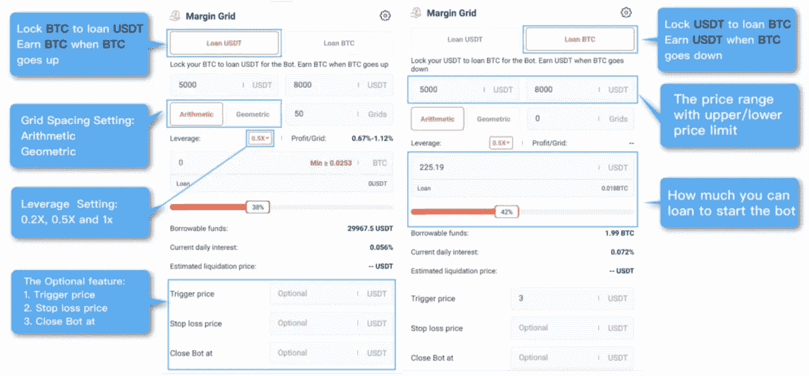

# 边缘网格机器人解释 Pionex

> 原文：<https://medium.com/coinmonks/margin-grid-bot-explained-pionex-7c2c693203db?source=collection_archive---------1----------------------->

## 了解 Margin Grid Bot 及其所有参数

Photo by [Jeremy Bezanger](https://unsplash.com/@jeremybezanger?utm_source=unsplash&utm_medium=referral&utm_content=creditCopyText) on [Unsplash](https://unsplash.com/s/photos/crypto?utm_source=unsplash&utm_medium=referral&utm_content=creditCopyText)

这个机器人对想要做空或做多市场的用户很有用。顾名思义，这个机器人也是基于[网格机器人](https://www.pionex.com/en-US/sign/ref/siZFAJUz)。让我快速解释一下它是关于什么的:

在 [Pionex](https://www.pionex.com/en-US/sign/ref/siZFAJUz) 上的网格交易中，你可以设置一个价格走廊，由一个价格区间的上限和下限组成。在这个范围内，价格可以变化，如果价格低，机器人购买一部分，如果价格高，它出售一部分。这种机器人非常适合市场的横向运动，当横向运动中有足够的波动时。避免以赔钱为结果的低卖高买等情绪反应是有好处的。然而，如果价格超出了这个范围，你可能已经在这个范围内低价卖出了。尽管如此，这还不算太糟，因为这样你就避免了更大的损失。[1]

> 如果你想在 [Pionex](https://www.pionex.com/en-US/sign/ref/siZFAJUz) ，[上试用这个机器人，点击这里](https://www.pionex.com/en-US/sign/ref/siZFAJUz)。

因此，从技术上来说，边缘网格 bot 机制是相同的，只是上下文不同。您可以选择做空[或做多](https://www.pionex.com/en-US/sign/ref/siZFAJUz)。[2]

*做空*
你拥有 USDT，你想做空以太坊。你用你的 USDT 作为抵押品，接受以太来做空以太坊。所以，你赌价格下跌。当以太下降时，你获得 USDT 和利润。接下来，你需要选择做空头寸的杠杆——0.2x、0.5x、1x、2x。现在您可以配置参数了。[2]

*龙*

你拥有以太，你想看以太坊。为此，你接受 USDT 并使用乙醚作为抵押品。你赌以太值上升。如果价格上涨，你就能获得利润。如上所述，你需要选择杠杆来做多头寸——0.2x、0.5x、1x、2x。然后，您可以配置参数。[2]

## 你明白杠杆是什么吗？

为了更好地理解，我将简要解释 Pionex 的杠杆网格机器人是如何工作的。对于上面解释的普通网格机器人，你存入 1000 USDT，机器人与 1000 USDT 一起工作，将它们投资于其他硬币(例如，卡尔达诺、比特币、以太等)。).杠杆网格机器人的工作方式不同。如果你选择 2 倍的杠杆，bot 会让你的投资翻倍。为此，它将从 pionex 资金池中贷出资金，并对贷出的资金按小时计算利率。所以，你实际上只有 1000 USDT，但它会借出 1000 美元，让你的投资翻倍。在牛市中，这可以帮助你真正利用你的钱，但同时你也可能失去所有的钱，因为你应用利率，如果市场下跌，你不仅会失去你的钱，还会失去你借的钱。所以，这并不意味着你会失去你借出去的钱——如果你的 1000 USDT 被清算，这个机器人就会停止。

正如你在上面读到的，多头和空头也可以像杠杆网格机器人一样利用杠杆。所以你可能会想，保证金网格 Bot Long 和杠杆网格 Bot 有什么区别。我告诉你。主要区别在于抵押品。有了杠杆网格机器人，你可以全押。你投资你的钱，如果它下跌你就输了，如果它上涨你就赢了。因此，杠杆网格机器人投资你的抵押品。保证金网格机器人保留你的抵押品，不进行投资。例如，你从 pionex 资金池中获得资金来应用保证金网格机器人，但要保留一定比例作为抵押品。[2]

Margin Grid Settings. Source: Pionex Website, asked for permission.

*   ***上限:*** 价格区间的上限。
*   ***下限:*** 价格区间的最低端。
*   ***网格数:*** 将价格区间划分为 x 个网格，设置网格/区间的买入和卖出报价
*   ***杠杆:*** 投资的倍数
*   ***可借入资金:*** 该资金从 pionex 池借入，用于应用杠杆网格 bot。
*   ***日利息:*** 借入资金收取的利率。每小时收费。利率是动态的，越多的用户应用杠杆网格机器人，它会更高。
*   ***预计平仓价格:*** 如果价格达到平仓价格，您的 bot 的头寸将被平仓。

> 如果你想在 [Pionex](https://www.pionex.com/en-US/sign/ref/siZFAJUz) 、[上试用这个机器人，点击这里](https://www.pionex.com/en-US/sign/ref/siZFAJUz)。

 [## 通过我的推荐链接加入 Medium-Hucker Marius

### 作为一个媒体会员，你的会员费的一部分会给你阅读的作家，你可以完全接触到每一个故事…

medium.com](/@hucker.marius/membership) 

*来源*

[1]https://www.pionex.com/blog/pionex-grid-bot/

[2]https://www.pionex.com/blog/margin-grid-bot/