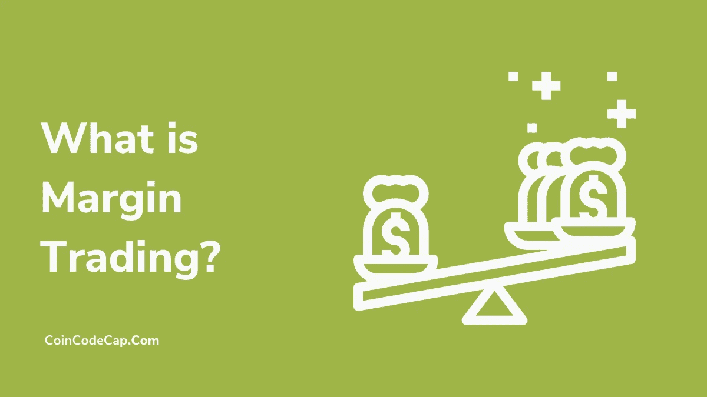
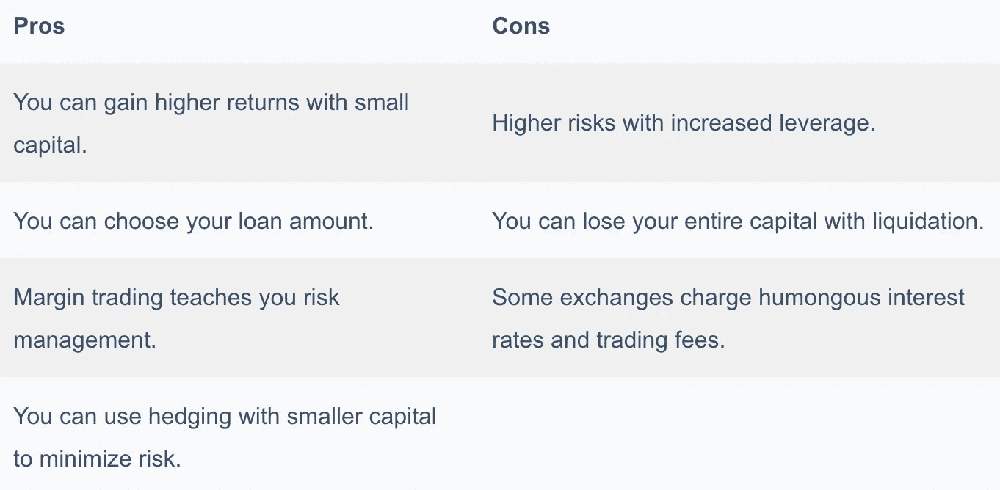

# 什么是保证金交易？保证金交易是如何运作的？[2021]

> 原文：<https://medium.com/coinmonks/margin-trading-abbe0b334f11?source=collection_archive---------12----------------------->

有时候人们很难理解保证金交易。因此，在本文中，我们将尝试解释什么是保证金交易以及保证金交易是如何运作的？我们将学习一些与保证金交易相关的基本术语，并概述在[加密保证金交易所](https://blog.coincodecap.com/crypto-margin-trading-exchanges)开始保证金交易的步骤。

# 总结(TL；博士)

*   保证金交易是指第三方借给你资金，用你的原始资本进行交易。
*   你可以根据你来设置杠杆，相应的成倍增加你的回报。
*   在隔离保证金交易中，交易所将您不同头寸的资金存储在子账户中，以防止您因某一特定头寸而损失超过您的资金。
*   交叉保证金交易将母保证金账户资金用于所有头寸，并防止清算。
*   你可以进行加密货币的保证金交易，也可以投资期货合约。
*   可以使用 [**【币安】**](https://blog.coincodecap.com/go/binance)[**Bityard**](https://blog.coincodecap.com/go/bityard)[**Bybit**](https://blog.coincodecap.com/go/bybit)等交流方式。，用于保证金交易。
*   有各种各样的术语，如权益、TP 比率、SL 比率、套期保值等。，这是融资融券交易者应该知道的。
*   保证金交易的平仓风险总是在增加。

# 什么是保证金交易？

加密保证金交易或保证金交易允许您以更高的资本借入资金进行交易。第三方或 [**交易所**](https://blog.coincodecap.com/crypto-margin-trading-exchanges) 以你的原始资本为抵押借给你资金。你决定你的贷款金额选择杠杆。

杠杆可以让你在交易所接受的范围内增加你的资本。在本文的后面，我们将再次讨论杠杆。

## 保证金交易是如何运作的？(一个例子)

假设你在一个平台上申请了 10 倍的杠杆，你有 5 USDT 作为原始资本。当你开仓时，交易所会额外借给你 45 USDT 投资市场。

现在，如果一项资产的价格上涨/下跌 5%，那么你将获得/损失(5 x 10 = 50%)。保证金交易可以立刻将你 5%的利润/亏损转换成 50%的利润/亏损。因此，保证金交易被认为是高利润和高风险的交易。

# 保证金交易的类型

大多数平台都提供两种或两种类型的保证金交易。新手通常喜欢单独保证金，而交叉保证金交易更适合专业交易者。

# 隔离保证金交易

在单独的保证金交易中，你所有头寸的保证金都保留在单独的子账户中。这有利于你在任何清算的情况下，因为你不必遭受任何进一步的损失，只有该特定位置的资金会丢失。

## 隔离保证金交易示例

让我们假设你的保证金账户里有 100 USDT。现在你在 BTC 市场建立了一个头寸，保证金为 10 USDT，杠杆为 10 倍。现在，BTC 的价格下跌了 10%，如果杠杆是 10 倍，你就会遭受 100%的损失。

在这种情况下，交易所会自动出售你所有的资产。**在这里，你不会损失超过 10 USDT** ，因为交易所不会从你的主余额中提取更多的资金来弥补损失。

# 交叉保证金交易

在交叉保证金交易中，你所有的头寸都有来自你主要保证金账户的资金。假设你在一个位置招致损失。在这种情况下，交易所可以从您的主余额中提取资金，以掩盖损失并防止清算。

## 交叉保证金交易示例

让我们假设你的保证金账户里有 100 USDT，你在 BTC 开了一个 10 USDT 的头寸，杠杆是 50 倍。现在 BTC 价格下跌了 2.2%，你亏损了 110%。

现在，与单独的保证金交易不同，**交易所将自动增加你的头寸保证金，以防止平仓。**这可能会造成更大的损失，但会让你的头寸保持开放。

# 加密保证金交易

[**交易所一般提供加密货币的保证金交易**](https://blog.coincodecap.com/crypto-margin-trading-exchanges) 。在几乎所有的平台上，你的加密保证金订单都是在现货市场上发出并执行的。

您可以利用自己选择的杠杆做多或做空一系列加密资产。

# 期货交易合同

期货合约允许你在未来以预定的价格卖出或买入一项资产。几乎所有的交易所都允许期货市场的保证金交易，而且它们通常提供比加密资产更高的杠杆。 [**PrimeXBT**](https://blog.coincodecap.com/go/primexbt) 在期货上提供高达 1000 倍的杠杆。

# 融资融券交易如何入门？

有时，对于初学者来说，理解保证金交易是一个乏味的过程。因此，我们有一个在任何交易所开始保证金交易的步骤大纲。

**注意:**这些步骤是一般化的；因此，如果你在你选择的交换中找不到一个确切的步骤，那么试着进行下一步。

## 创建一个帐户

您可以通过以下步骤在任何提供保证金交易 的 [**加密交易所创建账户。**](https://blog.coincodecap.com/crypto-margin-trading-exchanges)

1.  去交易所官网点击报名。
2.  现在，输入您的电子邮件和密码，然后验证您的电子邮件。
3.  如果交易要求您完成 KYC，请访问“个人资料”选项卡，然后单击“完成 KYC”。
4.  输入您的个人信息，上传所有文档，并验证您的银行帐户。

## 存款

你在任何市场开仓都需要资金，你可以按照以下步骤存款:

1.  从交换的标题访问钱包部分。
2.  现在，点击你的首选加密资产或菲亚特存款按钮。
3.  你可以为菲亚特做银行转账或 NEFT，具体取决于平台接受的方式。
4.  在数字货币的情况下，扫描二维码或将资金转移到您的钱包地址。

## 开立和关闭保证金订单

现在，您可以按照以下步骤开始或结束有保证金的头寸:

1.  访问加密/期货/衍生品保证金市场选项卡，并选择要投资的资产。
2.  现在，输入你想投资的金额。
3.  现在，选择杠杆，点击长/绿色按钮做多或短/红色按钮做空。
4.  当你决定平仓时，点击平仓按钮。

# 加密保证金交易的最佳平台

还有很多类似 [**【币安】**](https://www.binance.com/en)[**Bityard**](https://www.bityard.com/)[**PrimeXBT**](https://blog.coincodecap.com/go/primexbt)等交易所。，在市场上提供保证金交易服务。

要了解更多，你可以阅读我们关于 [**五大加密保证金交易交易所**](https://blog.coincodecap.com/crypto-margin-trading-exchanges) 或五大 [**最佳比特币保证金交易交易所**](https://blog.coincodecap.com/bitcoin-margin-trading-exchange) 的文章。

## 保证金交易词汇

在进行保证金交易时，你会经常遇到术语/术语/词汇，你应该知道它们的意思。以下是一些对你有帮助的术语。

## 什么是杠杆？

杠杆决定你的贷款额。假设你对 1 USDT 运用 10 倍的杠杆。然后平台会以你最初的 1 USDT 作为抵押借给你 9 USDT，你就可以开一个价值 10 USDT 的头寸。

## 融资融券交易中的抵押品是什么？

当你在保证金交易中开仓时，交易所持有你的初始资本。如果你的预测出现偏差，交易所会用这笔资金作为抵押品，弥补损失。

## 融资融券交易中什么是做多，如何做多？

做多意味着建立一个头寸来预测资产价值的增长。通过做多，你以较低的价格买入一项资产，并试图以较高的价格卖出，差价就是你的利润。

您可以点击保证金交易窗口上的“做多/买入/绿色”按钮进行“做多”。

## 融资融券交易什么是做空，如何做空？

通过“做空”，你建立了一个头寸来预测资产价值的减少。你以较高的价格买入资产，以较低的价格卖出，将差价作为利润。

您可以点击保证金窗口上的做空/卖出/红色按钮进行“做空”。

## 融资融券交易中的限价单是什么？

限价单允许你以期望的市场价格提前下单。当市场满足您的订单要求时，订单就会执行。

## 融资融券交易的市场秩序是怎样的？

市价单允许你实时开仓。您可以点击“多头/空头”按钮，根据当前市值开立一个头寸。

## 什么是保证金交易中的演示？

一些平台在保证金交易部分提供“演示”，如 [Bybit](https://testnet.bybit.com/) 。这个演示允许你在没有任何资本、利润或损失的情况下下单和平仓。它帮助新手研究市场，了解保证金交易是如何运作的。

## TP 比例是多少？

你的 TP 比率告诉你应该平仓的价格，以获得正回报。你可以输入你想要的利润百分比或你想要的 USDT 利润。市净率会给你收盘价，以获得回报。

## 什么是 SL 比率？

止损或 SL 比率告诉你交易的收盘价，超过这个价格你就不能承受损失。您可以快速输入金额或百分比，以获得特定头寸的收盘价。

## 什么是浮动 P&L？

浮动 P&L 告诉你你现在的盈利或亏损。

## 什么是股权？

股票告诉你你的保证金账户的总价值，包括你的资产在未平仓状态下的当前市场价值。

## 什么是追缴保证金？

当你开始在你的未平仓头寸中承担损失，清算即将发生时，交易所就会联系你。他们打电话给你，要求你在未平仓头寸上追加资金，以防止平仓。

## 关门时间是几点？

所有交易所每天平仓一次，你需要建立新的头寸。记住你正在使用的交易所的收盘时间，因为离开一个未平仓头寸可能会给你带来损失。

## 什么是维护保证金？

在你开仓后，你必须在你的保证金账户中维持一个最低金额。根据 FINRA 的规定，你必须在保证金账户中保持至少 25%的资产价值。

## 什么是 ADL 机制？

当你开始失去你的资金，并达到清算价值时，ADL 机制允许交易所出售你的资产。这是为了通过有效利用杠杆来弥补交易所的损失。

## 什么是对冲？

对冲意味着在两个方向都持有头寸，作为市场波动的保险。

例如，假设您在 BTC 市场以 50 倍的杠杆和 58，000 的价格建立了一个 10 USDT 的多头头寸。现在，你不知道市场会向哪个方向发展。所以你开了一个同样杠杆和价值的空仓。

如果市场向另一个方向跳跃，你仍然可以通过平仓获得回报。

结帐， [**Pionex 的**](https://blog.coincodecap.com/go/pionex) 现货期货套利机器人做类似的事情，并根据这种策略为你提供恒定的回报。

# 保证金交易的风险

尽管保证金交易听起来不错，但它有很高的潜在风险。其中一些如下:

1.  加密市场非常不稳定，这可能导致巨大的回报，也可能导致损失。
2.  杠杆越高，资本越低，平仓风险越轻。
3.  永远不要在开仓时离开屏幕，因为市场可能会在一眨眼的时间里横向波动。或者使用 [**密码交易机器人**](https://blog.coincodecap.com/best-crypto-trading-bots) 。
4.  因为保证金交易增加了风险，所以只投资你准备好要损失的金额。
5.  始终牢记您正在使用的交易所的所有头寸的**收盘时间**。

# 保证金交易:利弊

# 结论

保证金交易是利用借来的资金进行交易，对于新手来说，这可能是一项单调乏味的工作。你应该一直使用 [**顶级加密保证金交易所**](https://blog.coincodecap.com/crypto-margin-trading-exchanges) 因为一个小故障就可能让你损失全部资本。然而，有了正确的信息和经验，你可以很快在交易中获得回报。保证金交易对新手交易员来说也是危险的，他们可能会遭受重大损失。因此，如果你想要不带复杂行话的杠杆，那就试试 [**杠杆代币**](https://blog.coincodecap.com/leveraged-token) 。

# 常见问题

如果你失去了保证金交易，会发生什么？

假设你没有响应追加保证金的要求，或者没有增加仓位的资金。然后交易所自动出售你所有的资产来弥补损失，你就失去了你的资本。

为什么保证金交易是危险的？

因为你是在借入资金上交易，借出资金给你的交易所不会遭受损失。因此他们把你的资本作为抵押品。当你增加杠杆价值时，你就增加了平仓的机会。

**可以用保证金买比特币吗？**

比特币保证金交易就是赊账购买比特币。因此，即使你使用杠杆购买比特币，你也必须平仓才能获得回报。如果你获利，你可以用这些资金购买比特币。

*   [什么是比特币 CFD 交易？](https://blog.coincodecap.com/what-is-bitcoin-cfd-trading)
*   [Pionex vs 币安 2021 |交易、费用和机器人](https://blog.coincodecap.com/pionex-vs-binance)
*   [DeFi(分散金融)终极指南](https://blog.coincodecap.com/the-ultimate-guide-to-defi-decentralized-finance)
*   [3Commas Review 2021 |一款出色的加密交易机器人【更新】](https://blog.coincodecap.com/3commas-review-an-excellent-crypto-trading-bot)

*原载于 2021 年 3 月 17 日 https://blog.coincodecap.com***。**