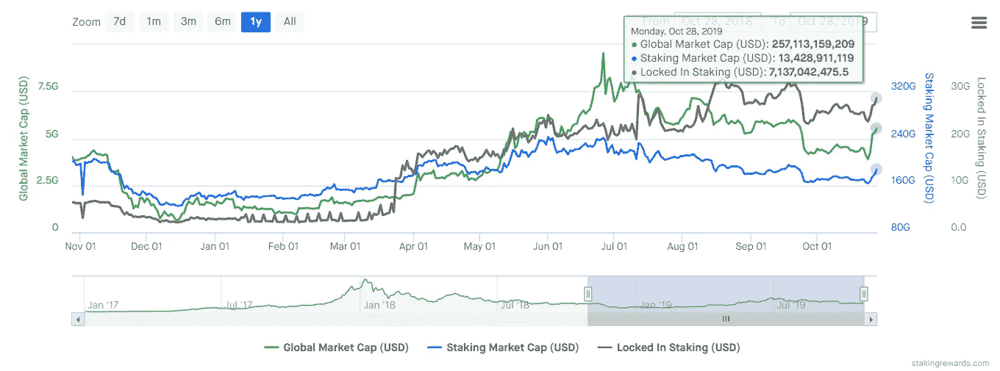

# 赌注收益率的市场扭曲

> 原文：<https://medium.com/coinmonks/market-distortions-of-staking-yields-d8078586c183?source=collection_archive---------0----------------------->

随着越来越多的区块链证据在加密生态系统中变得更加突出，理解赌注收益率对市场结构的影响就变得非常重要。

# **流动性影响**

较高的收益率对市场流动性造成负面压力。流动性市场最重要的特征之一是有能力购买或出售大量的…