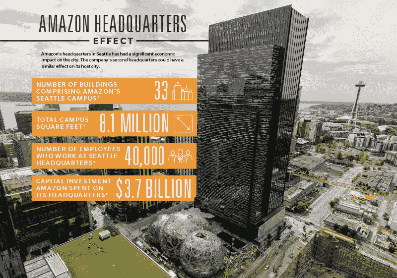
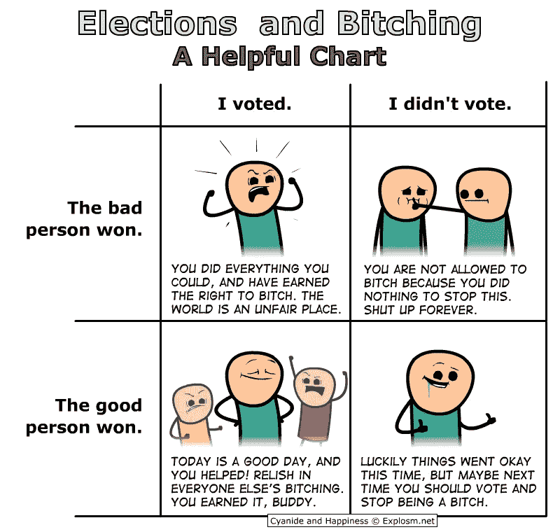
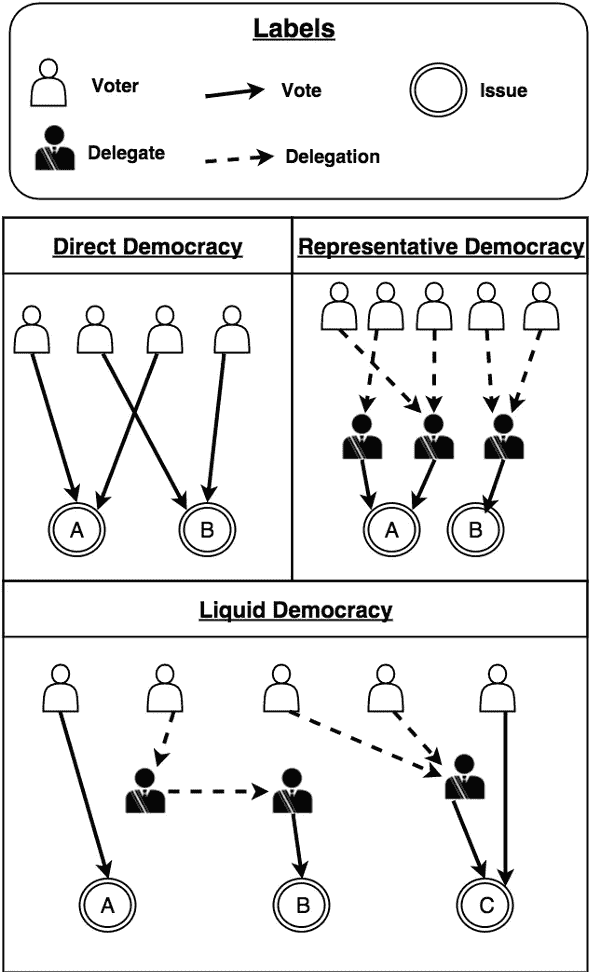
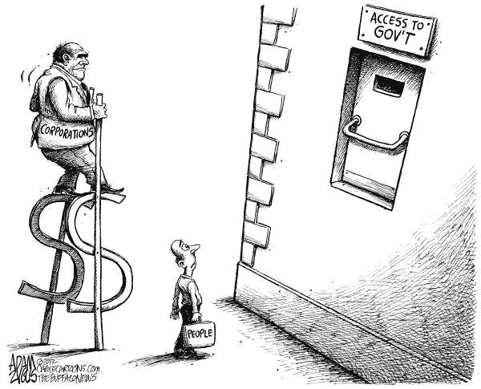

# 市场驱动的民主？专制和流动民主

> 原文：<https://medium.com/coinmonks/market-driven-democracy-futarchy-and-liquid-democracy-e140fbc39ae5?source=collection_archive---------2----------------------->

在我们开始之前，那些一直在关注媒体马戏团(即世界新闻)的人会正确地指出，大多数政府已经在很大程度上受到资本主义的驱动。在资源丰富但不太成熟的民主国家尤其如此，因为无能的领导人能够通过开采自然资源来安抚他们的亲信。人们不需要寻找太多盗贼统治的例子，因为对大多数人来说，不难回忆起你们当地政府中这种任人唯亲或任人唯亲的例子。事实上，《经济学人》实际上产生了一个裙带资本主义指数。如果你有兴趣看看现实生活中的好莱坞戏剧是如何上演的，我肯定会推荐你找到更多关于 1MDB(和这个[采访](https://www.youtube.com/watch?v=w0MjT7aeMeo))的信息。

WSJ’s Summary of 1MDB

私营企业也是资本主义对治理过程日益增长的影响力的同谋。一个典型的例子就是公司，尤其是那些业务更加无形的科技公司，为了逃避 T4 公司税而走的很远。尽管在主流新闻中几乎被遗忘，巴拿马报纸显示了这些公司和他们各自的代表与世界各国政府领导人的紧密联系。可以毫不夸张地说，许多政府政策都不可避免地受到这种关系的驱动，无论是有意还是无意。

抛开富人和权贵的生活不谈，这种结构本质上也是我们选择的结果。许多民粹主义领导人都是基于吸引人和简单化的承诺当选的，从长远来看，这总是会导致灾难性的后果。甚至我们的消费偏好，特别是寻找便宜货的兴奋感，也间接促使金钱在政治中的影响力越来越大，因为它赋予我们支持的公司权力。亚马逊最近对新总部所在地的投标显示了地方政府为了在投标中被考虑而愿意付出的努力，其中许多政府考虑了数亿美元的激励措施，尽管该公司作为一个整体已经支付了比其实体竞争对手更低的公司税。

[Who could resist those numbers?](https://communityimpact.com/dallas-fort-worth/development-construction/2017/10/26/plano-submits-sites-hunt-amazons-5b-second-headquarters/)

一如既往，现实总是要复杂得多，因为在我们正朝着的这个资本主义反乌托邦中，没有哪一方是无可指责的。更紧迫的是，许多人甚至没有资源也没有时间去真正理解他们的选择是如何促成这个循环的，因为他们太忙于生存。当前体系中固有的激励似乎正在将人们推向日益两极分化的极端，因为中间立场既没有那么有利可图，也没有那么吸引人。因此，抛开系统中的参与者，可能是时候后退一步，重新思考游戏规则本身，看看是否有更好的治理方法。具有讽刺意味的是，在享受资本主义带来的好处的同时，新的市场体系可能是控制资本主义过度行为的一个解决方案。

对于那些熟悉这些概念的人来说，可以在最后一节找到一个总结。

**社会可扩展性**

> “就个人而言，精神错乱是罕见的；但在团体、党派、国家和时代中，这是规则。”—尼采

除了引用上面尼采的话显得聪明之外，他的引用击中了治理中最大问题的核心:当对大多数人来说，决定在哪里吃家庭晚餐已经足够困难时，你如何协调越来越多的个人。有趣的是，随着社会变得越来越大，越来越复杂，权力越来越集中在少数人手里。这种集权是事物的自然规律，还是我们的治理体系没有相应地发展？

回想起来，集中化似乎是城市发展的自然结果；毕竟，在较小的群体中达成共识要容易得多。日常生活的许多方面本质上是世俗的，实际上可以被视为许多人宁愿避免的管理工作。只要我能得到可靠的电、水和 YouTube，我真的不在乎它是如何被传递的。我们都是懒惰的人，只要某样东西有用，并且不需要我们付出一个肾的代价，我们就会在自己的泡泡里快乐，而把决定权留给真正对这些事情感兴趣的人。

尽管我在这里主张我们需要更加积极主动，但是一天只有这么几分钟。迫使人们考虑他们生存的方方面面，本质上会把我们带回一个自由的狩猎采集社会。事实上，正是在土地革命期间，当个人能够持续生产剩余食物时，社会中的小部分人才能不再担心日常生存，而是将他们的时间用于丰富或控制社会。这慢慢演变成对农民征税的一种形式，这样农民就可以专注于增加作物产量，而不必担心他的商店被非法搜查。农民可以放心，他的商店只会通过法律手段定期遭到搜查，但至少暴力和饥饿的可能性更小。

因此，个人将自主权和权力让给了承诺更大安全和便利的机构。对许多个人来说，这种交易的真实成本高度依赖于机构和个人之间的权力动态；换句话说，就是集权的程度。一方的权力越大，另一方的谈判能力就越弱。更糟糕的是，一旦获得这种权力，对失去这种权力的恐惧往往会腐蚀哪怕是最善意的人。因此，人们很容易想起现代社会最著名的一位老人的话:

> “权力越大，责任越大”——本叔叔(瑞普·斯坦·李)

从民主社会中个人的角度来看，随着社会的发展，这种权力动态变得越来越糟糕，因为他们的声音越来越淹没在噪音中。这种无力感和缺乏代表性是许多现代民主国家将政治投票视为理所当然的一个重要原因。

[Too relatable](http://explosm.net/comics/4211)

更糟糕的是，具有讽刺意味的是，在许多国家采用的代议制民主模式中，这种代表性的缺乏更加严重。在这种模式下，公民基本上必须从有限的候选人中选出一名代表，希望他们的意识形态观点尽可能一致。这当然是不可能的，其结果是人们倾向于根据一些关键的承诺来投票。随后，候选人受到激励，以民粹主义承诺竞选，这通常在情感上吸引选民。一个人被剥夺的权利越多，她就越有可能投票反对这个制度，引入一个会破坏现状的人。

> “把一件赝品卖给一个相信它是真品的人要比把一件真品卖给一个相信它是赝品的人容易得多”——在网上某处读到的

这种模式的另一个结果是，由于当选代表必须吸引大众，软技能比特定工作技能更受重视。他们可能没有最好的技术知识来完成工作，但是又有多少人掌握了技术方面的知识。问题出现了，因为这些代表将不得不在对政策影响的理解(相对于专业人员而言)最差的情况下对政策提案进行投票。这并不是说这份工作的最佳人选有糟糕的沟通技巧，但考虑到官员应该在众多问题上代表选民的事实，对于每个问题，肯定有更有经验的专家。

因此，无数因素将当前系统推到了极限:

*   不能指望公民处理好他们与社会关系的方方面面。只要行得通，大多数人都会乐于授予他们自主权，这样他们就可以专注于自己的专业领域。
*   官员们倾向于兑现民粹主义承诺，因为不可能代表这么多个人的观点。因此，这些问题会盖过其他政策决定，因为当选官员也有投票权。
*   学科专家作为软技能被边缘化，在一定程度上，知识的广度是影响决策的关键。知识的深度仅次于外表和关系网。

我们最终得到的是一个政策制定机器，它把枯燥和多方面的长期规划与有争议和单一层面的短期承诺放在一边。此外，将个人偏好简化为一次投票往往会导致权力集中，因为减少的决议使当选官员负责其专业领域之外的决策。当选官员也会倾向于(有意或无意地)让自己被迎合他们的学科专家包围，从而导致社交网络凌驾于公正的专家意见之上。

因此，为了系统的发展，它需要解决以下问题:

*   增加了对个人关心的话题的投票决议
*   消除决策回音室
*   增强政策决策的问责制

值得注意的是，尽管以上主要是治理问题，但新技术可能会提供解决这个问题的替代方法。同样值得注意的是，下面提出的想法只是，未经测试，但仍然有希望的想法。因此，把它作为开始对话的起点。

液态民主:代表制和自决之间的中间地带？

刚刚变得可行的最有希望的治理结构之一是流动民主。我强烈推荐 IOTA 联合创始人写的这篇[文章](/organizer-sandbox/liquid-democracy-true-democracy-for-the-21st-century-7c66f5e53b6f)给那些对深度潜水感兴趣的人。简而言之，流动民主使选民能够就一个问题直接投票，或者他们可以将投票权委托给代表，由代表投票或代表他们进一步投票。这可以在全年完成，而不依赖于选举周期，因此更符合现实。实质上，流动民主解决了选民误报的问题，同时也使选民能够决定她愿意放弃的自决程度。

这种模式刚刚开始获得关注的主要原因是一个技术问题:在智能设备和互联网出现之前，没有简单的方法来管理这种网络的指数级增长。

[Increasingly complicated relationships](/organizer-sandbox/liquid-democracy-true-democracy-for-the-21st-century-7c66f5e53b6f)

如果没有智能设备，跟踪所有这些关系和每张选票的权重将是一个不切实际的要求。没有互联网，临时投票是不可能的。最后，也可能是最大的技术问题，如果没有区块链，数字身份验证似乎是不可思议的。假设目前在区块链参与身份管理的好人成功证明了这种技术的可行性和好处，流动民主是有希望的，原因如下:

*   个人对自己的投票有更好的决策控制权，也有决定自己参与程度的自由。个人对某个问题的投票不再纯粹依赖于通过代表进行的代理投票，因为可以选择直接对这些问题进行投票。在个人漠不关心或缺乏知识的情况下，他的投票可以委托给他信任的人。与代议制民主不同，这种投票授权并不局限于他们只知道名字的人的名单，而是可以是他们个人网络中知识特别丰富的人。这也意味着降低成为代表的门槛。
*   提供集中式解决方案的替代方案。请注意，这种解决方案并没有消除集中化的可能性，因为投票授权最终仍可能会累积到某个特别受欢迎的个人手中。然而，它引入了对这种集中化趋势的检查，因为对选票的竞争与解决具体问题的能力更紧密地联系在一起，因此相对于通才提升了专家的地位。因此，由于政党本身在争取选民和影响政策决定方面发挥的作用越来越小，基于政党归属的极端两极分化可能会减少。
*   它将民选代表与他们的决策联系得更紧密。事实上，委派的投票权可以随时移动，这意味着当选代表的责任和义务增加了。未能兑现选民对他们的信任可能会导致权力相对迅速地丧失。必须指出的是，实行选举周期的部分原因也是为了给政策的实现提供一个足够的窗口，因此可能需要寻求一种平衡。尽管如此，这种变化对整个社会的破坏性影响较小，因为当选代表仅限于其特定领域。

理论上，液体民主似乎是前进的方向，因为它在自决和便利性方面平衡了竞争环境。它使个人能够根据他们的舒适程度来调整他们的参与程度。重要的是，在这样的系统中投票确实是信任的反映，因为如果投票人决定委托，可能的候选人可以是任何人。这可能是让选民感受到更大的社会责任感所需的火花，因为他们确实有机会影响他们真正热衷的结果。因此，这是真正精英管理的起点。

因此，在现实世界中开始原型化这种模型将是有趣的，因为它能够更精细和更合理地映射社会商定的未来路线图。更进一步来说，流动民主甚至可以与专制的原则相结合，以确保最有效地利用共享资源，并将任人唯亲的影响降至最低。

**专制:用更多的钱解决政治中的钱？**

[Seems about right](http://media.cagle.com/82/2012/06/13/113406_600.jpg)

我们尚未直接解决的一个主要问题是金钱在政治中的影响。上述流动民主模式通过最大限度地减少竞选资金需求以及减少腐败机会(腐败往往伴随着权力的集中),确实对其进行了控制。然而，有待解决的一件事是，当选代表对如何执行政策没有任何制约。鉴于他们的权威地位，他们处于这样的地位，他们可以偏袒自己网络中的人，以获得由国库支付的合同。虽然在一个流动的民主国家中，投票的短暂性间接解决了这种风险，但问题是这种情况只有在事后才知道，这导致了资源的浪费和不理想的问责制。因此，专制试图通过区分我们想要的政策和实现所述政策的方式来解决这个问题。

从本质上讲，在未来社会中，价值观应该反映共享被治理资源的群体的主观目标和偏好，而确定最适合实现这些目标的政策最好留给更“客观”的预测[市场](https://blog.ethereum.org/2014/08/21/introduction-futarchy/)。政策由公开市场价值决定，并通过委托代理或自动化流程实施。

顺便提一下，在未来通过区块链引入[分散预测市场](/coinmonks/oracles-how-blockchains-perceive-the-world-390dcce3789c)实际上可能是分散技术的更好的使用案例之一，因为集中预测市场依赖于一个完全值得信赖的实体，它可以有效和安全地管理账本，并始终如一地报告事件的正确结果。实际上，中央行政人物的存在要求预测市场服从管理机构，管理机构允许外部利益施加压力或关闭这些[市场](https://www.ocf.berkeley.edu/~alexandra/Blockchain/Futarchy)。

“进一步发展”是罗宾·汉森在 2000 年首次提出的想法。正如 Hanson 所总结的，futarchy 有 3 个关键假设:

*   民主的失败很大程度上是因为没有收集可用信息。
*   区分富裕幸福的国家和贫穷悲惨的国家并不难。
*   博彩市场是我们最著名的信息收集机构

在最初制定双权制时，有必要定义一个正式的“国民福利”衡量标准，以便能够在事后对其进行衡量。因此，政府的基本规则是:

> “当一个博彩市场明确估计一项提议的政策会增加预期的国民福利时，该提议就成为法律”——[汉森](http://mason.gmu.edu/~rhanson/futarchy.html)

“福利指标”的存在是一个至关重要的假设，因为效用的概念本质上是主观的。然而，正如 Buterin 在他的关于[futarcy](https://blog.ethereum.org/2014/08/21/introduction-futarchy/)的潜水中所指出的(这是我强烈推荐的)，人类的价值是复杂的，不可能被浓缩成一个单一的数字度量。尽管如此，这并不能否定它，因为在任何政府中，福利指标的存在都是绩效评估不可避免的一部分。事实上，正是在这一点上，与流动民主的融合可能会带来更好的结果。

**市场驱动的民主？**

鉴于流动民主和专制的许多核心目标是紧密一致的，两者的混合模式可能会被证明是有价值的，因为它们在实施上基本上是互补的。

*   选民冷漠:在一个流动性民主中，选民可以选择他们的参与程度。如果他们真的对某个话题感兴趣，他们可以直接投票，甚至被委托投票，而如果他们对某个话题不感兴趣，他们可以委托他们知道会为他们投票的人投票。Futarchy 简化了这一过程，只要求广泛的投入，以确定福利指数的改善。
*   **知识聚合:**由于上述原因，流动民主鼓励特定领域的利益相关方进行充分知情的讨论。此外，在流动性民主中，更精细的政策目标选择清楚地定义了问题集。Futarchy 将这一点推进了一步，使个人能够通过在市场上买卖来将他们的发现纳入政策决策过程，以便从他们的高级信息差异中获利。
*   **限制网络的影响:**流动民主将政治联盟在赢得选民方面的影响降至最低。低准入门槛和投票的短暂性将重点更多地放在有效的政策实施上。由于市场对实施哪项政策拥有最终决定权，因此，父权制是对民选代表决策的一种制衡。因此，利益冲突被最小化。
*   **增强问责制:**在流动性民主中，投票的短暂性将当选代表与其政策目标的结果更紧密地联系在一起。一个进一步的权力机构通过迫使利益相关者在政策决策过程中把他们的钱放到他们该说的地方来加倍这一点。只有坚信自己政策有效性的人，才会愿意把自己的钱押在赌注上，以推动他们想要的结果。
*   在一个流动的民主体制中，政策制定不再是争夺选票，而是赢得选民的信任，因为对谁可以当选没有限制。Futarchy 消除了个性的影响，因为财务回报最终是通过研究模型、统计分析和交易图表来确定的。

当然，引入基于市场的治理也会让政策制定过程暴露在资本主义的过度行为之下。最主要的担忧是，有财力的政党可以通过购买他们想要的结果来操纵政策制定市场。更糟糕的是，如果达到临界点，财务理性的投资者可能会在噪音的基础上加入进来。这绝对是一个合理的考虑，但就与现行制度比较而言，我认为有两个主要优点:

*   透明度:向开放市场的转变将迫使政策决策过程变得更加透明。个人将通过一个可公开搜索的分类账直接与他们的政策决策偏好联系在一起。代理市场操纵仍然是可能的，但这可能仍比当前的政治游说系统有优势，在当前的政治游说系统中，资金会影响行政决策，而不是直接参与政策。
*   **成本:**为了操纵市场，操纵者需要拥有超过市场确定的“最佳”政策的资金。发生这种情况的可能性取决于具体问题。尽管如此，如果这是一个特别有争议或重要的问题，预计这种费用将大大高于贿赂少数代表的费用。此外，只要愿意通过抵制操纵来获利的人的市场势力超过操纵方的市场势力，诚实的参与者就会获胜，并在[过程](https://blog.ethereum.org/2014/08/21/introduction-futarchy/)中从操纵方那里榨取大量资金。

最终，这种模式在很大程度上仍然是理论性的，但它解决了有效治理的一个核心问题，即信任。流动民主确保了授权投票是信任的标志，而专制制度使整个制度更值得信任，因为操纵的机会更少。至关重要的是，这种系统承认知识本质上是分布式的，因此在制定影响整个社会的政策时，任何一方都不应拥有行政决策权。

谢谢你坚持到最后。希望听到你的想法/评论，所以请留言。我在 twitter 上很活跃[*@*AwKaiShin](https://twitter.com/awkaishin)*如果你想收到更多易消化的加密相关信息，或者访问我的* [*个人网站*](https://www.awkaishin.com/) *如果你想要我的服务:)*