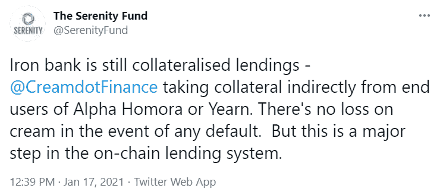
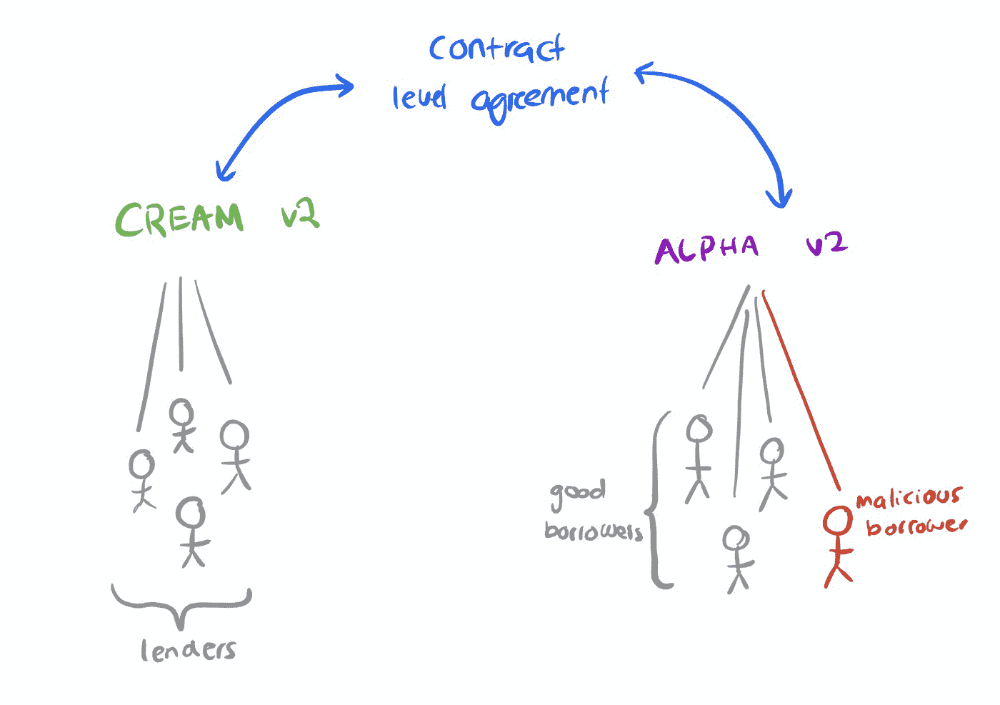

# [市场信息]阿尔法·霍莫拉欠铁银行的债务和加密无抵押贷款

> 原文：<https://medium.com/coinmonks/market-info-alpha-homoras-debt-to-iron-bank-and-crypto-uncollateralized-landing-3299058cdfc?source=collection_archive---------4----------------------->

2 月 13 日，Alpha Homora 被黑客利用，价值 3000 万美元的 ETH 被从其金库中提取。

这种情况发生在阿尔法·霍莫拉的 V2 身上，这是一个几周大的新版本，与另一个相对较新的项目“奶油金融铁银行”合作。我们过去报道过阿尔法·霍莫拉和 T2 的奶油金融。我们没有详细介绍 Iron Bank，因为它通常与用户无关。我们在一条推文中强调了铁银行的本质:

本质上，铁银行是密码借贷行业的 B2B 借贷平台。它允许 Cream Finance 将其盈余余额借给像 earning 或 Alpha Homora 这样的平台。向往和阿尔法霍莫拉反过来借给他们的用户。

该行业将 Iron Bank 视为无抵押贷款，因为这种贷款是基于 Yearn 或 Alpha Homora 的信用。我们强调，虽然这没有错，但这是一种保守的说法。铁银行并非完全没有抵押。它是由 Yearn 或 Alpha Homora 的借款人抵押的，他们将资产作为抵押品存入这些平台。铁银行依靠这些抵押品向渴望和阿尔法·霍莫拉放贷。从 Iron Bank 到 Yearn 或 Alpha Homora 的每笔交易都有特定用户的担保支持。

在正常情况下，如果来自 Alpha Homora 的用户金库有来自 Iron Bank 的借款，并且不幸该用户的金库被清算，Alpha Homora 将扣押该用户的抵押品，并在清算费用后偿还 Iron Bank。

如果我们在传统金融领域打个比方，铁银行就像是一家为阿尔法奥诺拉(Alpha Honora)这样的汽车贷款公司提供融资的银行。用户在汽车金融公司放下汽车的权属证书(作为抵押物)，开车离开汽车；汽车公司将所有权证书抵押给银行，并贷款美元来支付汽车款；用户会在以后的某个时间，用利息偿还汽车金融公司。汽车贷款全部还清，用户收回权属证书；或者他违约，然后银行卖车(因为它持有所有权证书)。

铁银行和阿尔法·霍莫拉的工作方式类似。因此，这不是信用贷款，而是抵押品的转移，使跨平台贷款更加灵活。铁银行的运营方 Cream Finance 并不一定要了解 Alpha Homora 的用户。

这就是问题所在。在阿尔法·霍莫拉的用户中有一个黑客，在 2 月 13 日，他抽干了阿尔法·霍莫拉的 ETH 金库的资金，并在金库抵押品中留下了低估的价值。完整的故事如下:[那么到底发生了什么？对最近发生的奶油//阿尔法事件进行深度剖析。](https://defiweekly.substack.com/p/efab8b4a-5b1d-4d87-8a64-913070ec328f)这里不做进一步阐述。用上面的类比，有人贿赂了汽车金融公司，拿走了一辆昂贵的汽车(如劳斯莱斯),但只留下了一辆丰田汽车的所有权证书。

现在，阿尔法·霍莫拉承认这是对他们的剥削，而不是奶油。确实有一瞬间很混乱。

该问题之后的问题将是:

*   谁来承担损失？
*   这是谁的错？

从智能合约的角度来看(让我们假设在 Cream Finance 和 Alpha Homora 之间除了智能合约之外没有什么)，没有什么可做的。黑客攻击将导致阿尔法·霍莫拉无力支付铁银行的债务，因为阿尔法·霍莫拉的一些资产被盗。因此，损失最终落在了铁银行身上，即瑞士联邦理工学院的 V2 信贷银行。

但是这会马上发生吗？不会。只有当铁银行的所有贷款人都从(ETH)金库中撤出时，阿尔法·霍莫拉才会受到偿还铁银行的压力。在此之前，铁银行的 ETH 处于抵押状态(一个 ETH 减去 Alpha Homora hack 按比例造成的损失)。

除了智能合约，Alpha Homora 似乎愿意制定一个解决方案，以确保钢铁银行贷款人不会亏损。这纯粹是商业谈判。守则就是法律，但好的生意需要善意。我们相信 Alpha Homora 会拿出一个计划来缓解这种情况，为自己的声誉和行业内的长期业务活力。

从这里，我们可以看到，在密码行业，贷款不完全基于抵押品，贷款不完全基于代码。信用开始形成，这是密码行业成为功能性金融行业组成部分的基础。

(宁静队，客座作家，2021 年 2 月 15 日，推特:【https://twitter.com/SerenityFund 

> 加入 Coinmonks [电报集团](https://t.me/joinchat/EPmjKpNYwRMsBI4p)，了解加密交易和投资

## 另外，阅读

*   什么是[闪贷](https://blog.coincodecap.com/what-are-flash-loans-on-ethereum)？
*   最好的[密码交易机器人](/coinmonks/crypto-trading-bot-c2ffce8acb2a) | [网格交易](https://blog.coincodecap.com/grid-trading)
*   [3 商业评论](/coinmonks/3commas-review-an-excellent-crypto-trading-bot-2020-1313a58bec92) | [Pionex 评论](/coinmonks/pionex-review-exchange-with-crypto-trading-bot-1e459d0191ea) | [Coinrule 评论](https://blog.coincodecap.com/coinrule-review-a-perfect-trading-bot)
*   [AAX 交易所评论](/coinmonks/aax-exchange-review-2021-67c5ea09330c) | [德里比特评论](/coinmonks/deribit-review-options-fees-apis-and-testnet-2ca16c4bbdb2) | [FTX 交易所评论](/coinmonks/ftx-crypto-exchange-review-53664ac1198f)
*   [n 平均零点评审](/coinmonks/ngrave-zero-review-c465cf8307fc) | [Phemex 评审](/coinmonks/phemex-review-4cfba0b49e28) | [PrimeXBT 评审](/coinmonks/primexbt-review-88e0815be858)
*   [by bit Exchange Review](/coinmonks/bybit-exchange-review-dbd570019b71)|[bit yard Review](https://blog.coincodecap.com/bityard-reivew)|[coin spot Review](https://blog.coincodecap.com/coinspot-review)
*   [3 commas vs crypto hopper](/coinmonks/3commas-vs-pionex-vs-cryptohopper-best-crypto-bot-6a98d2baa203)|[赚取秘密利息](/coinmonks/earn-crypto-interest-b10b810fdda3)
*   最好的比特币[硬件钱包](/coinmonks/the-best-cryptocurrency-hardware-wallets-of-2020-e28b1c124069?source=friends_link&sk=324dd9ff8556ab578d71e7ad7658ad7c) | [BitBox02 回顾](/coinmonks/bitbox02-review-your-swiss-bitcoin-hardware-wallet-c36c88fff29)
*   [莱杰 vs n rave](https://blog.coincodecap.com/ngrave-vs-ledger)|[莱杰 nano s vs x](https://blog.coincodecap.com/ledger-nano-s-vs-x)
*   [密码拷贝交易平台](/coinmonks/top-10-crypto-copy-trading-platforms-for-beginners-d0c37c7d698c) | [比特码拷贝交易](https://blog.coincodecap.com/bityard-copy-trading)
*   [Vauld Review](https://blog.coincodecap.com/vauld-review)|[you hodler Review](/coinmonks/youhodler-4-easy-ways-to-make-money-98969b9689f2)|[BlockFi Review](/coinmonks/blockfi-review-53096053c097)
*   最好的[加密税务软件](/coinmonks/best-crypto-tax-tool-for-my-money-72d4b430816b) | [硬币追踪评论](/coinmonks/cointracking-review-a-reliable-cryptocurrency-tax-software-5114e3eb5737)
*   最佳[密码借贷平台](/coinmonks/top-5-crypto-lending-platforms-in-2020-that-you-need-to-know-a1b675cec3fa) | [杠杆令牌](/coinmonks/leveraged-token-3f5257808b22)
*   [莱杰 Nano S vs 特雷佐 one vs 特雷佐 T vs 莱杰 Nano X](https://blog.coincodecap.com/ledger-nano-s-vs-trezor-one-ledger-nano-x-trezor-t)
*   [block fi vs Celsius](/coinmonks/blockfi-vs-celsius-vs-hodlnaut-8a1cc8c26630)|[Hodlnaut 审查](https://blog.coincodecap.com/hodlnaut-review)
*   [Bitsgap 审查](/coinmonks/bitsgap-review-a-crypto-trading-bot-that-makes-easy-money-a5d88a336df2) | [Quadency 审查](/coinmonks/quadency-review-a-crypto-trading-automation-platform-3068eaa374e1)
*   [埃利帕尔泰坦评论](/coinmonks/ellipal-titan-review-85e9071dd029) | [赛克斯斯通评论](https://blog.coincodecap.com/secux-stone-hardware-wallet-review)
*   [DEX Explorer](https://explorer.bitquery.io/ethereum/dex) | [区块链 API](https://explorer.bitquery.io/graphql)|[local bitcoins 评论](https://blog.coincodecap.com/localbitcoins-review)
*   最佳[区块链分析](https://bitquery.io/blog/best-blockchain-analysis-tools-and-software)工具| [赚比特币](https://blog.coincodecap.com/earn-bitcoin)
*   [加密套利](/coinmonks/crypto-arbitrage-guide-how-to-make-money-as-a-beginner-62bfe5c868f6)指南:新手如何赚钱
*   最佳[加密制图工具](/coinmonks/what-are-the-best-charting-platforms-for-cryptocurrency-trading-85aade584d80) | [最佳加密交易所](/coinmonks/crypto-exchange-dd2f9d6f3769)
*   了解比特币最好的[书籍有哪些？](/coinmonks/what-are-the-best-books-to-learn-bitcoin-409aeb9aff4b)

> [直接在您的收件箱中获得最佳软件交易](/coinmonks/newsletters/coinmonks)

