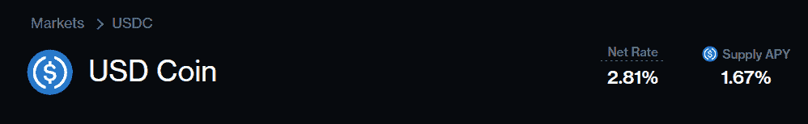
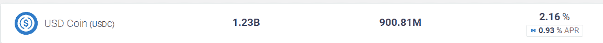
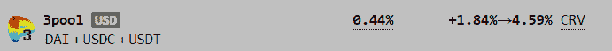

# [市场信息]无风险利率

> 原文：<https://medium.com/coinmonks/market-info-de-fi-risk-free-rate-140734270b36?source=collection_archive---------3----------------------->

Photo by [Micaela Parente](https://unsplash.com/@mparente?utm_source=medium&utm_medium=referral) on [Unsplash](https://unsplash.com?utm_source=medium&utm_medium=referral)

我们从事稳定币业务已经有一段时间了，不时有人问我们:去金融化的无风险利率是多少？

这是一个有趣的问题，因为去伪存真本身就是高风险的。整个行业去年夏天才刚刚起步，没有规章制度，充斥着黑客和监管，相当多的项目是匿名的。这里没有什么是没有风险的。

然而，我们相信帕累托改进原则，即给定风险集，一个人可以实现的最佳收益率是多少。完全不投资 De-Fi 或加密货币是合理的选择。但是如果你做了，你应该得到的最低收益率是多少？

因此，这里有两个问题:

1)为了获得一定的投资回报，你必须承担的最小风险是多少？

2)什么是收益率，如何衡量？

对于第一个问题，我们建议你至少要接触一个区块链，一个稳定币，和一个协议。目前，我们认为以太坊应该是最安全的连锁，和戴同样是最安全的稳定币(因所谓的原因退出，它没有得到完全支持)。可能有一些最安全的方案，我们现在采用平均法、复合法和曲线法。

对于第二个问题，有点棘手。收益必须以美元表示。通货膨胀和无风险利率之间只有一线之隔，我们将在另一篇关于去伪通货膨胀的文章中讨论。例如，你可以持有 eth2.0，在 eth 上有 7%的收益率。这 7%是无风险的吗——它没有风险，但它不是 ETH 系统的收入。Eth 2.0 赌注收益率基本上在验证者和其他持有人之间重新分配。ETH 系统的价值并不因标桩行为而改变。从经济学意义上来说，这就是通货膨胀。无风险回报必须是系统的收入增量。

因此，现在我们取三个收益率读数，取它们的算术平均值作为无风险利率:

1.  美元加元优惠利率 Aave 奖励
2.  美元储蓄利率+复合奖励
3.  曲线 3 池的收益率(基础+奖励)(无提升)

**截至今日，该利率为 2.73%，**为 2.81%、3.09%和 2.28%的平均值

我们也考虑了一些事情:

*   收益率包括奖励令牌，因为我们相信，当投资者在决定将资本分配到哪里时计算回报，他们通常会考虑所有的收入流。奖励代币的价格确实会波动(相当大)，但如果我们拍一张快照，按原样对待价格，这就不是计算问题了(但没错，是时间问题)。
*   Uniswap V2 和 V3 稳定币对。它们也足够安全。但是 V3 的设计并不是没有风险的。这实际上是提供流动性和出售期权。因此，如果你对稳定的玉米品种延伸一个很长的范围，产量首先不能反映实际产量；第二，回报由期权价值组成。由于 V3 不是纯粹的被动流动性回报，并且具有风险成分，随着流动性提供者在 V2 和 V3 之间转移资本，V2 受到间接影响。利率可能会因价格方向的市场情绪而变化，而不是风险。
*   、戴、的选择。为此，我们在很大程度上依赖于平均分析。所以 USDC 被选中了。
*   曲线的复合池。这实际上是曲线和复合，两个协议和复合产量嵌入。
*   其他集中化运营—我们可以参考 Blockfi 收益率，但其确定方式并不透明，此外，该收益率通常是在扣除公司成本的一部分后得出的(我们认为 De-Fi 无风险率应该更高，因为管理成本更低)。

我们也就此征求您的意见，并期待在未来提高无风险利率。请通过 [Twitter SerenityFund](https://twitter.com/SerenityFund) 联系我们。

(宁静队，2021 年 6 月 28 日，推特:【https://twitter.com/SerenityFund】T2)

> 加入 [Coinmonks 电报频道](https://t.me/coincodecap)，了解加密交易和投资

## 另外，阅读

*   [尤霍德勒 vs 科恩洛 vs 霍德诺特](/coinmonks/youhodler-vs-coinloan-vs-hodlnaut-b1050acde55a) | [Cryptohopper vs 哈斯博特](https://blog.coincodecap.com/cryptohopper-vs-haasbot)
*   [我的加密副本交易经历](/coinmonks/my-experience-with-crypto-copy-trading-d6feb2ce3ac5) | [比特币基地评论](/coinmonks/coinbase-review-6ef4e0f56064)
*   [加密货币储蓄账户](/coinmonks/cryptocurrency-savings-accounts-be3bc0feffbf) | [赌注加密](https://blog.coincodecap.com/staking-crypto) | [窃取 x 评论](/coinmonks/stealthex-review-396c67309988)
*   [BigONE 交易所评论](/coinmonks/bigone-exchange-review-64705d85a1d4) | [CEX。IO 审查](https://blog.coincodecap.com/cex-io-review) | [交换区审查](/coinmonks/swapzone-review-crypto-exchange-data-aggregator-e0ad78e55ed7)
*   [最佳比特币保证金交易](/coinmonks/bitcoin-margin-trading-exchange-bcbfcbf7b8e3) | [比特币保证金交易](https://blog.coincodecap.com/bityard-margin-trading) | [Prokey 审核](/coinmonks/prokey-review-26611173c13c)
*   [加密保证金交易交易所](/coinmonks/crypto-margin-trading-exchanges-428b1f7ad108) | [赚取比特币](/coinmonks/earn-bitcoin-6e8bd3c592d9) | [Mudrex 投资](https://blog.coincodecap.com/mudrex-invest-review-the-best-way-to-invest-in-crypto)
*   [WazirX vs CoinDCX vs bit bns](/coinmonks/wazirx-vs-coindcx-vs-bitbns-149f4f19a2f1)|[block fi vs coin loan vs Nexo](/coinmonks/blockfi-vs-coinloan-vs-nexo-cb624635230d)
*   [BlockFi 信用卡](https://blog.coincodecap.com/blockfi-credit-card) | [如何在币安购买比特币](https://blog.coincodecap.com/buy-bitcoin-binance) | [网格交易机器人](https://blog.coincodecap.com/grid-trading)
*   [加密副本交易平台](/coinmonks/top-10-crypto-copy-trading-platforms-for-beginners-d0c37c7d698c) | [五大 BlockFi 替代方案](https://blog.coincodecap.com/blockfi-alternatives)
*   [CoinLoan 点评](/coinmonks/coinloan-review-18128b9badc4)|[Crypto.com 点评](/coinmonks/crypto-com-review-f143dca1f74c) | [火币保证金交易](/coinmonks/huobi-margin-trading-b3b06cdc1519)
*   [比特币基地赌注](https://blog.coincodecap.com/coinbase-staking) | [热点评论](/coinmonks/hotbit-review-cd5bec41dafb) | [库币评论](https://blog.coincodecap.com/kucoin-review) | [期货交易机器人](/coinmonks/futures-trading-bots-5a282ccee3f5)
*   [最佳加密交易信号电报](/coinmonks/best-crypto-signals-telegram-5785cdbc4b2b) | [MoonXBT 评论](/coinmonks/moonxbt-review-6e4ab26d037)