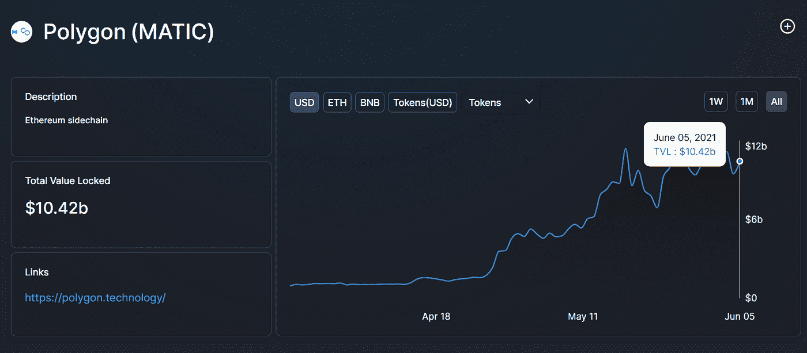

# [市场信息]寻找多边形:神奇的收益率和在哪里可以找到它们

> 原文：<https://medium.com/coinmonks/market-info-finding-polygon-fantastic-yields-and-where-to-find-them-2e2129ec1dd4?source=collection_archive---------1----------------------->

Polygon 的 Defi 呈爆炸式增长。我们于 5 月 14 日在我们的 [Twitter 上首次报道了 Polygon network。据](https://twitter.com/SerenityFund/status/1393203379933835266)[报道，Polygon 的 TVL 现在超过 100 亿美元。](https://defillama.com/protocols/chain)

一个技术上的解释可以在[的区块研究](https://www.theblockresearch.com/polygon-a-technical-overview-105799)(付费版)上找到。Defiprime 提供了多边形上的大型[去 fi 项目列表。在这里，我们总结了多边形上一些常见的产量农业场所。](https://defiprime.com/polygon)

## 传统以太坊专业

首先以太坊上相当多的大协议都搬过来了，比如 [Aave](https://aave.com) 、 [Curve](https://polygon.curve.fi/) 、 [Sushiswap](https://app.sushi.com ) 、 [mStable](https://app.mstable.org/#/musd/save) 。他们通常只是将以太坊版本的激励系统扩展到多边形版本。例如，您可以在曲线的多边形 3pool 上种植$Matic(而不是$crv)。现在的收益率在 20%以上。

## 地塞米松

Quickswap 是 Uniswap 的多边形版本，它对其流动性对有激励作用，就像 Uniswap 去年夏天做的那样。Polygon 上除了 Sushiswap 还有相当多的竞争对手，大部分都是本土的。下面我们列举几个。有些有奖励的归属期，所以显示的收益率更高。

[https://quickswap.exchange/#/quick](https://quickswap.exchange/#/quick)

[https://swap.cometh.io/#/stake](https://swap.cometh.io/#/stake)

DFYN 交易所

[poly dex——多边形上的下一个进化 DeFi 交换(MATIC)](https://www.polydex.fi/farms)

[https://app.elk.finance/#/elk](https://app.elk.finance/#/elk)

[https://swap.smartdex.app/#/farm](https://swap.smartdex.app/#/farm)

例如，DYFN 给出超过 60%的稳定硬币对，但是有一个字符串归属规则和对提前退出的惩罚。

## 收获者

在类似自动农场的服务的帮助下，上述所有东西都可以自动收获。首先， [Autofarm](https://autofarm.network/polygon/) 和 [Beefy](https://polygon.beefy.finance ) 现在在 Polygon 上，还有一个更小的， [Eleven Finance](https://eleven.finance  ) 也有。除了 0.1%的存款费用和 3%到 5%的收益费用外，您将获得几乎 100%的奖励代币用于养殖和再投资。

StakeDao 也在 Polygon 上，但唯一的跳马是 Curve 的 3pool，有 StakeDao 平台代币 10% APY 价值的丰厚奖励，$SDT。

另一种自动收获的方式是[harmony Finance](https://adamant.finance/)，Polygon 上的类似收获金融的服务。harmony Finance 收获你的奖励，卖出其中的 30%,并给你稍多一点的平台代币，作为回报。

## 稳定硬币发行者

就像一个国家需要自己的货币来宣称在金融领域的主权权力一样，多边形也需要自己的戴。因此，Polygon 上有一些本地货币发行者。[气道](https://app.mai.finance/)是马克尔道的多边形版本，[铁财](https://polygon.iron.finance )是 Frax 财的改良版。目前，它们的收益率超过 100%，但也存在风险。这就好比在一个新的国家，没有美元支持的货币总是不稳定。我们将在我们的高级数据库中涵盖这些协议。如果你感兴趣，请继续关注它。

## 庞氏动物农场

谁不喜欢一些动物呢！有一段时间，动物和水果充斥着币安智能链，制作了参数和 ui 略有变化的 Pancakeswap 简单叉子。这些动物养殖场的招数是它们的金库看似高收益，收取 4%的存款费用。这些费用用于回购平台奖励令牌。因此，在这个周期中，流动性存款正在支付早期存款人——一个伪装成 DEX 形式的庞氏骗局。

有一些动物农场做了足够的改变来提供一些实际的效用，或者他们只是足够大，有更多的人被饲养。看看 [PolyCat](https://polycat.finance) 和多边形中的第一只 [PolyWhale](https://polywhale.finance/oceanV2) 。

## 其他人

[Staker](http://Stacker Ventures | Decentralized Venture Capital) 是一个设计方面的 VC，一路走来不知何故转向了产量农业。无论如何，它现在在 USDC 提供 45%的 APY。

另一个是 [Blackswap](https://www.blackswap.finance/stake  ) ，被标记为收益率集合器，现在拥有收益率相当高的单一资产保险库，尽管流动性水平较低。

(宁静队，2021 年 6 月 5 日，推特:【https://twitter.com/SerenityFund 

> 加入 [Coinmonks 电报小组](https://t.me/joinchat/Trz8jaxd6xEsBI4p)并了解加密交易和投资

## 另外，阅读

*   [什么是融资融券交易](https://blog.coincodecap.com/margin-trading) | [成本平均法](https://blog.coincodecap.com/dca)
*   [3 商业评论](/coinmonks/3commas-review-an-excellent-crypto-trading-bot-2020-1313a58bec92) | [Pionex 评论](/coinmonks/pionex-review-exchange-with-crypto-trading-bot-1e459d0191ea) | [Coinrule 评论](/coinmonks/coinrule-review-2021-a-beginner-friendly-crypto-trading-bot-daf0504848ba)
*   [莱杰 vs Ngrave](/coinmonks/ledger-vs-ngrave-zero-7e40f0c1d694) | [莱杰 nano s vs x](/coinmonks/ledger-nano-s-vs-x-battery-hardware-price-storage-59a6663fe3b0) | [币安评论](/coinmonks/binance-review-ee10d3bf3b6e)
*   [Bybit Exchange 审查](/coinmonks/bybit-exchange-review-dbd570019b71) | [Bityard 审查](/coinmonks/bityard-review-7d104239be35) | [CoinSpot 审查](https://blog.coincodecap.com/coinspot-review)
*   [3 commas vs Cryptohopper](/coinmonks/3commas-vs-pionex-vs-cryptohopper-best-crypto-bot-6a98d2baa203)|[赚取加密利息](/coinmonks/earn-crypto-interest-b10b810fdda3) | [网格交易机器人](https://blog.coincodecap.com/grid-trading)
*   最好的比特币[硬件钱包](/coinmonks/the-best-cryptocurrency-hardware-wallets-of-2020-e28b1c124069?source=friends_link&sk=324dd9ff8556ab578d71e7ad7658ad7c) | [BitBox02 回顾](/coinmonks/bitbox02-review-your-swiss-bitcoin-hardware-wallet-c36c88fff29)
*   [BlockFi vs Celsius](/coinmonks/blockfi-vs-celsius-vs-hodlnaut-8a1cc8c26630)|[Hodlnaut 点评](/coinmonks/hodlnaut-review-best-way-to-hodl-is-to-earn-interest-on-your-bitcoin-6658a8c19edf) | [KuCoin 点评](https://blog.coincodecap.com/kucoin-review)
*   [Bitsgap 审查](/coinmonks/bitsgap-review-a-crypto-trading-bot-that-makes-easy-money-a5d88a336df2) | [Quadency 审查](/coinmonks/quadency-review-a-crypto-trading-automation-platform-3068eaa374e1) | [Bitbns 审查](/coinmonks/bitbns-review-38256a07e161)
*   [密码本交易平台](/coinmonks/top-10-crypto-copy-trading-platforms-for-beginners-d0c37c7d698c) | [Coinmama 审核](/coinmonks/coinmama-review-ace5641bde6e)
*   [印度比特币交易所](/coinmonks/bitcoin-exchange-in-india-7f1fe79715c9) | [比特币储蓄账户](/coinmonks/bitcoin-savings-account-e65b13f92451)
*   [CoinDCX 评论](/coinmonks/coindcx-review-8444db3621a2) | [加密保证金交易交易所](https://blog.coincodecap.com/crypto-margin-trading-exchanges)
*   [CoinLoan 评论](/coinmonks/coinloan-review-18128b9badc4) | [YouHodler 评论](/coinmonks/youhodler-4-easy-ways-to-make-money-98969b9689f2) | [BlockFi 评论](/coinmonks/blockfi-review-53096053c097)
*   最好的[加密税务软件](/coinmonks/best-crypto-tax-tool-for-my-money-72d4b430816b) | [硬币追踪评论](/coinmonks/cointracking-review-a-reliable-cryptocurrency-tax-software-5114e3eb5737)
*   最佳[加密借贷平台](/coinmonks/top-5-crypto-lending-platforms-in-2020-that-you-need-to-know-a1b675cec3fa) | [杠杆令牌](/coinmonks/leveraged-token-3f5257808b22)
*   最佳[加密制图工具](/coinmonks/what-are-the-best-charting-platforms-for-cryptocurrency-trading-85aade584d80) | [最佳加密交易所](/coinmonks/crypto-exchange-dd2f9d6f3769)
*   [如何在印度购买比特币？](/coinmonks/buy-bitcoin-in-india-feb50ddfef94) | [WazirX 评论](/coinmonks/wazirx-review-5c811b074f5b)
*   [埃利帕尔泰坦评论](/coinmonks/ellipal-titan-review-85e9071dd029) | [赛克斯斯通评论](/coinmonks/secux-stone-hardware-wallet-review-15-discount-coupon-2020-7577032faa6e) | [密码交易机器人](https://blog.coincodecap.com/best-crypto-trading-bots)
*   [本地比特币审核](/coinmonks/localbitcoins-review-6cc001c6ed56) | [加密货币储蓄账户](https://blog.coincodecap.com/cryptocurrency-savings-accounts)
*   [比特币基地评论](/coinmonks/coinbase-review-6ef4e0f56064) | [德里比特评论](/coinmonks/deribit-review-options-fees-apis-and-testnet-2ca16c4bbdb2) | [FTX 交易所评论](/coinmonks/ftx-crypto-exchange-review-53664ac1198f)
*   [n ave 零点回顾](/coinmonks/ngrave-zero-review-c465cf8307fc) | [Phemex 回顾](/coinmonks/phemex-review-4cfba0b49e28) | [PrimeXBT 回顾](/coinmonks/primexbt-review-88e0815be858)
*   最佳[区块链分析](https://bitquery.io/blog/best-blockchain-analysis-tools-and-software)工具| [赚比特币](/coinmonks/earn-bitcoin-6e8bd3c592d9)
*   [加密套利](/coinmonks/crypto-arbitrage-guide-how-to-make-money-as-a-beginner-62bfe5c868f6)指南| [如何做空比特币](/coinmonks/how-to-short-bitcoin-568a2d0b4ae5)