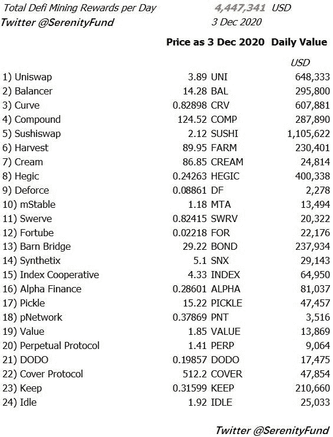

# 【市场信息】有多少挖矿奖励？

> 原文：<https://medium.com/coinmonks/market-info-how-much-mining-rewards-are-there-e3cc59fc0f3c?source=collection_archive---------3----------------------->

本文列出了截至 2020 年 12 月 3 日市场上主要 Defi 公司的采矿奖励和政策。挖掘奖励不包括:1)只为下注他们自己的平台代币或只为涉及他们自己的平台代币的交易对给出代币的平台；2)只发放利益而不发放平台代币作为奖励的平台。

综合名单来自[https://www.coingecko.com/en/yield-farming;](https://www.coingecko.com/en/yield-farming;)T2【https://debank.com/invest;T4【https://coinmarketcap.com/yield-farming/】

下面是 24 个 defi 平台的结果。每天有超过 400 万美元的奖励被发放。(*Uniswap 尚未投票，但预计将于 12 月中旬投票。)

我们从上表中观察到了一些情况:

1)奖励的美元价值很大程度上取决于平台代币的价格，例如寿司的价格对总奖励以及每个池的 APY 有很大影响。由于这些代币的价格比流动性水平快得多，由此产生的 APY 可能会产生误导(这就是为什么我们没有披露 APYs)。

2)这些平台很多都是新的。这些平台的很大一部分是几个月前才创建的，如果不是几个星期的话。有些甚至还没有产品。这些平台的价值定位存在疑问，因此每个投资者都应该对执行风险保持理智。如果你真的缺乏热情，我们宁愿鼓励你先投资一点点到平台代币，这样你的流动资金本金就不会有风险；风险更大，但风险要小得多。

3)挖矿奖励达到顶峰。从长远来看，采矿回报正在减少。所以你今天得到的可能明天会更少。假设今天的奖励会永远持续下去是不公平的，即使已经宣布，社区治理可能会改变它。因此，APY 是一个相对的衡量标准，而不是你一年收益的保证。挖掘奖励是途径，不是目的。

4)最终，一些平台将成为 defi 行业的新基石，并对区块链行业甚至整个金融行业具有长期价值。我们作为行业中有意义的力量向前发展，共同带来变革。但有些项目会灭亡，有些会被证明功能失调，有些会变成骗局。只有时间能证明一切。如果你相信这个平台，成为它的一部分——使用它并参与到社区中来——不要只看价格。以太坊今天之所以伟大，不是它的价格，而是建造它的人。其他项目也是如此。

5)不要假设稳定的信贷有相同的风险或没有风险。不要假设瑞士联邦理工学院或 BTC 的衍生产品与瑞士联邦理工学院和 BTC 相同。设计、安全、执行都有风险。在你承担风险之前，先了解你所承担的风险。不要低估市场效率和这个行业中的其他人有多聪明——这是一个弱肉强食的行业，除了代码没有其他法律。

*   如果您需要上述采矿奖励计划来源的参考链接，请以 PM 身份关注我们的 twitter。[*@ serenity fund*](https://twitter.com/SerenityFund)

(宁静队，2020 年 12 月 4 日)

## 另外，阅读

*   最好的[密码交易机器人](/coinmonks/crypto-trading-bot-c2ffce8acb2a)
*   [Uniswap API](https://bitquery.io/blog/uniswap-pool-api) —如何获取 Uniswap 数据？
*   [Deribit 审查](/coinmonks/deribit-review-options-fees-apis-and-testnet-2ca16c4bbdb2) |选项、费用、API 和 Testnet
*   [FTX 密码交易所评论](/coinmonks/ftx-crypto-exchange-review-53664ac1198f)
*   [Bybit 交换审查](/coinmonks/bybit-exchange-review-dbd570019b71)
*   最好的比特币[硬件钱包](/coinmonks/the-best-cryptocurrency-hardware-wallets-of-2020-e28b1c124069?source=friends_link&sk=324dd9ff8556ab578d71e7ad7658ad7c)
*   [密码本交易平台](/coinmonks/top-10-crypto-copy-trading-platforms-for-beginners-d0c37c7d698c)
*   [Bitsgap vs 3 commas vs quad ency](https://blog.coincodecap.com/bitsgap-3commas-quadency)
*   最好的[加密税务软件](/coinmonks/best-crypto-tax-tool-for-my-money-72d4b430816b)
*   [最佳加密交易平台](/coinmonks/the-best-crypto-trading-platforms-in-2020-the-definitive-guide-updated-c72f8b874555)
*   最佳[加密借贷平台](/coinmonks/top-5-crypto-lending-platforms-in-2020-that-you-need-to-know-a1b675cec3fa)
*   [莱杰纳米 S vs 特雷佐 one vs 特雷佐 T vs 莱杰纳米 X](https://blog.coincodecap.com/ledger-nano-s-vs-trezor-one-ledger-nano-x-trezor-t)
*   [block fi vs Celsius](/coinmonks/blockfi-vs-celsius-vs-hodlnaut-8a1cc8c26630)vs Hodlnaut
*   Bitsgap 评论——一个轻松赚钱的加密交易机器人
*   为专业人士设计的加密交易机器人
*   [PrimeXBT 审查](/coinmonks/primexbt-review-88e0815be858) |杠杆交易、费用和交易
*   [Altrady 评论](https://blog.coincodecap.com/altrady-reivew)
*   [埃利帕尔泰坦评论](/coinmonks/ellipal-titan-review-85e9071dd029)
*   [SecuX Stone 评论](https://blog.coincodecap.com/secux-stone-hardware-wallet-review)
*   [BlockFi 评论](/coinmonks/blockfi-review-53096053c097) |从您的密码中赚取高达 8.6%的利息
*   [面向开发人员的最佳加密 API](/coinmonks/best-crypto-apis-for-developers-5efe3a597a9f)
*   [最佳区块链分析工具](https://bitquery.io/blog/best-blockchain-analysis-tools-and-software)
*   [加密套利](/coinmonks/crypto-arbitrage-guide-how-to-make-money-as-a-beginner-62bfe5c868f6)指南:新手如何赚钱
*   顶级[比特币节点](https://blog.coincodecap.com/bitcoin-node-solutions)提供商
*   最佳加密制图工具
*   了解比特币的[最佳书籍有哪些？](/coinmonks/what-are-the-best-books-to-learn-bitcoin-409aeb9aff4b)

> [直接在您的收件箱中获得最佳软件交易](/coinmonks/newsletters/coinmonks)

