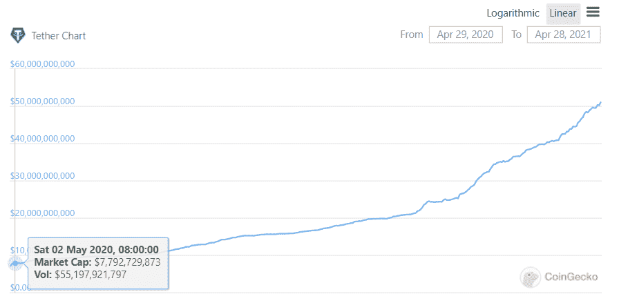

# [市场信息]资产支持稳定币概述

> 原文：<https://medium.com/coinmonks/market-info-overview-of-asset-backed-stablecoin-7e111488e4af?source=collection_archive---------4----------------------->

随着最近 algo stablecoins 的大肆宣传，我们忽略了一些传统的 stablecoins。是时候重访他们了！Coingecko 总共上市了 47 只 stablecoins，总市值 840 亿美元。这只是加密货币 2.1 万亿美元总市值的 4%。为了给出一个粗略的(但不是非常准确的)构图概念，我们使用了 Coin360 中的一个图表。USDT 的统治地位仍然很高，但最近 BUSD 和其他 2 级稳定资本也在上升。新的稳定的竞争对手，如费和 Lquity 美元，也加入了竞争。

为了给出前 10 名的更准确的数据，下面是 Coingecko 的截图:

我们已经招募了 18 家 stablecoins，它们全部或大部分由资产支持，市值至少 1000 万美元。最大的当然是 USDT，最小的是 DUSD。我们将它们分为以下 5 类:

## 100%美元菲亚特支持

一个 USDT (USD Tether)由 1 美元支持，由 [Tether](https://tether.to/) 管理。Tether 始于比特币的 Omni network，作为交易媒介很受欢迎，因为 BTC 太不稳定，没有任何有意义的课程。后来，USDT 在以太坊上有了一个版本，随着以太坊的用户群和产品供应的爆炸性增长，这个版本也蓬勃发展起来。对于流通中的美元是否真的完全由美元支持，总是有一个问号。纽约州总检察长对 Tether(及其母公司 Bitfinex)进行了一项期待已久的调查，但调查于今年 2 月结束，处罚很轻。截至今天，有 500 亿 USDT 在流通，几乎是一年前的 7 倍。

USDT 背后有一个最大的加密交易所 Bitfinex。加密交易所有自己的稳定账户并不奇怪。类似地，最受欢迎的是:

*   币安:BUSD
*   双子座:GUSD
*   霍比:HUSD
*   OKEX:美元
*   帕克斯:帕克斯

加密交易所发行的 Stablecoins 都是由美元全额支持的。在其他动机中，稳定的信用使交易所在扩展业务和管理流动性方面具有灵活性。随着币安智能连锁的蓬勃发展，BUSD 的发行量在过去 30 天内翻了一番。

另外还有两家独立实体发行 stablecoins，USDC 的 [Circle](https://www.circle.com/en/usdc) (管理 Circle Pay 的美国数字支付公司)，TUSD 的 [TrustToken](https://www.trusttoken.com/) 。USDC 是流通中的第二大稳定币，由纽约州金融服务局颁发[执照，并由均富 LLP 每月进行审计。](https://en.wikipedia.org/wiki/Circle_(company))

由于这些稳定债券完全由美元支持，它们与其各自的发行者一样可信。从这个意义上来说，我们可以说它们在钉住方面是稳定的，但不太符合去中心化的精神。

## 超过 100%的 Crpytocurrency 被整理

一些其他的抵押债券纯粹是建立在链条上的，最受欢迎的是戴的 [MakerDao](https://makerdao.com/en/) 。任何一个有钱包的用户都可以用[马克尔道的绿洲](https://oasis.app/borrow)创建一个金库，通过质押一些 ETH(或者其他接受的硬币)来借用戴。从概念上讲，这类似于抵押贷款:用你的房子抵押美元。对于 MakerDao 来说，如果你的房子贬值，有利息(稳定费)，清算罚款(清算费)，还有一个比率来决定你可以借多少。根据利率的不同，你可以用价值 130 到 175 美元的 ETH 抵押借款 100 DAI(通常价值 100 美元)。

如果抵押品(在这种情况下是 ETH)大幅下跌，并打破了清偿率(假设你的 150 美元 ETH 现在不到 100 美元，因为你借了 100 DAI)。金库将被清算(在 ETH 的价值跌至 100 美元以下之前), ETH 将在市场上出售，以弥补您的 DAI 借款。

没有像美元法币稳定这样的保证，每个戴都能拿回价值 1 美元的美元或任何东西。用户认为戴是 1 美元，并据此交易，这更是一种市场共识。当 DAI 低于 1 美元时，套利者会买入 DAI。由于存在借贷和使用 DAI 的利益，当 DAI 更便宜时，MakerDAO 的 DAI 借款人将被激励回购他们先前花费的 DAI。

如果我们看看智能链版本的创客道(准确地说，可能是创客+复利)，[金星](https://venus.io/)，其稳定的币，经常在很长一段时间内大幅低于 1 美元交易，尽管拥有与戴相同的机制。

还有一个 MakerDao 的分支，[单元协议](https://unit.xyz/)提供 USDP 作为稳定币。自 2020 年 11 月推出以来，它的价格不到 1 美元，但现在稳定在 1 美元左右。别忘了 SUSD 的[合成币](https://synthetix.io/)，在那里你可以存入$SNX 到造币厂$sUSD 以及其他合成币。

因此，加密超额抵押稳定币的可信度是一个共识问题，这是稳定币的历史、用户基础、市值和流动性、平台质量的综合结果；或许还有一点市场情绪。

## 100%主要加密货币支持

你可能已经意识到，从上述两类资产支持的稳定债券来看，它们都有不足之处:

*   菲亚特支持:不分散
*   加密抵押:过度抵押是没有效率的

因此，有另一类资产支持的稳定货币，可以用另一种加密货币铸造和燃烧。其中最大的是 Terra USD 或 UST，由 Terra Money 投资，这是一家韩国区块链公司，经营 Terra 连锁店(luna，如果这听起来更熟悉的话)。任何用户都可以使用泰拉链的原生令牌月神，以 1 美元的价格铸造或焚烧 UST。详情请参考[这篇文章](https://academy.ivanontech.com/blog/what-is-terra-blockchain-terrausd-and-luna-coin)。因此，只要卢纳是流动的，并且拥有比 UST 大的市值，UST 就可以维持在 1 美元。

类似地，另一个 stablecoin 中微子 USD，或 USDN，由 [Waves Technologies](https://waves.tech/) 开发，也有同样的设计。USDN 和 WAVE token 可以 WAVE 的$价格进行交换，因此 USDN 的价格保持为$1。

与 VAI 相比，美元的价格自推出以来要稳定得多。这两款 stablecoins 具有可比性，因为它们都是在去年年底推出的，市值接近。

我们也不认为 UST 的波动性比美国国债小。鉴于他们的设计，我们可以得出结论，100%主要加密货币支持的 stablecoins 与支持它们的令牌的市值和流动性以及交换桥的平台质量一样可信。

## 100%稳定币支持

一些 stablecoins 是其他 stablecoins 的集合。比如说 [mStable](https://app.mstable.org/#/musd/save) 的 MUSD，就是 sUSD、戴、的合集。mStable 假设每枚硬币总是 1 美元，只要平台有流动性支持交易，就可以兑换。因此，在任何时候，MUSD 都是四种硬币中最便宜的一种。

此外，借用 Curve 的 3pool 概念，mStable 提供了 mUSD-GUSD 和 mUSD-BUSD 资金池，为 BUSD 和 GUSD 提供流动性。因此，实际上，MUSD 得到了另外 6 个稳定团体的支持。

一个类似的项目是 [DefiDollar](https://app.dusd.finance/savings) ，其 DUSD 实际上是曲线的 y 型池。说到这里，DefiDollar 有两项创新:

*   它是模块化的，因此管理机构可以投票将其他稳定的货币产品(如 y-pool)添加到 DUSD 篮子中。
*   DUSD 可以得救，DUSD 的储户可以从 y-pool 的奖励等协议收益中受益，但也可以获得 y-pool 贬值的第一笔资金。这是为了确保在其他稳定货币价格下跌的情况下，流通中的其他 DUSD 将有一个缓冲。

我们可以将 100%的 Stablecoin 视为 stable coin 的安全衍生品，它们与篮子中的 stable coin 一样可信，其平台质量也是如此。

## 部分稳定硬币支持/其他设计

最后，defi 是一个创新永不停止的地方。由于以上所有的稳定圈都不完美，许多有才华的团队致力于改进稳定圈的设计。从这个意义上说，算法稳定是最大的创新领域——但不知何故，这又是经济原则，迄今为止没有一个成功(定义为它们对 1 美元的稳定程度)。

另一方面，一些团队寻求放弃 100%资产支持的想法，并且已经取得了一些进展。一种更实际且被广泛接受的稳定币是 FRAX 币，由经济学家史蒂芬·摩尔建议，由 [Frax Finance](https://frax.finance/) 提出。FRAX 部分得到主要稳定资本的支持，部分得到其平台象征 FXS 的支持。一个 FRAX 有多少稳定的资本支持，FXS 有多少，这个比例是由算法决定的。详情请见[我们关于 Frax Finance](https://serenityfund.medium.com/company-watch-dual-asset-backed-stablecoins-would-this-work-227deb9e11a3) 的文章。

这似乎是多余的，但它确实探索了一种可能性，即如果一个大型稳定币可以在没有 100%资产支持或由另一个市值较小的密码支持的情况下持续存在。Frax 使用了两者的结合，从这里再多走一步可能会带来一些惊人的东西。

stablecoin 创新设计的另一个例子是由和 Compound 的创始人间接支持的 FEI by [Fei Protocol](https://app.fei.money/) 。尽管最近的媒体动荡，FEI 被设计为由 ETH 池支持，并通过动态调整 Uniswap FEI-ETH 池来实现挂钩。更多详情请参考[我们关于 Fei 协议](https://serenityfund.medium.com/company-watch-fei-protocol-quick-review-before-its-launch-931b016bbacb)的文章。虽然这个设计很宏伟，因为它实现了低抵押，但在实践中可能行得通，也可能行不通。

对于部分稳定的硬币支持或其他设计，我们的结论是，总体目标是实现低抵押，但所有新概念都必须经过市场测试和时间考验。

## 附录:汇总表

*100%美元支持:* $USDT，$美元兑换，美元兑换，美元兑换，美元兑换

*超过 100%的加密货币抵押:* $dai，$usdp，$vai，$sUSD

*100%主要加密货币支持:* $ust，$usdn

*100%稳定币支持:* $musd，$dusd

*部分稳定币背/其他设计* : $frax $fei

(宁静队，2021 年 4 月 28 日，推特:[https://twitter.com/SerenityFund)](https://twitter.com/SerenityFund))

> 加入 [Coinmonks 电报小组](https://t.me/joinchat/uiLERCQL1fQ5ZjA1)并了解加密交易和投资

## 另外，阅读

*   最好的[加密交易机器人](/coinmonks/crypto-trading-bot-c2ffce8acb2a) | [网格交易机器人](https://blog.coincodecap.com/grid-trading)
*   [加密副本交易平台](/coinmonks/top-10-crypto-copy-trading-platforms-for-beginners-d0c37c7d698c) | [五大 BlockFi 替代方案](https://blog.coincodecap.com/blockfi-alternatives)
*   [CoinLoan 点评](/coinmonks/coinloan-review-18128b9badc4)|[Crypto.com 点评](/coinmonks/crypto-com-review-f143dca1f74c) | [火币保证金交易](/coinmonks/huobi-margin-trading-b3b06cdc1519)
*   [尤霍德勒 vs 科恩洛 vs 霍德诺特](/coinmonks/youhodler-vs-coinloan-vs-hodlnaut-b1050acde55a) | [Cryptohopper vs 哈斯博特](https://blog.coincodecap.com/cryptohopper-vs-haasbot)
*   [杠杆令牌](/coinmonks/leveraged-token-3f5257808b22) | [最佳密码交换](/coinmonks/crypto-exchange-dd2f9d6f3769) | [Paxful Review](/coinmonks/paxful-review-4daf2354ab70)
*   [在印度如何购买比特币？](/coinmonks/buy-bitcoin-in-india-feb50ddfef94)|[waz rix 审核](/coinmonks/wazirx-review-5c811b074f5b) | [BitMEX 审核](https://blog.coincodecap.com/bitmex-review)
*   [双子座对比特币基地](https://blog.coincodecap.com/gemini-vs-coinbase) | [比特币基地对北海巨妖](https://blog.coincodecap.com/kraken-vs-coinbase) | [CoinJar 对 CoinSpot](https://blog.coincodecap.com/coinspot-vs-coinjar)
*   [币安 vs 北海巨妖](https://blog.coincodecap.com/binance-vs-kraken) | [美元成本平均交易机器人](https://blog.coincodecap.com/pionex-dca-bot)
*   [印度比特币交易所](/coinmonks/bitcoin-exchange-in-india-7f1fe79715c9) | [比特币储蓄账户](/coinmonks/bitcoin-savings-account-e65b13f92451)
*   [币安费](/coinmonks/binance-fees-8588ec17965) | [僵尸密码审查](/coinmonks/botcrypto-review-2021-build-your-own-trading-bot-coincodecap-6b8332d736c7) | [Hotbit 审查](/coinmonks/hotbit-review-cd5bec41dafb) | [KuCoin 审查](https://blog.coincodecap.com/kucoin-review)
*   [我的加密副本交易经验](/coinmonks/my-experience-with-crypto-copy-trading-d6feb2ce3ac5) | [金币复习](https://blog.coincodecap.com/buycoins-review)
*   [密码货币储蓄账户](/coinmonks/cryptocurrency-savings-accounts-be3bc0feffbf)|[yo bit Review](/coinmonks/yobit-review-175464162c62)|[Bitbns Review](/coinmonks/bitbns-review-38256a07e161)
*   [最佳比特币保证金交易](/coinmonks/bitcoin-margin-trading-exchange-bcbfcbf7b8e3) | [比特币保证金交易](https://blog.coincodecap.com/bityard-margin-trading)
*   [加密保证金交易交易所](/coinmonks/crypto-margin-trading-exchanges-428b1f7ad108) | [赚取比特币](/coinmonks/earn-bitcoin-6e8bd3c592d9) | [Mudrex 投资](https://blog.coincodecap.com/mudrex-invest-review-the-best-way-to-invest-in-crypto)
*   [BlockFi 信用卡](https://blog.coincodecap.com/blockfi-credit-card) | [如何在币安购买比特币](https://blog.coincodecap.com/buy-bitcoin-binance)
*   [顶级付费加密货币和区块链课程](https://blog.coincodecap.com/blockchain-courses) | [币安评论](/coinmonks/binance-review-ee10d3bf3b6e)
*   [MXC 交易所评论](/coinmonks/mxc-exchange-review-3af0ec1cba8c) | [Pionex vs 币安](https://blog.coincodecap.com/pionex-vs-binance) | [Pionex 套利机器人](https://blog.coincodecap.com/pionex-arbitrage-bot)
*   [在美国如何使用 BitMEX？](https://blog.coincodecap.com/use-bitmex-in-usa) | [BitMEX 回顾](https://blog.coincodecap.com/bitmex-review) | [币安 vs Bittrex](https://blog.coincodecap.com/binance-vs-bittrex)