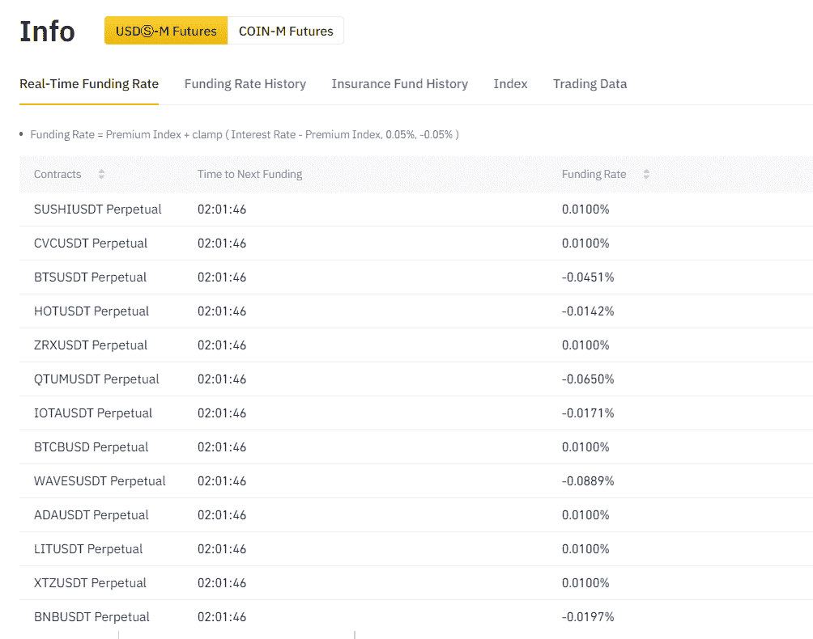

# [市场信息]限制风险以及如何降低风险

> 原文：<https://medium.com/coinmonks/market-info-tether-risk-and-how-to-mitigate-it-b8af7e23b3d9?source=collection_archive---------5----------------------->

系绳无疑是区块链最伟大的发明之一。就实用性而言，可以说这是唯一有意义的创造，因为到今天为止，除了加密货币本身，人们不能购买任何东西。然而，值在相对时总是有意义的——0.069009——这对你有意义吗，或者最好这样说:今天的 BTC 价格是 39908 美元，ETH 是 2754 美元，因此 ETH/BTC 是 0.06009。Stablecoins 是一个参考点，人们可以在这里衡量他对加密货币的投资相对于他对加密货币的投资。而在这里，系绳美元，是一切的起点。

## 系绳的历史和现状

Tether 最早可以追溯到以太坊存在之前的 2012 年的一份白皮书。第一个系绳是在比特币网络的 Omni 层上创建的，并于 2014 年 10 月由联合创始人布洛克·皮尔斯、里夫·科林斯和克雷格·塞拉斯命名为“Realcoin”。关于系绳历史的更多细节可以在维基百科中阅读。

今天，Tether 是 stablecoins 的 bethomoth 发行量为 600 亿，比其他 stablecoins 的总和还要多。

大多数系绳是自去年夏天 De-Fi 以来发行的，受产量农业和其他相关产品(如 Curve 和 Aave)的强劲需求驱动。然而，一个主要的推动是在 2021 年 2 月，在[纽约州总检察长放弃对泰瑟](https://ag.ny.gov/press-release/2021/attorney-general-james-ends-virtual-currency-trading-platform-bitfinexs-illegal)定罪的追求之后。在支付了最低限度的罚款后，泰瑟开始了造币狂潮:自那以来，已发行了数百亿 USDT。

## 终极风险

人们一直担心，尽管该公司声称，每个 USDT 并没有 1 美元的全额抵押。正如司法部长詹姆斯所说，“Tether 声称其虚拟货币在任何时候都完全由美元支持是一个谎言。”

尽管没有具体证据表明 Tether 未能完全支持其流通中的 600 亿 USDT，但这一数额引起了很多怀疑，因为这对世界上任何一家银行来说都太大了，不会引起任何监管机构的注意。最近，[的斯蒂芬·迪尔在推特](https://twitter.com/smdiehl/status/1393669812220465162)上提出了一个关于风险的详细论点。这并不是 USDT 第一次受到挑战——事实上，每年都有人声称 USDT 将会崩溃，尤其是当人们对市场下跌感到担忧的时候。

Tether 的财务支持在上周达到高潮，并在一定程度上直接促成了 5.19 的下跌，当时[该公司发布了一页关于其储备的报告](https://tether.to/wp-content/uploads/2021/05/tether-march-31-2021-reserves-breakdown.pdf)。在这有限的信息中，至少可以看出超过一半的流通资金，即 300 亿美元，是发行给公司的商业票据，而不是现金或现金等价物。至于哪些公司持有这些商业票据，目前还没有进一步的细节。

尽管这不是第一次 Tether 受到挑战，但市场还是有些波动。[《金融时报》对 Tether 公司披露的储量进行了特别报道。](https://www.ft.com/content/529eb4e6-796a-4e81-8064-5967bbe3b4d9)

如果这些商业票据的质量不高，或者在资金紧张的情况下没有流动性，或者仅仅是这些票据没有真正的流动性，那么每张票据将会短缺 1 美元。这是 Tether 的最终风险，也是 De-Fi 甚至加密货币行业的最终风险，因为 Tether 不仅是流通中的 stablecoins 的一半以上，它还是 Curve 的 3pool 的主要货币，也是币安等许多交易所和许多大多数方面的主导交易对。

## 如何缓解

我们不对 Tether 的储量质量做出判断；我们也不否认系绳有跌破 1 美元的可能性。我们提出了一些降低风险的方法，人们希望在多大程度上实施这些措施是一个主观问题。

*使用其他稳定的指针*

首先，如果你可以选择不使用 USDT，但仍能达到同样的目的，那就不要这样做。今天有各种各样的资产支持资产，我们将它们分为 5 类。最接近和最强的可能是 USD Circle 或者您可以选择加密的本地稳定币戴。我们在这里不展开对这一点的讨论。

很少出现只能使用 USDT 的情况。实际情况是，USDT 与其他稳定的地方有联系。Curve 的 3pool，深度 14 亿美元，几乎可以和、戴无缝交换；此外，另外 20 个元池依靠 3pool 成为做市商。在这个意义上，很难避免 USDT，曲线上唯一没有 USDT 的美元稳定币池是复合币池和萨夫币池。尽你所能使用这些。同样的原则也适用于其他 defi 投资。

*使用合成结构*

如果你想在不承担市场波动风险的情况下实现加密货币行业的收益，除了使用 stablecoins 进行收益农业，还有其他方法。一个典型的方法是在币安或 FTX 使用保证金期货。

这种策略的本质是购买任何硬币，存入期货交易所(如币安期货)，然后做空全部金额。([详情在此。](https://serenityfund.medium.com/strategy-paper-hedged-futures-in-cex-387343e3b5a5))无论你购买什么样的硬币，这都不会给你带来市场波动风险，因为你做空了全部金额，而且加密货币的收益率仍然是一年中大部分时间都是正的(根据我们的经验，每年 10%到 20%)。

*De-fi 保险协议*

如果你真的必须投资或使用 USDT，例如，你有一个大袋子在曲线上，那么你可以考虑购买 USDT 保险。到目前为止，有两个 de-fi 协议提供这种保险:[鸦片](https://app.opium.finance/insurance)和未鞭打。

鸦片的成本超过 10%,未捆绑的约为 2%——但两个平台都没有处理过任何与 USDT 挂钩的索赔——所以这些保险协议应该有效都是假设。

*借用 USDT*

最后，如果你认为 USDT 可能会过时，你可以随时借用它。通常会有很高的成本，例如，借 USDT 平均每年的成本为 5%到 10%。这可能代价高昂，但幸运的是，两大主导贷款平台现在都有激励措施。

这不仅意味着的实际借贷成本可能是低的或负的，它还意味着你可以重复以下步骤来进行收益耕作:1)存款戴；2)借用 USDT；3)用戴卖出，直到你的总杠杆率达到 60%至 70%左右。由于借贷都将使你有资格获得平台激励，你可以获得 10%至 20%的收益率，同时免受 USDT 脱钩风险的影响。(关于这一战略的更多细节请关注我们的媒体，并[阅读本](https://serenityfund.medium.com/strategy-paper-comp-leveraged-mining-ab1ee21560f0)。)

## 结论

我们真诚地希望 USDT 是稳定的，并得到充分的支持，这样 De-fi 就可以从婴儿期稳步成长，并成为下一代金融体系的重要组成部分。我们还认为，区块链和去中心化金融的设计应该提倡透明度。由于对系绳有一些怀疑，即使这只是纯粹的猜测，它也不会伤害我们，或者至少只需要很小的代价，就可以保护我们自己。

(宁静队，2021 年 5 月 21 日，推特:[https://twitter.com/SerenityFund](https://twitter.com/SerenityFund))

*   最佳[加密借贷平台](/coinmonks/top-5-crypto-lending-platforms-in-2020-that-you-need-to-know-a1b675cec3fa) | [杠杆令牌](/coinmonks/leveraged-token-3f5257808b22)
*   最佳[加密制图工具](/coinmonks/what-are-the-best-charting-platforms-for-cryptocurrency-trading-85aade584d80) | [最佳加密交易所](/coinmonks/crypto-exchange-dd2f9d6f3769)