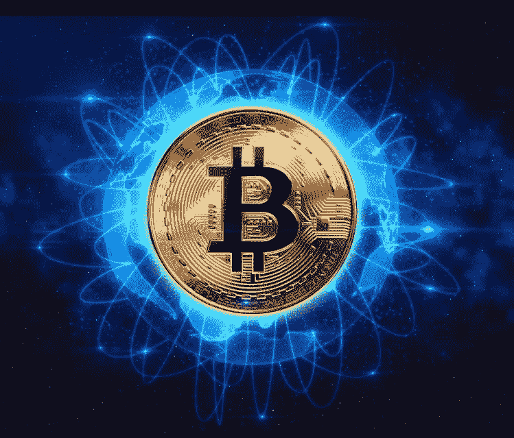
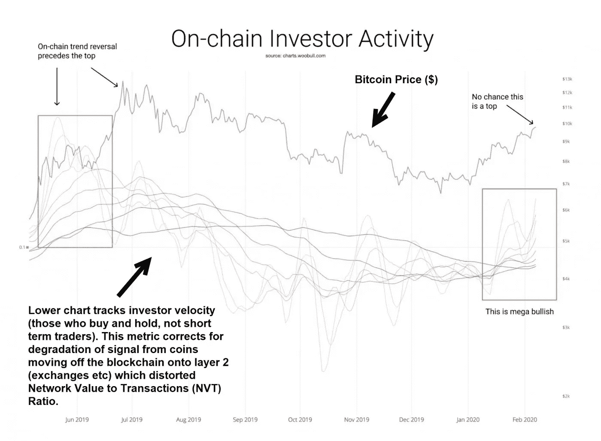

# 市场实验室报告——10 年内从 1 美元到 1000 万美元？

> 原文：<https://medium.com/coinmonks/market-lab-report-1-to-10-000-000-in-10-years-a2e98a411185?source=collection_archive---------8----------------------->

虽然全世界都在遏制并试图制服冠状病毒，但高盛(NYSE:GS)分析师估计，这一疫情将使中国今年的 GDP 增长下降约 0.4%。如果遏制病毒的时间超过预期，对全球经济的损害可能会更严重，尽管各国央行似乎已准备好减轻任何此类损害。

与此同时，去年，欧元区经济增速降至 2014 年年中以来的最低水平。在反对马克龙总统养老金改革的罢工和意大利库存大幅下降的影响下，法国和意大利经济都出现了收缩。德国零售销售在年底意外下降，也导致欧元区产出仅季度增长 0.1%。

尽管全球经济过剩，比特币仍在前进。这在投机史上是史无前例的。2009 年投资的 1 美元在十年后价值超过 1000 万美元。然而，这并没有阻止所谓的思想领袖多年来坚持认为这样的价格上涨是不可能的。

2015 年 1 月，当比特币在触及 1100 美元以上的高点后反弹至 150 美元时，一位思想领袖说:“你永远不会看到比特币从这里(当时的价格:160 美元)涨到 10，000 美元，”另一位自称的思想领袖最近也给出了类似的理由。比特币的可分性被用来证明比特币在任何 12 个月内都不会达到 20 万美元。然而，这种可分性并不能阻止它在创下新高后徘徊(通常是 10 倍或更高)，就像它以前几次做的那样。仅仅因为 satoshis 变得更加昂贵，这并没有把买家拒之门外。他们只需要买更少的 satoshis。

这种说法忽视了贸易的基本要素，也忽视了为什么一些资产会违背所有“基本原理”继续走高。供应/需求决定一切。此外，比特币的海啸般的顺风仍在发挥作用，这也是它成为资产升值史上最赚钱的资产的原因。10 年内投资 100 万到 1000 万美元，回报率为 10 亿美元。尽管有些人认为这违背了所有的理由，但从长远来看，市场比我们任何人都要聪明得多。有些人可能还记得上世纪 90 年代末试图做空亚马逊的卖空者被杀，因为亚马逊在若干年内不会有任何收益。

杰西·利弗莫尔曾经说过，没有人能在多个周期内战胜市场。自我倾向于战胜大多数交易者。但是如果交易者“了解你自己”，他们可能会有机会。像威廉·奥尼尔、埃德·塞科塔、吉尔·布莱克、汤姆·巴索和其他一些人一样，终生交易者在市场上反复赚钱，但他们控制住了自己。

无论如何，这种针对比特币和区块链的声明和诋毁也忽略了一点，即勇敢浏览器(Brave Browser)等平台是可用的最快的浏览器之一，并使那些每天只赚一美元的人能够通过越来越多的这种平台每天赚几美元或更多。当然，Steemit 等部分去中心化的平台实现了这样的利润。

海啸顺风

比特币手头有许多海啸般的顺风，我在之前的报告中写过，比如《T2》和《T3》。从解决世界上没有银行账户和部分有银行账户的人的问题，到 5 月份减半，到机构加入，到比特币的散列率和唯一地址都创下历史新高，到我自 2011 年以来用来衡量比特币主要顶部和底部的许多其他指标，有理由认为，在任何完整的牛熊加密周期中，只有少数硬币的表现优于比特币。

**跑赢大盘**

比特币目前在 I 型市场的主导地位徘徊在 64%左右。也就是说，在当前的牛市周期中，以太坊和其他利用其技术的加密公司在过去几周的速度超过了比特币。这在 BTC/瑞士联邦理工学院的图表中很容易观察到(如下)。请注意在 2018 年初的最后一次 crypto climax top 中，以太坊和其他表现优异的股票(其中许多股票我一直持有到 2018 年 1 月 30 日)如何跑赢比特币，这是基于 2017 年末的大幅上涨趋势，如下图所示。

在整个市场周期(包括牛市和熊市)中，比特币的最佳表现者可能是以太坊(ETH)、币安(BNB)和创(TRX)，以及 Dash 和 Monero 等隐私币，不过请注意，人们不得不忍受每种币的巨大波动性。 因此，像我一样能够识别比特币的主要顶部和底部是控制投资组合波动的关键，这样人们就可以在熊市开始时卖掉所有的比特币，安全地转移到现金，因为比特币和所有其他硬币之间仍然存在非常高的相关性。

> [发现并回顾最佳专业交易软件](https://coincodecap.com/category/trading-automation)

一些图表，特别是在对数图上显示时，直观上抑制了主要修正的深度，通常超过-67%，可能超过-90%，但与价格上涨的幅度相比，看起来相当温和。以美元计算，ETH 修正了近-95%，在 2018 年 12 月触底(如下图所示)。黄线是加密货币与比特币的价格表现，绿线是加密货币的美元价格:

Chainlink (LINK)看起来似乎可能是比特币的明显赢家，尽管它只经历了一次熊市，目前正处于牛市之中。我有关于它是否扩展的问题，我说过我会在网上研讨会上回答。正如你所看到的，林克一直在向历史高点推进。在仍在交易的 2500 多种加密货币中，它的价格表现最为强劲。它已经与包括谷歌、甲骨文、微软、英特尔和思科系统在内的大多数大公司达成了交易。因此，虽然它看起来延长了，但更有可能只是再次启动。它的市值目前约为 14 亿美元，是第 16 大硬币。鉴于其先发优势、网络效应和正在进行的交易，其市值可能会轻松飙升 10 倍，达到 140 亿美元。它的杀手锏是它的去中心化的神谕，使得链上和链下的区块链之间能够沟通。Oracles 充当代理来验证现实世界的数据，并准备将其记录在区块链的智能合同中。Chainlink 将智能合约与现实世界的数据、事件和支付联系起来，旨在 PayPal 和 Visa 等支付服务、汇丰银行和富国银行等银行以及以太坊和比特币等区块链之间建立桥梁。区块链互操作性是区块链未来成功的关键。

**比特币铺路**

几乎所有加密货币都与比特币的价格趋势高度相关。比特币始于 2019 年的反弹表明，价格上涨不是由散户投资者推动的，而是由机构投资者推动的。在之前的比特币牛市中，比特币交易所的存款随着价格上涨，而在熊市期间，存款有所回落。这一次，比特币交易所的存款在过去六个月里大幅下降。

全球最大的比特币和加密货币基金 gray 表示，流入其基金的大部分资金是机构资金，而非散户资金。上个月，灰度显示，2019 年的资金流入量为 6 亿美元，超过 2013 年至 2018 年的总和，并宣布机构资金终于进入了加密货币领域。

灰度公司的董事总经理最近说，“如果持续的问题是，‘机构投资者在哪里？答案是它们就在这里，并且以有意义的规模出现。”

比特币和加密货币对冲基金 Adaptive Capital 的一名合伙人也附和说:“这次突破是真正的交易。基本面投资活动正在支撑这一 10，000 美元突破，”然后包括这张图表:

因此，虽然比特币可能会回到 10，000 美元左右的水平，但这很可能是暂时的，在它回到 20，000 美元左右的旧高点之前，然后蓝天，如果历史是任何指南，将在未来一两年内将比特币推高 10 倍或更多。首先，20 万美元肯定是有可能的。

**由克利斯·凯驰博士的** [的**汉斯数码接入**](https://hansedigitalaccess.com) **、KJA 数码投资和** [**美德私心投资**](http://www.selfishinvesting.com/)

**(͡:B ͜ʖ ͡:B)**

> [直接在您的收件箱中获得最佳软件交易](https://coincodecap.com/?utm_source=coinmonks)

