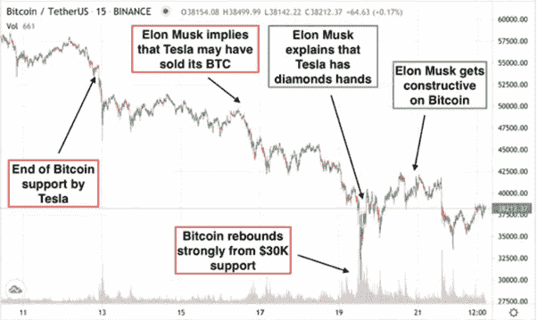

# 市场操纵是真实的

> 原文：<https://medium.com/coinmonks/market-manipulations-are-real-31a368660bcf?source=collection_archive---------9----------------------->

Unfortunately, most market participants are subject to FOMO and any price manipulation.

我们中的许多人肯定听说过对加密货币市场利率的操纵，大型鲸鱼、基金、公司的大量交易，或者各种价格修正或抽取信息渠道的创建。

不幸的是，大多数市场参与者都受到 FOMO 和任何价格操纵的影响。市场稍有上涨或下跌，许多新手已经开始捐出他们的硬币，因为他们认为这样至少可以保留一部分积蓄。但过一会儿，人们会期待自然的失望，并意识到硬币只是被那些能够操纵市场和公众意识的人拿走了。

**密码爱好者还是狡猾的诈骗高手？**

最近，我们能够思考我们这个时代最有影响力的人物之一——埃隆·马斯克——的一系列类似先例。

这一切都始于这样一个事实:埃隆只是在他的 Twitter 个人资料描述中添加了#比特币的标签，这已经足以让股票瞬间飙升 20%。疯狂。

接下来是接受用比特币支付特斯拉汽车，仅仅一周后，这种货币的增长率已经达到约 72%。

除了 BTC，埃隆的注意力也不是没有 Dogecoin 加密货币，SpaceX 的负责人说他为他的儿子 xa-12 买了它。此外，埃隆定期给 Doge 贴上标签，并定期在他的 Twitter 上以正面的方式提到货币。因此，硬币设法泵到创纪录的 0.7376 美元。在那之后，市场做出了反应，创造了许多硬币，如 SHIB、多吉隆、埃隆多吉、弗洛基·伊努和许多其他硬币。

这位亿万富翁还在他的推特上发布了其中一些。

此外，这位亿万富翁并没有止步于此，而是继续推动市场向他有利的方向发展。今年 5 月，特斯拉宣布暂停 BTC 的销售，原因是采矿的非生态性质，这使整个加密货币市场下跌了约 15%。

Series of precedents from one of the most influential personalities of our time — Elon Musk

SEC 已经开始关注这些操纵行为，包括特斯拉股票和加密货币，并开始对其进行一系列检查和监管。

但是，许多读者会记得，埃隆并不是唯一一个成功操纵市场的人。

除了定期进入和合并其加密资产的大型基金之外，去年以太坊的创始人 Vitalik Buterin 也发生了类似的情况。

SHIB 代币的创造者向 Vitalik 的钱包发送了约 410 万亿代币，价值约 65 亿美元。维塔利克烧掉了 90%的代币，把剩下的送给了对抗冠状病毒的慈善机构。这影响了货币，它在一个小时内上涨了近 40%。

在币安一家大型交易所上市后，该股票飙升了 250%以上。

这是我们在 NTF 艺术品交易中可以观察到的众多操纵例子中的另一个，有影响力的人和演艺界明星定期炒作，将价格推至新的高峰。

## **不要让你的资产被拿走**

加密货币世界中有很多类似的例子，但其中许多对大多数用户来说是隐藏的。

我们可以清楚地看到大量硬币的运动是如何改变价格的，我们也可以清楚地看到硬币是如何被人为地创造出来，投机者从中赚取超额利润，然后硬币飞到底部，移动到硬币市场的最后一页

不要屈服于操纵和普遍恐慌，记住技术指标不要有歇斯底里的情绪。即使是大的变化也可能只不过是风险基金和投资公司的另一场“秘密游戏”。任何基本面的硬币都是有真实价值的，不管某个圈子的人有没有兴趣操纵价格。

> 加入 Coinmonks [电报频道](https://t.me/coincodecap)和 [Youtube 频道](https://www.youtube.com/c/coinmonks/videos)了解加密交易和投资

## 另外，阅读

*   [OKEx 回顾](/coinmonks/okex-review-6b369304110f) | [Kucoin 交易机器人](/coinmonks/kucoin-trading-bot-automate-your-trades-8cf0ca2138e0) | [期货交易机器人](/coinmonks/futures-trading-bots-5a282ccee3f5)
*   [AscendEx Staking](https://blog.coincodecap.com/ascendex-staking)|[Bot Ocean Review](https://blog.coincodecap.com/bot-ocean-review)|[最佳比特币钱包](https://blog.coincodecap.com/bitcoin-wallets-india)
*   [霍比评论](https://blog.coincodecap.com/huobi-review) | [OKEx 保证金交易](https://blog.coincodecap.com/okex-margin-trading) | [期货交易](https://blog.coincodecap.com/futures-trading)
*   [Godex.io 审核](/coinmonks/godex-io-review-7366086519fb) | [邀请审核](/coinmonks/invity-review-70f3030c0502) | [BitForex 审核](https://blog.coincodecap.com/bitforex-review)
*   [Crypto.com 费用](/coinmonks/binance-fees-8588ec17965) | [Botcrypto 审查](/coinmonks/botcrypto-review-2021-build-your-own-trading-bot-coincodecap-6b8332d736c7) | [替代方案](https://blog.coincodecap.com/crypto-com-alternatives)
*   [有哪些交易信号？](https://blog.coincodecap.com/trading-signal) | [Bitstamp vs 比特币基地](https://blog.coincodecap.com/bitstamp-coinbase) | [买索拉纳](https://blog.coincodecap.com/buy-solana)
*   [ProfitFarmers 回顾](https://blog.coincodecap.com/profitfarmers-review) | [如何使用 Cornix Trading Bot](https://blog.coincodecap.com/cornix-trading-bot)
*   [MXC 交易所评论](/coinmonks/mxc-exchange-review-3af0ec1cba8c) | [Pionex vs 币安](https://blog.coincodecap.com/pionex-vs-binance) | [Pionex 套利机器人](https://blog.coincodecap.com/pionex-arbitrage-bot)
*   [我的密码交易经验](/coinmonks/my-experience-with-crypto-copy-trading-d6feb2ce3ac5) | [《比特币基地评论》](/coinmonks/coinbase-review-6ef4e0f56064)
*   [CoinFLEX 评论](https://blog.coincodecap.com/coinflex-review) | [AEX 交易所评论](https://blog.coincodecap.com/aex-exchange-review) | [UPbit 评论](https://blog.coincodecap.com/upbit-review)
*   [AscendEx 保证金交易](https://blog.coincodecap.com/ascendex-margin-trading) | [Bitfinex 赌注](https://blog.coincodecap.com/bitfinex-staking) | [bitFlyer 审核](https://blog.coincodecap.com/bitflyer-review)
*   [麻雀交换评论](https://blog.coincodecap.com/sparrow-exchange-review) | [纳什交换评论](https://blog.coincodecap.com/nash-exchange-review)
*   [维护卡审核](https://blog.coincodecap.com/uphold-card-review) | [信任钱包 vs MetaMask](https://blog.coincodecap.com/trust-wallet-vs-metamask)
*   [Exness 点评](https://blog.coincodecap.com/exness-review)|[moon xbt Vs bit get Vs Bingbon](https://blog.coincodecap.com/bingbon-vs-bitget-vs-moonxbt)